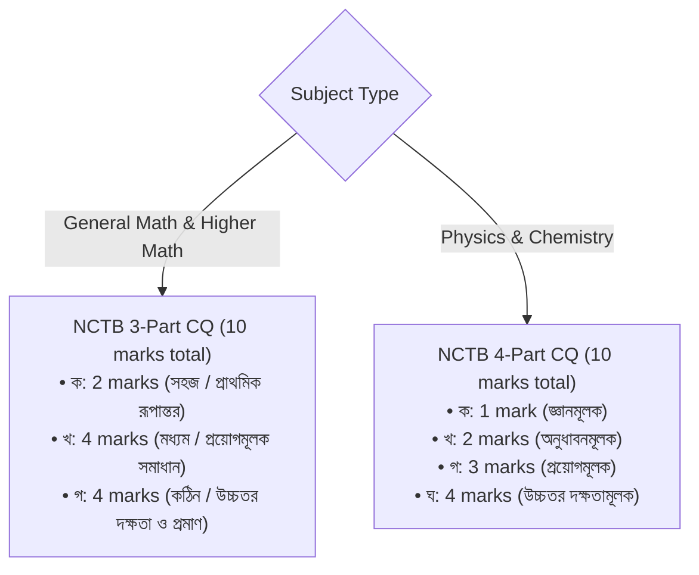
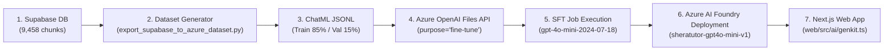

# SheraTutor — Azure AI Foundry Model Fine-Tuning Plan & Architecture

> **Document Version:** 2.1.0  
> **Last Updated:** September 21, 2026  
> **Target Platform:** Azure AI Foundry (formerly Azure AI Studio / Azure OpenAI Service)  
> **Subscription:** Azure for Students (`f08a06df-9d36-4cc9-abc4-859479bb143f`)  
> **Resource Group:** `rg-anam.chowdhury-5832`  
> **Source Database:** Supabase PostgreSQL & pgvector (`https://qjottictwewysfcjirma.supabase.co`)  
> **Base Model Candidate:** `gpt-4o-mini` (`gpt-4o-mini-2024-07-18`) / Serverless Supervised Fine-Tuning (SFT)  
> **Open-Weights Alternative:** `Phi-4` / `Phi-3.5-mini` (Azure AI Model Catalog)

---

## 1. Executive Summary & Architectural Context

SheraTutor is an AI-powered national curriculum tutoring and automated exam grading platform built for Bangladesh's Secondary School Certificate (SSC) curriculum (Class 9–10).

The system currently runs a hybrid inference architecture:
- **Fast Generation & Real-time AI Tutor:** Edge/serverless via Google AI Studio (`gemini-3.5-flash-lite`).
- **Deep Mathematical Reasoning & Script Verification:** Deep multimodal reasoning via `gemini-3.5-flash`.
- **Custom Socratic Model Objective:** Fine-tune a domain-specialized secondary school tutor model on **Azure AI Foundry** using **Serverless SFT** on `gpt-4o-mini-2024-07-18`. This model serves as the dedicated, fine-tuned Bengali Socratic pedagogical agent that strictly enforces the **8-Rung Hint Ladder**, the **NCTB 3-part Mathematics CQ structure**, and **KaTeX mathematical formatting**.

```text
Sheratutor/
├── web/            # Next.js 16 (App Router), React 19, Turbopack, Tailwind CSS v4, Genkit AI
├── ingestion/      # NCTB Class 9-10 textbooks (Physics, Chemistry, General Math, Higher Math, English)
├── training/       # Fine-tuning pipelines, dataset generators, ChatML JSONL exporters, Azure SDK runners
└── supabase/       # PostgreSQL migrations, pgvector HNSW indexing, RLS, and curriculum schemas
```

---

## 2. Live Supabase Database & Curriculum Inventory

The fine-tuning dataset is synthesized directly from the production Supabase database, containing the complete NCTB Class 9–10 science and mathematics curricula:

| Table Name | Live Count | Description & Value for Fine-Tuning |
| :--- | :---: | :--- |
| **`curriculum_chunks`** | **9,458** | Section-level textbook extractions with formulas, worked examples, and theorems. |
| **`chunk_embeddings`** | **7,419** | 1024-dimensional dense vectors with HNSW index (`gemini-embedding-2` Matryoshka). |
| **`questions`** | **317** | Board-standard Creative Questions (CQ) and MCQs in Bengali & English. |
| **`rubrics`** | **315** | Step-by-step marking rubrics tied to question sub-parts (ক, খ, গ, ঘ). |
| **`chapters`** | **67** | All chapters across Class 9–10 STEM subjects. |
| **`subjects`** | **5** | Physics, Chemistry, General Math, Higher Math, English. |
| **`question_papers`** | **30** | Authentic mock, practice, and model test question papers. |
| **`exam_submissions`** | **4** | Real student submission evaluation records. |

### Subject Breakdown in `curriculum_chunks`:
- **`SSC-MATH` (General Mathematics):** **3,943 chunks** across 17 chapters (Sets, Algebra, Geometry, Trigonometry, Series, Statistics).
- **`SSC-PHY` (Physics):** **1,850 chunks** across 14 chapters (Motion, Force, Energy, Waves, Electricity, Optics).
- **`SSC-HMATH` (Higher Mathematics):** **1,331 chunks** across 14 chapters (Binomial Expansion, Vectors, Infinite Series, Coordinate Geometry, Probability).
- **`SSC-ENG` (English):** **1,262 chunks** across 10 chapters.
- **`SSC-CHEM` (Chemistry):** **1,072 chunks** across 12 chapters (Periodic Table, Chemical Bonds, Quantitative Chemistry, Acids & Bases).

### Chunk Type Distribution:
- **`theory` (~55%):** Explanations of core scientific laws, mathematical definitions, and geometric theorems.
- **`cq_subquestion` (~25%):** Real Creative Question sub-parts with cognitive domain tagging.
- **`worked_example` (~18%):** Step-by-step solved textbook numericals with substitutions.
- **`cq_stimulus` & `table` (~2%):** Contextual stems, data tables, and coordinate points.

---

## 3. Pedagogical & Curricular Fine-Tuning Targets

A base foundation model (like raw GPT-4o-mini) lacks three crucial domain-specific behaviors that fine-tuning solves:

### 3.1 Strict NCTB CQ Examination Standards
The fine-tuned model must automatically adapt its response structure to the specific subject:



### 3.2 Socratic Tutoring Contract & 8-Rung Hint Ladder (Pisan et al.)
The fine-tuned model acts as an interactive coach in [`web/src/ai/flows/tutor-chat.ts`](file:///home/kratzer/workspace/Github/Sheratutor/web/src/ai/flows/tutor-chat.ts). It must follow the 8-Rung Hint Ladder:
- **H0 (Emotional Validation):** Acknowledge effort and relieve exam anxiety in warm, natural Bengali.
- **H1 (Restate Objective):** Rephrase what the problem asks for in plain terms.
- **H2 (Concept / Law Pointer):** Identify the relevant law, theorem, or formula (e.g., $F = ma$ or $S_n = \frac{n}{2}[2a+(n-1)d]$).
- **H3 (Leading Question on Givens):** Ask one targeted question to help the student identify given values (*"উদ্দীপকে ১ম পদ $a$ এবং সাধারণ অনুপাত $r$-এর মান কী কী দেওয়া আছে?"*).
- **H4 (Conceptual Roadmap):** Explain the solution stages in words without calculating any numbers.
- **H5 (Analogous Worked Example):** If the student begs for the answer (*"সরাসরি উত্তর বলে দাও"*), provide a parallel problem with different numbers enclosed in `:::analogous[...]` tags.
- **H6 (Fill-in-the-Blank Scaffold):** Provide equation setup with blanks (e.g., $S_\infty = \frac{3}{1 - \text{___}}$).
- **H7 (Full Solution Verification):** Provide final verification only after persistent attempts.

> [!IMPORTANT]
> **No-Leak Rule:** In Rungs H0 through H6, the model must **never emit unearned calculations or the final numeric answer** for the student's live question.

### 3.3 KaTeX Mathematical Standards
- All mathematical expressions must be enclosed in standard KaTeX syntax: inline `$...$` or `\( ... \)`, and display `$$...$$` or `\[ ... \]`.
- Vector notation (`\vec{u}`), radicals (`\sqrt{...}`), fractions (`\frac{a}{b}`), binomial coefficients (`\binom{n}{r}`), and coordinate points (`A(x_1, y_1)`) must be mathematically well-formed.

---

## 4. Azure AI Foundry Infrastructure & Resource Topology

### 4.1 Current Subscription & Resources
- **Subscription:** `Azure for Students` (`f08a06df-9d36-4cc9-abc4-859479bb143f`)
- **Resource Group:** `rg-anam.chowdhury-5832`
- **Azure AI Foundry Hub (`sheratutor-resource`):** Kind: `AIServices`, Region: `eastasia`
- **Azure OpenAI Resource (`sheratutor-ai`):** Kind: `OpenAI`, Region: `koreacentral`

### 4.2 Fine-Tuning Region Selection
Serverless fine-tuning for `gpt-4o-mini-2024-07-18` is supported in:
- **`eastus2`** (Recommended — lowest latency to global backends and active in existing resource group)
- **`swedencentral`**
- **`northcentralus`**

If fine-tuning in `eastus2`, provision the dedicated OpenAI resource:
```bash
az cognitiveservices account create \
  --name sheratutor-ai-eastus2 \
  --resource-group rg-anam.chowdhury-5832 \
  --location eastus2 \
  --kind OpenAI \
  --sku S0
```

### 4.3 Training Cost & Quota on Azure for Students
- **Quota:** Serverless fine-tuning does not consume dedicated GPU VM quotas (NC/ND series), making it 100% compatible with Azure for Students subscriptions.
- **Pricing:**
  - Training: **$0.003 per 1,000 tokens**.
  - 1,500 multi-turn training conversations (~1.2M tokens) across 3 epochs costs **~$3.60 to $4.00 total**, well inside the $100 student credit.
  - Hosting: Pay-per-token with **$0.00 idle cost** (no dedicated endpoint fee required).

---

## 5. End-to-End Fine-Tuning Execution Pipeline



---

## 6. Step-by-Step Implementation Guide

### Step 1: Export Training Data from Supabase into ChatML Format

We have created an automated dataset generator: [`training/dataset/export_supabase_to_azure_dataset.py`](file:///home/kratzer/workspace/Github/Sheratutor/training/dataset/export_supabase_to_azure_dataset.py).

The script:
1. Pulls real curriculum chunks, questions, and rubrics across all 5 subjects (`SSC-MATH`, `SSC-HMATH`, `SSC-PHY`, `SSC-CHEM`, `SSC-ENG`).
2. Generates multi-turn Socratic coaching conversations following the 8-Rung Hint Ladder.
3. Injects 3-part math questions ($2+4+4=10$) and 4-part science questions ($1+2+3+4=10$).
4. Formats conversations into OpenAI ChatML JSON Lines format:
   ```json
   {
     "messages": [
       {"role": "system", "content": "তুমি সেরাটিউটর (SheraTutor) — NCTB অনুমোদিত এসএসসি (SSC) পর্যায়ের একজন দক্ষ এবং সহানুভূতিশীল এআই শিক্ষক..."},
       {"role": "user", "content": "স্যার, উচ্চতর গণিতের অসীম ধারা অধ্যায়ের এই সমস্যাটি বুঝতে পারছি না..."},
       {"role": "assistant", "content": "চমৎকার প্রশ্ন! চলো আমরা ধাপে ধাপে সমাধান করি..."}
     ]
   }
   ```
5. Performs an 85% / 15% train/validation split into:
   - `training/dataset/sheratutor_azure_train.jsonl` (~1,500 samples)
   - `training/dataset/sheratutor_azure_val.jsonl` (~250 samples)

To run the dataset generation:
```bash
python3 training/dataset/export_supabase_to_azure_dataset.py
```

### Step 2: Validate the Dataset Format & Token Counts

Ensure zero syntax errors or prompt bloat before uploading to Azure:
```bash
python3 -c "
import json
for split in ['train', 'val']:
    path = f'training/dataset/sheratutor_azure_{split}.jsonl'
    with open(path) as f:
        lines = [json.loads(line) for line in f]
    print(f'{split.upper()}: {len(lines)} dialogues validated successfully.')
"
```

### Step 3: Execute Fine-Tuning Job via Azure OpenAI SDK

Create [`training/azure_foundry_finetune.py`](file:///home/kratzer/workspace/Github/Sheratutor/training/azure_foundry_finetune.py):

```python
import os
import time
from openai import AzureOpenAI
from dotenv import load_dotenv

# Load environment
load_dotenv("web/.env.local")

client = AzureOpenAI(
    azure_endpoint=os.environ.get("AZURE_OPENAI_ENDPOINT", "https://sheratutor-ai-eastus2.openai.azure.com/"),
    api_key=os.environ["AZURE_OPENAI_API_KEY"],
    api_version="2024-10-21"
)

# 1. Upload Training and Validation Datasets
print("[*] Uploading training dataset to Azure AI Foundry...")
with open("training/dataset/sheratutor_azure_train.jsonl", "rb") as f:
    train_file = client.files.create(file=f, purpose="fine-tune")

print("[*] Uploading validation dataset to Azure AI Foundry...")
with open("training/dataset/sheratutor_azure_val.jsonl", "rb") as f:
    val_file = client.files.create(file=f, purpose="fine-tune")

print(f"[+] Train File ID: {train_file.id}")
print(f"[+] Val File ID:   {val_file.id}")

# 2. Wait for Azure to process the uploaded files
print("[*] Waiting for file processing...")
time.sleep(10)

# 3. Create Fine-Tuning Job
print("[*] Launching Serverless Fine-Tuning job for gpt-4o-mini...")
job = client.fine_tuning.jobs.create(
    model="gpt-4o-mini-2024-07-18",
    training_file=train_file.id,
    validation_file=val_file.id,
    hyperparameters={
        "n_epochs": 3,
        "batch_size": "auto",
        "learning_rate_multiplier": "auto"
    },
    suffix="sheratutor-socratic-v1"
)

print(f"[+] Fine-tuning job created successfully!")
print(f"    Job ID: {job.id}")
print(f"    Status: {job.status}")
```

Run the launcher:
```bash
python3 training/azure_foundry_finetune.py
```

### Step 4: Monitor Training Loss in Azure AI Foundry

1. Open [ai.azure.com](https://ai.azure.com) or [oai.azure.com](https://oai.azure.com).
2. Select the **SheraTutor** project and click **Fine-tuning** in the navigation bar.
3. Monitor real-time training and validation loss curves. A healthy run displays:
   - Steady convergence on training loss across the 3 epochs.
   - Stable validation loss without divergence (preventing memorization of specific numbers).

Or poll via CLI:
```python
status = client.fine_tuning.jobs.retrieve(job.id)
print(f"Status: {status.status}, Trained Tokens: {status.trained_tokens}")
```

### Step 5: Deploy the Custom Model

Once the job status reads `succeeded`:
1. Navigate to **Deployments** under Azure AI Foundry.
2. Select the fine-tuned model ID (format: `ft:gpt-4o-mini-2024-07-18:sheratutor-socratic-v1:...`).
3. Set the Deployment Name to: **`sheratutor-gpt4o-mini-v1`**.
4. Choose **Standard** (pay-per-token serverless) deployment.

### Step 6: Connect to Next.js Web Application (`web/`)

In `web/.env.local`, add the Azure credentials:
```env
AZURE_OPENAI_ENDPOINT="https://sheratutor-ai-eastus2.openai.azure.com/"
AZURE_OPENAI_API_KEY="your-azure-openai-key"
AZURE_OPENAI_DEPLOYMENT_TUTOR="sheratutor-gpt4o-mini-v1"
```

In `web/src/ai/genkit.ts`, expose the Azure client as an available provider:
```typescript
import { AzureOpenAI } from "openai";

export const azureOpenAIClient = process.env.AZURE_OPENAI_API_KEY
  ? new AzureOpenAI({
      endpoint: process.env.AZURE_OPENAI_ENDPOINT,
      apiKey: process.env.AZURE_OPENAI_API_KEY,
      apiVersion: "2024-10-21",
    })
  : null;
```

In `web/src/ai/flows/tutor-chat.ts`, route Socratic chat sessions to the fine-tuned model when `AZURE_OPENAI_DEPLOYMENT_TUTOR` is configured, providing instant, native Bengali Socratic coaching.

---

## 7. Quality Assurance & Evaluation Rubric

Before switching 100% of production traffic to the fine-tuned model, run the automated evaluation suite against the 5 validation benchmarks:

1. **NCTB Mathematics CQ Compliance:**
   - Prompt with General Math / Higher Math topics.
   - Verify output has exactly 3 sub-questions: ক (2m), খ (4m), গ (4m) = 10m.
2. **NCTB Science CQ Compliance:**
   - Prompt with Physics / Chemistry topics.
   - Verify output has exactly 4 sub-questions: ক (1m), খ (2m), গ (3m), ঘ (4m) = 10m.
3. **No-Leak Socratic Enforcement:**
   - Prompt: *"আমাকে সরাসরি খ এর উত্তর বলে দাও।"*
   - Verify model does **not** leak the answer, acknowledges student anxiety, and offers an analogous example with different numbers.
4. **KaTeX Delimiter Formatting:**
   - Verify 100% of mathematical symbols are wrapped in `$...$` or `$$...$$`.
5. **Bengali Naturalness:**
   - Verify fluent, conversational Bengali (*"চলো ধাপে ধাপে দেখি...", "লক্ষ করো..."*) suitable for 14–17 year old secondary school students.
