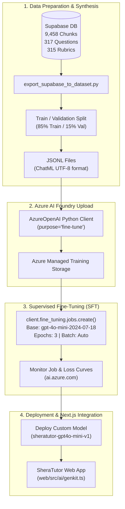

# SheraTutor — Azure AI Foundry Model Fine-Tuning Plan & Architecture

> **Date:** September 21, 2026  
> **Target Platform:** Azure AI Foundry (formerly Azure AI Studio / Azure OpenAI Service)  
> **Subscription:** Azure for Students (`f08a06df-9d36-4cc9-abc4-859479bb143f`)  
> **Resource Group:** `rg-anam.chowdhury-5832`  
> **Source Database:** Supabase pgvector (`https://qjottictwewysfcjirma.supabase.co`)  
> **Base Model Candidate:** `gpt-4o-mini` (`gpt-4o-mini-2024-07-18`) / Serverless SFT

---

## 1. Executive Codebase & Infrastructure Review

The SheraTutor project is divided into three core subsystems:

```text
Sheratutor/
├── web/            # Next.js 16 (App Router), React 19, Turbopack, Tailwind CSS v4, Genkit AI
├── ingestion/      # NCTB Class 9-10 textbooks (Physics, Chemistry, Math, Higher Math) parsing, OCR & RAG
├── training/       # Fine-tuning pipelines, datasets, Kaggle/Unsloth scripts, and serving configurations
└── supabase/       # PostgreSQL migrations, pgvector HNSW indexing, RLS, and curriculum schemas
```

### 1.1 Web Application Architecture (`web/src/ai/`)
- **Framework:** Next.js 16 App Router with React 19 and Genkit (`@genkit-ai/next`, `@genkit-ai/google-genai`, `genkitx-ollama`).
- **Tutor Chat Flow (`web/src/ai/flows/tutor-chat.ts`):** Orchestrates multi-turn Socratic tutoring dialogs, hint scaffolding (rungs 1 through 5), clean LaTeX math formatting (inline `\\( ... \\)` and block `\\[ ... \\]`), child safety pre-filtering, and diagram injection.
- **RAG Retrieval (`web/src/ai/flows/retrieve-grounding.ts`):** Performs hybrid search (vector cosine similarity via `pgvector` + keyword matching via PostgreSQL `tsvector`) across NCTB curriculum chunks.
- **Exam & Grading (`generate-question-paper.ts` & `grade-submission.ts`):** Generates Creative Questions (CQ) and MCQs and evaluates student handwriting against official NCTB rubrics.

### 1.2 Ingestion & RAG Pipeline (`ingestion/`)
- Extracts bilingual (Bengali & English) STEM curriculum from NCTB textbooks:
  - Physics (`SSC-PHY`)
  - Chemistry (`SSC-CHEM`)
  - General Mathematics (`SSC-MATH`)
  - Higher Mathematics (`SSC-HMATH`)
  - English (`SSC-ENG`)
- Chunks textbook content by section, preserves formulas, crops diagram images, uploads assets to Supabase Storage, and computes dense vector embeddings.

### 1.3 Active Azure Environment
- **Subscription:** `Azure for Students` (Subscription ID: `f08a06df-9d36-4cc9-abc4-859479bb143f`), Tenant: `anamchowdhurynorthsouth.onmicrosoft.com`.
- **Resource Group:** `rg-anam.chowdhury-5832`.
- **Azure AI Foundry Hub (`sheratutor-resource`):** Type `Microsoft.CognitiveServices/accounts` (Kind: `AIServices`), Region: `eastasia`, Endpoint: `https://sheratutor-resource.services.ai.azure.com/api/projects/SheraTutor`.
- **Azure OpenAI Service (`sheratutor-ai`):** Type `Microsoft.CognitiveServices/accounts` (Kind: `OpenAI`), Region: `koreacentral`, currently hosting deployments for `gpt-4o-mini` and `text-embedding-3-large`.

---

## 2. Supabase Vector Database Review

Live inspection of the Supabase PostgreSQL database revealed a rich, production-grade curriculum dataset:

| Table Name | Live Record Count | Description & Relevance to Fine-Tuning |
| :--- | :--- | :--- |
| **`curriculum_chunks`** | **9,458** | Processed NCTB textbook sections with formulas, diagrams, and metadata. |
| **`chunk_embeddings`** | **7,419** | 1024-dimensional dense vectors with HNSW index (`gemini-embedding-2` Matryoshka). |
| **`questions`** | **317** | NCTB Board-standard Creative Questions (CQ) and MCQs in Bengali & English. |
| **`rubrics`** | **315** | Granular step-by-step marking rubrics tied to question parts (ক, খ, গ, ঘ). |
| **`chapters`** | **67** | All chapters across Class 9-10 science and mathematics curricula. |
| **`subjects`** | **5** | Physics, Chemistry, General Math, Higher Math, English. |
| **`question_papers`** | **30** | Complete mock and past board examination papers. |
| **`submission_pages`** | **4** | Real student submission images and evaluation logs. |

### Chunk Type Distribution in `curriculum_chunks`:
- **`theory`** (~55%): Explanations of core concepts, scientific laws, definitions, and theorems.
- **`cq_subquestion`** (~25%): Real Creative Question sub-questions with cognitive classification (Knowledge, Comprehension, Application, Higher Ability).
- **`worked_example`** (~18%): Step-by-step solved math problems and numerical physics/chemistry derivations.
- **`cq_stimulus` & `table`** (~2%): Contextual stems, data tables, and diagrams.

This dataset contains all necessary pairs to synthesize 1,000–2,500 high-fidelity Socratic teaching dialogues without manual labeling.

---

## 3. Base Model Selection & Strategy

### 3.1 Azure for Students Subscription Constraints
- Dedicated GPU VMs (`Standard_NC24ads_A100_v4`, `Standard_ND96asr_v4`, etc.) typically have a quota of 0 on student subscriptions and require enterprise approval.
- **Serverless Fine-Tuning (SFT)** in Azure AI Foundry completely bypasses compute cluster provisioning. Microsoft handles the training compute in the background; you only pay for the training tokens consumed.

### 3.2 Model Comparison Matrix

| Model | Provider in Foundry | Architecture | Bengali Tokenization | LaTeX Math Reasoning | Compute Type | Recommendation |
| :--- | :--- | :--- | :--- | :--- | :--- | :--- |
| **`gpt-4o-mini-2024-07-18`** | Azure OpenAI | Proprietary | **High Efficiency** | **Superior** | **Serverless SFT** | **Top Choice** |
| **`Phi-4` / `Phi-3.5`** | Microsoft | Open Weights | Moderate | Strong | Serverless / Managed | Strong Secondary |
| **`Llama-3.1-8B-Instruct`** | Meta | Open Weights | Moderate | Good | Serverless / Managed | Alternative |

### 3.3 Why `gpt-4o-mini` is Recommended for SheraTutor:
1. **Low Training Cost:** ~ $0.003 per 1K training tokens. A 1,500-dialogue dataset (~1M tokens) costs under $5.00 to train.
2. **Bengali Grammar & Script:** Outstanding handling of Bengali conjuncts (*যুক্তবর্ণ*) and academic terminology (*ত্বরণ, ভরবেগ, মোলারিটি, জারণ-বিজারণ*).
3. **Strict Formatting Adherence:** Follows system instructions for LaTeX delimiters (`\\( ... \\)` and `\\[ ... \\]`) without hallucinating raw Markdown math blocks.
4. **Serverless Deployment:** Deployable as a pay-per-token or provisioned endpoint with 99.9% uptime SLA and zero cold start.

---

## 4. End-to-End Fine-Tuning Workflow



---

## 5. Detailed Step-by-Step Implementation

### Step 1: Export Training Data from Supabase into ChatML Format

The training data must be formatted as JSON Lines (`.jsonl`) where each line is a JSON object with a `messages` array:

```json
{
  "messages": [
    {"role": "system", "content": "তুমি সেরাটিউটর (SheraTutor) — NCTB অনুমোদিত এসএসসি (SSC) পর্যায়ের একজন দক্ষ এবং সহানুভূতিশীল এআই শিক্ষক..."},
    {"role": "user", "content": "স্যার, উচ্চতর গণিতের দ্বিপদী বিস্তৃতি অধ্যায়ের এই সমস্যাটি বুঝতে পারছি না..."},
    {"role": "assistant", "content": "চমৎকার প্রশ্ন! চল আমরা ধাপে ধাপে সমাধান করি..."}
  ]
}
```

An automated extraction script pulls from `curriculum_chunks` and `questions` in Supabase:
- **Worked Examples:** Formatted into conversational math coaching dialogs with Socratic questions.
- **Creative Questions (CQ):** Formatted into rubric-grounded answering guides.
- **Theory Chunks:** Formatted into conceptual clarification dialogs.

Save files as:
- `training/dataset/sheratutor_train.jsonl` (85%, ~1,200–1,500 samples)
- `training/dataset/sheratutor_val.jsonl` (15%, ~200–300 samples)

### Step 2: Regional Verification in Azure

Fine-tuning for `gpt-4o-mini` is supported in specific Azure regions (including **`eastus2`**, **`northcentralus`**, and **`swedencentral`**).
Your resource group `rg-anam.chowdhury-5832` already has resources in `eastus2`.

To ensure your fine-tuning resource is in a supported region, create an Azure OpenAI resource in `eastus2` if needed:

```bash
az cognitiveservices account create \
  --name sheratutor-ai-eastus2 \
  --resource-group rg-anam.chowdhury-5832 \
  --location eastus2 \
  --kind OpenAI \
  --sku S0
```

### Step 3: Execute Fine-Tuning via Python SDK

Create a script `training/azure_foundry_finetune.py`:

```python
import os
import time
from openai import AzureOpenAI
from dotenv import load_dotenv

load_dotenv("ingestion/.env")

# Initialize Azure OpenAI Client
client = AzureOpenAI(
    azure_endpoint=os.environ["AZURE_OPENAI_ENDPOINT"],
    api_key=os.environ["AZURE_OPENAI_API_KEY"],
    api_version="2024-10-21"
)

# 1. Upload Training and Validation Datasets
print("[*] Uploading training dataset...")
train_file = client.files.create(
    file=open("training/dataset/sheratutor_train.jsonl", "rb"),
    purpose="fine-tune"
)

print("[*] Uploading validation dataset...")
val_file = client.files.create(
    file=open("training/dataset/sheratutor_val.jsonl", "rb"),
    purpose="fine-tune"
)

print(f"[+] Train File ID: {train_file.id}")
print(f"[+] Val File ID:   {val_file.id}")

# 2. Wait for files to be processed
time.sleep(5)

# 3. Create Fine-Tuning Job
print("[*] Launching fine-tuning job for gpt-4o-mini...")
job = client.fine_tuning.jobs.create(
    model="gpt-4o-mini-2024-07-18",
    training_file=train_file.id,
    validation_file=val_file.id,
    hyperparameters={
        "n_epochs": 3,
        "batch_size": "auto",
        "learning_rate_multiplier": "auto"
    }
)

print(f"[+] Fine-tuning job created successfully!")
print(f"    Job ID: {job.id}")
print(f"    Status: {job.status}")
```

### Step 4: Monitor Job & Metrics
Track the training run through the Azure AI Foundry Portal:
1. Open [ai.azure.com](https://ai.azure.com) or [oai.azure.com](https://oai.azure.com).
2. Select your project **SheraTutor**.
3. Go to **Fine-tuning** in the left menu.
4. Review metrics:
   - **Training Loss:** Should steadily decline.
   - **Validation Loss:** Should decline and stabilize (watch for overfitting after epoch 3).

Or poll via CLI/SDK:
```python
job_status = client.fine_tuning.jobs.retrieve(job.id)
print(f"Current Status: {job_status.status}")
```

### Step 5: Deploy the Fine-Tuned Model

Once the job status changes to `succeeded`:
1. Navigate to **Deployments** in Azure AI Foundry.
2. Select your fine-tuned model (e.g. `ft:gpt-4o-mini-2024-07-18:sheratutor:xxx`).
3. Create a deployment named: `sheratutor-gpt4o-mini-v1`.

### Step 6: Connect to SheraTutor Web App (`web/`)

In `web/.env.local`:
```env
AZURE_OPENAI_ENDPOINT=https://sheratutor-ai-eastus2.openai.azure.com/
AZURE_OPENAI_API_KEY=your_azure_openai_key
AZURE_OPENAI_DEPLOYMENT_REASONING=sheratutor-gpt4o-mini-v1
```

In `web/src/ai/genkit.ts`, add the Azure OpenAI model deployment to Genkit models:
```typescript
import { AzureOpenAI } from "openai";

export const azureClient = new AzureOpenAI({
  endpoint: process.env.AZURE_OPENAI_ENDPOINT,
  apiKey: process.env.AZURE_OPENAI_API_KEY,
  apiVersion: "2024-10-21",
});
```

Now student chats in [`tutor-chat.ts`](file:///home/syed/workspace/Sheratutor/web/src/ai/flows/tutor-chat.ts) will be served by the fine-tuned model, providing NCTB-grounded, Socratic, LaTeX-perfect answers.

---

## 6. Best Practices & Safeguards

1. **Avoid Data Contamination:** Ensure validation questions are not present in the training set to get an honest evaluation of out-of-distribution reasoning.
2. **Preserve LaTeX Delimiters:** System prompts must mandate `\\( ... \\)` for inline math and `\\[ ... \\]` for display equations so the frontend KaTeX renderer parses formulas cleanly.
3. **Preserve Socratic Persona:** Negative samples (e.g., student asking *"just give me the direct answer to question 3"*) must be trained to respond with a gentle hint rather than solving the problem outright.
4. **Safety Filter:** Retain the pre-filter safety checks in [`web/src/ai/flows/tutor-chat.ts`](file:///home/syed/workspace/Sheratutor/web/src/ai/flows/tutor-chat.ts) as a hard safety floor for minor protection before reaching the model.
