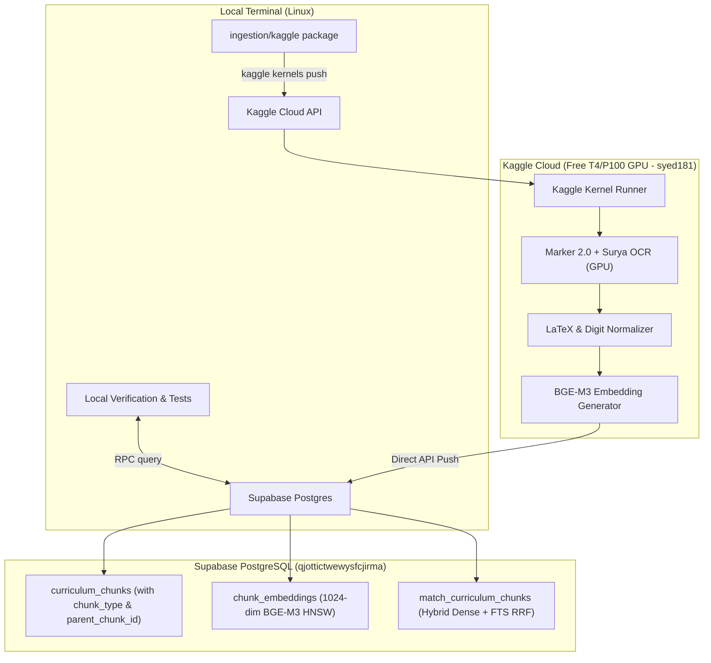

# Implementation Plan: NCTB SSC Physics Bilingual RAG Pipeline

A production-grade, bilingual RAG ingestion and retrieval architecture for the 14 chapters of NCTB SSC Physics in both Bengali (`physics_bn.pdf`, 366 pages) and English (`physics_en.pdf`, 370 pages), executed headlessly via Kaggle Free Remote GPU (`syed181`).

---

## User Review Required

> [!NOTE]
> **Kaggle CLI Remote GPU Pipeline Configured**:
> Remote execution is configured for Kaggle account **`syed181`** with GPU acceleration (`enable_gpu: true`). This processes both textbooks (736 pages total) in **~15–20 minutes** at zero cost, bypassing local CPU limitations completely.

> [!IMPORTANT]
> **Parent-Child & Creative Question (CQ) Chunking**:
> In NCTB textbooks, Creative Questions (সৃজনশীল প্রশ্ন / CQ) have a shared stimulus (উদ্দীপক) followed by sub-questions `(ক, খ, গ, ঘ)`. We enrich the database schema with `chunk_type` and `parent_chunk_id` to guarantee the stimulus is always retrieved alongside the sub-question during grading.

---

## Architecture Overview



---

## Proposed Changes

### 1. Database Schema & Hybrid Retrieval Migration

#### [NEW] [00000000000013_curriculum_enrichment.sql](file:///home/syed/workspace/Sheratutor/supabase/migrations/00000000000013_curriculum_enrichment.sql)
* Enrich `curriculum_chunks` with:
  * `chunk_type`: `'theory' | 'worked_example' | 'cq_stimulus' | 'cq_subquestion' | 'table'`
  * `parent_chunk_id`: Self-referencing UUID for hierarchical CQ stimulus linkage.
  * `section_no` (e.g. `"2.4"`) and `section_title` (e.g. `"Distance and Displacement"`).
  * `fts_doc`: Generated `tsvector` column for full-text keyword indexing.
* Create GIN index on `fts_doc`.
* Update `match_curriculum_chunks` RPC to implement **Hybrid Retrieval (Dense HNSW + Sparse Full-Text Search via Reciprocal Rank Fusion)**.

---

### 2. Kaggle Remote GPU Ingestion Package

#### [NEW] [ingestion/kaggle/kernel-metadata.json](file:///home/syed/workspace/Sheratutor/ingestion/kaggle/kernel-metadata.json)
* Kernel specification for `syed181/sheratutor-physics-ingest`:
  ```json
  {
    "id": "syed181/sheratutor-physics-ingest",
    "title": "SheraTutor Physics Ingest",
    "code_file": "remote_ingest.py",
    "language": "python",
    "kernel_type": "script",
    "is_private": "true",
    "enable_gpu": "true",
    "enable_internet": "true"
  }
  ```

#### [NEW] [ingestion/kaggle/remote_ingest.py](file:///home/syed/workspace/Sheratutor/ingestion/kaggle/remote_ingest.py)
* **GPU Ingestion Engine**:
  * Clones or downloads `physics_bn.pdf` and `physics_en.pdf`.
  * Runs `marker_single` with `--mode balanced` (accelerated by PyTorch CUDA).
  * **LaTeX & Numeral Normalizer**:
    * Normalizes Bengali digits in mathematical context (`১, ২, ৩` $\to$ `1, 2, 3`) while retaining Bengali script in narrative explanations.
    * Preserves inline (`$...$`) and block (`$$...$$`) LaTeX equations.
  * **Chunk Classifier**:
    * Identifies Theory, Worked Examples, CQ Stimuli, and CQ Sub-questions.
  * **Embedding & Supabase Writer**:
    * Generates 1024-dim `bge-m3` vectors via `sentence-transformers` on GPU.
    * Batch-inserts chunks, embeddings, and updates `ingestion_jobs` state in Supabase.

---

### 3. Local CLI Helper & Progress Monitor

#### [NEW] [ingestion/run_remote_ingest.sh](file:///home/syed/workspace/Sheratutor/ingestion/run_remote_ingest.sh)
* A one-command terminal script to:
  1. Package the Kaggle payload.
  2. Execute `kaggle kernels push -p ingestion/kaggle`.
  3. Stream status (`kaggle kernels status syed181/sheratutor-physics-ingest`).
  4. Fetch execution logs (`kaggle kernels output syed181/sheratutor-physics-ingest`).

---

### 4. AI Core Retrieval Flow Integration

#### [MODIFY] [retrieve-grounding.ts](file:///home/syed/workspace/Sheratutor/web/src/ai/flows/retrieve-grounding.ts)
* Update `retrieveGroundingFlow` to:
  * Call the hybrid retrieval RPC (`match_curriculum_chunks`).
  * If a matched chunk is a `cq_subquestion` that has a `parent_chunk_id`, automatically retrieve the parent stimulus context and inject it into the prompt.
  * Trigger cross-lingual retrieval fallback if primary language similarity is `< 0.60`.

---

## Verification Plan

### Automated Remote Ingestion & Progress Check
1. Run `kaggle kernels push -p ingestion/kaggle` from terminal.
2. Monitor kernel status until completion (`COMPLETE` exit code 0).
3. Verify chunk rows in Supabase:
   * Query `SELECT count(*), chunk_type FROM curriculum_chunks GROUP BY chunk_type;`
   * Query `SELECT count(*) FROM chunk_embeddings WHERE model_name = 'bge-m3';`

### Automated Retrieval Benchmarks
Run a local test suite with 4 canonical physics queries across Bengali and English:
1. **Theory Recall**: `"দ্রুতি ও বেগের মধ্যে পার্থক্য কী?"` $\to$ expects Chapter 2, Section 2.4.
2. **Formula Retrieval**: `"Write down the formula relating force, mass and acceleration"` $\to$ expects Chapter 3 ($F=ma$).
3. **Worked Example Retrieval**: `"একটি গাড়ির আদিবেগ 10 m/s এবং ত্বরণ 2 m/s^2..."` $\to$ expects Chapter 2 kinematics example chunk.
4. **CQ Stimulus Attachment**: Query a CQ sub-question $\to$ verify parent stimulus is joined in result.
