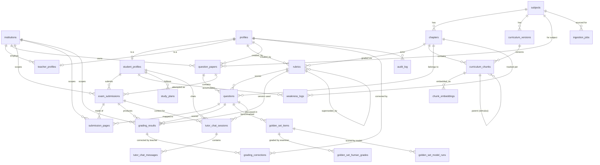

# SheraTutor — Full Codebase Report

**Generated:** 2026-08-24 · **Branch:** `backend` · **Scope:** `web/` (Next.js app), `supabase/` (Postgres schema), `ingestion/` (offline pipeline)

---

## 1. What SheraTutor Is

SheraTutor is a bilingual (Bangla/English) AI study platform for Bangladeshi SSC/HSC students, currently scoped to **NCTB Physics**. Students upload handwritten answer scripts, an AI pipeline OCRs and grades them against official board rubrics, and the app turns the results into weakness tracking, personalized study plans, AI-generated practice papers, and a Socratic AI tutor chat — all delivered in a "খাতা" (exam-notebook) themed UI.

**Stack:** Next.js 16 (App Router, React 19) · Supabase (Postgres 17 + pgvector + pgmq + Auth + Storage) · Genkit 1.41 (Google's AI orchestration framework) · NVIDIA NIM (primary LLM/embedding provider, OpenAI-compatible) · Tailwind v4 + shadcn/ui (radix-nova) · TypeScript.

---

## 2. Architecture Overview

```mermaid
flowchart LR
    subgraph Client["Browser"]
        UI[Next.js App Router\nServer + Client Components]
    end

    subgraph Edge["Next.js Server (proxy.ts)"]
        MW[Session refresh middleware]
        SA[Server Actions]
        API[API Routes]
    end

    subgraph AI["Genkit AI Layer (web/src/ai)"]
        L1[Layer 1: transcribe.ts\nVLM OCR]
        L2[Layer 2: retrieve-grounding.ts\nHybrid RAG]
        L3[Layer 3+4: evaluate-rubric.ts\nRubric-grounded grading]
        L5[generate-question-paper.ts]
        L6[tutor-chat.ts\nSocratic tutor + safety filter]
    end

    subgraph Providers["External AI Providers"]
        NIM[NVIDIA NIM\nLlama vision/reasoning + embeddings]
        Fireworks["Fireworks (configured, unused by default)"]
        Ollama[Ollama (local dev)]
    end

    subgraph DB["Supabase Postgres"]
        Tables[(23 tables\nRLS-protected)]
        Queue[[pgmq: grading_queue]]
        Vec[(pgvector HNSW\nchunk_embeddings)]
    end

    subgraph Worker["Background Grading"]
        Cron[External scheduler] --> Internal[POST /api/internal/process-grading-queue\nsecret-header auth]
        Internal --> GradeFlow[grade-submission.ts\nservice-role client]
    end

    UI --> MW --> SA & API
    SA --> Tables
    API --> Tables
    API --> Queue
    GradeFlow --> L1 & L2 & L3
    L5 --> L2
    L1 & L3 & L5 & L6 --> NIM
    L2 --> Vec
    Queue --> GradeFlow
    Tables --> Vec
```

**Four-layer grading pipeline** (the architectural core of the product):
1. **Transcribe** (`transcribe.ts`) — VLM reads the handwritten page image, produces a *verbatim* transcript (explicitly forbidden from auto-correcting student errors), flags uncertain spans.
2. **Retrieve grounding** (`retrieve-grounding.ts`) — embeds the question, hybrid-searches (`pgvector` HNSW + Postgres full-text, combined via RRF) the curriculum chunk store scoped to the right chapter/language, pulls parent stimulus text for CQ sub-questions.
3. **Evaluate against rubric** (`evaluate-rubric.ts`) — combines the official rubric JSON + grounded curriculum text + verbatim transcript (+ raw page images when available) and asks the LLM to score against the rubric, citing which rule each mark deduction comes from, and to flag if the photo contradicts the transcript.
4. **Persist with provenance** (`grade-submission.ts` orchestrates 1–3 per question) — every `grading_results` row records model name/version, prompt version, rubric version, and pipeline version for auditability and offline eval.

Grading itself runs **asynchronously** via a Postgres queue (`pgmq`): submitting a script enqueues a job; a secret-header-protected internal route drains up to 5 jobs at a time with retry/backoff (`MAX_ATTEMPTS=3`) and idempotent re-processing.

---

## 3. Database Schema (Supabase Postgres, project `qjottictwewysfcjirma`)

23 tables, all with **Row Level Security enabled**. Extensions: `pgvector` (embeddings), `pgmq` (queue), `pg_trgm`/full-text search.

### Entity groups

| Group | Tables |
|---|---|
| Identity & tenancy | `institutions`, `profiles`, `student_profiles`, `teacher_profiles` |
| Curriculum content | `subjects`, `chapters`, `curriculum_versions`, `curriculum_chunks`, `chunk_embeddings`, `ingestion_jobs` |
| Assessment content | `rubrics`, `question_papers`, `questions` |
| Student submissions & grading | `exam_submissions`, `submission_pages`, `grading_results`, `grading_corrections` |
| Progress & planning | `weakness_logs`, `study_plans` |
| Tutor | `tutor_chat_sessions`, `tutor_chat_messages` |
| Quality/eval | `golden_set_items`, `golden_set_human_grades`, `golden_set_model_runs` |
| Ops | `audit_log`, `waitlist_signups` |

### Key columns & enums

- `profiles.role`: `STUDENT | TEACHER | INST_ADMIN | GOVT_ADMIN`
- `institutions.type`: `COACHING | SCHOOL | GOVT_BOARD`; `subscription_tier`: `TRIAL | BASIC | PREMIUM | ENTERPRISE`
- `student_profiles`: board (`DHAKA…MADRASAH…TECHNICAL`), `exam_type` (`SSC|HSC`), `academic_group` (`SCIENCE|HUMANITIES|BUSINESS_STUDIES`), `overall_momentum_score`, minor/guardian-consent fields (PDPA compliance), `training_data_opt_in`
- `curriculum_chunks`: `chunk_type` (`theory|worked_example|cq_stimulus|cq_subquestion|table`), self-referencing `parent_chunk_id` (sub-questions point back to their stimulus), generated `fts_doc tsvector` column, `official_rubric_rules jsonb`
- `chunk_embeddings`: `vector` column + `model_name`/`model_version` (supports swapping embedding models without losing history)
- `questions`: supports both `MCQ` and `CQ` (`question_type`), CQ uses `stimulus_bn/en` + `sub_questions_json`, MCQ uses `mcq_options_json`/`mcq_correct_option`
- `exam_submissions.status`: `QUEUED → OCR_PROCESSING → EVALUATING → COMPLETED|FAILED`; `idempotency_key` (unique) prevents duplicate submission processing
- `submission_pages`: `question_id` (nullable — per-page question mapping), `ocr_uncertain_spans jsonb`, `student_flagged_mismatch` (student can dispute OCR)
- `grading_results`: full provenance columns (`model_name`, `model_version`, `prompt_version`, `pipeline_version`, `rubric_version_id`, token/cost tracking), `transcript_mismatch_detected`
- `rubrics`: versioned via `version` + `superseded_by` self-reference (never mutated in place, always superseded)
- `tutor_chat_sessions.mode`: `rubric` (tied to a specific graded question/step) or `general` (open subject chat); `tutor_chat_messages.safety_category` for self-harm pre-filter logging
- `golden_set_*`: a human-graded benchmark set (transcription + scoring) used to evaluate model accuracy offline — currently empty (0 rows), infrastructure only

### ERD



### Migration history (`supabase/migrations/`, 23 files)

Chronological build-up: extensions → core (identity) → curriculum → exams → progress → **RLS policies** → hybrid retrieval RPC function → waitlist → storage buckets → **provider pivot** (Google GenAI → NIM/Fireworks, per `genkit.ts` comments) → golden set → embed-model default fix → curriculum enrichment (chunk types, section metadata) → tutor chat tables → student-writable study plans → submission↔question mapping → transcription-mismatch safeguard columns → grading queue (pgmq) → paper-generator RLS → grading-queue grants fix → grading/transcript-mismatch column → submission-pages write RLS → CQ schema update (stimulus/sub-questions/MCQ support).

This sequence tells a clear story: the schema started as a generic exam-grading platform and was iteratively hardened for **real handwritten-answer grading at scale** — provenance tracking, transcript-mismatch detection, async queueing, and CQ (Creative Question, the actual Bangladesh board format) support were all added after the initial core schema.

---

## 4. Backend

### 4.1 Server Actions (`web/src/app/actions/`)

| File | Purpose | Notable logic |
|---|---|---|
| `auth.ts` | Email/password sign-up & sign-in, Google OAuth, sign-out | Uses `useActionState` form-state pattern; OAuth redirects through `/auth/callback` |
| `generate-paper.ts` | Generate an AI practice paper and persist it | Zod-validates input → calls `generateQuestionPaperFlow` → writes `question_papers` + one `rubrics` row + one `questions` row per generated question, building `criteria_json` from CQ sub-parts or a single MCQ rule → rolls back (deletes paper) if any insert fails |
| `onboarding.ts` | Complete student profile after signup | **PDPA compliance gate**: computes age from DOB; if under 18, guardian phone + acknowledged consent are hard-required before the profile can be created |
| `profile.ts` | Update student profile / opt-in preferences | Only stamps `training_data_opt_in_at` when the opt-in value actually changes |
| `study-plan.ts` | Generate/update a 14-day study plan | **Deterministic, non-AI** scheduler: pulls top 8 `weakness_logs` (or falls back to first 8 chapters), spreads each across a 14-day cycle with frequency 1–4 proportional to weakness score; `togglePlanTask` mutates a `completed_tasks_json` map |
| `waitlist.ts` | Public landing-page waitlist signup | BD phone regex validation; minor/guardian-consent enforced both here and via a DB check constraint (defense in depth); handles unique-phone conflicts gracefully |

### 4.2 AI Flows — Genkit (`web/src/ai/`)

- **`genkit.ts`** — central config; registers `nim` (NVIDIA NIM, default, OpenAI-compatible), `fireworks` (configured but unused by default), `ollama` (local dev). `MODELS = { vision, reasoning, fast }` all default to NIM Llama models. Two custom embedders (`ollamaEmbedder`, `nimEmbedder`); `nimEmbedder` (1024-dim, Matryoshka-truncated) is the active one. Exports `PIPELINE_VERSION`/`PROMPT_VERSION` for grading provenance.
- **`schemas/rubric.ts`** — `RubricEvaluationSchema` forces the model to cite which rubric rule backs each deduction (`cited_rubric_rule`), emit a `grounding_confidence` (routes low-confidence grades to human review), and flag `transcript_mismatch_detected`.
- **`schemas/transcription.ts`** — `TranscriptionSchema` captures verbatim text, LaTeX equations, diagram descriptions, detected language, confidence, and uncertain spans — explicitly designed to stop the VLM from silently "fixing" student mistakes.
- **`flows/transcribe.ts`** — Layer 1 OCR; vision model prompt explicitly forbids auto-correcting arithmetic/unit errors.
- **`flows/retrieve-grounding.ts`** — Layer 2 RAG; hybrid dense+FTS search via Postgres RPC `match_curriculum_chunks`; resolves parent stimulus for CQ sub-questions; returns `groundingConfidence`.
- **`flows/evaluate-rubric.ts`** — Layers 3+4; combines rubric + grounding + transcript (+ page images when question-region mapping exists); uses vision model when images are supplied (to cross-check photo vs transcript), else reasoning model; temperature 0.2.
- **`flows/generate-question-paper.ts`** — Builds a large hardcoded NCTB-Physics-specific Bangla prompt; question counts derived from paper type/marks (CQ = marks/10 questions × 4 sub-parts ক/খ/গ/ঘ; MCQ = 5–25 one-mark items; MIXED = 70/30 split). **Bypasses Genkit's `ai.generate`**, calls the raw OpenAI SDK against NIM directly with `response_format: json_object`, then manually repairs/parses the JSON before Zod validation.
- **`flows/grade-submission.ts`** — Orchestrates all four layers for one submission, using the **service-role client** (background job only, idempotent — a `COMPLETED` submission is a safe no-op on redelivery); builds per-question transcripts from mapped pages.
- **`flows/tutor-chat.ts`** — `preFilterSafety()`: regex-based self-harm pre-filter (English + Bangla patterns) that short-circuits to a fixed Bangla safe-escalation message referencing the Kaan Pete Roi helpline, explicitly documented as "a floor, not a ceiling" (no real moderation API); `buildTutorPrompt()` for `rubric` vs `general` modes, enforces Bangla-only replies with LaTeX math delimiters, no opening greetings; post-processing normalizes LaTeX delimiters and strips greetings the model didn't obey.

### 4.3 API Routes (`web/src/app/api/`)

| Route | Method | Auth | Purpose |
|---|---|---|---|
| `/api/tutor-chat` | POST | Session + student profile | 50 messages/day rate limit (Asia/Dhaka midnight); resolves/creates chat session (rubric sessions keyed by submission+question+step; general sessions per chapter); safety pre-filter with audit logging; SSE streaming or JSON response |
| `/api/tutor-chat/sessions` | GET | Session | Lists general sessions, or looks up one rubric session by submission/question/step |
| `/api/tutor-chat/sessions/[sessionId]` | GET | Session (RLS-scoped) | Returns session + ordered messages |
| `/api/submissions` | POST | Session + student profile | Idempotent submission creation (dedupe by `idempotencyKey`); inserts `exam_submissions` + `submission_pages`; enqueues grading via `enqueue_grading_job` RPC (pgmq wrapper) |
| `/api/submissions/[id]/pages/[pageId]/flag` | POST | Session (RLS-scoped) | Student flags "this isn't what I wrote" on a page; logs `audit_log` entry |
| `/api/internal/process-grading-queue` | POST | `x-worker-secret` header | Drains up to 5 pgmq jobs (120s visibility), runs `gradeSubmissionFlow`, retries up to 3 attempts before marking `FAILED` |
| `/auth/callback` | GET | — | OAuth/email code exchange; redirects to `/dashboard` or `/onboarding` depending on profile existence |

### 4.4 Auth & Session Infrastructure (`web/src/lib/supabase/`)

SSR-cookie-based auth (`@supabase/ssr`). `proxy.ts` (Next 16's renamed `middleware.ts`) refreshes the session cookie on every non-static route via `updateSession`. Server Components/Route Handlers each call `supabase.auth.getUser()` and redirect/401 if absent. **RLS is the primary authorization boundary**; a separate `service-role` client (bypasses RLS) is reserved strictly for background grading jobs, the internal queue worker, and cross-tenant audit logging.

---

## 5. Frontend

### 5.1 Pages (routes under `web/src/app/`)

| Route | Rendering | What it does |
|---|---|---|
| `/` | Client | Landing page: live student-count social proof, hero, waitlist form, "how it works," value props |
| `/login`, `/signup` | Client | Email/password + Google OAuth forms (still on legacy inline-style CSS, not yet migrated to shadcn) |
| `/onboarding` | Client | Board/exam-type/group/target-year form; conditionally shows guardian-consent block for minors |
| `/dashboard` | Server | Aggregates profile, submissions, subjects, weakness logs, active study plan; computes average score, letter grade, momentum/readiness score, percentile estimate, today's tasks |
| `/dashboard/achievements` | Server | XP/level/badge gamification computed from real submission data (with fallback placeholders) |
| `/dashboard/board-simulator` | Server | Renders one question paper in full exam-simulation mode |
| `/dashboard/mistake-analysis` | Server | Weakness logs ranked by score, recoverable-marks estimate |
| `/dashboard/practice` + `/practice/generate` + `/practice/[id]` | Server | Practice paper list, AI paper-generation form, single paper viewer (KaTeX-rendered, printable) |
| `/dashboard/profile` | Server | Editable profile/preferences settings |
| `/dashboard/study-plan` | Server | Active 14-day plan + weakness-based recommendations (currently assumes "today" = day 1, not yet offset from `start_date`) |
| `/dashboard/submissions` + `/submissions/[id]` | Server | Submission history list + detailed per-question rubric breakdown |
| `/dashboard/tutor` | Server | Subject/chapter picker + full tutor chat session UI |
| `/dashboard/upload` | Server | Answer-sheet page upload flow with per-page question mapping |

### 5.2 Key Components

- **Page-body client components** (`components/pages/*.tsx`) — one per dashboard route, separating server data-fetching from client interactivity (`DashboardPageClient`, `AchievementsPageClient`, `ExamsPageClient` (shared by practice + simulator), `MistakesPageClient`, `PlannerPageClient`, `QuestionPaperViewerClient`, `SettingsPageClient`, `SubmissionDetailClient`, `SubmissionsPageClient`).
- **`Header.tsx`** — profile menu, Supabase Realtime subscription on `exam_submissions` updates for grading-complete notifications, language/theme toggles.
- **`Sidebar.tsx`** — main nav (desktop fixed + mobile drawer); `dashboard-nav.tsx` appears to be an unused/legacy duplicate.
- **`tutor-chat-panel.tsx`** — shared chat UI (markdown + KaTeX rendering via `react-markdown`/`remark-math`/`rehype-katex`), reused by both the standalone tutor page and the inline "explain simply" sheet.
- **`explain-simply-button.tsx`** — opens a per-rubric-step tutor chat with quick-reply chips ("explain simply," "real-life example," "where was my mistake").
- **`upload-form.tsx`**, **`waitlist-form.tsx`**, **`khata-preview.tsx`** (decorative landing illustration), **`ScoreRing.tsx`**, **`BarChart.tsx`** (hand-rolled SVG charts), **`page-transcription-card.tsx`** (OCR confidence badge + dispute button).
- **Theming duplication**: `theme-provider.tsx`/`theme-toggle.tsx` wrap `next-themes`, but a separate custom `ThemeContext.tsx` (manual localStorage + `.dark` class toggling) is what `ClientShell`/`Header`/`SettingsPageClient` actually use — two parallel theme mechanisms coexist.

### 5.3 Contexts

- **`LanguageContext.tsx`** — bn/en toggle, SSR-safe (defaults to `'bn'`, hydrates from `localStorage` post-mount), `t(key, fallback)` lookup against `data/translations.ts`.
- **`ThemeContext.tsx`** — independent dark/light implementation (see duplication note above).

### 5.4 Styling System

Tailwind v4 (`@import "tailwindcss"`) + shadcn/ui (`components.json`: style `radix-nova`, base color `neutral`, icons `lucide`) + `tw-animate-css`. `globals.css` defines a "খাতা" (exam-notebook) design system — light theme is ruled paper, dark theme is blackboard/chalk, bottle-green primary, with "examiner red" reserved narrowly for marks/critical-gap indicators. Layered on top of an **older plain-CSS/inline-style layer** (`styles.css`, `pages.css`, `layout-fixes.css`) still visible in `/login`, `/signup`, and parts of the landing page — a visible seam from an earlier design iteration that hasn't been fully migrated.

### 5.5 Types & Data

- **`types/index.ts`** — shared UI types (`NavItem`, `SubjectProgress`, `AchievementItem`, `TaskItem`, `MistakePattern`).
- **`data/translations.ts`** — ~450 lines of bn/en copy keyed by dotted namespace, the single source for all UI text.
- **`data/mockData.ts`** — static placeholder data, largely superseded by live Supabase queries but still used as fallback/demo content in a few components.

---

## 6. Feature Summary (plain-language)

1. **Bilingual landing page & waitlist** — public marketing page with live signup counter and a guardian-consent-aware waitlist form (minors require acknowledged parental consent, enforced both client- and DB-side).
2. **Auth & onboarding** — email/password + Google sign-in; onboarding collects board/exam type/subject group/target year, and legally gates minors behind guardian consent before a profile is created.
3. **Answer-sheet upload & AI grading** — students photograph/upload handwritten answer pages, optionally mapping pages to specific questions; submissions are queued and graded asynchronously through a four-layer AI pipeline (verbatim OCR → curriculum-grounded retrieval → rubric-cited scoring → provenance-tracked persistence), with idempotent retry and a student-facing "this isn't what I wrote" dispute mechanism for OCR errors.
4. **Rubric-based scoring with citations** — every mark deduction is traceable to a specific official rubric rule and a specific retrieved curriculum passage, with a confidence score that can route uncertain grades to human review, and automatic detection of transcript/photo mismatches.
5. **AI practice-paper generation** — students pick chapters/paper type/difficulty/marks and get a freshly generated NCTB-format paper (CQ with ক/খ/গ/ঘ sub-parts, MCQ, or mixed), auto-paired with a matching rubric for later grading.
6. **Board simulator** — full exam-mode presentation of a question paper (KaTeX-rendered, printable) for realistic timed practice.
7. **AI Socratic tutor chat** — bilingual (Bangla-enforced) chat available both as a standalone page and inline per rubric-deduction ("explain simply," "real-life example," "where was my mistake"); rate-limited to 50 messages/day; includes a hardcoded self-harm safety pre-filter that redirects to a crisis helpline before any AI response.
8. **Weakness tracking & study planning** — per-chapter weakness scores accrue from grading results; a deterministic (non-AI) algorithm turns the top weaknesses into a 14-day study schedule with completable daily tasks.
9. **Progress dashboard** — average score, letter grade, momentum/readiness score, percentile estimate, and "today's tasks" summary.
10. **Mistake analysis** — surfaces recurring weak chapters and estimates recoverable marks.
11. **Gamification** — XP, levels, and unlockable badges computed from real submission history.
12. **Submission history & detail** — per-submission rubric breakdown by criterion, OCR confidence indicators per page.
13. **Multi-tenant/role foundation (not yet exposed in UI)** — schema supports institutions, teacher accounts, and teacher grade-correction overrides (`grading_corrections`), suggesting a planned B2B/coaching-center rollout beyond the current B2C student flow.
14. **Offline evaluation infrastructure** — a "golden set" of human-graded exam scripts (schema present, currently empty) for measuring model transcription/grading accuracy against ground truth, plus a `scripts/eval-golden-set.ts` CLI.
15. **Curriculum ingestion pipeline** (`ingestion/`, Python, separate from the web app) — OCRs and chunks official NCTB textbook PDFs (Physics, Chemistry, Math, English, in both Bangla and English editions) into the `curriculum_chunks`/`chunk_embeddings` tables that ground both grading and tutoring.

---

## 7. Notable Engineering Observations

- **Provider migration in progress**: the codebase pivoted away from Google GenAI to NVIDIA NIM (free tier) as the default LLM/embedding provider, with Fireworks configured as a paid fallback not yet wired as default — visible in extensive comments in `genkit.ts`.
- **Two parallel theming systems** (`next-themes`-based `theme-provider.tsx` vs. the actually-used custom `ThemeContext.tsx`) and **two CSS eras** (legacy plain CSS on auth/landing pages vs. Tailwind v4/shadcn on the dashboard) indicate an in-progress UI migration rather than a finished design system.
- **Compliance-first data model**: PDPA-oriented guardian-consent fields, training-data opt-in tracking, and full grading provenance (model/prompt/rubric/pipeline versions on every score) suggest the team is building toward regulatory and academic-integrity scrutiny, not just an MVP demo.
- **Reliability patterns already in place**: idempotency keys on submissions, a retry-capped async queue with dead-lettering to `FAILED`, and audit logging for safety-sensitive and dispute-relevant actions — more production-hardened than a typical hackathon-stage app.
- **Known gaps flagged in the code itself**: study-plan "today" is hardcoded to day 1 instead of computing a real offset from `start_date`; the tutor's safety pre-filter is explicitly documented as "a floor, not a ceiling" (regex-only, no real moderation API); the golden-set evaluation tables exist but are unpopulated.
