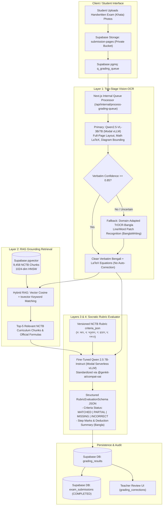

# SheraTutor — Submissions & Grading Pipeline Architecture

> **Document Version:** v1.0.0  
> **Status:** Finalized & Approved  
> **Execution Stack:** Kaggle (Unsloth T4 x2) + Modal Labs (Serverless vLLM) + Next.js 16 (App Router / Genkit) + Supabase (pgvector & pgmq)  
> **Target Domains:** Secondary & Higher Secondary (SSC/HSC) Bangla-Medium STEM (General Math, Higher Math, Physics, Chemistry, Biology)

---

## 1. Executive Summary

This specification establishes the production architecture for **SheraTutor's Automated Submissions & Grading System**. 

The system transitions SheraTutor away from brittle commercial Vision-Language Model (VLM) free-tier dependencies (avoiding rate-limit quota exhaustion and silent auto-correction biases) to a sovereign, cost-efficient, two-model fine-tuned pipeline:
1. **Model 1 (Layer 1 - Vision OCR):** A two-stage hybrid handwritten recognition pipeline utilizing fine-tuned **Qwen2.5-VL** for full-page layout and mathematical expressions, backed by a domain-adapted **TrOCR-Bangla** fallback for dense, cursive Bengali handwriting.
2. **Model 2 (Layers 3 & 4 - Rubric Evaluator):** A fine-tuned **Qwen 2.5 7B-Instruct** model trained via Unsloth on Kaggle to evaluate NCTB Creative Questions (ক, খ, গ, ঘ) against structured JSON rubrics with step-by-step partial credit and Bengali deduction explanations.
3. **Serving Infrastructure:** Serverless OpenAI-compatible vLLM endpoints hosted on **Modal Labs**, scaling to zero ($0.00 idle cost) and consuming Modal's $30/month recurring developer credits.

---

## 2. End-to-End Pipeline Workflow



---

## 3. Deep Component Specifications

### 3.1 Model 1: Two-Stage Hybrid Vision-OCR (Layer 1)

#### The Problem Solved
Standard off-the-shelf commercial VLMs suffer from language model prior bias—when a student writes a mistake in Bangla (e.g. arithmetic slip `v = u - at` instead of `v = u + at`, or a misspelled scientific term), conversational VLMs silently "auto-correct" the text, obscuring student mistakes from the grading engine.

#### Two-Stage Architecture
1. **Stage 1 (Primary - Qwen2.5-VL-3B/7B via Unsloth FastVision):**
   - **Role:** Handles full-page image inputs, segments page layout into question blocks (`recognized_blocks`), extracts inline/display LaTeX math (`\\[ ... \\]`), and tags geometric sketches.
   - **Training:** Fine-tuned on Kaggle T4 x2 using Unsloth's `FastVisionModel` with 4-bit quantization.
   - **Output:** Transcribed text, normalized bounding coordinates `[ymin, xmin, ymax, xmax]`, and a `verbatim_confidence` score (0.0–1.0).
2. **Stage 2 (Secondary Fallback - Domain-Adapted TrOCR-Bangla):**
   - **Role:** Triggered for text spans flagged with low confidence, ambiguous conjuncts (*যুক্তাক্ষর*), or dense cursive handwriting.
   - **Architecture:** Vision Transformer (ViT) encoder + RoBERTa Bengali text decoder (~250M parameters).
   - **Training:** Initialized from a community pre-trained Bengali TrOCR checkpoint on Hugging Face and domain-adapted on the **BanglaWriting** dataset (21,234 words from 260 writers) with mathematical operators.
   - **Benefit:** Transcribes strictly character-by-character without autoregressive conversational smoothing.

---

### 3.2 Model 2: Socratic Rubric Evaluator & Grader (Layers 3 & 4)

#### Base Model Selection: Qwen 2.5 7B-Instruct
- **Tokenizer Efficiency:** Qwen 2.5 possesses a superior multilingual tokenizer for Bengali. Unlike Llama 3.1 (which fragments a single Bengali word into 4–7 subword tokens), Qwen 2.5 requires significantly fewer tokens per word, reducing generation latency and context bloat.
- **STEM Reasoning:** Pre-trained on massive mathematical and scientific corpora, enabling accurate verification of physics derivations, chemical stoichiometry, and geometric proofs.
- **JSON Adherence:** Strong native instruction-following for constrained JSON schemas.

#### Training Dataset Preparation (Offline Multi-Mistake Synthesis via Gemini)
The training dataset is constructed offline from existing assets in the Supabase database:
- **Seed Assets:** 317 NCTB board questions and 315 versioned marking rubrics (`criteria_json`).
- **Synthesis:** An offline synthesis script utilizes Gemini 3.5 Flash to generate ~1,500 diverse student answer variations per question, classified into 5 realistic error modes:
  1. `FULL_MARKS`: Fully correct derivation, proper SI units, and complete explanation.
  2. `CALCULATION_ERROR`: Correct formula and values, but arithmetic/algebraic slip (e.g. $19 \times 3 = 54$).
  3. `UNIT_CONVERSION`: Omitting unit conversions (e.g., grams to kilograms, km/h to m/s).
  4. `FORMULA_RECALL`: Misremembered formula (e.g., $s = vt + \frac{1}{2}at$ missing squared exponent).
  5. `CONCEPTUAL_MISCONCEPTION`: Misapplying physical laws or writing irrelevant answers.
- **Supervision Target:** Ground-truth `RubricEvaluationSchema` JSON:
  ```json
  {
    "question_id": "...",
    "score_obtained": 2,
    "max_marks": 3,
    "criteria_evaluations": [
      {
        "step_name": "সূত্র প্রয়োগ (Formula Application)",
        "max_step_marks": 1,
        "awarded_marks": 1,
        "status": "MATCHED",
        "observation": "শিক্ষার্থী সঠিকভাবে সূত্র উল্লেখ করেছে: F = ma"
      },
      {
        "step_name": "মান বসানো ও একক রূপান্তর (Values & Units)",
        "max_step_marks": 1,
        "awarded_marks": 0,
        "status": "INCORRECT",
        "observation": "ভরের একক গ্রাম (g) থেকে কিলোগ্রামে (kg) রূপান্তর করা হয়নি।"
      },
      {
        "step_name": "চূড়ান্ত গণনা (Final Calculation)",
        "max_step_marks": 1,
        "awarded_marks": 1,
        "status": "MATCHED",
        "observation": "ভুল মান অনুযায়ী ধারাবাহিক গণনা সঠিক ছিল (কনসেকশোনাল মার্কিং)।"
      }
    ],
    "deduction_summary_bn": "সূত্রের প্রয়োগ সঠিক হলেও ভরের একক রূপান্তর না করায় ১ নম্বর কর্তন করা হয়েছে।",
    "mistake_category": "UNIT_CONVERSION",
    "arithmetic_verified": true
  }
  ```

---

## 4. Serving & Infrastructure Architecture

### 4.1 Modal Labs Serverless Deployment
- **Configuration:** Containerized vLLM engine running on Modal Labs (`training/deploy/modal_vllm_serverless.py`).
- **GPU Specs:** NVIDIA A10G / L4 (scale-to-zero enabled).
- **Cold-Start Policy:** Container boots in ~15–25 seconds on incoming grading batch; remains warm for 5 minutes of idle time.
- **Cost Structure:**
  - $0.00 fixed monthly infrastructure cost.
  - Consumes Modal's $30.00/month recurring free compute tier.
  - Pay-per-second execution only when evaluating papers.

### 4.2 Web Application Integration (`web/src/ai/genkit.ts`)
The serverless deployment exposes standard OpenAI-compatible endpoints (`/v1/chat/completions`), integrating natively into Genkit via `@genkit-ai/compat-oai`:

```typescript
// web/src/ai/genkit.ts
import { openAI } from "@genkit-ai/compat-oai";

export const ai = genkit({
  plugins: [
    openAI({
      apiKey: process.env.MODAL_API_KEY || "dummy",
      baseURL: process.env.MODAL_VLLM_BASE_URL || "https://sheratutor--vllm-serve.modal.run/v1",
    }),
    googleAI({
      apiKey: process.env.GEMINI_API_KEY,
    }),
  ],
});
```

*Note: Free-tier Gemini keys remain active in the rotation as an automatic fallback if the Modal endpoint experiences cold-start timeouts or quota limits.*

---

## 5. Security, Provenance & Human-in-the-Loop Audit

1. **Deterministic Auditing:** Every evaluation record inserted into `grading_results` retains complete provenance:
   - `model_name` (e.g. `modal/qwen2.5-7b-sheratutor-v1`)
   - `prompt_version`
   - `rubric_version_id`
   - `pipeline_version`
2. **Hallucination & Mismatch Safeguard:**
   - If `transcript_mismatch_detected` is flagged or `grounding_confidence < 0.70`, the submission status is marked as `NEEDS_REVIEW` instead of publishing unchecked marks.
   - Teachers can inspect original Khata crops and adjust criterion marks directly in the Teacher Dashboard via the `grading_corrections` table.

---

## 6. Implementation Milestones

| Milestone | Objective | Files & Artifacts |
| :--- | :--- | :--- |
| **Milestone 1** | Synthesize ~1,500 Multi-Mistake Training Triplets from Supabase | `training/dataset/export_supabase_to_dataset.py`<br>`training/dataset/sheratutor_rubric_train.jsonl` |
| **Milestone 2** | Fine-Tune Qwen 2.5 7B via Unsloth on Kaggle (T4 x2) | `training/kaggle/sheratutor_unsloth_qwen2_5_finetune.ipynb`<br>Export to Hugging Face Hub (GGUF / 16-bit) |
| **Milestone 3** | Domain-Adapt TrOCR-Bangla on Kaggle using BanglaWriting | `training/kaggle/train_trocr_banglawriting.py` |
| **Milestone 4** | Deploy Serverless vLLM Endpoint to Modal Labs | `training/deploy/modal_vllm_serverless.py` |
| **Milestone 5** | Wire Modal Endpoint into `web/.env.local` & Verify E2E Flow | `web/src/ai/flows/grade-submission.ts`<br>`web/src/tests/live_end_to_end_evaluation.ts` |
