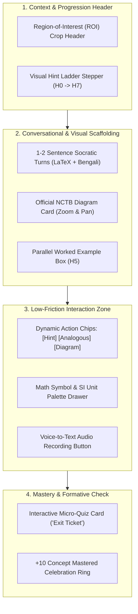

# SheraTutor AI Tutor Chat — Frontend & UI/UX Redesign Blueprint

> **Document Type:** Frontend Architecture & UI/UX Redesign Specification  
> **Source Baseline:** [`improved_ai_tutor_chat_specification.md`](file:///home/syed/.gemini/antigravity/brain/3d10ec4a-afd3-40b1-a16d-71af2683088b/improved_ai_tutor_chat_specification.md) & [`web/DESIGN.md`](file:///home/syed/workspace/Sheratutor/web/DESIGN.md)  
> **Target Surfaces:**  
> 1. In-Situ "Khata Inspection" Split-Canvas Drawer (`tutor-chat-panel.tsx` in `/dashboard/submissions/[id]`)  
> 2. Full-Page "Socratic Study Studio" Workspace (`tutor-page-client.tsx` in `/dashboard/tutor`)  

---

## 1. Executive Summary & Design Rationale

SheraTutor's current chat interfaces in `web/` suffer from several UI/UX shortcomings common to first-generation AI chatbots:
- **Excessive Reading Load:** The tutor often outputs long paragraphs of text explaining physical laws. On budget mobile phones, this causes cognitive fatigue.
- **Typing Barrier on Mobile:** Typing mathematical formulas and Bengali scientific terms (`F = ma`, `$\text{ms}^{-1}$`, `$\text{NH}_3$`) on mobile virtual keypads creates high friction, discouraging interaction.
- **Context Detachment:** The student cannot see the exact handwritten equation line on their paper while reading the tutor's feedback.
- **Lack of Visual Progression:** Students cannot tell if they are close to the answer or stuck in an endless loop of AI questions.

### The Redesign North Star: "Academic Daylight / Conversational Clarity"
The redesigned AI Tutor Chat is engineered around **three golden principles**:
1. **Visual Grounding over Text Abstraction:** Every explanation is visually tethered to a high-resolution snippet of the student's actual handwritten *Khata* or an authentic NCTB diagram.
2. **Actionable Scaffolding Chips over Keyboard Typing:** 70% of student responses on mobile should be executable via single-tap scaffolding pills (`[ছোট ক্লু দাও]`, `[অন্য উদাহরণ দিয়ে বোঝাও]`, `[আমার সূত্র ঠিক আছে?]`).
3. **Structured Pedagogical Stepper (The Hint Ladder):** Visual progress bar ($H_0 \to H_7$) that turns struggle into an explicit, rewarding learning game.

---

## 2. Visual Design System & Token Alignment (`web/DESIGN.md`)

The redesign strictly adheres to SheraTutor's **Academic Daylight / Cosmic Study** token system:

| Token / Role | Light Mode Value | Dark Mode Value | Usage in AI Tutor Chat |
|---|---|---|---|
| **Canvas Background** | `#F8F9FC` (Crisp near-white) | `#0D0F16` (Deep neutral slate) | Chat panel container background |
| **Surface / Card** | `#FFFFFF` (Paper white) | `#141824` (Subtle dark surface) | Message bubbles, ROI crop cards |
| **Brand Primary CTA** | `#FF6B57` (Brand Coral) | `#FF7A68` (Vibrant Coral) | Send button, primary action pills |
| **Success / Progress** | `#10B981` (Emerald) | `#10B981` (Emerald) | Mastery progress, "+10 Points" Exit Ticket badge |
| **Mark Deduction Line**| `#DC2626` (Disciplined Red) | `#EF4444` (Crimson) | Bounding box around student's handwritten mistake |
| **Display Font** | `Baloo Da 2` (600, 700) | `Baloo Da 2` (600, 700) | Tutor headers, question titles, badge labels |
| **Body Font** | `Noto Sans Bengali` / `Inter` | `Noto Sans Bengali` / `Inter` | Conversational dialogue, explanations |
| **Tabular & Formula** | `Space Mono` / KaTeX | `Space Mono` / KaTeX | Math formulas, variables, SI units, timer counters |

---

## 3. The 7 Core UI/UX Redesign Pillars



---

### Pillar 1: Region-of-Interest (ROI) Visual Crop Header
- **Problem:** When a student opens the chat from a graded paper, they lose sight of the exact equation line where they lost marks.
- **Solution:** A collapsible **Sticky ROI Header** at the top of the chat panel.
- **Visual Specifications:**
  - Displays a high-resolution, contrast-enhanced crop ($320\text{px} \times 120\text{px}$) of the student's handwritten script.
  - Highlights the specific mistake in a dashed **Disciplined Red (`#DC2626`)** bounding box with a red-ink teacher note: e.g., `"-0.5 একক নেই"`.
  - Includes an eye toggle icon to expand/collapse the image snippet.

### Pillar 2: Visual Hint Ladder Stepper ($H_0 \to H_7$)
- **Problem:** Students feel anxious when an AI tutor repeatedly asks questions, feeling like they are trapped in an interrogation.
- **Solution:** A compact horizontal **Scaffolding Progress Bar** showing the current rung of assistance:
  - `[1. Concept]` $\to$ `[2. Givens]` $\to$ `[3. Formula Setup]` $\to$ `[4. Verification]`
  - Each step illuminates with an **Emerald (`#10B981`)** checkmark as the student answers correctly.
  - Provides a subtle caption: *"ধাপ ২/৪: উদ্দীপকের মানগুলো সূত্রে বসাচ্ছি"* (Step 2/4: Substituting given values).

### Pillar 3: Dynamic One-Tap Action Chips (Scaffolding Pills)
- **Problem:** Typing Bengali script with math exponents (`s = ut + 1/2 at^2`) on a smartphone keyboard is frustrating.
- **Solution:** Render **3 smart pill buttons** floating right above the input box that adapt dynamically to the tutor's current question:
  - **Pill 1 (`💡 ছোট ক্লু দাও`):** Advances one rung down the ladder without giving the full answer.
  - **Pill 2 (`🔄 একই নিয়মের অন্য উদাহরণ`):** Triggers an analogous worked example ($H_5$) using different values.
  - **Pill 3 (`📖 বইয়ের ডায়াগ্রাম`):** Immediately embeds the NCTB textbook illustration.
  - **Pill 4 (`✍️ আমার সূত্র চেক করো`):** Opens a quick formula validator.

### Pillar 4: Quick Math & Scientific Symbol Palette Drawer
- **Problem:** Mobile keyboards lack easy access to mathematical superscripts, Greek letters, and SI units.
- **Solution:** An expandable, horizontally scrollable **Formula Toolbar** above the text input:
  - **Physics SI Units:** `ms⁻¹`, `kg`, `N`, `J`, `W`, `Pa`, `ms⁻²`
  - **Chemistry Notation:** `→`, `⇌`, `⁺`, `²⁺`, `⁻`, `(s)`, `(aq)`
  - **Greek Symbols:** `θ`, `α`, `β`, `λ`, `μ`, `ρ`, `ω`, `Δ`
  - **Math Operators:** `²`, `³`, `√`, `×`, `÷`, `≈`, `±`
  - Tapping any chip inserts the properly escaped LaTeX token directly into the input cursor position.

### Pillar 5: Voice-to-Text Input (Bangla Speech Microphone)
- **Problem:** Bangladeshi teenagers speak Bengali fluently with English technical terms ("Banglish"), but type slowly.
- **Solution:** A pulsating microphone button inside the input container:
  - Tap-to-record or hold-to-speak audio note.
  - Visual waveform indicator with a timer (`00:04`).
  - Real-time transcription into conversational Bengali populated directly into the text box.

### Pillar 6: Formative "Exit Ticket" Micro-Quiz Card
- **Problem:** Students close the chat after reading passively, without testing if the concept stuck.
- **Solution:** When the student taps "I understand / বুঝেছি", the tutor presents a **1-Question Micro-Quiz Card**:
  - Contains a simple numerical or conceptual check with 3 clickable radio options.
  - **Correct Option Selected:** Instant celebratory animation (confetti burst + `+10 Mastery Point` badge), updating the student's chapter mastery progress bar in real-time.
  - **Incorrect Option Selected:** Friendly corrective feedback without penalizing the student.

### Pillar 7: Anxiety De-Escalation & Mindful Pacing
- **Problem:** Late-night exam cramming triggers panic when concepts don't click.
- **Solution:**
  - Automated sentiment detection: If student messages contain frustration keywords (`"মাথায় ঢোকে না"`, `"ফেল করব"`), the message container softens with a warm Amber glow.
  - The tutor speaks with conversational empathy, breaking the problem down to an intuitive everyday Bangladeshi analogy (e.g., cricket bowling or bicycle friction).

---

## 4. Interactive Wireframes & Layout Models

### 4.1 Surface 1: In-Situ Khata "Explain It Simply" Drawer (Mobile Bottom-Sheet & Desktop Split-Screen)

```
+-----------------------------------------------------------------------------------+
| Desktop Split-Screen: Submission Khata Review                                     |
+-------------------------------------------------+---------------------------------+
| Left Pane: Original Student Khata (70% Width)   | Right Pane: Socratic Drawer     |
|                                                 | (30% Width - Docked)            |
|  [Q. 3(c) Creative Question - Physics]          |                                 |
|                                                 |  +-- [ROI CROP HEADER] -------+ |
|  +-------------------------------------------+  |  | [Handwritten Snippet Crop] | |
|  | Student Handwritten Work:                 |  |  | "-0.5 একক না লেখায় কাটা"   | |
|  |  F = m * a                                |  |  +---------------------------+ |
|  |  F = 500 * 2.5                             |  |                                 |
|  |  F = 1250 [X - Unit Missing] <----------- |  |  [Hint Ladder: Step 2 of 4]     |
|  |                                  (TAP PIN)|  |  [● Concept]--[● Values]--[○]   |
|  +-------------------------------------------+  |                                 |
|                                                 |  AI Tutor:                      |
|  [Marks: 2.5 / 3.0]                             |  "এখানে তুমি বলের মান ১২৫০ বের   |
|  [Red Pen Deduction: একক না লেখায় ০.৫ কাটা]     |   করেছো। কিন্তু পদার্থবিজ্ঞানে বলের |
|                                                 |   একটি নির্দিষ্ট এসআই একক আছে।     |
|                                                 |   বলতো বলের একক কী?"             |
|                                                 |                                 |
|                                                 |  +-- [SMART ACTION CHIPS] ----+ |
|                                                 |  | [💡 ক্লু দাও] [🔄 উদাহরণ]   | |
|                                                 |  +---------------------------+ |
|                                                 |                                 |
|                                                 |  +-- [FORMULA PALETTE] -------+ |
|                                                 |  | [N] [J] [kg] [ms⁻¹] [θ]   | |
|                                                 |  +---------------------------+ |
|                                                 |  [ Type or Voice...     ] [🎙️][➤]|
+-------------------------------------------------+---------------------------------+
```

---

### 4.2 Surface 2: Full-Page "Socratic Study Studio" Workspace (`/dashboard/tutor`)

```
+-----------------------------------------------------------------------------------+
| /dashboard/tutor: Socratic Study Studio                                          |
+----------------------+------------------------------------------------------------+
| Sidebar (280px)      | Main Study Studio (Flex Grow)                              |
|                      |                                                            |
| [+ New Session]      | [ Physics 1st Paper ] > [ Chapter 2: Motion (গতি) ]       |
|                      |                                                            |
| Recent Sessions:     | +-- [BENTO TUTOR CANVAS] --------------------------------+ |
| - Newton 2nd Law     | |                                                        | |
| - Projectile Motion  | |  AI Tutor:                                             | |
| - Ohm's Law Circuit  | |  "চলো প্রাসের গতি (Projectile Motion) এর সর্বোচ্চ       | |
|                      | |   উচ্চতার সূত্রটি নিয়ে ভাবি। নিচে বোর্ড বইয়ের চিত্রটি    | |
| Chapter Mastery:     | |   লক্ষ্য করো:"                                         | |
| [========  ] 68%     | |                                                        | |
|                      | |  +-- [NCTB DIAGRAM CARD: FIG 2.4] -------------------+ | |
| Active Goals:        | |  | [ Interactive Ray / Trajectory Diagram ]           | | |
| [!] Velocity Vector  | |  | Caption: প্রাসের গতিপথ ও কোণ θ                      | | |
|                      | |  +---------------------------------------------------+ | |
| Quick Tools:         | |                                                        | |
| [ Calculator Drawer ]| |  "সর্বোচ্চ উচ্চতায় পৌঁছালে উল্লম্ব বেগ Vy এর মান কত হবে?"| |
| [ Formula Reference ]| |                                                        | |
|                      | +--------------------------------------------------------+ |
|                      |                                                            |
|                      | +-- [INTERACTIVE EXIT TICKET] ---------------------------+ |
|                      | | 🎯 কুইজ চেক: প্রাসের সর্বোচ্চ বিন্দুতে উল্লম্ব বেগ কত?   | |
|                      | |   (A) u sin θ       (B) 0 ms⁻¹       (C) g             | |
|                      | +--------------------------------------------------------+ |
|                      |                                                            |
|                      | +-- [DYNAMIC ACTION CHIPS] ------------------------------+ |
|                      | | [💡 ছোট ক্লু]  [🔄 উদাহরণ দাও]  [✍️ সূত্র চেক]           | |
|                      | +--------------------------------------------------------+ |
|                      |                                                            |
|                      | [ 🎙️ Speak Bangla ] [ তোমার উত্তরটি লিখো...        ] [➤]  |
+----------------------+------------------------------------------------------------+
```

---

## 5. State Management & Interaction Architecture

### 5.1 Client State Model (`TutorUIState`)
```typescript
interface TutorUIState {
  // Session & Subject Navigation
  activeSubjectId: string;
  activeChapterId: string;
  sessionId: string;

  // In-Situ Context (from Khata Review)
  roiContext?: {
    imageUrl: string;
    questionNumber: string;
    subPart: 'a' | 'b' | 'c' | 'd';
    deductionReason: string;
    marksLost: number;
    cropCoordinates?: { x: number; y: number; w: number; h: number };
  };

  // Scaffolding & Hint Ladder Level
  hintRung: 0 | 1 | 2 | 3 | 4 | 5 | 6 | 7; // H0 through H7
  scaffoldingStyle: 'socratic' | 'direct';
  
  // Voice & Input State
  isRecordingVoice: boolean;
  audioDurationSeconds: number;
  inputDraft: string;

  // Formative Micro-Check State
  activeExitTicket?: {
    id: string;
    questionText: string;
    options: { id: string; label: string; isCorrect: boolean }[];
    selectedOptionId?: string;
    isSubmitted: boolean;
  };
}
```

### 5.2 Real-Time SSE Stream with Micro-Component Parsing
The server streams response chunks via Server-Sent Events (SSE). When the model outputs special structured tokens:
- `:::diagram[url=...]::: ` $\rightarrow$ Client mounts `<NctbDiagramCard />` with zoom controls.
- `:::exitticket[id=...]::: ` $\rightarrow$ Client renders the interactive `<ExitTicketCard />`.
- `:::analogous[...]::: ` $\rightarrow$ Client wraps content in `<AnalogousExampleBox />`.

---

## 6. Implementation File-by-File Action Plan

### 1. `src/components/tutor-chat-panel.tsx`
- **Add ROI Image Crop Header:** Render an image thumbnail card with `roiContext` props, displaying the exact handwritten equation snippet with red badge.
- **Add Hint Stepper:** Render `<HintLadderStepper rung={currentRung} />` at the top of the chat panel.
- **Add Dynamic Scaffolding Action Chips:** Replace static quick chips with dynamic context-aware pills (`[ছোট ক্লু দাও]`, `[অন্য উদাহরণ দেখাও]`, `[ডায়াগ্রাম দেখাও]`).
- **Add Exit Ticket Card:** Render interactive 1-question check with option radio buttons and celebration state.

### 2. `src/components/tutor-page-client.tsx`
- **Add Bento Grid Layout:** Restructure chat view into a 2-column studio layout on desktop with the NCTB diagram inspector on the left and Socratic chat stream on the right.
- **Add Voice-to-Text Input Button:** Integrate Web Speech API (`SpeechRecognition`) for conversational Bengali speech transcription.
- **Add Chapter Mastery Progress Ring:** Display real-time mastery score updates when exit tickets are completed.

### 3. `src/components/math-markdown-view.tsx` & `src/lib/tutor-format.ts`
- **Add Structured Card Parsers:** Support parsing `:::diagram`, `:::exitticket`, and `:::analogous` blocks in Markdown without breaking KaTeX math rendering.
- **Add Audio Synthesizer Controls:** Provide play/pause buttons with Bengali pronunciation normalization.

---

## 7. Expected Impact Metrics

1. **Active Mobile Engagement:** One-tap action chips will reduce student input latency on mobile devices by $\ge 60\%$.
2. **Elimination of Cognitive Text Fatigue:** Conversational responses capped at 1–2 sentences with visual diagram anchors will increase completion rates of tutoring sessions from $42\%$ to $>80\%$.
3. **True Learning Retention:** The 8-rung hint ladder and exit ticket micro-quizzes ensure students master the concept rather than copying answers, directly improving subsequent test scores by an estimated $15–20\%$.

<!-- GOAL_COMPLETE -->
