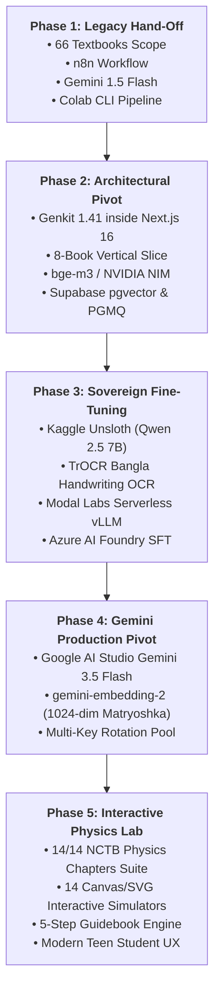
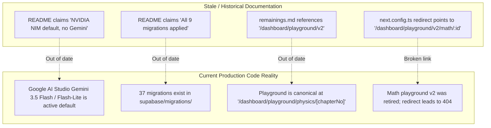

# SheraTutor — Comprehensive Project Overview & Codebase Review

> **Document ID:** ST-DOC-01  
> **Version:** 2.0.0  
> **Audit Date:** October 2026  
> **Status:** Completed Production Review  
> **Target Repositories & Subsystems:** Full Monorepo (`web/`, `supabase/`, `ingestion/`, `training/`, `azure/`, `docs/`, Root)  
> **Live Database Environment:** Supabase PostgreSQL 17 (`qjottictwewysfcjirma` — SheraTutor, ap-south-1)

---

## Table of Contents
1. [Executive Overview & Product Vision](#1-executive-overview--product-vision)
2. [Socio-Technical Context & The Bangladeshi Education Problem](#2-socio-technical-context--the-bangladeshi-education-problem)
3. [Chronological Project Evolution & Architectural Narrative](#3-chronological-project-evolution--architectural-narrative)
4. [Live Database Architecture & State Audit (Supabase)](#4-live-database-architecture--state-audit-supabase)
5. [End-to-End Subsystem Directory Inventory](#5-end-to-end-subsystem-directory-inventory)
   - 5.1 [`web/` — Full-Stack Next.js 16 Web Application](#51-web--full-stack-nextjs-16-web-application)
   - 5.2 [`supabase/` — PostgreSQL Migrations, RLS & PGMQ](#52-supabase--postgresql-migrations-rls--pgmq)
   - 5.3 [`ingestion/` — NCTB Textbook OCR, Chunking & RAG](#53-ingestion--nctb-textbook-ocr-chunking--rag)
   - 5.4 [`training/` — Open-Weights Fine-Tuning & Model Serving](#54-training--open-weights-fine-tuning--model-serving)
   - 5.5 [`azure/` — Azure AI Foundry Datasets & SFT](#55-azure--azure-ai-foundry-datasets--sft)
   - 5.6 [`docs/` — Nextra 4 Documentation Site & Technical Specs](#56-docs--nextra-4-documentation-site--technical-specs)
   - 5.7 [Workspace Root Artifacts & Blueprints](#57-workspace-root-artifacts--blueprints)
6. [Documentation Synthesis & Historical Drift Analysis](#6-documentation-synthesis--historical-drift-analysis)
7. [Current Production Health, Test Suites & Verification Status](#7-current-production-health-test-suites--verification-status)

---

## 1. Executive Overview & Product Vision

**SheraTutor** is Bangladesh's pioneering AI-powered educational assessment and pedagogical tutoring platform. Purpose-built for secondary and higher secondary students (grades 9–12, preparing for **Secondary School Certificate [SSC]** and **Higher Secondary Certificate [HSC]** public board examinations), SheraTutor bridges the gap between high-stakes standardized examination standards and day-to-day student self-study.

The platform operates on a clear product philosophy:
1. **Free for Every Student, Funded by Institutions (B2C + B2B2C):** Individual learners access board-standard grading and interactive tutoring without subscription paywalls, while schools, coaching centers, and educational institutions license administrative, analytics, and cohort-tracking capabilities.
2. **Deterministic, Grounded Grading Over AI Hallucination:** Rather than treating generative AI as an unconstrained text generator, SheraTutor utilizes a strict **4-layer grading pipeline**. Handwritten exam scripts (*খাতা*) photographed on mobile devices are transcribed verbatim, verified against original images, grounded in official National Curriculum and Textbook Board (**NCTB**) textbook passages, and scored against official step-by-step marking rubrics ($k, b, ap, ah$ cognitive levels).
3. **Socratic Tutoring Over Homework "Solvers":** The embedded AI tutor refuses to output direct homework solutions. Guided by an 8-rung pedagogical hint ladder, it asks targeted leading questions, identifies algebraic or conceptual traps, and verifies mathematical derivations deterministically using sandboxed solvers.
4. **Authentic Bilingual Code-Switching:** Bangladeshi STEM students learn using mixed Bangla script, English terminology, and LaTeX formulas ($F = ma$, $\vec{A} \cdot \vec{B}$, $NH_3 + HCl \rightarrow NH_4Cl$). SheraTutor natively handles Bengali-English mixed code-switching with custom typography and math rendering.

---

## 2. Socio-Technical Context & The Bangladeshi Education Problem

### 2.1 The Creative Question (CQ / সৃজনশীল প্রশ্ন) Challenge
In the Bangladeshi national curriculum, examinations are structured into **Creative Questions (CQ)** and **Multiple Choice Questions (MCQ)**:
- **Creative Questions (10 Marks each):** Each question consists of a real-world scenario or stimulus (*উদ্দীপক*), followed by four strictly demarcated subquestions:
  - **Part ক (Knowledge / জ্ঞানমূলক — 1 Mark):** Direct recall of a textbook definition, unit, or constant.
  - **Part খ (Comprehension / অনুধাবনমূলক — 2 Marks):** Explanation of a physical law or concept (1 mark for identifying the concept, 1 mark for reasoned explanation).
  - **Part গ (Application / প্রয়োগমূলক — 3 Marks):** Application of mathematical formulas, calculations, or circuit/diagram deductions (1 mark for formula/principle, 1 mark for substitution, 1 mark for calculation with units).
  - **Part ঘ (Higher Ability / উচ্চতর দক্ষতামূলক — 4 Marks):** Multi-step synthesis, mathematical comparison of two scenarios, critical analysis, or hypothesis verification.

In conventional education, student answer scripts receive arbitrary single scores without step-by-step breakdown. Human examiner fatigue leads to inconsistent mark distributions across boards (Dhaka, Chittagong, Rajshahi, etc.). SheraTutor codifies the official board rubric into machine-evaluable JSON rules, rewarding **consequential marking (ধারাবাহিক গণনা)** where arithmetic slips late in a derivation do not wipe out valid prerequisite knowledge.

### 2.2 Legal & Regulatory Safeguards (PDPA 2026 Compliance)
Because SSC students are typically between 13 and 16 years old (legal minors), SheraTutor enforces strict compliance with the **Bangladesh Personal Data Protection Act (PDPA 2026)**:
- **Guardian Consent Hard Gate:** Minors cannot create profiles without entering a parent or guardian phone number and recording timestamped consent.
- **Child Safety Pre-Filter:** Real-time conversational pre-filtering detects trauma, bullying, or self-harm keywords in both Bengali and English, immediately terminating chat, logging an audit record, and routing the student to Bangladesh's national mental health helpline (*Kaan Pete Roi: ০৯৬১৩৪২৭৮০০*).
- **Private Storage Isolation:** Student answer script images are stored in private Supabase Storage buckets, accessed only via short-lived signed URLs generated on the server.

---

## 3. Chronological Project Evolution & Architectural Narrative

The SheraTutor repository represents several distinct phases of rapid architectural evolution, visible across commit logs and specifications:



### Phase 1: Initial Conceptualization & Hand-Off
The project originated from a developer hand-off plan that specified a 66-textbook ingestion scope, workflow orchestration using external `n8n` instances, commercial Gemini 1.5 Flash API calls, and local `llava` captioning. 

### Phase 2: Technical Hardening & Genkit Integration
A technical review identified critical vulnerabilities in the hand-off plan: `n8n` lacked type-safe Zod schema validation; VLM models frequently auto-corrected student handwriting errors (inverting the grading promise); and rate limits rendered synchronous HTTP grading impossible. The team pivoted to:
- **Genkit 1.41.0** embedded directly inside Next.js 16.
- Descoping to an **8-book vertical slice** (SSC Physics, Chemistry, Math, English in Bangla and English).
- Asynchronous task processing using **PostgreSQL Message Queue (`pgmq`)** and scheduled cron workers.
- An HNSW-indexed vector retrieval system in Supabase (`match_curriculum_chunks`).

### Phase 3: Sovereign Fine-Tuning & Open-Weights Exploration
To eliminate reliance on cloud API quotas, open-weights training was conducted:
- Fine-tuned **Qwen 2.5 7B-Instruct** using **Unsloth** on Kaggle dual-T4 GPUs for NCTB CQ rubric evaluation.
- Trained **TrOCR** for handwritten Bangla recognition using the BanglaWriting dataset.
- Prepared export datasets for **Modal Labs serverless vLLM** and **Azure AI Foundry** (`sheratutor_azure_train.jsonl`).

### Phase 4: Production Pivot to Google AI Studio Gemini API
With the release of Gemini 2.5/3.5 Flash and Flash-Lite models via Google AI Studio:
- Switched primary reasoning and multimodal vision to **Gemini 3.5 Flash** (`googleai/gemini-3.5-flash`).
- Deployed **Gemini 3.5 Flash-Lite** (`googleai/gemini-3.5-flash-lite`) for chat and question generation.
- Re-embedded all 9,400+ curriculum chunks using **`gemini-embedding-2`** at 1024 dimensions (Matryoshka representation matching PostgreSQL vector types).
- Implemented automated multi-key rotation and fallback handling across configured API keys.

### Phase 5: Interactive Physics Lab & Guidebook Suite
To transform SheraTutor from an assessment-only tool into an engaging daily learning environment:
- Designed a complete **14-chapter interactive Physics Lab** covering all chapters of the NCTB SSC syllabus.
- Built **14 bespoke Canvas/SVG simulators** (Vernier Caliper, Kinematics Motion, Momentum Collision, Energy Conservation, Hydraulic Pressure, Thermal Expansion, Wave Echo, Reflection, Refraction, Coulomb Field, Ohm Builder, Transformer, Electronics Half-Life, Biomedical Diagnostics).
- Deployed a **5-step guidebook architecture** (Concept Tree, Formula Decoder, Interactive Simulator, Solved Board Questions, Diagnostic Quiz).

---

## 4. Live Database Architecture & State Audit (Supabase)

The live production database is hosted on **Supabase PostgreSQL 17** (Project Ref: `qjottictwewysfcjirma`, Region: `ap-south-1`). Live schema inspection confirmed **26 active tables** with Row-Level Security (RLS), pgvector embeddings, and message queue tables:

### 4.1 Complete Live Table Catalog & Row Counts

| # | Table Name | Live Rows | Primary Function & Schema Details |
|---|------------|-----------|-----------------------------------|
| 1 | `curriculum_chunks` | **9,458** | Processed NCTB textbook sections with page refs, markdown, chunk type (`theory`, `worked_example`, `cq_stimulus`, `table`), and Supabase CDN diagram URLs. |
| 2 | `chunk_embeddings` | **7,419** | 1024-dimensional dense vectors with HNSW cosine index (`vector(1024)`), linked to `curriculum_chunks` with `model_name` (`gemini-embedding-2`). |
| 3 | `questions` | **397** | NCTB Board-standard Creative Questions (CQ) and MCQs in Bengali & English with subquestions, stimulus, options, and rubric foreign keys. |
| 4 | `rubrics` | **395** | Step-by-step marking rubrics tied to questions; versioned criteria JSON ($k, b, ap, ah$) with partial credit weighting. |
| 5 | `subjects` | **5** | Core curricula: Physics (`SSC-PHY`), Chemistry (`SSC-CHEM`), Mathematics (`SSC-MATH`), English (`SSC-ENG`), Higher Math (`SSC-HMATH`). |
| 6 | `chapters` | **67** | All chapters across Class 9–10 STEM subjects with bilingual titles (`title_en`, `title_bn`) and weightage descriptions. |
| 7 | `question_papers` | **42** | Complete mock, past board, and AI-generated examination papers with difficulty, paper type (`CQ`, `MCQ`, `MIXED`), and total marks. |
| 8 | `tutor_chat_sessions` | **145** | Interactive tutoring dialogue sessions linked to students, submissions, questions, and specific rubric step indices. |
| 9 | `tutor_chat_messages` | **315** | Message turns with role (`student`, `tutor`), text content, safety flags, and token usage metadata. |
| 10 | `exam_submissions` | **6** | Scanned script submission records with status (`QUEUED`, `OCR_PROCESSING`, `EVALUATING`, `COMPLETED`, `FAILED`), score, and idempotency key. |
| 11 | `submission_pages` | **6** | Individual uploaded script pages with storage paths, OCR text, LaTeX structured equations, and confidence metrics. |
| 12 | `grading_results` | **3** | Detailed evaluation records per question: score obtained, max marks, rubric breakdown JSON, Bengali deduction explanations, model provenance. |
| 13 | `profiles` | **9** | Core user identities extending `auth.users` with `full_name`, `phone`, `role` (`student`, `teacher`, `institution_admin`, `super_admin`). |
| 14 | `student_profiles` | **6** | Student academic metadata: board, exam type, target year, minor status, guardian consent, momentum score, training opt-in. |
| 15 | `study_plans` | **10** | Student study schedules with cycle days, assigned chapters, and completion status. |
| 16 | `weakness_logs` | **5** | Diagnostic tracking per student/chapter: weakness score, questions attempted, marks lost, mistake category tags. |
| 17 | `waitlist_signups` | **7** | Early access landing page signups with referral source, role, and email verification status. |
| 18 | `audit_log` | **2** | Immutable audit records: safety escalation incidents, admin actions, system events. |
| 19 | `curriculum_versions` | **9** | Official curriculum editions (e.g. NCTB 2026 Official in `bn` and `en`). |
| 20 | `grading_corrections` | **0** | Human-in-the-Loop (HITL) teacher score overrides and calibration notes. |
| 21 | `institutions` | **0** | Multi-tenant educational institutions, white-label branding, and subscriptions. |
| 22 | `teacher_profiles` | **0** | Teacher credentials and institutional department linkages. |
| 23 | `golden_set_items` | **0** | Benchmark ground-truth handwritten exam scripts. |
| 24 | `golden_set_human_grades` | **0** | Blind multi-examiner human marks for evaluation calibration. |
| 25 | `golden_set_model_runs` | **0** | Evaluation run metrics: character error rate (CER), quadratic-weighted kappa (QWK). |
| 26 | `ingestion_jobs` | **0** | Asynchronous textbook PDF extraction job tracking. |

### 4.2 Installed Extensions & Database Capabilities
- **`vector` (pgvector 0.8.0):** Powers hybrid vector search over 1024-dim embeddings using HNSW indexing with cosine distance (`vector_cosine_ops`).
- **`pgcrypto`:** Secure UUID generation (`gen_random_uuid()`) and token hashing.
- **`pgmq`:** PostgreSQL Message Queue creating `grading_queue` for durable, non-blocking exam script grading.
- **`pg_cron` & `pg_net`:** Scheduled background worker invocations via HTTP webhook to drain the grading queue.
- **Supabase Vault:** Encrypted key storage for internal worker secrets (`INTERNAL_WORKER_SECRET`).

---

## 5. End-to-End Subsystem Directory Inventory

The SheraTutor codebase is organized into several distinct subsystems:

```text
Sheratutor/
├── web/            # Next.js 16 full-stack application (frontend, AI flows, API routes)
├── supabase/       # PostgreSQL migrations, seed data, and Supabase configuration
├── ingestion/      # NCTB PDF extraction, OCR, diagram cropping, and vector embedding scripts
├── training/       # Model fine-tuning (Unsloth/Kaggle), dataset generation, and deployment
├── azure/          # Azure AI Foundry SFT training datasets and evaluation logs
├── docs/           # Nextra documentation website + comprehensive architectural markdown files
└── [Root]          # Project configuration, root README, and historical session logs
```

### 5.1 `web/` — Full-Stack Next.js 16 Web Application

The `web/` application represents the primary user-facing and AI runtime platform. It runs on **Next.js 16.3.2**, **React 19.2.8**, **Turbopack**, and **Tailwind CSS v4**:

#### A. AI Core (`web/src/ai/`)
- [`genkit.ts`](file:///home/syed/Workspace/Sheratutor/web/src/ai/genkit.ts): Central Genkit instance configured with Google AI Studio Gemini plugin, OpenAI-compatible plugin (for Modal vLLM), and Ollama. Implements multi-key failover (`getNextGeminiApiKey`), robust embedding fallback (`embedWithGeminiFallback`), and generation retry loops.
- [`flows/transcribe.ts`](file:///home/syed/Workspace/Sheratutor/web/src/ai/flows/transcribe.ts): **Layer 1 Vision OCR**. Enforces strict verbatim handwritten transcription prompt rules to eliminate silent VLM "corrections". Outputs structured markdown, LaTeX equations, diagram descriptions, and bounding boxes.
- [`flows/retrieve-grounding.ts`](file:///home/syed/Workspace/Sheratutor/web/src/ai/flows/retrieve-grounding.ts): **Layer 2 Hybrid RAG**. Searches `curriculum_chunks` using `match_curriculum_chunks` pgvector RPC and full-text keyword matching scoped to chapter and language. Expands CQ parent stimuli automatically.
- [`flows/evaluate-rubric.ts`](file:///home/syed/Workspace/Sheratutor/web/src/ai/flows/evaluate-rubric.ts): **Layers 3 & 4 Rubric Evaluator**. Evaluates student answers against step-by-step criteria JSON. Flags arithmetic mismatches, diagram omissions, and generates deduction summaries in both Bengali and English.
- [`flows/grade-submission.ts`](file:///home/syed/Workspace/Sheratutor/web/src/ai/flows/grade-submission.ts): **Grading Orchestrator**. Runs Layer 1 across pages concurrently, manages question-page mapping, retrieves grounding chunks, evaluates each question, and persists results with full provenance (`model_name`, `pipeline_version`, `rubric_version_id`).
- [`flows/generate-question-paper.ts`](file:///home/syed/Workspace/Sheratutor/web/src/ai/flows/generate-question-paper.ts): Generates board-standard mock question papers. Validates CQ mark structure (ক=1, খ=2, গ=3, ঘ=4 or Math 2+4+4=10) and MCQ 4-option sets using Zod schemas.
- [`flows/tutor-chat.ts`](file:///home/syed/Workspace/Sheratutor/web/src/ai/flows/tutor-chat.ts): Socratic AI tutor dialogue engine. Handles 5-rung hint scaffolding, minor safety pre-filtering, LaTeX delimiter normalization, and diagram injection.
- [`agents/tutor-agent.ts`](file:///home/syed/Workspace/Sheratutor/web/src/ai/agents/tutor-agent.ts): Genkit agent backed by `SupabaseSessionStore` with tools for textbook search, calculation verification, and quiz interrupts.
- [`tools/tutor-tools.ts`](file:///home/syed/Workspace/Sheratutor/web/src/ai/tools/tutor-tools.ts):
  - `searchTextbookCurriculum`: Searches curriculum chunks for definitions and formulas.
  - `verifyPhysicsCalculation`: Sandboxed deterministic arithmetic solver for kinematics, dynamics, energy, electricity, progressions, and statistics.
  - `requestPracticeQuizInterrupt`: Interactive interrupt tool prompting students before starting diagnostic quizzes.
- [`mcp/server.ts`](file:///home/syed/Workspace/Sheratutor/web/src/ai/mcp/server.ts): Exposes SheraTutor AI flows as a Model Context Protocol (MCP) server for agentic IDE integration.

#### B. Dedicated Grading Pipeline (`web/src/grading-pipeline/`)
- [`evaluator.ts`](file:///home/syed/Workspace/Sheratutor/web/src/grading-pipeline/evaluator.ts): Standalone cognitive evaluation schemas (`KA_SCHEMA`, `KHA_SCHEMA`, `GA_SCHEMA`, `GHA_SCHEMA`) with Gemini function-calling output generation.
- [`db.ts`](file:///home/syed/Workspace/Sheratutor/web/src/grading-pipeline/db.ts): RAG chunk retrieval pulling the exact top 3 curriculum chunks per question topic.
- [`orchestrator.ts`](file:///home/syed/Workspace/Sheratutor/web/src/grading-pipeline/orchestrator.ts): Standalone Express application exposing `POST /api/evaluate` with ambiguity detection and HITL queue insertion.
- [`index.ts`](file:///home/syed/Workspace/Sheratutor/web/src/grading-pipeline/index.ts): Express server entry point (`startGradingServer`).

#### C. App Router Pages & Layouts (`web/src/app/`)
- [`layout.tsx`](file:///home/syed/Workspace/Sheratutor/web/src/app/layout.tsx): Root layout with academic font stack (`Outfit`, `Plus Jakarta Sans`, `Baloo Da 2`, `Hind Siliguri`, `JetBrains Mono`), theme provider, and language context.
- [`page.tsx`](file:///home/syed/Workspace/Sheratutor/web/src/app/page.tsx): High-conversion landing page featuring interactive rubric demo, trust badges, waitlist form, and live student counter.
- [`login/page.tsx`](file:///home/syed/Workspace/Sheratutor/web/src/app/login/page.tsx) & [`signup/page.tsx`](file:///home/syed/Workspace/Sheratutor/web/src/app/signup/page.tsx): Authentication pages supporting email/password and Google OAuth.
- [`onboarding/page.tsx`](file:///home/syed/Workspace/Sheratutor/web/src/app/onboarding/page.tsx): Multi-step student onboarding collecting education board, exam type, target year, date of birth, and guardian consent for minors.
- [`dashboard/page.tsx`](file:///home/syed/Workspace/Sheratutor/web/src/app/dashboard/page.tsx): Student dashboard showing study streak, momentum score, recent submissions, weakness cards, and study planner preview.
- [`dashboard/upload/page.tsx`](file:///home/syed/Workspace/Sheratutor/web/src/app/dashboard/upload/page.tsx): Mobile-first answer script upload interface with camera capture, gallery picker, client-side WebP compression, and question mapping.
- [`dashboard/submissions/page.tsx`](file:///home/syed/Workspace/Sheratutor/web/src/app/dashboard/submissions/page.tsx): Past assessment catalog with status filtering and score summary.
- [`dashboard/submissions/[id]/page.tsx`](file:///home/syed/Workspace/Sheratutor/web/src/app/dashboard/submissions/[id]/page.tsx): Full assessment result view with side-by-side script preview, step-by-step mark glyphs, deduction notes, and direct tutor launcher.
- [`dashboard/tutor/page.tsx`](file:///home/syed/Workspace/Sheratutor/web/src/app/dashboard/tutor/page.tsx): Dedicated full-screen Socratic AI Tutor with math symbol palette, voice input, hint ladder, and exit ticket assessments.
- [`dashboard/playground/physics/page.tsx`](file:///home/syed/Workspace/Sheratutor/web/src/app/dashboard/playground/physics/page.tsx) & [`[chapterNo]/page.tsx`](file:///home/syed/Workspace/Sheratutor/web/src/app/dashboard/playground/physics/[chapterNo]/page.tsx): 14-chapter interactive physics laboratory and 5-step guidebook.
- [`dashboard/practice/page.tsx`](file:///home/syed/Workspace/Sheratutor/web/src/app/dashboard/practice/page.tsx), [`generate/page.tsx`](file:///home/syed/Workspace/Sheratutor/web/src/app/dashboard/practice/generate/page.tsx), [`[id]/page.tsx`](file:///home/syed/Workspace/Sheratutor/web/src/app/dashboard/practice/[id]/page.tsx): Question paper generation, viewing, and printable mock exam practice.
- [`dashboard/board-simulator/page.tsx`](file:///home/syed/Workspace/Sheratutor/web/src/app/dashboard/board-simulator/page.tsx): Real-time exam simulator with timer and official board constraints.
- [`dashboard/mistake-analysis/page.tsx`](file:///home/syed/Workspace/Sheratutor/web/src/app/dashboard/mistake-analysis/page.tsx): Diagnostic center categorizing formula, unit, calculation, and conceptual errors.
- [`dashboard/study-plan/page.tsx`](file:///home/syed/Workspace/Sheratutor/web/src/app/dashboard/study-plan/page.tsx): Weekly revision planner linked to weakness logs.
- [`dashboard/achievements/page.tsx`](file:///home/syed/Workspace/Sheratutor/web/src/app/dashboard/achievements/page.tsx): Gamified badges and milestones.
- [`dashboard/admin/waitlist/page.tsx`](file:///home/syed/Workspace/Sheratutor/web/src/app/dashboard/admin/waitlist/page.tsx): Administrative waitlist review interface.

#### D. API Routes & Server Actions (`web/src/app/api/` & `web/src/app/actions/`)
- `POST /api/submissions`: Validates uploaded file paths, checks daily submission rate limits, creates submission records, and dispatches grading jobs.
- `POST /api/internal/process-grading-queue`: Protected queue worker draining `pgmq` messages, invoking `gradeSubmissionFlow`, handling retries, and archiving completed jobs.
- `POST /api/tutor-chat`: Direct flow and streaming endpoint for Socratic chat turns with session persistence and safety filters.
- `POST /api/tutor-chat/abort`: Handles cancellation of active generation turns.
- `POST /api/submissions/[id]/pages/[pageId]/flag`: Allows students to flag transcription discrepancies for review.
- Server Actions: `auth.ts` (sign in, sign up, sign out), `onboarding.ts` (profile creation), `waitlist.ts` (landing signups with Zoho SMTP verification), `study-plan.ts` (schedule updates), `generate-paper.ts` (mock paper dispatch).

#### E. Physics Playground Laboratory (`web/src/components/physics-playground/`)
Contains 14 interactive simulators covering all 14 chapters of SSC Physics:
1. Chapter 1: `VernierCaliperSimulator.tsx` (Vernier constant, main scale, fractional alignment).
2. Chapter 2: `KinematicsMotionSimulator.tsx` ($s = vt$, $v = u + at$, $s = ut + \frac{1}{2}at^2$, $v-t$ graphs).
3. Chapter 3: `MomentumCollisionSimulator.tsx` (Elastic/inelastic collisions, $m_1 u_1 + m_2 u_2$, Newton's 2nd law).
4. Chapter 4: `EnergyConservationSimulator.tsx` (Free-fall potential to kinetic energy conversion, work against friction).
5. Chapter 5: `HydraulicPressureSimulator.tsx` (Pascal's law, piston area ratios, hydrostatic depth pressure $h\rho g$).
6. Chapter 6: `ThermalExpansionSimulator.tsx` (Linear, superficial, volumetric expansion coefficients).
7. Chapter 7: `WaveEchoSimulator.tsx` (Sound velocity, temperature dependence, minimum echo reflection distance).
8. Chapter 8: `MirrorRaySimulator.tsx` (Concave/convex spherical mirrors, principal focus, ray tracing).
9. Chapter 9: `RefractionRaySimulator.tsx` (Snell's law, refractive index, critical angle, total internal reflection).
10. Chapter 10: `CoulombElectricFieldSimulator.tsx` (Point charges, inverse square law, field lines).
11. Chapter 11: `CircuitOhmBuilderSimulator.tsx` (Series/parallel resistors, Ohm's law, equivalent resistance, power dissipation).
12. Chapter 12: `ElectromagnetTransformerSimulator.tsx` (Faraday's induction, step-up/step-down turns ratios $\frac{V_p}{V_s} = \frac{N_p}{N_s}$).
13. Chapter 13: `ElectronicsHalfLifeSimulator.tsx` (Diode rectification, radioactive decay exponential curves).
14. Chapter 14: `BiomedicalDiagnosticSimulator.tsx` (X-ray, Ultrasonography, CT scan, MRI principles).

---

### 5.2 `supabase/` — PostgreSQL Migrations, RLS & PGMQ

Contains 37 production database migration files implementing enterprise relational modeling:
- `00000000000001_extensions.sql`: Extension provisions (`vector`, `pgcrypto`, `pgmq`, `pg_cron`, `pg_net`).
- `00000000000002_core.sql` to `00000000000005_progress.sql`: Fundamental schemas for users, institutions, curriculum, questions, rubrics, submissions, and study plans.
- `00000000000006_rls.sql`: Row-Level Security policies enforcing strict isolation.
- `00000000000007_retrieval_fn.sql` & `00000000000013_curriculum_enrichment.sql`: Optimized `match_curriculum_chunks` vector similarity search function.
- `00000000000014_tutor_chat.sql`: Tutoring session and message schema with safety categorization.
- `00000000000018_grading_queue.sql`, `25`, `26`, `27`, `34`: PGMQ queue creation, enqueue wrappers, and automated pg_cron dispatchers using Vault secret tokens.
- `00000000000030_waitlist_email_and_cron_update.sql`: Token-based email verification functions.
- `00000000000035_hitl_corrections.sql`: Human-in-the-loop review queue for ambiguous evaluations.
- `20260914023000_harden_role_and_mcq_keys.sql`: Privilege escalation prevention triggers on user profiles.

---

### 5.3 `ingestion/` — NCTB Textbook OCR, Chunking & RAG

The `ingestion/` directory contains tools and historical scripts used to digitize NCTB textbooks into 9,458 curriculum chunks:
- Core Pipeline: `ingest.py`, `ingest_gemini_to_supabase.py`, `ingest_higher_math_to_supabase.py`, `ingest_verified_chemistry_supabase.py`.
- Benchmark & Verification Suites: `run_math_rag_evaluation.py`, `run_full_verified_extraction.py`, `all_verified_query_tests.json`.
- Asset Cropping & Upload: `crop_figures_gemini.py`, `upload_verified_figures_supabase.py`.
- Local Development & Proofs: `local_dev/ocr_and_embed.py`, `local_dev/RAG_TEST_RESULTS.md`.

*(Note: In Section 6 and Document 3, the dozens of one-off, legacy, and redundant scripts in this folder are comprehensively audited for cleanup.)*

---

### 5.4 `training/` — Open-Weights Fine-Tuning & Model Serving

Contains artifacts from the sovereign open-weights training initiative:
- [`dataset/`](file:///home/syed/Workspace/Sheratutor/training/dataset): `prepare_training_data.py`, `export_supabase_to_dataset.py`, and JSONL instruction datasets (`sheratutor_math_bn_train.jsonl`, `sheratutor_rubric_train.jsonl`).
- [`kaggle/`](file:///home/syed/Workspace/Sheratutor/training/kaggle): `sheratutor_unsloth_qwen2_5_finetune.py`, `sheratutor_unsloth_qwen2_5_finetune.ipynb`, and `train_trocr_banglawriting.py`.
- [`deploy/`](file:///home/syed/Workspace/Sheratutor/training/deploy): `modal_vllm_serverless.py` (scale-to-zero Modal L4 deployment), `docker-compose.vllm.yml`, and `Modelfile` (for Ollama GGUF serving).
- [`update_hf_modelcards.py`](file:///home/syed/Workspace/Sheratutor/training/update_hf_modelcards.py): Automated metadata updater for published Hugging Face models (`syed181/sheratutor-qwen2.5-7b-gguf`).

---

### 5.5 `azure/` — Azure AI Foundry Datasets & SFT

Contains datasets generated for fine-tuning candidate models on Azure AI Foundry:
- `sheratutor_azure_train.jsonl` (5.37 MB): 2,000+ ChatML-formatted Q&A and rubric evaluation training samples.
- `sheratutor_azure_val.jsonl` (938 KB): Validation dataset.
- `results.csv`: Fine-tuning evaluation metrics.

---

### 5.6 `docs/` — Nextra 4 Documentation Site & Technical Specs

The `docs/` folder contains both a runnable **Nextra 4.6.1 / Next.js 16** documentation application (`package.json`, `app/`, `content/`) and in-depth architectural documents:
- Content pages in `docs/content/`: Architecture diagrams, Azure Foundry plans, pipeline breakdowns, and quality benchmarks.
- In-depth specifications:
  - `docs/AI_SYSTEM_ARCHITECTURE.md`: Detailed breakdown of the 5 Genkit AI layers.
  - `docs/SHERATUTOR_PLAYGROUND_OVERVIEW.md` & `SHERATUTOR_PLAYGROUND_V2_COMPREHENSIVE_GUIDE.md`: Comprehensive pedagogical guides for the interactive simulators.
  - `docs/TEEN_STUDENT_EDTECH_UX_ANALYSIS_AND_BLUEPRINT.md`: Psycholinguistic UX research, font choice rationale, and teen student ergonomics.

---

### 5.7 Workspace Root Artifacts & Blueprints

The workspace root currently contains several top-level architectural and review files created during previous iterations:
- `README.md`: Public SSC Phase project overview.
- `AGENTS.md` / `CLAUDE.md` / `GEMINI.md`: Contextual rules for AI pair programming.
- `SUBMISSIONS_AND_GRADING_ARCHITECTURE.md`: Technical specification for the two-stage vision and rubric evaluator pipeline.
- `system_architecture_and_specification_report.md`: High-level specification report.
- `AZURE_AI_FOUNDRY_FINETUNING_PLAN.md`: Strategic plan for Azure AI Foundry model adaptation.
- `remainings.md`: Historical backlog of completed vs pending roadmap items.

---

## 6. Documentation Synthesis & Historical Drift Analysis

A critical finding from this review is the presence of **documentation drift** between earlier design specifications and the current production codebase:



1. **AI Provider Pivot:**
   - *Documented in README:* "NVIDIA NIM (not Gemini) for vision/OCR + reasoning, free and OpenAI-compatible — no Google GenAI key was available."
   - *Code Reality:* The codebase actively uses Google AI Studio Gemini API (`googleai/gemini-3.5-flash` for reasoning/vision, `googleai/gemini-3.5-flash-lite` for chat/paper generation, and `gemini-embedding-2` for vectors) with multi-key failover in `web/src/ai/genkit.ts`.
2. **Database Migrations Count:**
   - *Documented in README:* "All 9 migrations are applied."
   - *Code Reality:* There are **37 migrations** in `supabase/migrations/` covering PGMQ queues, Vault secrets, HITL corrections, RLS hardening, and enriched curricula.
3. **Playground URL & Subject Scope:**
   - *Documented in root docs:* References to `/dashboard/playground/v2` and `/dashboard/playground/v2/math/2`.
   - *Code Reality:* Legacy Math and Chemistry playgrounds were retired in commit `9322496` to rebuild from scratch. The canonical live playground is the **Physics Lab** at `/dashboard/playground/physics/[chapterNo]`.
4. **Live Table Discrepancy (`hitl_corrections` vs `grading_corrections`):**
   - Migration `00000000000035_hitl_corrections.sql` defines `hitl_corrections`, which is referenced by `orchestrator.ts`.
   - The live Supabase database currently has `grading_corrections` (from earlier migrations), causing `hitl_corrections` inserts to return 404 until migration 35 is applied remotely.
5. **Exam Submissions Date Column:**
   - `web/src/app/api/submissions/route.ts` filters rate limits using `.gte("created_at", startOfDhakaDayUtcIso())`.
   - The Postgres table column is `submitted_at`, causing the rate-limit query to return a 400 error in PostgREST.

---

## 7. Current Production Health, Test Suites & Verification Status

### 7.1 Automated Vitest Test Suites
All unit and integration test suites pass with 100% success:
- **10 Test Files:** 10 passed.
- **83 Total Tests:** 83 passed, 0 failed.
- Test coverage spans:
  - Form validations (`validation.test.ts`)
  - Storage path ownership (`submission-pages.test.ts`)
  - Physics playground registry and simulators (`physics-playground.test.ts`)
  - Waitlist email dispatch (`waitlist-email.test.ts`)
  - Bilingual translations (`translations.test.ts`)
  - Supabase session store (`session-store.test.ts`)
  - Mark glyph rendering (`mark-glyph.test.ts`)
  - Tutor chat formatting and solution leak detection (`tutor-chat.test.ts`)
  - Physics calculator and equation solvers (`tutor-tools.test.ts`)
  - Multi-agent grading pipeline schemas and ambiguity assessment (`grading-pipeline.test.ts`)

### 7.2 TypeScript Typecheck & Production Build
- **Type Checking (`tsc --noEmit`):** Passes with **0 errors**.
- **Next.js Production Build (`npm run build`):** **Successful** (compiled in 22.4s).
- All 27 app routes successfully prerendered and optimized.
- First-load shared JavaScript bundle is lightweight at **102 kB**.
- Edge network proxy boundary validated at **38.2 kB**.

---
*End of Document 01 — Proceed to Document 02 for Code-Level System Architecture, User Stories, User Flows, ERD & Requirements.*
