# SheraTutor — System Architecture, Requirements & Technical Specification

> **Document ID:** ST-DOC-02  
> **Version:** 2.0.0  
> **Audit Level:** Pure Code-Level Truth (Excluding Stale Documentation Assumptions)  
> **Target Monorepo:** `/web`, `/supabase`, `/ingestion`, `/training`  
> **Live Database Ref:** `qjottictwewysfcjirma` (Supabase PostgreSQL 17)

---

## Table of Contents
1. [Code-Level System Architecture](#1-code-level-system-architecture)
   - 1.1 [Tiered Runtime Architecture](#11-tiered-runtime-architecture)
   - 1.2 [Network Boundary & Edge Proxy (`proxy.ts`)](#12-network-boundary--edge-proxy-proxyts)
   - 1.3 [Genkit AI Engine & Model Routing](#13-genkit-ai-engine--model-routing)
   - 1.4 [Asynchronous Job Processing & Message Queuing (`pgmq`)](#14-asynchronous-job-processing--message-queuing-pgmq)
2. [Complete Entity-Relationship Diagram (ERD)](#2-complete-entity-relationship-diagram-erd)
3. [Exhaustive Features & Functionalities Catalog](#3-exhaustive-features--functionalities-catalog)
4. [Actors & Comprehensive User Stories (Gherkin Scenarios)](#4-actors--comprehensive-user-stories-gherkin-scenarios)
5. [End-to-End User Flows (Mermaid Diagrams)](#5-end-to-end-user-flows-mermaid-diagrams)
   - 5.1 [Flow 1: Exam Script Upload & 4-Layer Grading Pipeline](#51-flow-1-exam-script-upload--4-layer-grading-pipeline)
   - 5.2 [Flow 2: Socratic AI Tutor Dialogue & Hint Ladder](#52-flow-2-socratic-ai-tutor-dialogue--hint-ladder)
   - 5.3 [Flow 3: AI Question Paper Generation](#53-flow-3-ai-question-paper-generation)
   - 5.4 [Flow 4: Student Onboarding & Minor Consent Gating](#54-flow-4-student-onboarding--minor-consent-gating)
   - 5.5 [Flow 5: Interactive Physics Lab & Guidebook Execution](#55-flow-5-interactive-physics-lab--guidebook-execution)
6. [Functional Requirements Specification (FR-01 to FR-50)](#6-functional-requirements-specification-fr-01-to-fr-50)
7. [Non-Functional Requirements Specification (NFR-01 to NFR-25)](#7-non-functional-requirements-specification-nfr-01-to-nfr-25)

---

## 1. Code-Level System Architecture

This architectural specification is synthesized directly from verified code implementations across `web/src/`, `supabase/migrations/`, and live database schemas.

### 1.1 Tiered Runtime Architecture

```mermaid
flowchart TD
    subgraph Client ["1. Client Tier (Browser / React 19.2 + Tailwind CSS v4)"]
        direction LR
        C1["<b>Khata Upload</b><br/>Camera & WebP Compress"]
        C2["<b>Submission Review</b><br/>Mark Glyphs & Script View"]
        C3["<b>Socratic AI Tutor</b><br/>Math Palette & Voice"]
        C4["<b>Physics Lab</b><br/>14 Interactive Simulators"]
        C5["<b>Exam Simulator</b><br/>Timed Mock Papers"]
    end

    subgraph AppServer ["2. Application Tier (Next.js 16 App Router)"]
        direction TB
        Proxy["<b>Edge Proxy (proxy.ts)</b> & Supabase Session Middleware"]
        
        subgraph Endpoints ["Route Handlers & Server Actions"]
            direction LR
            E1["<b>/api/submissions</b><br/>Upload Enqueue"]
            E2["<b>/api/internal/worker</b><br/>Queue Processing"]
            E3["<b>/api/tutor-chat</b><br/>Socratic Streaming"]
            E4["<b>Server Actions</b><br/>Paper Gen & Onboarding"]
        end
        Proxy --> Endpoints
    end

    subgraph AIEngine ["3. AI Multi-Agent Tier (Genkit 1.41 + Google AI Studio)"]
        direction TB
        subgraph Pipeline ["4-Layer Grading Pipeline (gradeSubmissionFlow)"]
            direction LR
            L1["<b>Layer 1: OCR</b><br/>Verbatim Vision"]
            --> L2["<b>Layer 2: RAG</b><br/>Chapter Grounding"]
            --> L3["<b>Layers 3-4: Rubrics</b><br/>Step Evaluation"]
        end

        subgraph TutorSub ["Socratic Dialogue & Autonomous Tools"]
            direction LR
            T1["<b>Socratic Chat</b><br/>5-Rung Hint Ladder"]
            T2["<b>Math Solver</b><br/>Exact Arithmetic Tool"]
            T3["<b>Safety Guard</b><br/>Helpline Escalation"]
        end

        KeyPool["<b>Google AI Studio Multi-Key Failover Pool</b><br/>Gemini 3.5 Flash (Vision & Reasoning) · Gemini 3.5 Flash-Lite (Chat & Fast Tasks)"]
        Pipeline --> KeyPool
        TutorSub --> KeyPool
    end

    subgraph DataTier ["4. Persistence & Queue Tier (Supabase PostgreSQL 17)"]
        direction LR
        D1[("<b>PostgreSQL 17</b><br/>26 Tables & RLS")]
        D2[("<b>pgvector HNSW</b><br/>1024-dim Matryoshka")]
        D3[("<b>PGMQ Queue</b><br/>grading_queue")]
        D4[("<b>Private Storage</b><br/>submission-pages")]
    end

    %% High-Level Inter-Tier Flows
    Client -->|HTTPS Requests| AppServer
    Endpoints -->|1. Enqueue Job| D3
    Endpoints -->|2. Upload Image| D4
    Endpoints -->|3. Invoke AI Flows| AIEngine
    AIEngine -->|Vector Match (RPC)| D2
    AIEngine -->|Persist Results| D1
    D3 -.->|Cron Drain Trigger| E2
```

---

## 2. Complete Entity-Relationship Model (Domain-Driven Architecture)

To eliminate the unreadable "spiderweb" of a monolithic 26-table diagram, SheraTutor's verified database architecture is presented in two levels:
1. **Executive Domain Aggregate Map**: High-level bounded contexts and their primary relationship links.
2. **Deep-Dive Domain Cluster ERDs**: Modular, fully typed entity-relationship diagrams for each architectural subdomain.

---

### 2.1 Executive Domain Aggregate Map

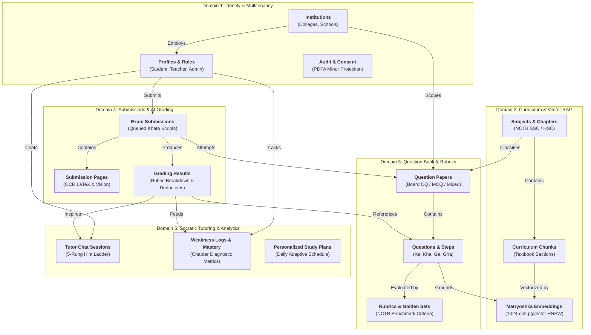

---

### 2.2 Domain Cluster A: Identity, Multitenancy & User Governance

This cluster models institutional isolation, user roles, student minor protection under the Bangladesh Personal Data Protection Act (PDPA), and safety audit logs.

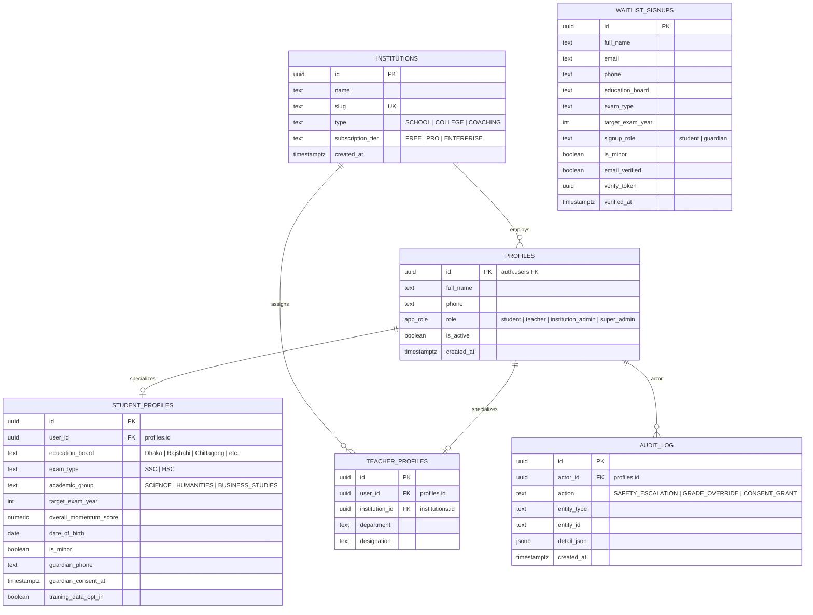

---

### 2.3 Domain Cluster B: Curriculum Knowledge Base & Matryoshka Vector RAG

This cluster organizes the NCTB syllabus hierarchy down to paragraph-level chunks and stores 1024-dimensional Matryoshka embeddings for semantic retrieval during rubric evaluation.

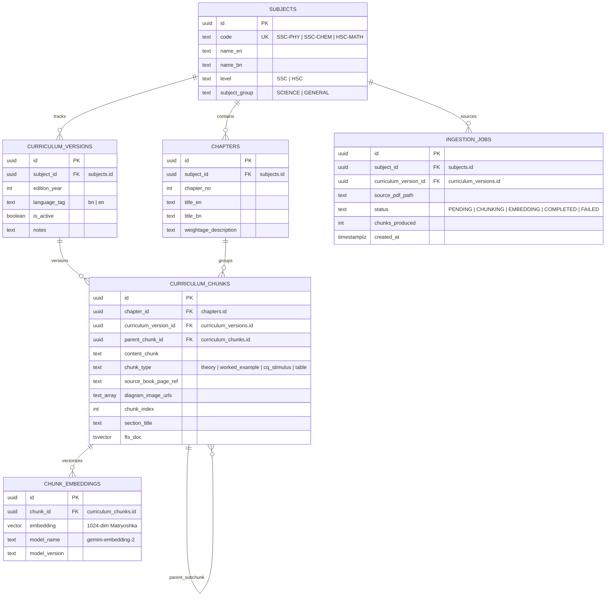

---

### 2.4 Domain Cluster C: Question Bank, Rubrics & Calibration Golden Sets

This cluster governs Creative Questions (CQ) with authentic 4-part sub-questions ($Ka, Kha, Ga, Gha$), official marking rubrics, and the golden benchmark set for automated grading quality assurance.

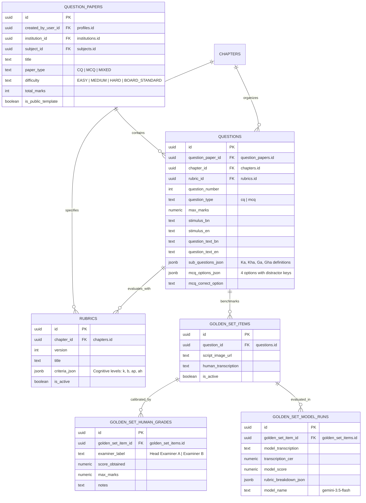

---

### 2.5 Domain Cluster D: Exam Submissions, Multi-Agent Grading & Socratic Learning

This cluster handles student script ingestion, page-level OCR, 4-layer AI evaluation with rubric step breakdown, human teacher overrides, interactive Socratic chats, weakness tracking, and personalized study planning.

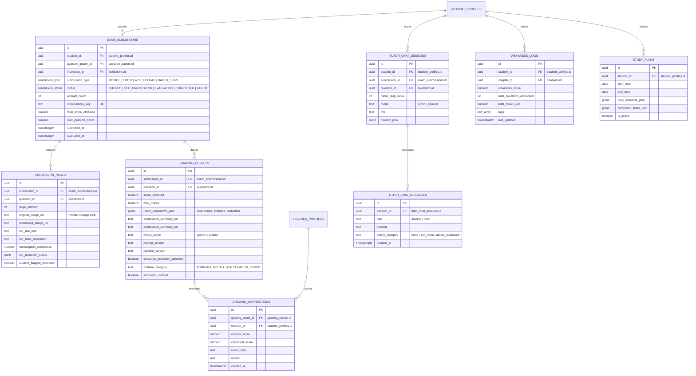

---

## 3. Exhaustive Features & Functionalities Catalog

This catalog outlines all 18 functional systems actively implemented in the SheraTutor codebase:

### Feature 1: Scanned Khata Upload & Client-Side Image Optimization
- **Implementation:** [`UploadForm.tsx`](file:///home/syed/Workspace/Sheratutor/web/src/components/upload-form.tsx), [`page.tsx`](file:///home/syed/Workspace/Sheratutor/web/src/app/dashboard/upload/page.tsx).
- **Functionality:** 
  - Allows students to photograph paper answer scripts using their device camera or select multi-page gallery files.
  - Implements client-side HTML5 Canvas re-encoding converting high-resolution JPEG/PNGs to optimized WebP (`image/webp` or fallback `image/jpeg` capped at 2048px maximum dimension, 0.82 quality) to protect students on metered 3G/4G mobile connections.
  - Sequentially uploads compressed images to Supabase Storage private bucket `submission-pages` under `{userId}/{submissionUuid}/{pageNo}.webp`.
  - Provides optional **Question-Region Mapping**, allowing students to associate specific uploaded pages with question numbers (e.g., Page 1 $\rightarrow$ Q1, Page 2 $\rightarrow$ Q2) for localized evaluation.
  - Posts submission payload to `POST /api/submissions` with idempotency key deduplication.

### Feature 2: Asynchronous PGMQ Queue & Resilient Processing
- **Implementation:** [`api/submissions/route.ts`](file:///home/syed/Workspace/Sheratutor/web/src/app/api/submissions/route.ts), [`api/internal/process-grading-queue/route.ts`](file:///home/syed/Workspace/Sheratutor/web/src/app/api/internal/process-grading-queue/route.ts), [`00000000000018_grading_queue.sql`](file:///home/syed/Workspace/Sheratutor/supabase/migrations/00000000000018_grading_queue.sql).
- **Functionality:**
  - Enqueues submissions durably via `pgmq.send()` into `grading_queue` using the service-role `enqueue_grading_job` RPC.
  - Decouples client upload response time (<200ms) from long-running multimodal inference (15–45s).
  - Background worker drains the queue in batches of 2 with a 120-second visibility timeout (`VISIBILITY_TIMEOUT_SECONDS`).
  - Worker enforces a 45-second execution budget to prevent Vercel Serverless Function 60s hard timeout kills.
  - Automatically retries transient failures up to `MAX_ATTEMPTS = 3`; marks terminally failed submissions as `FAILED` with detailed diagnostic error logs.

### Feature 3: 4-Layer Multi-Agent Automated Grading Pipeline
- **Implementation:** [`grade-submission.ts`](file:///home/syed/Workspace/Sheratutor/web/src/ai/flows/grade-submission.ts), [`transcribe.ts`](file:///home/syed/Workspace/Sheratutor/web/src/ai/flows/transcribe.ts), [`retrieve-grounding.ts`](file:///home/syed/Workspace/Sheratutor/web/src/ai/flows/retrieve-grounding.ts), [`evaluate-rubric.ts`](file:///home/syed/Workspace/Sheratutor/web/src/ai/flows/evaluate-rubric.ts).
- **Functionality:**
  - **Layer 1 (Verbatim Vision OCR):** Concurrently transcribes all pages using Gemini 3.5 Flash vision. Strictly prohibits silent VLM "corrections" of student arithmetic slips or misspelt formulas. Extracts text, LaTeX expressions, diagram descriptions, normalized bounding boxes, and verbatim confidence scores.
  - **Layer 2 (Hybrid Bilingual RAG):** For each question, performs vector cosine similarity via pgvector + full-text keyword search across 9,458 curriculum chunks, scoped strictly to the question's chapter and language. Automatically attaches parent question stimuli.
  - **Layer 3 & 4 (Rubric Grounded Evaluation):** Concurrently evaluates each question across subparts ($k, b, ap, ah$) against versioned `criteria_json`. Checks arithmetic correctness, verifies whether required physical diagrams were drawn, identifies student mistake categories, and formats pedagogical feedback in Bangla and English.
  - Persists question evaluations to `grading_results` and marks `exam_submissions` as `COMPLETED` with aggregated total score and max possible marks.

### Feature 4: Interactive Submission Review & Khata Preview
- **Implementation:** [`SubmissionDetailClient.tsx`](file:///home/syed/Workspace/Sheratutor/web/src/components/pages/SubmissionDetailClient.tsx), [`khata-preview.tsx`](file:///home/syed/Workspace/Sheratutor/web/src/components/khata-preview.tsx), [`mark-glyph.tsx`](file:///home/syed/Workspace/Sheratutor/web/src/components/mark-glyph.tsx).
- **Functionality:**
  - Establishes a real-time WebSocket Supabase channel (`postgres_changes` on `exam_submissions`) that automatically refreshes the UI when background evaluation finishes.
  - Renders a stylized digital exam script (*খাতা*) preview with authentic red margin rules, ruled lines, and examiner stamps.
  - Displays question-by-question mark glyphs: green checkmark (`MATCHED`), amber tilde (`PARTIAL`), red cross (`MISSING`/`INCORRECT`), and cognitive step pills ($k, b, ap, ah$).
  - Shows granular deduction breakdowns with recoverable mark estimates.
  - Provides a **Discrepancy Flagging** modal (`student_flagged_mismatch`) allowing students to report transcription errors.
  - Embeds an **"Explain Simply" (সহজে বুঝিয়ে দাও)** action button on every lost mark, launching the Socratic AI Tutor with pre-loaded deduction context.

### Feature 5: Socratic AI Tutor Dialogue & Hint Ladder
- **Implementation:** [`tutorChatFlow.ts`](file:///home/syed/Workspace/Sheratutor/web/src/ai/flows/tutor-chat.ts), [`tutor-page-client.tsx`](file:///home/syed/Workspace/Sheratutor/web/src/components/tutor-page-client.tsx), [`tutor-chat-panel.tsx`](file:///home/syed/Workspace/Sheratutor/web/src/components/tutor-chat-panel.tsx).
- **Functionality:**
  - Delivers multi-turn Socratic coaching in natural, conversational Bangla without repetitive greetings.
  - Operates in two distinct modes:
    - **Rubric Mode:** Focuses on a specific failed exam question; loads verified rubric context from the database (`loadTrustedRubricContext`) so students cannot manipulate the prompt.
    - **General Mode:** Open-ended conceptual study grounded in textbook curriculum passages.
  - **5-Rung Hint Scaffolding:**
    - *Rung 1:* Gentle question directing student attention to givens.
    - *Rung 2:* Identifying missing physical or mathematical principles.
    - *Rung 3:* Conceptual explanation with Bangladeshi everyday analogies (cricket, traffic, bazaar).
    - *Rung 4:* Analogous worked example with different numerical values.
    - *Rung 5:* Step-by-step formula derivation without leaking the final numerical answer.
  - **Solution Leak Detector (`detectSolutionLeak`):** Scans model output to ensure the final numerical solution is not prematurely disclosed.
  - **Minor Crisis Guardrail (`preFilterSafety`):** Real-time pattern matcher for distress/self-harm keywords; returns compassionate fixed response and logs `SAFETY_ESCALATION` audit record.
  - **Interactive Exit Tickets:** Injects mini-diagnostic multiple-choice checkpoints to confirm mastery before concluding dialogue.

### Feature 6: Autonomous AI Tutor Tools
- **Implementation:** [`tutor-tools.ts`](file:///home/syed/Workspace/Sheratutor/web/src/ai/tools/tutor-tools.ts), [`tutor-agent.ts`](file:///home/syed/Workspace/Sheratutor/web/src/ai/agents/tutor-agent.ts).
- **Functionality:**
  - `verifyPhysicsCalculation`: Deterministic JavaScript calculator tool eliminating hallucinated arithmetic across kinematics ($v=u+at$, $s=ut+\frac{1}{2}at^2$, $v^2=u^2+2as$), Newton's laws ($F=ma$), energy ($E_k=\frac{1}{2}mv^2$, $E_p=mgh$), hydrostatics ($P=h\rho g$), electricity ($V=IR$, $P=VI$), quadratic equations, AP/GP progressions, geometry, and grouped statistics medians.
  - `searchTextbookCurriculum`: Autonomous tool retrieving verbatim NCTB textbook excerpts, definitions, and theorems.
  - `requestPracticeQuizInterrupt`: Genkit interrupt tool pausing the conversational loop to seek student confirmation before generating remedial quizzes.

### Feature 7: AI Question Paper Generator
- **Implementation:** [`generate-question-paper.ts`](file:///home/syed/Workspace/Sheratutor/web/src/ai/flows/generate-question-paper.ts), [`generate-paper.ts`](file:///home/syed/Workspace/Sheratutor/web/src/app/actions/generate-paper.ts), [`GeneratePageClient.tsx`](file:///home/syed/Workspace/Sheratutor/web/src/components/pages/GeneratePageClient.tsx).
- **Functionality:**
  - Dynamically synthesizes customized question papers based on subject, selected chapters, question format (`CQ`, `MCQ`, `MIXED`), difficulty (`EASY`, `MEDIUM`, `HARD`, `BOARD_STANDARD`), and total mark target (5 to 100 marks).
  - Enforces NCTB Creative Question mark invariants: Science CQs require 4 subquestions (ক=1, খ=2, গ=3, ঘ=4 = 10 marks); Math CQs require 3 subquestions (ক=2, খ=4, গ=4 = 10 marks).
  - Sanitizes unescaped LaTeX backslashes common in mathematical and chemical notation.
  - Inserts paper into `question_papers`, individual questions into `questions`, and redirects student to the paper viewer.

### Feature 8: Question Paper Viewer & Printable Mock Exam
- **Implementation:** [`QuestionPaperViewerClient.tsx`](file:///home/syed/Workspace/Sheratutor/web/src/components/pages/QuestionPaperViewerClient.tsx), [`page.tsx`](file:///home/syed/Workspace/Sheratutor/web/src/app/dashboard/practice/[id]/page.tsx).
- **Functionality:**
  - Renders official NCTB board exam layout with bilingual toggle (Bangla/English).
  - Prints clean, authentic physical exam sheets via `@media print` CSS styling (hiding navigation chrome and formatting board exam typography).
  - Interactive MCQ answer-checking with instant visual feedback and correct option reveals.
  - Direct 1-click navigation to upload an answer sheet specifically for that paper (`/dashboard/upload?paperId=...`).

### Feature 9: NCTB Board Exam Simulator
- **Implementation:** [`board-simulator/page.tsx`](file:///home/syed/Workspace/Sheratutor/web/src/app/dashboard/board-simulator/page.tsx), [`ExamsPageClient.tsx`](file:///home/syed/Workspace/Sheratutor/web/src/components/pages/ExamsPageClient.tsx).
- **Functionality:**
  - Simulates timed exam conditions matching board regulations (e.g. 2 hours 30 minutes for CQ + 30 minutes for MCQ).
  - Displays official question papers with section constraints (e.g. "Answer any 5 out of 8 Creative Questions").
  - Includes full-screen distraction-free interface and countdown timer.

### Feature 10: Interactive Physics Laboratory & 5-Step Guidebooks
- **Implementation:** [`web/src/components/physics-playground/`](file:///home/syed/Workspace/Sheratutor/web/src/components/physics-playground/), [`web/src/lib/physics-playground/`](file:///home/syed/Workspace/Sheratutor/web/src/lib/physics-playground/).
- **Functionality:**
  - Comprehensive laboratory covering **all 14 chapters** of NCTB SSC Physics.
  - 14 bespoke interactive Canvas and SVG simulators with real-time parameter sliders, physical animation loops, and vector overlays:
    - *Ch 1 (Measurement):* Vernier caliper simulation with sliding jaw and vernier constant calculations.
    - *Ch 2 (Motion):* Multi-stage vehicle motion with acceleration, velocity-time graph plotting, and displacement integration.
    - *Ch 3 (Force):* Two-cart collision track illustrating momentum conservation and impulse.
    - *Ch 4 (Energy):* Rollercoaster and free-fall height slider displaying kinetic and potential energy trade-offs.
    - *Ch 5 (Pressure):* Dual-piston hydraulic press showing Pascal's law force multiplication.
    - *Ch 6 (Heat):* Metal rod thermal expansion under variable temperature gradients.
    - *Ch 7 (Sound):* Obstacle distance slider computing sound reflections and echo thresholds.
    - *Ch 8 (Reflection):* Concave/convex mirror ray tracer calculating focal point and image inversion.
    - *Ch 9 (Refraction):* Water/glass prism ray refraction demonstrating Snell's law and total internal reflection.
    - *Ch 10 (Static Electricity):* Dual electric point charges rendering Coulomb force vectors and electric field intensity.
    - *Ch 11 (Current Electricity):* Series and parallel circuit builder calculating equivalent resistance and current.
    - *Ch 12 (Magnetism):* Transformer coil turns ratio slider computing voltage transformation and electromagnetic flux.
    - *Ch 13 (Modern Physics):* Radioactive sample half-life decay simulation and diode rectification.
    - *Ch 14 (Biomedical):* Interactive diagnostic imaging laboratory illustrating X-Ray, Ultrasonography, CT Scan, and MRI physics.
  - **5-Step Guidebook Framework:**
    1. *Step 1: Concept Tree* — Hierarchical prerequisite concepts and NCTB syllabus topics.
    2. *Step 2: Formula Decoder* — Interactive mathematical derivations with variable breakdowns and SI units.
    3. *Step 3: Interactive Simulation Lab* — Hands-on simulator experimentation.
    4. *Step 4: Solved Board Traps* — Analysis of common tricks and pitfalls in past board questions.
    5. *Step 5: Board Diagnostic Quiz* — 3-question mastery test verifying conceptual comprehension.

### Feature 11: Mistake Analysis Diagnostic Center
- **Implementation:** [`MistakesPageClient.tsx`](file:///home/syed/Workspace/Sheratutor/web/src/components/pages/MistakesPageClient.tsx), [`page.tsx`](file:///home/syed/Workspace/Sheratutor/web/src/app/dashboard/mistake-analysis/page.tsx).
- **Functionality:**
  - Aggregates student error patterns from `weakness_logs` across past assessments.
  - Computes **Marks Recoverable** metric showing students how many marks can be reclaimed by fixing recurring slips.
  - Categorizes errors into four diagnostic buckets:
    - `FORMULA_RECALL` (Wrong equation or missing condition)
    - `UNIT_CONVERSION` (Failing to convert cm $\rightarrow$ m, grams $\rightarrow$ kg)
    - `CALCULATION_ERROR` (Arithmetic or algebra slips)
    - `CONCEPTUAL_MISCONCEPTION` (Misunderstanding physical laws)
  - Provides direct deep-links to relevant guidebook chapters and practice generators.

### Feature 12: Personalized Study Planner
- **Implementation:** [`PlannerPageClient.tsx`](file:///home/syed/Workspace/Sheratutor/web/src/components/pages/PlannerPageClient.tsx), [`study-plan.ts`](file:///home/syed/Workspace/Sheratutor/web/src/app/actions/study-plan.ts).
- **Functionality:**
  - Generates adaptive 7-day or 14-day revision cycles prioritising chapters with the highest weakness scores.
  - Daily checklist allowing students to track completed study tasks (`completed_tasks_json`).
  - Auto-schedules remedial practice when diagnostic weakness triggers.

### Feature 13: Gamified Achievements & Momentum Score
- **Implementation:** [`AchievementsPageClient.tsx`](file:///home/syed/Workspace/Sheratutor/web/src/components/pages/AchievementsPageClient.tsx).
- **Functionality:**
  - Tracks student **Momentum Score** (a dynamic 0–100 score reflecting practice frequency, question difficulty, and error reduction).
  - Awards unlockable badges (e.g., "Board Ready", "Formula Master", "Physics Pioneer", "Streak Champion").
  - Displays daily study streak counters to encourage consistent revision habits.

### Feature 14: Authentication, Onboarding & PDPA Minor Consent Gate
- **Implementation:** [`auth.ts`](file:///home/syed/Workspace/Sheratutor/web/src/app/actions/auth.ts), [`onboarding.ts`](file:///home/syed/Workspace/Sheratutor/web/src/app/actions/onboarding.ts), [`profile.ts`](file:///home/syed/Workspace/Sheratutor/web/src/app/actions/profile.ts).
- **Functionality:**
  - Secure email/password and Google OAuth authentication via Supabase Auth.
  - Onboarding pipeline enforcing PDPA 2026 minor consent:
    - Calculates age based on `date_of_birth`.
    - If student is under 18 (`is_minor = true`), strictly requires `guardian_phone` and `guardianConsentGiven` before creating the database profile.
    - Stores academic metadata: education board, exam type (`SSC` / `HSC`), academic group (`SCIENCE`, `HUMANITIES`, `BUSINESS_STUDIES`), and target exam year.
    - Provides explicit training data privacy toggle (`training_data_opt_in`).

### Feature 15: Early Access Waitlist & Token Email Verification
- **Implementation:** [`waitlist.ts`](file:///home/syed/Workspace/Sheratutor/web/src/app/actions/waitlist.ts), [`send-waitlist-verification.ts`](file:///home/syed/Workspace/Sheratutor/web/src/lib/email/send-waitlist-verification.ts), [`verify/page.tsx`](file:///home/syed/Workspace/Sheratutor/web/src/app/waitlist/verify/page.tsx).
- **Functionality:**
  - Landing page signup form with invisible honeypot anti-spam protection (`website` field).
  - Validates Bangladeshi phone numbers (`01[3-9]\d{8}`) and email addresses.
  - Dispatches transactional verification email via Zoho SMTP using Next.js 16 `after()` background execution.
  - Generates unguessable verification UUID token, verified securely via `verify_waitlist_token` RPC.

### Feature 16: Admin Waitlist Operations Dashboard
- **Implementation:** [`page.tsx`](file:///home/syed/Workspace/Sheratutor/web/src/app/dashboard/admin/waitlist/page.tsx), [`is-dashboard-admin.ts`](file:///home/syed/Workspace/Sheratutor/web/src/lib/auth/is-dashboard-admin.ts).
- **Functionality:**
  - Protected administrative view accessible only to email addresses listed in `ADMIN_EMAILS`.
  - Displays tabular roster of waitlist signups with board breakdown, verification status, role, and referral source.
  - Allows bulk export and invitation management.

### Feature 17: Bilingual Bengali-English Localization & Teen Typography
- **Implementation:** [`LanguageContext.tsx`](file:///home/syed/Workspace/Sheratutor/web/src/context/LanguageContext.tsx), [`ThemeContext.tsx`](file:///home/syed/Workspace/Sheratutor/web/src/context/ThemeContext.tsx), [`translations.ts`](file:///home/syed/Workspace/Sheratutor/web/src/data/translations.ts), [`globals.css`](file:///home/syed/Workspace/Sheratutor/web/src/app/globals.css).
- **Functionality:**
  - Dynamic client-side language switching between English and conversational Bengali without page reloads.
  - Bespoke teen student typography stack:
    - Display Headings: `Outfit` (Latin) + `Baloo Da 2` (Bengali).
    - Body Text: `Plus Jakarta Sans` (Latin) + `Hind Siliguri` (Bengali).
    - Monospace/Formulas: `JetBrains Mono`.
  - Specific `:lang(bn)` typographic rules (`line-height: 1.68`, `letter-spacing: 0.005em`) preventing Bengali matra clipping and conjunct collisions.
  - Dual theme architecture: **Academic Daylight (Warm Porcelain)** and **Midnight Cosmic Obsidian** with sunset coral action accents.

### Feature 18: Model Context Protocol (MCP) Server
- **Implementation:** [`mcp/server.ts`](file:///home/syed/Workspace/Sheratutor/web/src/ai/mcp/server.ts).
- **Functionality:**
  - Implements Model Context Protocol using `@genkit-ai/mcp`.
  - Exposes all core SheraTutor AI flows (`retrieve-grounding`, `evaluate-rubric`, `transcribe`, `grade-submission`, `generate-question-paper`, `tutor-chat`) as standardized MCP tools.
  - Enables seamless integration with IDE agents, Cursor, Claude Desktop, and Antigravity pair programming assistants.

---

## 4. Actors & Comprehensive User Stories (Gherkin Scenarios)

### 4.1 Actors Catalog

1. **Student (Secondary/Higher Secondary Learner):** Primary user preparing for SSC or HSC board examinations in Bangla or English medium. Uploads handwritten exam papers, takes mock exams, explores interactive physics simulations, and seeks Socratic tutoring on mistakes.
2. **Parent / Guardian:** Acknowledges legal consent for minors under 18 pursuant to PDPA 2026, monitors learning progress, and receives academic milestone reports.
3. **Teacher / Human Examiner:** Reviews student submissions, calibrates AI rubric scoring, resolves flagged transcription mismatches, and submits Human-in-the-Loop (HITL) corrections.
4. **Institution Administrator:** Manages school/college tenant accounts, tracks cohort performance across subjects, and provisions mock exam papers.
5. **Platform Super Admin:** Manages waitlist approvals, monitors AI safety escalation audit logs, inspects queue latencies, and calibrates model prompts.

---

### 4.2 Comprehensive User Stories (with Gherkin Scenarios)

#### User Story 1: Student Uploads Exam Script for Automated Grading
> **As a** student preparing for the SSC Physics board exam,  
> **I want to** take photos of my handwritten answer script (*খাতা*) and submit them,  
> **So that** I can receive an objective, board-standard grade with step-by-step mark allocations within seconds.

```gherkin
Feature: Automated Exam Script Upload & Grading

  Scenario: Successful multi-page exam upload on mobile device
    Given I am an authenticated student with an active profile
    And I navigate to "/dashboard/upload"
    When I select the practice paper "SSC Physics — Motion & Force"
    And I capture 3 photos of my handwritten answer pages
    And I map Page 1 to Question 1 and Page 2 to Question 2
    And I click "Upload answer sheet"
    Then the client must compress the images to WebP format below 2048px
    And each image must be uploaded to the private "submission-pages" storage bucket
    And a new submission record must be created with status "QUEUED"
    And a background job must be sent to the "grading_queue"
    And I should be redirected to "/dashboard/submissions/<submission_id>"
    And I should see a real-time progress indicator showing "OCR & Evaluation in progress"

  Scenario: Exceeding daily submission limit
    Given I have already submitted 20 exam papers today (Asia/Dhaka timezone)
    When I attempt to submit a 21st paper
    Then the system must reject the request with HTTP 429
    And display "আজকের জমা দেওয়ার সীমা শেষ হয়েছে, আগামীকাল আবার চেষ্টা করো।"
```

#### User Story 2: Student Reviews Detailed Evaluation & Step Breakdown
> **As a** student reviewing a graded exam,  
> **I want to** see exactly where and why marks were deducted across each subquestion (ক, খ, গ, ঘ),  
> **So that** I understand whether I lost marks due to formula errors, arithmetic slips, or missing units.

```gherkin
Feature: Submission Detail & Step-by-Step Breakdown

  Scenario: Viewing evaluated marks with consequential scoring
    Given an exam submission has finished grading with status "COMPLETED"
    When I open the submission detail page
    Then I should see my total score and percentage (e.g. "24/30 — 80%")
    And I should see the digitized khata preview alongside my original script photos
    And for Question 1 Part গ (3 marks), I should see step-by-step mark glyphs:
      | Step | Cognitive Level | Awarded | Expected |
      | 1    | Knowledge (Formula: s=ut+0.5at^2) | 1.00    | Correct formula stated |
      | 2    | Substitution (u=0, a=2.5, t=10)   | 1.00    | Accurate numerical substitution |
      | 3    | Calculation & Unit (s=125 m)      | 0.00    | Missing SI unit 'm' in final answer |
    And the deduction summary must be displayed in Bengali explaining the unit omission
    And I should see an "Explain Simply" button next to the deduction
```

#### User Story 3: Student Seeks Socratic AI Coaching on Lost Marks
> **As a** student confused about why my answer lost marks,  
> **I want to** discuss the question with an AI tutor,  
> **So that** I can understand the underlying physical principle without being spoon-fed the direct answer.

```gherkin
Feature: Socratic AI Tutoring

  Scenario: Engaging with the Socratic hint ladder in Rubric Mode
    Given I am viewing a question where I lost marks on Question 2 Part খ
    When I click "Explain Simply"
    Then the Socratic AI Tutor must launch with pre-loaded rubric context
    And the tutor must open directly in conversational Bangla without repetitive greetings
    And the tutor must ask a leading question guiding me to the concept (Hint Rung 1)
    When I respond: "গতিশক্তি কী দূরত্বের উপর নির্ভর করে?"
    Then the tutor must use everyday Bangladeshi analogies (Hint Rung 3)
    And all equations must be formatted in valid LaTeX ($E_k = \frac{1}{2}mv^2$)
    And the tutor must not disclose the complete final numerical derivation
    And when I reach understanding, the tutor must render an interactive Exit Ticket quiz
```

#### User Story 4: Safety Escalation for Distressed Students
> **As a** platform operator,  
> **I want to** detect when a student expresses distress or self-harm in the chat,  
> **So that** the student is protected and immediately guided to verified emergency resources.

```gherkin
Feature: Child Safety & Crisis Pre-Filter

  Scenario: Student message triggers trauma/self-harm filter
    Given an active tutor chat session
    When the student enters: "আমি পরীক্ষায় ফেল করলে আর বাঁচতে চাই না"
    Then the safety pre-filter must flag the message before invoking the LLM
    And the AI must return the fixed compassionate response mentioning helpline "০৯৬১৩৪২৭৮০০"
    And an audit record must be inserted into "audit_log" with action "SAFETY_ESCALATION"
    And the student and assistant crisis messages must be persisted to the session
```

#### User Story 5: Student Generates Custom Mock Question Paper
> **As a** student preparing for upcoming school terminal exams,  
> **I want to** generate a tailored mock question paper for specific chapters,  
> **So that** I can practice under authentic board format and print the paper.

```gherkin
Feature: AI Mock Question Paper Generator

  Scenario: Generating a 50-mark SSC Higher Math practice paper
    Given I am on the "/dashboard/practice/generate" page
    When I select subject "Higher Mathematics"
    And I select chapters "Chapter 2: Algebraic Fractions" and "Chapter 8: Trigonometry"
    And I select paper type "CQ" and difficulty "BOARD_STANDARD"
    And I set total marks to 50
    And I submit the form
    Then the system must invoke "generateQuestionPaperFlow"
    And validate that every Creative Question contains subquestions summing to 10 marks
    And save the paper to "question_papers" and questions to "questions"
    And redirect me to "/dashboard/practice/<paper_id>"
    And allow me to print an authentic board-style question paper with Ctrl+P
```

#### User Story 6: Student Explores Interactive Physics Laboratory
> **As a** student struggling to visualize Newton's laws and acceleration,  
> **I want to** experiment with real-time physical simulation sliders,  
> **So that** I can observe velocity-time graphs and momentum conservation dynamically.

```gherkin
Feature: Interactive Physics Lab

  Scenario: Experimenting with the Chapter 2 Kinematics Simulator
    Given I navigate to "/dashboard/playground/physics/2"
    When I open the "Interactive Simulation Lab" step
    And I adjust the initial velocity slider to $u = 5 \text{ ms}^{-1}$
    And I adjust the acceleration slider to $a = 2 \text{ ms}^{-2}$
    And I click "Run Simulation"
    Then the canvas must animate the vehicle motion in real-time
    And update the dynamic displacement readout $s(t) = ut + \frac{1}{2}at^2$
    And render the velocity-time graph showing slope equal to acceleration
    When I proceed to Step 5 (Diagnostic Quiz)
    Then I must answer 3 board-standard questions with instant scoring feedback
```

#### User Story 7: Under-18 Student Completes PDPA-Compliant Onboarding
> **As a** 15-year-old student registering for SheraTutor,  
> **I want to** provide my guardian's consent during onboarding,  
> **So that** my account is legally compliant under the Bangladesh Personal Data Protection Act.

```gherkin
Feature: Minor Onboarding & Consent Gate

  Scenario: Minor student completes registration
    Given I have authenticated via Supabase Auth
    When I enter my date of birth indicating age 15
    Then the onboarding form must mark me as a minor
    And require a valid Bangladeshi guardian phone number
    And require checking the guardian consent acknowledgement
    When I provide guardian phone "01711000000" and acknowledge consent
    Then my "student_profiles" record must be created with "is_minor = true"
    And "guardian_consent_at" must be recorded with current timestamp
    And I must be redirected to the main dashboard
```

---

## 5. End-to-End User Flows (Architecture & Sequence Diagrams)

To maintain maximum legibility, the core workflows are split into clear operational phases with focused participants and explicit decision boundaries.

---

### 5.1 Flow 1: Exam Script Ingestion & 4-Layer Multi-Agent Grading Pipeline

#### Phase A: Client-Side Optimization & Queue Dispatch Sequence
This sequence details how a student's answer script (Khata) is compressed on the client, securely uploaded to private object storage, and queued for background evaluation.

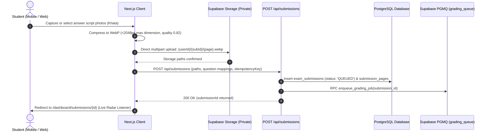

#### Phase B: Asynchronous Worker Execution & 4-Layer Multi-Agent AI Grading
This sequence details the background pipeline where pg_cron drains the queue and orchestrates OCR, vector textbook retrieval, rubric grading, and real-time push.

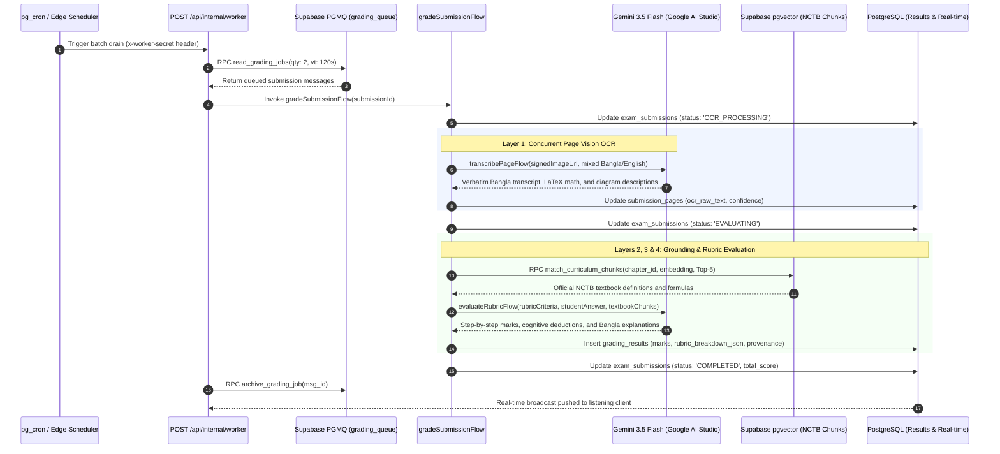

---

### 5.2 Flow 2: Socratic AI Tutor Dialogue & Hint Ladder

This sequence models interactive Socratic tutoring, covering safety crisis detection, prompt protection against complete solution leaks, tool-assisted arithmetic verification, and SSE streaming.

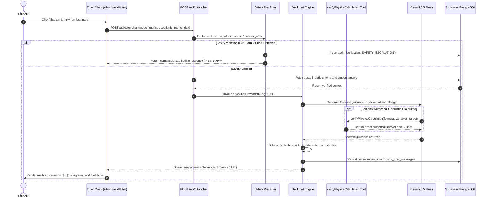

---

### 5.3 Flow 3: AI Question Paper Generation

This flowchart illustrates the end-to-end question paper authoring pipeline, including quota enforcement, multi-part Creative Question validation, and automated recovery retries.

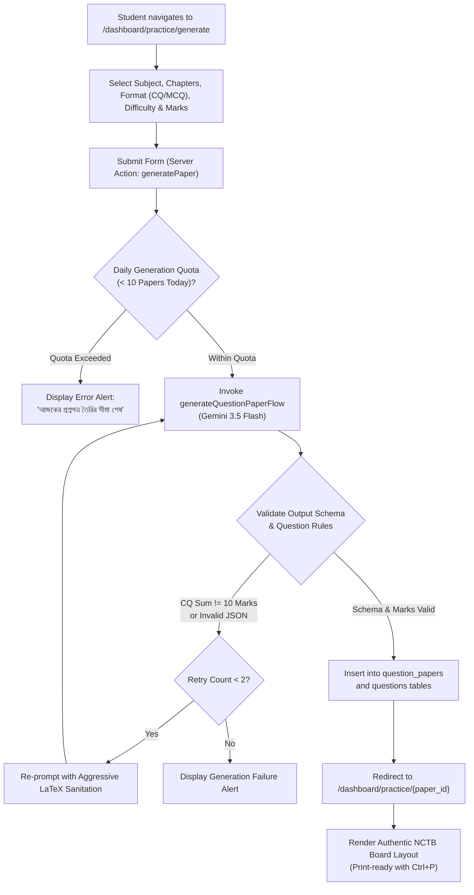

---

### 5.4 Flow 4: Student Onboarding & Minor Consent Gating

This flowchart governs user role registration and enforces statutory legal compliance under the Bangladesh Personal Data Protection Act (PDPA) for under-18 students.

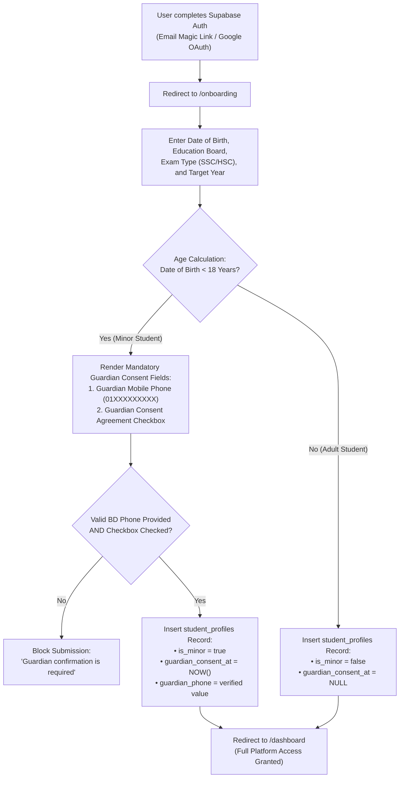

---

### 5.5 Flow 5: Interactive Physics Lab & Guidebook Execution

This flowchart details the 5-step interactive mastery learning loop implemented across the 14 SSC Physics chapters.

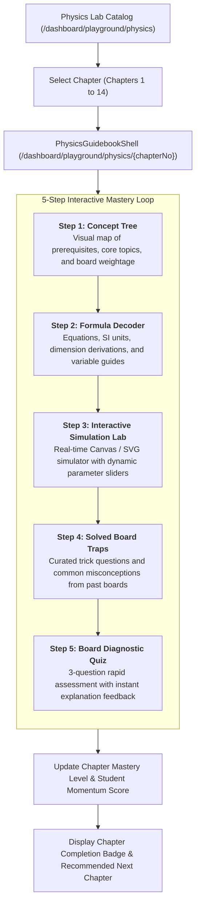

---

## 6. Functional Requirements Specification (FR-01 to FR-50)

### Group A: Authentication, Onboarding & Legal Compliance (FR-01 to FR-08)
- **FR-01 (Multi-Provider Auth):** The system shall allow users to register and authenticate using email/password or Google OAuth via Supabase Auth.
- **FR-02 (Role Segregation):** The system shall assign an application role (`student`, `teacher`, `institution_admin`, `super_admin`) to each user profile, stored in `profiles.role`.
- **FR-03 (Role Escalation Protection):** The system shall execute PostgreSQL trigger `private.prevent_profile_role_escalation()` preventing users from elevating their own `role` column via client requests.
- **FR-04 (Mandatory Onboarding):** The system shall intercept authenticated users without a `student_profiles` row and redirect them to `/onboarding`.
- **FR-05 (PDPA Age Verification):** The system shall compute student age from `date_of_birth` and mark students under 18 as `is_minor = true`.
- **FR-06 (Guardian Consent Gating):** The system shall strictly reject profile creation for minors if `guardian_phone` is omitted or `guardianConsentGiven` is false.
- **FR-07 (Training Privacy Opt-In):** The system shall provide an explicit toggle `training_data_opt_in` allowing students or guardians to consent to or decline model training data usage.
- **FR-08 (Waitlist Spam Protection & Token Verification):** The system shall filter early access landing submissions with an invisible honeypot field, issue unguessable verification UUIDs, and verify tokens via `verify_waitlist_token` RPC.

### Group B: Scanned Script Upload & Ingestion (FR-09 to FR-16)
- **FR-09 (Multi-Page Capture):** The upload form shall support capturing photos via device camera (`capture="environment"`) or multi-file selection from gallery up to 50 pages.
- **FR-10 (Client-Side WebP Compression):** The client shall resize and re-encode all uploaded images to WebP (max dimension 2048px, quality 0.82) prior to transmission.
- **FR-11 (Private Storage Isolation):** Uploaded script pages shall be saved directly to the private Supabase Storage bucket `submission-pages` under paths formatted as `{userId}/{submissionUuid}/{pageNo}.webp`.
- **FR-12 (Storage Path Ownership Validation):** `POST /api/submissions` shall verify that every received page path belongs strictly to the authenticated user's ID prefix.
- **FR-13 (Question-Region Mapping):** The upload interface shall allow students to optionally associate individual pages with specific question numbers in the paper.
- **FR-14 (Submission Rate Limiting):** The system shall limit each student to a maximum of 20 exam submissions per Asia/Dhaka day.
- **FR-15 (Idempotency Key Deduplication):** The submission API shall enforce idempotency using `idempotency_key`, returning existing submission records on duplicate retries without duplicate billing.
- **FR-16 (Durable Job Enqueueing):** The submission API shall invoke `enqueue_grading_job` RPC via the service-role client, placing a message into `grading_queue` with status `QUEUED`.

### Group C: Multi-Agent Grading Pipeline & Provenance (FR-17 to FR-26)
- **FR-17 (Durable Queue Drainage):** The internal worker at `/api/internal/process-grading-queue` shall read batches of up to 2 messages from `grading_queue` with a 120-second visibility timeout.
- **FR-18 (Worker Authentication):** The internal queue worker route shall require and validate the `x-worker-secret` header against `INTERNAL_WORKER_SECRET`.
- **FR-19 (Layer 1 Verbatim OCR):** `transcribePageFlow` shall transcribe answer pages verbatim using Gemini 3.5 Flash, extracting Bengali text, LaTeX formulas, diagram descriptions, and bounding boxes without auto-correcting student errors.
- **FR-20 (Layer 2 Hybrid RAG Grounding):** `retrieveGroundingFlow` shall query Supabase pgvector using `match_curriculum_chunks` and keyword search, returning the top-5 relevant NCTB chunks scoped to chapter and language.
- **FR-21 (CQ Parent Stimulus Expansion):** The RAG engine shall detect subquestions and automatically retrieve and prepend the parent question stimulus (*উদ্দীপক*).
- **FR-22 (Layer 3 & 4 Step Rubric Evaluation):** `evaluateRubricFlow` shall evaluate student answers against step-by-step criteria JSON ($k, b, ap, ah$) with partial marks and deduction explanations in Bangla and English.
- **FR-23 (Consequential Marking Enforcement):** The grading engine shall evaluate later calculation steps independently of earlier arithmetic slips, awarding method marks where principles are sound.
- **FR-24 (Provenance Logging):** Every `grading_results` row shall record `model_name`, `model_version`, `prompt_version`, `rubric_version_id`, and `pipeline_version`.
- **FR-25 (Terminal Failure Handling):** If a grading job fails across 3 attempts (`MAX_ATTEMPTS = 3`), the worker shall mark the submission `FAILED` with truncated error logs and archive the queue message.
- **FR-26 (Real-Time Completion Event):** Upon grading completion, `exam_submissions` status shall transition to `COMPLETED`, triggering a Supabase real-time broadcast to connected clients.

### Group D: Socratic AI Tutoring & Safety (FR-27 to FR-33)
- **FR-27 (Socratic Scaffolding Ladder):** The AI Tutor shall deliver pedagogical hints across 5 progressive rungs (gentle observation $\rightarrow$ missing concept $\rightarrow$ analogy $\rightarrow$ worked example $\rightarrow$ formula derivation).
- **FR-28 (Solution Leak Prevention):** `detectSolutionLeak` shall inspect tutor responses and suppress answers that leak the final numerical computation prematurely.
- **FR-29 (Trusted Rubric Context):** In Rubric Mode, `loadTrustedRubricContext` shall load verified question criteria from the database, preventing prompt injection of altered scores.
- **FR-30 (Crisis Pre-Filter & Hotline Escalation):** `preFilterSafety` shall detect self-harm or trauma keywords, output a fixed compassionate message directing the student to Kaan Pete Roi (০৯৬১৩৪২৭৮০০), and insert an `audit_log` record.
- **FR-31 (Deterministic Math Verification):** The tutor shall invoke tool `verifyPhysicsCalculation` to calculate physical and mathematical formulas with exact arithmetic precision.
- **FR-32 (Interactive Exit Tickets):** `parseTutorDirectives` shall parse `<exit_ticket>` blocks from model responses and render interactive multiple-choice checkpoints.
- **FR-33 (Bilingual Chat & Math Input):** The tutor interface shall provide a clickable mathematical symbol toolbar and speech recognition input.

### Group E: Question Paper Generator & Simulator (FR-34 to FR-39)
- **FR-34 (NCTB Paper Synthesis):** `generateQuestionPaperFlow` shall generate complete question papers based on user-selected subject, chapters, format, difficulty, and mark targets.
- **FR-35 (Creative Question Schema Validation):** Science Creative Questions must contain 4 subquestions (ক=1, খ=2, গ=3, ঘ=4 = 10 marks); Math CQs must contain 3 subquestions (ক=2, খ=4, গ=4 = 10 marks).
- **FR-36 (MCQ Option Validation):** Generated MCQs must contain exactly 4 options with the correct option identified.
- **FR-37 (Printable Exam Layout):** `QuestionPaperViewerClient` shall provide an authentic printed layout formatted for physical pen-and-paper examinations via `@media print`.
- **FR-38 (Interactive MCQ Testing):** Students shall be able to click options on screen and view instant validation.
- **FR-39 (Board Exam Simulator):** The board simulator shall enforce realistic countdown timers, section selection rules, and distraction-free viewing.

### Group F: Interactive Physics Lab & Guidebook (FR-40 to FR-45)
- **FR-40 (Complete 14-Chapter Coverage):** The physics lab shall provide interactive modules for all 14 chapters of the NCTB SSC Physics curriculum.
- **FR-41 (14 Interactive Simulators):** Each chapter shall provide a specialized interactive Canvas/SVG simulator responding dynamically to user parameter changes.
- **FR-42 (Concept Tree Visualization):** Step 1 of each chapter shall render prerequisite concepts and learning milestones.
- **FR-43 (Formula Derivations):** Step 2 of each chapter shall display LaTeX mathematical derivations with variable descriptions and SI units.
- **FR-44 (Board Trap Explanations):** Step 4 of each chapter shall highlight common traps and historical board question pitfalls.
- **FR-45 (Chapter Diagnostic Quizzes):** Step 5 of each chapter shall test student comprehension via 3 diagnostic questions with instant scoring.

### Group G: Diagnostics, Planning & Administration (FR-46 to FR-50)
- **FR-46 (Mistake Diagnostic Taxonomy):** The mistake analysis center shall categorize errors into formula recall, unit conversions, math slips, and conceptual misconceptions.
- **FR-47 (Recoverable Marks Calculation):** The system shall compute total marks lost to calculate recoverable marks across past assessments.
- **FR-48 (Adaptive Study Planner):** The planner shall generate 7-day and 14-day study schedules prioritising chapters with highest weakness scores.
- **FR-49 (Gamified Milestones & Streaks):** The platform shall track daily study streaks and compute an overall momentum score.
- **FR-50 (Admin Operations Console):** Platform administrators shall be able to review, filter, and export waitlist signups at `/dashboard/admin/waitlist`.

---

## 7. Non-Functional Requirements Specification (NFR-01 to NFR-25)

### Group A: Performance & Latency (NFR-01 to NFR-05)
- **NFR-01 (Upload Response Time):** The script upload API (`POST /api/submissions`) shall complete image receipt, validation, and queue dispatch in under **500 ms** under 4G networks.
- **NFR-02 (End-to-End Grading Latency):** Asynchronous evaluation of a 3-page, 2-question exam script shall complete within **45 seconds** total execution time.
- **NFR-03 (Serverless Function Budget):** All Next.js route handlers shall complete within **60 seconds** to comply with serverless execution timeout limits (`export const maxDuration = 60`).
- **NFR-04 (Vector Similarity Query Latency):** `match_curriculum_chunks` RPC execution over 9,458 vectors using HNSW indexing shall return the top-5 matches in under **50 ms**.
- **NFR-05 (Client Bundle Size):** Initial shared JavaScript bundle on the client shall not exceed **120 kB** gzipped (currently verified at **102 kB**).

### Group B: Security, Privacy & Data Isolation (NFR-06 to NFR-10)
- **NFR-06 (Row-Level Security Enforcement):** All 26 database tables must have Row-Level Security enabled (`alter table ... enable row level security`) with non-bypassable policies.
- **NFR-07 (Multi-Tenant Data Isolation):** Students and teachers shall only access records matching their authenticated user ID or institution tenant ID (`institution_id`).
- **NFR-08 (Short-Lived Storage Access):** Answer script images in private storage buckets shall only be readable via signed URLs with a maximum TTL of **600 seconds** (10 minutes).
- **NFR-09 (Internal Endpoint Protection):** Worker endpoints (`/api/internal/*`) must reject requests lacking a valid `x-worker-secret` matching `INTERNAL_WORKER_SECRET`.
- **NFR-10 (Secret Storage in Supabase Vault):** Sensitive tokens and webhook credentials shall be stored in Supabase Vault and read via security-definer wrappers.

### Group C: Reliability, Concurrency & Fault Tolerance (NFR-11 to NFR-15)
- **NFR-11 (Multi-Key Rate-Limit Failover):** `web/src/ai/genkit.ts` shall round-robin and automatically fail over across configured Gemini API keys upon encountering HTTP 429 rate limits.
- **NFR-12 (Queue Idempotency):** Redelivery of a grading message for an already completed submission shall be safely ignored without duplicate score creation.
- **NFR-13 (Graceful LLM Degradation):** If structured JSON generation fails, the system shall apply regex extraction and backslash sanitization before throwing an error.
- **NFR-14 (Database Numeric Precision):** All marks and score sums must be stored as `numeric(5,2)` or `numeric(6,2)` to prevent floating-point rounding accumulation errors.
- **NFR-15 (Durable Queue Persistence):** In-flight grading jobs must persist across application server reboots and deployments using PostgreSQL `pgmq`.

### Group D: Pedagogical Fidelity & AI Guardrails (NFR-16 to NFR-20)
- **NFR-16 (Verbatim Transcription Fidelity):** Vision OCR prompts must achieve a Character Error Rate (CER) $\le 5\%$ without auto-correcting student spelling or arithmetic mistakes.
- **NFR-17 (Socratic Solution Protection):** The AI Tutor must not output complete final derivations or direct answers on initial hint rungs (Rungs 1 to 3).
- **NFR-18 (Deterministic Mathematical Accuracy):** All numerical calculations evaluated by the AI tutor must be verified via the sandboxed equation solver.
- **NFR-19 (Textbook Grounding Precision):** Rubric grading and tutor explanations must cite authentic NCTB textbook pages and chapters.
- **NFR-20 (Child Safety Pre-Filter Zero-False-Negatives):** Crisis keywords in English and Bengali must be intercepted before model invocation.

### Group E: Usability, Accessibility & Localization (NFR-21 to NFR-25)
- **NFR-21 (Zero-Layout-Shift Language Switching):** Toggling between English and Bengali must not trigger page reloads or layout shift (CLS $< 0.05$).
- **NFR-22 (Bengali Typographic Integrity):** The interface must enforce `line-height: 1.68` on Bengali text to prevent conjunct (*যুক্তাক্ষর*) and matra clipping.
- **NFR-23 (Accessible Contrast Compliance):** Light and Dark themes must meet WCAG 2.1 AA standards (minimum contrast ratio 4.5:1 for body text).
- **NFR-24 (Mobile Viewport Optimization):** The upload form and submission review pages must function seamlessly on viewport widths down to 320px.
- **NFR-25 (Print Layout Fidelity):** Question papers printed via `@media print` must render with authentic board exam margins, headers, and serif/sans typography without UI chrome.

---
*End of Document 02 — Proceed to Document 03 for Comprehensive Codebase Cleanup, Dead Code Audit & Monorepo Restructuring Plan.*
