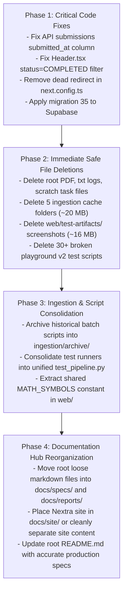

# SheraTutor — Codebase Cleanup, Dead Code Audit & Monorepo Restructuring Plan

> **Document ID:** ST-DOC-03  
> **Version:** 2.0.0  
> **Status:** Actionable Technical Proposal & Immediate Remediation Plan  
> **Audit Scope:** Workspace Root, `web/`, `supabase/`, `ingestion/`, `training/`, `azure/`, `docs/`

---

## Table of Contents
1. [Executive Summary & Cleanliness Assessment](#1-executive-summary--cleanliness-assessment)
2. [Critical Code-Level Bugs Discovered During Audit](#2-critical-code-level-bugs-discovered-during-audit)
3. [Exhaustive Inventory of Dead, Deprecated & Unnecessary Files](#3-exhaustive-inventory-of-dead-deprecated--unnecessary-files)
   - 3.1 [Category A: Workspace Root Clutter & Stray Artifacts](#31-category-a-workspace-root-clutter--stray-artifacts)
   - 3.2 [Category B: `ingestion/` Script Sprawl & Cache Bloat (~20 MB)](#32-category-b-ingestion-script-sprawl--cache-bloat-20-mb)
   - 3.3 [Category C: `web/scripts/` Orphan & Broken Test Suites (30+ Scripts)](#33-category-c-webscripts-orphan--broken-test-suites-30-scripts)
   - 3.4 [Category D: `web/test-artifacts/` Screenshot Bloat (16 MB)](#34-category-d-webtest-artifacts-screenshot-bloat-16-mb)
   - 3.5 [Category E: `docs/` Loose Documentation vs Nextra App](#35-category-e-docs-loose-documentation-vs-nextra-app)
4. [Duplicated Code & Architectural Redundancies](#4-duplicated-code--architectural-redundancies)
5. [Target Clean Directory Architecture Proposal](#5-target-clean-directory-architecture-proposal)
6. [Phased Action Plan & Execution Roadmap](#6-phased-action-plan--execution-roadmap)

---

## 1. Executive Summary & Cleanliness Assessment

During the development of SheraTutor, the repository underwent rapid prototyping across multiple AI providers (Gemini 1.5 $\rightarrow$ NVIDIA NIM $\rightarrow$ Ollama $\rightarrow$ Qwen 2.5 Fine-Tuning $\rightarrow$ Gemini 3.5 Flash), iterative PDF extractions for four NCTB subjects, and consecutive UI redesigns (Playground v1 $\rightarrow$ v2 $\rightarrow$ current 14-chapter Physics Lab).

While the core web application builds cleanly (`next build` succeeds with 0 errors) and passes all 83 unit tests, the filesystem has accumulated significant technical debt:
- **Root Clutter:** Nearly 20 loose `.md` files, a 454 KB binary PDF, and raw Kaggle execution `.txt` logs sit in the root directory.
- **Ingestion Folder Sprawl:** Over 70 Python scripts sit in `ingestion/`, many of which are one-off single-use debugging scripts, chapter-specific backfills, or abandoned provider experiments (e.g. NVIDIA NIM). Furthermore, 5 cache directories consume ~20 MB of disk space.
- **Orphan E2E Test Scripts:** In `web/scripts/`, 16 Math chapter scripts, 11 Physics chapter scripts, and numerous "v2" tests actively target deleted routes (`/dashboard/playground/v2/math/:id`) that were retired in commit `9322496`.
- **Test Artifacts:** 16 MB of old Puppeteer PNG screenshots sit checked into `web/test-artifacts/`.

This document provides a comprehensive inventory of all dead, deprecated, and duplicate code, identifies 4 active runtime defects, and presents a structured reorganization plan.

---

## 2. Critical Code-Level Bugs Discovered During Audit

Before file cleanup, the following **4 critical code-level discrepancies** must be addressed:

### Bug 1: Submission Rate-Limiting SQL Column Mismatch
- **Location:** [`web/src/app/api/submissions/route.ts:95`](file:///home/syed/Workspace/Sheratutor/web/src/app/api/submissions/route.ts#L95).
- **Code:**
  ```typescript
  const { count: todaysSubmissions } = await supabase
    .from("exam_submissions")
    .select("id", { count: "exact", head: true })
    .eq("student_id", profile.id)
    .gte("created_at", startOfDhakaDayUtcIso());
  ```
- **Issue:** The `exam_submissions` table in PostgreSQL does **not** have a `created_at` column; the column is named `submitted_at` (`00000000000004_exams.sql:80`).
- **Impact:** PostgREST returns HTTP 400 (`column exam_submissions.created_at does not exist`), causing `todaysSubmissions` to evaluate to `null` and bypassing or failing the rate limiter.
- **Fix:** Change `"created_at"` to `"submitted_at"`.

---

### Bug 2: Real-Time Header Notification Filter Status Mismatch
- **Location:** [`web/src/components/Header.tsx:92`](file:///home/syed/Workspace/Sheratutor/web/src/components/Header.tsx#L92).
- **Code:**
  ```typescript
  .on(
    'postgres_changes',
    { event: 'UPDATE', schema: 'public', table: 'exam_submissions', filter: 'status=eq.GRADED' },
    (payload) => { ... }
  )
  ```
- **Issue:** PostgreSQL enum `submission_status` and `gradeSubmissionFlow` use the status string `'COMPLETED'`. There is no `'GRADED'` status in the schema (`00000000000004_exams.sql:58`).
- **Impact:** The real-time notification listener in the top header never triggers when an exam script finishes evaluation.
- **Fix:** Change `filter: 'status=eq.GRADED'` to `filter: 'status=eq.COMPLETED'`.

---

### Bug 3: Broken Dead Redirect in `next.config.ts`
- **Location:** [`web/next.config.ts:33-41`](file:///home/syed/Workspace/Sheratutor/web/next.config.ts#L33-L41).
- **Code:**
  ```typescript
  async redirects() {
    return [
      {
        source: '/dashboard/playground/math/:id',
        destination: '/dashboard/playground/v2/math/:id',
        permanent: true,
      },
    ];
  }
  ```
- **Issue:** The route `/dashboard/playground/v2` was retired in commit `9322496`. The destination returns a 404.
- **Fix:** Remove this obsolete redirect rule or redirect to `/dashboard/playground/physics`.

---

### Bug 4: Standalone Pipeline HITL Table Mismatch
- **Location:** [`web/src/grading-pipeline/orchestrator.ts:150`](file:///home/syed/Workspace/Sheratutor/web/src/grading-pipeline/orchestrator.ts#L150).
- **Code:**
  ```typescript
  await supabase.from("hitl_corrections").insert({ ... });
  ```
- **Issue:** Migration `00000000000035_hitl_corrections.sql` defines `hitl_corrections`, but on the live Supabase project, migration 35 has not been applied yet (the live project has `grading_corrections` from earlier migrations).
- **Impact:** PostgREST returns HTTP 404 (`Could not find the table 'public.hitl_corrections' in the schema cache`).
- **Fix:** Apply migration 35 to the live Supabase instance or align table naming with `grading_corrections`.

---

## 3. Exhaustive Inventory of Dead, Deprecated & Unnecessary Files

### 3.1 Category A: Workspace Root Clutter & Stray Artifacts

The workspace root currently contains 23 files, of which 18 should be relocated or deleted:

| File Name | Size | Status / Reason | Recommended Action |
|-----------|------|-----------------|--------------------|
| `test-query-ai-response.md.pdf` | 454 KB | Binary test output PDF committed to git. | **Delete immediately** |
| `kaggle_v4_log.txt` | 11.2 KB | Raw terminal log from Kaggle kernel run. | **Delete immediately** |
| `task.md` | 3.9 KB | Prompt assignment scratchpad. | **Delete or move to scratch/** |
| `task-2.md` | 10.9 KB | Prompt assignment scratchpad. | **Delete or move to scratch/** |
| `claude-session.md` | 6.4 KB | Historical session log. | **Delete or move to docs/archive/** |
| `test-query-ai-response.md` | 22.3 KB | Test query output from Gemini 3.5 Flash run. | **Move to docs/reports/** |
| `test-query-ai-response-gemini-3-5-flash-lite.md` | 20.7 KB | Test query output from Flash-Lite run. | **Move to docs/reports/** |
| `Refactor Model Provider to Google AI Studio Free Gemini API.md` | 6.1 KB | One-off refactor plan. | **Move to docs/archive/** |
| `transformer_chat_history.md` | 8.0 KB | Historical transformer prompt experiment. | **Move to docs/archive/** |
| `AI_CODE_REVIEW_FINDINGS.md` | 12.5 KB | Historical code review report (Aug 2026). | **Move to docs/archive/** |
| `ai_tutor_chat_frontend_redesign_blueprint.md` | 19.0 KB | Historical design blueprint. | **Move to docs/specs/** |
| `improved_ai_tutor_chat_specification.md` | 18.5 KB | Historical chat specification. | **Move to docs/specs/** |
| `chemistry_extraction_strategy.md` | 9.9 KB | Chemistry RAG extraction plan. | **Move to docs/specs/** |
| `ssc_student_portal_initial_plan_and_user_stories.md` | 36.0 KB | Initial product plan. | **Move to docs/specs/** |
| `SUBMISSIONS_AND_GRADING_ARCHITECTURE.md` | 11.7 KB | Architecture spec for 2-stage grading. | **Move to docs/specs/** |
| `AZURE_AI_FOUNDRY_FINETUNING_PLAN.md` | 13.4 KB | Azure AI Foundry fine-tuning spec. | **Move to docs/specs/** |
| `system_architecture_and_specification_report.md` | 51.6 KB | Previous monolithic architecture doc. | **Move to docs/reports/** |
| `sheratutor_comprehensive_codebase_review.md` | 21.5 KB | Previous review document. | **Move to docs/reports/** |
| `remainings.md` | 21.7 KB | Historical backlog notes. | **Move to docs/archive/** |

---

### 3.2 Category B: `ingestion/` Script Sprawl & Cache Bloat (~20 MB)

The `ingestion/` directory contains 70+ scripts and 5 cache directories. Most are one-off, duplicate, or abandoned:

#### B.1 Redundant Local Cache Folders (~20 MB Disk Bloat)
- `ingestion/cache_gemini/` (**13 MB**): Intermediate JSON dumps from past Gemini batch extractions.
- `ingestion/cache/` (**3.2 MB**): Raw OCR text caches from Surya/Marker runs.
- `ingestion/cache_flawed_legacy/` (**1.8 MB**): Historical flawed runs preserved for regression testing.
- `ingestion/cache_verified/` (**1.8 MB**): Verified chunk dumps already loaded into Supabase.
- `ingestion/cache_azure/` (**60 KB**): Azure OCR cache dumps.
- **Action:** Add all `cache*` folders to `.gitignore` and **delete them locally**.

#### B.2 Abandoned / Superseded Provider Ingestion Scripts
- `nim_bangla_ingest.py` (14.8 KB) & `nim_batch_ingest.py` (27.3 KB): Ingestion via NVIDIA NIM. Superseded by `ingest_gemini_to_supabase.py`.
- `azure_multimodal_pipeline.py` (7.0 KB): Azure OCR ingestion pipeline. Superseded by Gemini Vision.
- `seed_math_question_papers.js` (15.3 KB): Stray JavaScript file in Python folder.
- **Action:** Move to `ingestion/archive/` or delete.

#### B.3 One-Off Ad-Hoc Debugging Scripts (Delete or Archive)
- `debug_resp.py` (1.2 KB)
- `check_chemistry_terms.py` (2.4 KB)
- `check_crops_content.py` (681 B)
- `check_nodiag_pages.py` (491 B)
- `inspect_pages_9_16.py` (1.2 KB)
- `find_formula_boxes.py` (1.6 KB)
- `find_ocr_corruptions.py` (1.6 KB)
- `ocr_inspect_crops.py` (1.5 KB)
- `test_pdf_details.py` (545 B)
- `test_pdf_text.py` (455 B)
- `test_page_equation_extraction.py` (1.6 KB)
- `test_search_chem.py` (3.2 KB)
- `test_supabase_upload.py` (916 B)
- `test_azure_endpoints.py` (2.0 KB)
- `test_live_rag_global.py` (1.9 KB)
- `test_live_rag_search.py` (1.8 KB)
- `run_vector_search_pg.py` (457 B)
- `run_mcp_sql.py` (1.8 KB)
- `analyze_crops_vs_pdf.py` (703 B)
- `analyze_page_distribution.py` (1.1 KB)
- **Action:** Consolidate useful verification checks into `ingestion/tests/` and delete temporary one-off scripts.

#### B.4 One-Off Chapter-Specific Hardcoded Scripts (Archive)
- `build_chapter_01_verified.py` (75.9 KB — contains giant inline strings)
- `build_chapter_02_verified.py` (6.5 KB)
- `crop_chapter_02_verified.py` (2.4 KB)
- `clean_en_in_place.py` (5.9 KB)
- `clean_bangla_text.py` (14.0 KB)
- `compile_all_407_metadata.py` (3.0 KB)
- `finish_uploads.py` (1.4 KB)
- `retry_failed_uploads.py` (1.5 KB)
- `sync_missing.py` (1.5 KB)
- `refresh_all_flawed_pages.py` (12.4 KB)
- `refresh_bangla_legacy_pages.py` (7.6 KB)
- `build_gallery_html.py` (18.1 KB) & `build_gallery_md.py` (4.6 KB)
- **Action:** Archive into `ingestion/archive/historical_batches/`.

#### B.5 Redundant Test Runners (Consolidate into 1 CLI Runner)
- `run_full_extraction_suite.py`
- `run_full_verified_extraction.py`
- `run_fast_verification.py`
- `run_verification_tests.py`
- `run_gemini_35_tests.py`
- `run_gemma_test_queries.py`
- `run_ai_tutor_test.py`
- `run_math_rag_evaluation.py`
- `run_rag_vector_grounded_test.py`
- `run_tier3_english_suite.py`
- `run_chemistry_bangla.py`
- `run_chemistry_sequential.py`
- **Action:** Consolidate into a unified `test_pipeline.py`.

---

### 3.3 Category C: `web/scripts/` Orphan & Broken Test Suites (30+ Scripts)

In `web/scripts/`, a large number of Puppeteer scripts test routes that no longer exist:

| Script Name | Broken Target Route | Reason |
|-------------|---------------------|--------|
| `e2e-math-ch2-complete.mjs` through `e2e-math-ch17-complete.mjs` (16 scripts) | `/dashboard/playground/v2/math/:id` | Route deleted in commit `9322496`. All 16 scripts fail with 404. |
| `e2e-physics-ch2-complete.mjs` through `e2e-physics-ch12-complete.mjs` (11 scripts) | `/dashboard/playground/v2/physics/:id` | Route replaced by `/dashboard/playground/physics/[chapterNo]`. |
| `e2e-physics-v2-complete.mjs` | `/dashboard/playground/v2` | Route retired. |
| `e2e-chemistry-ch4-12-complete.mjs` | `/dashboard/playground/v2/chemistry/:id` | Chemistry playground retired to rebuild. |
| `e2e-playground-v2-test.mjs`, `e2e-playground-v2-5steps-complete.mjs`, `e2e-playground-v2-collapsible-test.mjs`, `e2e-playground-v2-complete-test.mjs`, `e2e-playground-v2-ui-match-test.mjs`, `e2e-playground-v2-visual-clarity.mjs` | `/dashboard/playground/v2` | Target deprecated playground architecture. |
| `verify-playground-v2-only.mjs`, `verify-all-math-chapters.mjs`, `test-playground.mjs`, `e2e-playground-test.mjs` | `/dashboard/playground/v2` | Target deprecated playground architecture. |

- **Recommended Action:**
  1. Delete all obsolete `e2e-math-ch*.mjs` and `e2e-playground-v2-*.mjs` scripts.
  2. Create a single parameterized test script `test-physics-lab.mjs` taking `--chapter=N` to verify the active `/dashboard/playground/physics/[chapterNo]` routes.

---

### 3.4 Category D: `web/test-artifacts/` Screenshot Bloat (16 MB)

- `web/test-artifacts/` contains **16 MB** of binary PNG screenshots from historical automated runs:
  - `01-before-login.png` (37 KB)
  - `02-after-login.png` (210 KB)
  - `bangla-nctb-paper.png` (168 KB)
  - `fixed-practice-paper.png` (143 KB)
  - `all-features/`
  - `playground/`
  - `playground-e2e/` (2.6 MB)
  - `playground-v2/`
  - `playground-v2-redesign/`
- **Recommended Action:**
  1. Add `web/test-artifacts/` to `.gitignore`.
  2. Remove historical screenshot files from the repository to prevent git history bloat.

---

### 3.5 Category E: `docs/` Loose Documentation vs Nextra App

The `docs/` directory acts as a **Nextra 4.6.1** documentation website with static export (`output: 'export'`), but also contains 10 loose markdown files sitting directly in its root:
- `docs/AI_SYSTEM_ARCHITECTURE.md` (17.7 KB)
- `docs/NCTB_BOARD_MASTER_SOLVER_PLAN.md` (26.3 KB)
- `docs/PLAYGROUND_DESCRIPTION.md` (5.1 KB)
- `docs/PLAYGROUND_STUDY_MATERIAL_PLAN.md` (10.1 KB)
- `docs/RECENT_WORK_SUMMARY.md` (129.3 KB)
- `docs/Roadmap Execution: Tasks 3, 4, and 5...md` (3.7 KB)
- `docs/SHERATUTOR_BRAND_COLORS_AND_TYPOGRAPHY.md` (6.7 KB)
- `docs/SHERATUTOR_PLAYGROUND_OVERVIEW.md` (41.2 KB)
- `docs/SHERATUTOR_PLAYGROUND_V2_COMPREHENSIVE_GUIDE.md` (31.0 KB)
- `docs/TEEN_STUDENT_EDTECH_UX_ANALYSIS_AND_BLUEPRINT.md` (10.2 KB)

- **Recommended Action:**
  - Move architectural specs that should be browsable in the Nextra docs into `docs/content/architecture/` or `docs/content/overview/` as `.mdx` files.
  - Relocate non-site reference docs into a clean `docs/specs/` or `docs/archive/` folder.

---

## 4. Duplicated Code & Architectural Redundancies

### 4.1 Duplicated Math Symbol Palettes
- **Location:** [`web/src/components/tutor-page-client.tsx:45-75`](file:///home/syed/Workspace/Sheratutor/web/src/components/tutor-page-client.tsx#L45-L75) and [`web/src/components/tutor-chat-panel.tsx:46-76`](file:///home/syed/Workspace/Sheratutor/web/src/components/tutor-chat-panel.tsx#L46-L76).
- **Issue:** Both components define nearly identical `MATH_SYMBOLS` arrays with LaTeX insertion snippets.
- **Fix:** Extract shared symbols into `web/src/lib/tutor-format.ts` or a constants file.

### 4.2 Overlapping Grading Pipeline Systems
- **Location:** Genkit flows in [`web/src/ai/flows/grade-submission.ts`](file:///home/syed/Workspace/Sheratutor/web/src/ai/flows/grade-submission.ts) vs standalone Express server in [`web/src/grading-pipeline/orchestrator.ts`](file:///home/syed/Workspace/Sheratutor/web/src/grading-pipeline/orchestrator.ts).
- **Issue:** Two distinct grading orchestration layers exist in the same codebase:
  1. `gradeSubmissionFlow` (Genkit flow invoked by Next.js queue worker).
  2. `createGradingApp` (Express server exposing `POST /api/evaluate`).
- **Fix:** Clarify operational boundaries: define `web/src/ai/flows/` as the primary Next.js production pipeline, and designate `web/src/grading-pipeline/` as the standalone microservice alternative.

---

## 5. Target Clean Directory Architecture Proposal

The proposed clean directory structure eliminates clutter, groups specifications logically, and ensures an intuitive monorepo hierarchy:

```text
Sheratutor/
├── .github/                        # Workflows & CI/CD pipelines
├── AGENTS.md                       # AI agent pair programming rules
├── README.md                       # Streamlined production README
├── LICENSE / SECURITY.md           # Legal & vulnerability disclosure
│
├── web/                            # Primary Next.js 16 Web Application
│   ├── src/
│   │   ├── ai/                     # Genkit 1.41 AI core, flows, agents & tools
│   │   ├── app/                    # Next.js 16 App Router (pages & route handlers)
│   │   ├── components/             # Reusable UI & Physics Playground simulators
│   │   ├── context/                # LanguageContext & ThemeContext
│   │   ├── lib/                    # Supabase clients, storage, email, physics registry
│   │   └── types/                  # TypeScript interface definitions
│   ├── scripts/                    # Parametric E2E verification scripts (clean)
│   ├── public/                     # Static assets (favicons, manifests)
│   └── package.json / next.config.ts
│
├── supabase/                       # Database Infrastructure
│   ├── migrations/                 # PostgreSQL migrations (01 through 37)
│   ├── config.toml                 # Supabase CLI configuration
│   └── seed.sql                    # Seed datasets
│
├── ingestion/                      # NCTB Curriculum Ingestion Service
│   ├── cli.py                      # Unified CLI entry point (ingest, verify, embed)
│   ├── core/                       # PDF parsing, OCR, chunking, diagram cropping
│   ├── textbooks/                  # Source manifest & checksums
│   ├── tests/                      # RAG benchmarks & retrieval test suites
│   ├── requirements.txt            # Python dependencies
│   └── archive/                    # Archived one-off batch scripts
│
├── training/                       # Sovereign Model Fine-Tuning
│   ├── dataset/                    # Curated instruction JSONL datasets & generators
│   ├── kaggle/                     # Unsloth fine-tuning scripts & notebooks
│   ├── deploy/                     # Modal vLLM, Docker Compose & Ollama Modelfile
│   └── README.md
│
├── azure/                          # Azure AI Foundry Datasets
│   ├── sheratutor_azure_train.jsonl
│   ├── sheratutor_azure_val.jsonl
│   └── results.csv
│
└── docs/                           # Documentation Hub
    ├── 01_PROJECT_OVERVIEW_AND_CODEBASE_REVIEW.md
    ├── 02_SYSTEM_ARCHITECTURE_REQUIREMENTS_AND_SPECIFICATION.md
    ├── 03_CODEBASE_CLEANUP_DEAD_CODE_AND_RESTRUCTURING_PLAN.md
    ├── specs/                      # Deep technical specifications
    │   ├── AI_SYSTEM_ARCHITECTURE.md
    │   ├── SUBMISSIONS_AND_GRADING_ARCHITECTURE.md
    │   └── TEEN_STUDENT_EDTECH_UX_BLUEPRINT.md
    ├── reports/                    # Benchmark reports & evaluation logs
    ├── archive/                    # Historical planning notes & roadmaps
    └── site/                       # Nextra 4.6 Documentation Website
        ├── app/
        ├── content/
        └── package.json
```

---

## 6. Phased Action Plan & Execution Roadmap



### Immediate Execution Steps:
1. **Fix the 4 code-level bugs** in `api/submissions/route.ts`, `Header.tsx`, and `next.config.ts`.
2. **Remove disk-wasting transient artifacts** (`rm -rf ingestion/cache* web/test-artifacts/*.png test-query-ai-response.md.pdf kaggle_v4_log.txt`).
3. **Purge broken Puppeteer scripts** in `web/scripts/` (`rm web/scripts/e2e-math-*.mjs web/scripts/e2e-playground-v2-*.mjs`).
4. **Relocate loose root markdown documents** into structured `docs/` subdirectories.
5. **Update root `README.md`** to accurately reflect the Gemini 3.5 Flash architecture, 37 migrations, and 14-chapter Physics lab.

---
*End of Document 03 — Comprehensive Codebase Cleanup, Dead Code Audit & Monorepo Restructuring Plan.*
