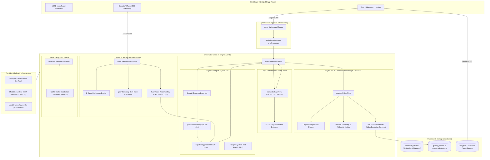

# SheraTutor AI System Architecture

> **Comprehensive Technical Guide to the Genkit-Powered AI Systems, 4-Layer Grading Pipeline, NCTB Curriculum RAG, and Socratic Tutoring Engine.**  
> *Last Updated: March 2025*

---

## 1. Executive Summary & System Philosophy

**SheraTutor** is an AI-augmented educational platform purpose-built for Bangladeshi secondary and higher secondary students (SSC & HSC) following the National Curriculum and Textbook Board (**NCTB**).

The core AI engine is designed with four non-negotiable principles:
1. **Zero Unearned Answers (Socratic Pedagogy):** The AI Tutor does not act as a homework solver. It utilizes an 8-rung pedagogical hint ladder to coach students step-by-step toward self-discovery.
2. **Deterministic, Grounded Rubric Grading:** Handwritten answers are evaluated strictly against authentic NCTB marking criteria and official textbook chapters. The system penalizes hallucination and rewards **consequential marking (ধারাবাহিক গণনা)**.
3. **Multimodal Bengali-English Code-Switching:** Seamlessly parses mixed Bengali script, English scientific jargon, chemical formulas ($NH_3$, $HCl$, $Zn \rightarrow Zn^{2+} + 2e^-$), and LaTeX mathematics ($F = ma$, $\int x dx$).
4. **Resilience & Fault Tolerance:** Multi-tiered provider failovers (Google AI Studio Gemini, Modal Serverless vLLM, and local Ollama) combined with round-robin API key pools and asynchronous queue workers.

---

## 2. High-Level Architecture Diagram



---

## 3. Provider Infrastructure & Resilience Architecture

SheraTutor implements a **multi-tiered, anti-fragile LLM infrastructure** defined in [`web/src/ai/genkit.ts`](file:///home/kratzer/workspace/Sheratutor/web/src/ai/genkit.ts).

### Model Configurations
* **Reasoning & Vision Model:** `googleai/gemini-2.5-flash` (or `gemini-3.5-flash`)
  * Deep mathematical derivation, script OCR, diagram inspection, and rubric evaluation.
* **Fast & Chat Model:** `googleai/gemini-2.0-flash` (or `gemini-3.5-flash-lite`)
  * Ultra-low token latency for conversational chat and question paper generation.
* **Embedding Model:** `googleai/gemini-embedding-2`
  * 1024-dimensional Matryoshka output matching the Supabase `curriculum_chunks` vector column.
* **Sovereign Secondary Evaluator:** Modal Labs Serverless vLLM
  * Runs `Qwen/Qwen2.5-7B-Instruct` on dedicated Nvidia L4 GPUs with scale-to-zero ($0 idle cost).
* **Local Offline Fallback:** Ollama
  * Connects to `qwen3:8b`, `gemma4:e4b`, and `bge-m3`.

### Multi-Key Round-Robin & Failover Pool
To mitigate Google AI Studio 429 rate limits or tier exhaustions during peak exam seasons:
1. **Dynamic Key Pool:** Aggregates `GEMINI_API_KEY`, `GEMINI_API_KEY_SECONDARY`, `GEMINI_API_KEY_TERTIARY`, `GEMINI_API_KEY_4`, `GEMINI_API_KEY_5`, and comma-separated lists from `GEMINI_API_KEYS`.
2. **Automatic Retry with Jitter:** On HTTP 429 responses, `batchEmbedWithGeminiFallback` pauses for 2500ms before rotating to the next key.
3. **REST Direct Failover:** If Genkit's internal client fails, `generateWithGeminiFallback` and `embedWithGeminiFallback` drop down to direct native HTTPS REST calls over Google's `generativelanguage.googleapis.com/v1beta` endpoint across the key array.

---

## 4. The 4-Layer Automated Grading Pipeline

Grading student scripts is orchestrated by [`gradeSubmissionFlow`](file:///home/kratzer/workspace/Sheratutor/web/src/ai/flows/grade-submission.ts). It runs entirely in the background via `pgmq` to ensure responses never exceed serverless execution timeouts.

### Layer 1: Multimodal Vision & OCR Transcription ([`transcribe.ts`](file:///home/kratzer/workspace/Sheratutor/web/src/ai/flows/transcribe.ts))
* **Concurrent Page Ingestion:** Pages are decrypted and signed via short-lived URLs (`GRADING_SIGNED_URL_TTL_SEC`), then processed concurrently via Gemini Vision.
* **Bilingual LaTeX Structuring:** Converts messy handwritten math, equations, and Bengali handwriting into clean LaTeX:
  * Example: Converts handwritten "$s = ut + 1/2 at^2$" and Bengali notes into structured blocks.
* **STEM Diagram Detection:** Scans for scientific sketches, circuit diagrams (batteries, resistors, switches), ray optics (mirrors, lenses, focal points), and biological cells. Outputs structured textual features (e.g., `[Page 1] Circuit diagram showing two 4-ohm resistors in parallel connected to a 12V DC source`).
* **Uncertainty Tracking:** Flags low-confidence text spans (`uncertain_spans`) and calculates `verbatim_confidence` (0.0 to 1.0).

### Layer 2: Bilingual Hybrid RAG Grounding ([`retrieve-grounding.ts`](file:///home/kratzer/workspace/Sheratutor/web/src/ai/flows/retrieve-grounding.ts))
* **Bengali Curriculum Synonym Expansion:** Automatically injects technical English and alternative Bengali terms:
  * `ত্বরণ` $\rightarrow$ `acceleration, বেগের পরিবর্তন, মন্দন`
  * `ব্যাপন` $\rightarrow$ `diffusion, নিঃসরণ, অ্যামোনিয়া, হাইড্রোক্লোরিক`
  * `পরিমিতি` $\rightarrow$ `mensuration, সিলিন্ডার, বেলন, গোলক, ক্ষেত্রফল`
* **Subject Detection Heuristic:** Classifies queries into `SSC-PHY`, `SSC-CHEM`, `SSC-MATH`, or `SSC-HMATH` (Higher Math).
* **Hybrid Search RPC:** Calls Supabase's `match_curriculum_chunks` or `match_curriculum_chunks_global`:
  * Dense vector search (HNSW cosine similarity with 1024-dim Matryoshka embeddings).
  * Sparse full-text search (PostgreSQL `tsvector` with Bengali configuration).
  * Returns content chunks, chapter references, book page numbers, and verified textbook diagram assets.

### Layer 3 & 4: Grounded Reasoning & Rubric Evaluation ([`evaluate-rubric.ts`](file:///home/kratzer/workspace/Sheratutor/web/src/ai/flows/evaluate-rubric.ts))
* **Strict Rubric Conformance:** Grades strictly against the official NCTB marking criteria stored in `rubrics.criteria_json`. The model is prohibited from inventing arbitrary criteria.
* **Image Cross-Checking:** The evaluator receives signed URLs of the student's original image alongside the transcript. If the transcript silently "corrected" a student's arithmetic mistake, the evaluator flags `transcript_mismatch_detected = true` and grades what was written on paper.
* **Consequential Marking (ধারাবাহিক গণনা):**
  * If a student makes an early calculation or substitution slip but follows correct mathematical methodology and logic downstream, marks are deducted **only** for the calculation step. Subsequent steps receive full consequential credit.
* **Mistake Taxonomy Classification:**
  * `NONE`: 100% correct.
  * `FORMULA_RECALL`: Wrong formula or omission of standard formula.
  * `UNIT_CONVERSION`: Failed to convert units (e.g., $km/h \rightarrow m/s$, $cm \rightarrow m$) or omitted units.
  * `CALCULATION_ERROR`: Correct formula, but arithmetic or algebraic evaluation slip.
  * `CONCEPTUAL_MISCONCEPTION`: Deep conceptual flaw in physical laws or mathematical definitions.
* **Bilingual Feedback:** Outputs natural, encouraging Bengali explanations (`deduction_summary_bn`) without literal translation artifacts, accompanied by concise English summaries (`deduction_summary_en`).

---

## 5. Socratic AI Tutor & Hint Ladder

The interactive tutoring system ([`tutor-chat.ts`](file:///home/kratzer/workspace/Sheratutor/web/src/ai/flows/tutor-chat.ts) and [`tutor-agent.ts`](file:///home/kratzer/workspace/Sheratutor/web/src/ai/agents/tutor-agent.ts)) operates in two distinct modes:
1. **Rubric Mode:** Attached directly to an exam question and the student's graded submission, explaining why marks were lost and guiding remediation.
2. **General Mode:** An open curriculum tutor accessible via `/dashboard/tutor`, grounded in specific NCTB subjects and chapters.

### The 8-Rung Pedagogical Hint Ladder
Adapted from empirical cognitive scaffolding research (Pisan et al., *arXiv:2608.12292*):

| Rung | Name | Pedagogical Purpose | Output Behavior |
| :--- | :--- | :--- | :--- |
| **H0** | **Emotional Validation** | Calm exam anxiety, acknowledge effort | Warm Bengali encouragement; zero formulas introduced. |
| **H1** | **Restate Objective** | Clarify the core question requirement | Rephrases the problem statement in simple terms. |
| **H2** | **Concept / Law Pointer** | Identify relevant curriculum principle | Mentions the theorem or law (e.g., Archimedes' principle, $F = ma$). |
| **H3** | **Leading Question on Givens** | Identify knowns and unknowns | Asks: *"উদ্দীপকে কী কী মান দেওয়া আছে এবং কোনটি বের করতে হবে?"* |
| **H4** | **Conceptual Roadmap** | Outline solution pathway | Explains the stages of calculation in words without computing numbers. |
| **H5** | **Analogous Worked Example** | Prevent answer leakage | Solves a **parallel problem with different numbers** inside a structured block: `:::analogous[title="..."]...:::` |
| **H6** | **Fill-in-the-Blank Scaffold** | Setup algebraic equation with slots | Emits formula with blanks (e.g., $F = \text{___} \times 9.8$). |
| **H7** | **Full Verification** | Validate complete student derivation | Detailed line-by-line solution (only unlocked after genuine attempts). |

### Safety Guardrails & Formative Exit Tickets
* **Crisis & Self-Harm Pre-Filter (`preFilterSafety`):** Uses deterministic regex to detect emotional distress, self-harm, or abuse disclosures. Bypasses the LLM to deliver a compassionate safety notice with the **Kaan Pete Roi Helpline (০৯৬১৩৪২৭৮০০)**.
* **Formative Exit Tickets:** When the student signals conceptual clarity (*"বুঝেছি"*, *"ক্লিয়ার"*, *"পরের প্রশ্ন"*), the tutor generates an interactive single-question micro-check:
  ```markdown
  :::exitticket[id="et-check", q="প্রাসের সর্বোচ্চ বিন্দুতে উল্লম্ব বেগ কত?", optA="0 ms⁻¹", optB="u sin θ", optC="g", correct="A", exp="সর্বোচ্চ বিন্দুতে পৌঁছালে উল্লম্ব বেগ শূন্য হয়ে যায়।"]:::
  ```
* **Official NCTB Diagram Embeds:** Pulls verified image URLs directly from the textbook database and embeds them via standard markdown (``), prohibiting external link hallucinations.

---

## 6. NCTB Question Paper Generation Engine

The mock paper generation engine ([`generate-question-paper.ts`](file:///home/kratzer/workspace/Sheratutor/web/src/ai/flows/generate-question-paper.ts)) synthesizes standard board examination papers strictly compliant with NCTB syllabus structures.

### Board Standard Question Distribution Rules
* **Creative Questions (CQ) - Mathematics (10 Marks):**
  * Sub-question (ক): 2 marks (Knowledge / Basic definition).
  * Sub-question (খ): 4 marks (Application / Problem solving).
  * Sub-question (গ): 4 marks (Higher-order proof or evaluation).
* **Creative Questions (CQ) - Science (Physics/Chemistry) (10 Marks):**
  * Sub-question (ক) **জ্ঞানমূলক**: 1 mark.
  * Sub-question (খ) **অনুধাবনমূলক**: 2 marks.
  * Sub-question (গ) **প্রয়োগমূলক**: 3 marks.
  * Sub-question (ঘ) **উচ্চতর দক্ষতা**: 4 marks.
* **Multiple Choice Questions (MCQ):** 4 options per question with genuine distractors based on common student misconceptions.
* **Strict Zod Super-Refinement:** Any generated CQ where the sum of sub-questions does not strictly equal 10 marks is rejected and regenerated.
* **Robust JSON Recovery (`extractJsonFromResponse`):** Sanitizes unescaped backslashes commonly produced by LLMs when outputting LaTeX equations (e.g. `\frac`, `\sqrt`, `\rightarrow`) before JSON parsing.

---

## 7. Model Context Protocol (MCP) Integration

SheraTutor features a native **Model Context Protocol (MCP)** server implemented in [`web/src/ai/mcp/server.ts`](file:///home/kratzer/workspace/Sheratutor/web/src/ai/mcp/server.ts) using `@genkit-ai/mcp`.

* **Purpose:** Allows external AI clients (Claude Desktop, Antigravity IDE, Cursor) to directly invoke SheraTutor's verified educational capabilities over standard stdio transport.
* **Exposed Tools & Flows:**
  * `searchTextbookCurriculum`: Search authentic NCTB textbooks with semantic ranking.
  * `verifyPhysicsCalculation`: Deterministic mathematical and unit verification.
  * `gradeSubmission`: Full end-to-end script evaluation.
  * `retrieveGrounding`: Vector retrieval over curriculum chunks.

---

## 8. Summary Table of AI Flows & Assets

| File / Module | Genkit Component | Purpose / Responsibilities |
| :--- | :--- | :--- |
| [`genkit.ts`](file:///home/kratzer/workspace/Sheratutor/web/src/ai/genkit.ts) | Core Config & Providers | Model definitions, multi-key failover pool, embedders, Modal/Ollama plugins. |
| [`grade-submission.ts`](file:///home/kratzer/workspace/Sheratutor/web/src/ai/flows/grade-submission.ts) | Flow (`gradeSubmission`) | 4-layer asynchronous grading orchestrator with pgmq integration. |
| [`transcribe.ts`](file:///home/kratzer/workspace/Sheratutor/web/src/ai/flows/transcribe.ts) | Flow (`transcribePage`) | Vision-based OCR, bilingual text transcription, LaTeX math formatting, diagram parsing. |
| [`retrieve-grounding.ts`](file:///home/kratzer/workspace/Sheratutor/web/src/ai/flows/retrieve-grounding.ts) | Flow (`retrieveGrounding`) | Bengali synonym expansion, hybrid HNSW vector + FTS search over textbook chunks. |
| [`evaluate-rubric.ts`](file:///home/kratzer/workspace/Sheratutor/web/src/ai/flows/evaluate-rubric.ts) | Flow (`evaluateRubric`) | Step-by-step rubric grading, image cross-check, consequential credit, mistake taxonomy. |
| [`tutor-chat.ts`](file:///home/kratzer/workspace/Sheratutor/web/src/ai/flows/tutor-chat.ts) | Flow (`tutorChat`) | Socratic dialogue, 8-rung hint ladder, safety escalation, exit tickets, diagram embeds. |
| [`tutor-agent.ts`](file:///home/kratzer/workspace/Sheratutor/web/src/ai/agents/tutor-agent.ts) | Agent (`tutorAgent`) | Tool-augmented Socratic tutor using Supabase session storage. |
| [`generate-question-paper.ts`](file:///home/kratzer/workspace/Sheratutor/web/src/ai/flows/generate-question-paper.ts) | Flow (`generateQuestionPaper`) | Synthesis of authentic NCTB CQ (10 marks) and MCQ papers with Zod schema validation. |
| [`server.ts`](file:///home/kratzer/workspace/Sheratutor/web/src/ai/mcp/server.ts) | MCP Server | Exposes curriculum search, grading, and tutoring tools over Model Context Protocol. |
