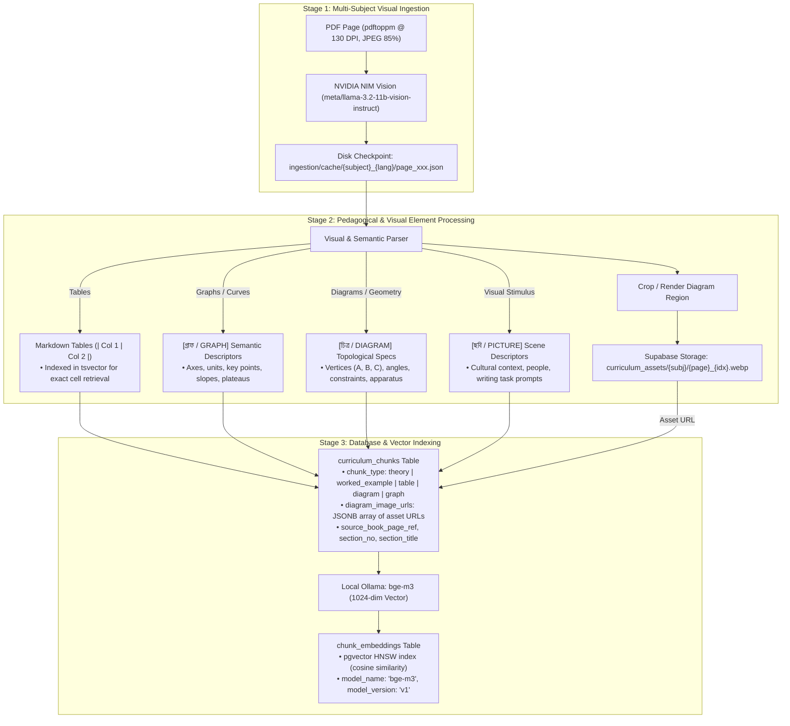

# Implementation Plan: Comprehensive Multimodal Textbook Ingestion (NVIDIA NIM Vision + Visual Assets + BGE-M3 + Supabase)

A production-grade ingestion and multimodal RAG pipeline for the remaining 1,961 pages of NCTB Class 9–10 textbooks (**Chemistry**, **Mathematics**, and **English**). This plan details how visual content—including tables, charts, graphs, raster photographs, vector geometric drawings, and chemical apparatus—is extracted, semantically structured, linked to visual assets, embedded via local 1024-dim BGE-M3, and persisted into Supabase.

---

## 1. Visual Content Analysis Across Textbooks

Our inspection of all 6 non-Physics textbooks (1,961 pages total) reveals distinct visual paradigms across the three subject domains:

```
┌─────────────────────────────────────────────────────────────────────────────────────────────────────────┐
│                                    TEXTBOOK VISUAL TYPOLOGY MATRIX                                      │
├───────────────────┬──────────────────────────────────┬──────────────────────────────────────────────────┤
│ Subject           │ Visual Content Types             │ Technical Nature in PDF & Handling Strategy      │
├───────────────────┼──────────────────────────────────┼──────────────────────────────────────────────────┤
│ Chemistry         │ • Laboratory apparatus & setups  │ • Mixture of raster images (hazard symbols,      │
│ (310 pages BN,    │ • Bohr/Rutherford atomic models  │   crystals) and vector path diagrams.            │
│  310 pages EN)    │ • Periodic table & trend charts  │ • Vision LLM generates structured LaTeX chemical │
│                   │ • Heating & solubility curves    │   reactions + [চিত্র / DIAGRAM] & [গ্রাফ / GRAPH]│
│                   │ • Chemical hazard (GHS) symbols  │   blocks; tables to GitHub Markdown.             │
├───────────────────┼──────────────────────────────────┼──────────────────────────────────────────────────┤
│ Mathematics       │ • Geometric theorems & proofs    │ • 99.8% VECTOR DRAWINGS (lineto, curveto, arc).  │
│ (389 pages BN,    │ • Geometric constructions (অঙ্কন) │ • Raster extractors find 0 images.               │
│  421 pages EN)    │ • Coordinate Cartesian graphs    │ • Vision LLM decodes vertices ($A, B, C$),       │
│                   │ • Mensuration solid geometry     │   angles, parallel/perpendicular lines, and      │
│                   │ • Statistics (histograms/ogives) │   topological relations into LaTeX & specs.      │
├───────────────────┼──────────────────────────────────┼──────────────────────────────────────────────────┤
│ English           │ • Writing task graphs & charts   │ • 100% of pages contain embedded photo/art scans │
│ (206 pages EFT,   │ • Cultural/historical pictures   │   or tabular grammar layouts.                    │
│  325 pages Gram)  │ • Grammar transformation tables  │ • Vision LLM transcribes substitution tables,    │
│                   │ • Substitution sentence tables   │   data chart trends, dialogues, and scene info.  │
└───────────────────┴──────────────────────────────────┴──────────────────────────────────────────────────┘
```

---

## 2. 3-Tier Multimodal Ingestion Architecture



---

## 3. Detailed Handling of Visual Elements

### A. Tables (Periodic Table, Valency, Statistics, Grammar Substitution)
* **Extraction**: Transcribed directly into GitHub-flavored Markdown tables.
* **Why Markdown?**: Markdown tables preserve columnar relational structure, allow PostgreSQL `tsvector` to match row/column intersections, and render natively in the Next.js frontend ("খাতা" student paper view).
* **Chunk Classification**: Stored as `chunk_type = 'table'` (or embedded inside `theory`/`worked_example`).

### B. Graphs & Analytical Curves (Chemistry Solubility, Math Cartesian/Ogive, English Bar/Pie)
* **Format**: Structured `[গ্রাফ / GRAPH]` block:
  ```markdown
  [গ্রাফ / GRAPH: পানির শীতলীকরণ বক্ররেখা / Cooling Curve of Water]
  - ধরন (Type): রেখাচিত্র (Line Graph / Curve)
  - X-অক্ষ (X-axis): সময় (Time) [মিনিট / minutes], ব্যাপ্তি: ০ থেকে ২০ মিনিট
  - Y-অক্ষ (Y-axis): তাপমাত্রা (Temperature) [°C], ব্যাপ্তি: -২০°C থেকে ১৪০°C
  - মূল বিন্দু ও রেখাংশ (Key Coordinates & Segments):
    * A (০ মিনিট, ১৪০°C) থেকে B (৪ মিনিট, ১০০°C): গ্যাসীয় অবস্থার শীতলীকরণ
    * BC মালভূমি (Plateau at ১০০°C, ৪-৮ মিনিট): ঘনীভবন (গ্যাস $\to$ তরল)
    * CD রেখা (৮-১২ মিনিট): তরল পানির শীতলীকরণ (১০০°C $\to$ ০°C)
    * DE মালভূমি (Plateau at ০°C, ১২-১৬ মিনিট): হিমাঙ্ক / কঠিনীভবন (তরল $\to$ বরফ)
    * EF রেখা (১৬-২০ মিনিট): বরফের তাপমাত্রা হ্রাস (০°C $\to$ -২০°C)
  ```
* **Pedagogical Value**: Enables the Socratic AI tutor to ask questions about phase transitions and verify student curve interpretations during automated grading.

### C. Geometric Figures & Vector Diagrams (Mathematics)
* **Format**: Structured `[চিত্র / DIAGRAM]` block:
  ```markdown
  [চিত্র / DIAGRAM: বৃত্তে অন্তর্লিখিত চতুর্ভুজ / Cyclic Quadrilateral]
  - জ্যামিতিক উপাদান (Geometric Elements): $O$ কেন্দ্রবিশিষ্ট বৃত্ত, বৃত্তে অন্তর্লিখিত চতুর্ভুজ $ABCD$
  - শীর্ষবিন্দু ও কোণ (Vertices & Angles): শীর্ষ $A, B, C, D$; কেন্দ্রস্থ কোণ $\angle BOD$ (সরলকোণ ও প্রবৃদ্ধ), বৃত্তস্থ কোণ $\angle BAD$ ও $\angle BCD$
  - জ্যামিতিক সম্পর্ক (Constraints): $\angle BAD + \angle BCD = 180^\circ$ (দুই সমকোণ)
  - অঙ্কন (Construction): $O, B$ এবং $O, D$ যোগ করা হয়েছে।
  ```
* **Vector Graphic Recovery**: Solves the critical issue where standard PDF image extractors return 0 images for math theorems.

### D. Laboratory Apparatus & Chemical Structures (Chemistry)
* **Format**: Structured `[চিত্র / DIAGRAM]` block describing apparatus components (বিকার, ফানেল, টেস্টটিউব, বুনসেন বার্নার, নির্গম নল) and molecular configurations (পরমাণুর নিউক্লিয়াস, শক্তিস্তর, ইলেকট্রন বিন্যাস).
* **Asset Linking**: Where high-resolution apparatus diagrams appear, the bounding region is stored in `diagram_image_urls` and embedded as `` for student viewing.

### E. Cultural Scenes, Historical Photos & English Writing Prompts (English)
* **Format**: Structured `[ছবি / PICTURE]` block detailing the scene, historical figures, actions, and writing prompts (e.g., describing family tree, flood rehabilitation, traffic congestion).

---

## 4. Database Schema Alignment

The `curriculum_chunks` table already contains designated visual columns:

| Column | Data Type | Populated Value / Format |
|---|---|---|
| `id` | `uuid` | Generated UUID v4 |
| `chapter_id` | `uuid` | Foreign key to `chapters` (e.g. Chemistry Ch 1–12, Math Ch 1–17, English Ch 1–10) |
| `curriculum_version_id`| `uuid` | Foreign key to `curriculum_versions` (Class 9-10 NCTB) |
| `chunk_type` | `text` | `'theory'`, `'worked_example'`, `'cq_stimulus'`, `'cq_subquestion'`, `'table'`, `'diagram'`, `'graph'` |
| `content_chunk` | `text` | Verbatim text + LaTeX math + Markdown tables + `[চিত্র]`/`[গ্রাফ]` semantic blocks |
| `diagram_image_urls` | `jsonb` | JSON array of asset URLs: `["https://.../assets/chem_ch01_p16_fig1.webp"]` |
| `source_book_page_ref`| `text` | Page number string (e.g. `'15'`, `'16'`) |
| `section_no` | `text` | Section number (e.g. `'1.2'`, `'3.4'`) |
| `section_title` | `text` | Section title (e.g. `'রসায়নে অনুসন্ধান ও গবেষণা'`) |
| `parent_chunk_id` | `uuid` | Self-referencing FK linking sub-questions to parent stimulus or diagram |
| `fts_doc` | `tsvector` | Auto-generated full-text search vector over Bengali & English content |

Vector embeddings are persisted into `chunk_embeddings`:
| Column | Data Type | Populated Value / Format |
|---|---|---|
| `chunk_id` | `uuid` | Foreign key to `curriculum_chunks.id` |
| `embedding` | `vector(1024)` | Local Ollama `BAAI/bge-m3` 1024-dimensional dense vector |
| `model_name` | `text` | `'bge-m3'` |
| `model_version` | `text` | `'v1'` |

---

## 5. Phased Ingestion & Rollout Plan

### Phase 1: Chemistry (`chemistry_bn.pdf` & `chemistry_en.pdf`, 620 pages total)
* **Chapters**: 12 chapters in `SSC-CHEM` (Subject UUID: `d85609a4-256b-485f-a4e6-6ec7c7b5098e`).
* **Visual Profile**: ~80% of pages feature apparatus, reaction equations, state symbols, and periodic properties.
* **Execution**:
  1. Bengali Edition: Pages 1–310 (`--subject chemistry --lang bn --persist-db`)
  2. English Edition: Pages 1–310 (`--subject chemistry --lang en --persist-db`)
* **Checkpointing**: In `ingestion/cache/chemistry_bn/` and `ingestion/cache/chemistry_en/`.

### Phase 2: Mathematics (`mathematics_bn.pdf` & `mathematics_en.pdf`, 810 pages total)
* **Chapters**: 17 chapters in `SSC-MATH` (Subject UUID: `96e2be52-da81-4ebc-a81d-6b5ca78e7cf6`).
* **Visual Profile**: Geometric proofs, compass constructions (অঙ্কন), Cartesian graphs, and statistics tables.
* **Execution**:
  1. Bengali Edition: Pages 1–389 (`--subject mathematics --lang bn --persist-db`)
  2. English Edition: Pages 1–421 (`--subject mathematics --lang en --persist-db`)
* **Checkpointing**: In `ingestion/cache/mathematics_bn/` and `ingestion/cache/mathematics_en/`.

### Phase 3: English (`english_for_today.pdf` & `english_grammar_and_composition.pdf`, 531 pages total)
* **Chapters**: 10 chapters in `SSC-ENG` (Subject UUID: `f33e721d-7201-447a-8f5b-8c81907cb583`).
* **Visual Profile**: Graph/chart interpretation for writing tasks, cultural scenes, substitution tables, dialogue turns.
* **Execution**:
  1. English For Today: Pages 1–206 (`--subject english --lang en --persist-db`)
  2. Grammar & Composition: Pages 1–325 (`--subject english --lang bn --persist-db`)
* **Checkpointing**: In `ingestion/cache/english_for_today/` and `ingestion/cache/english_grammar/`.

---

## 6. Verification Plan

### Automated Verification
1. **Schema Integrity Check**:
   ```bash
   python3 -c "import requests; ... verify 1024-dim embeddings and non-empty curriculum_chunks"
   ```
2. **Visual Block Audit**:
   Verify that chunks for pages with figures contain `[চিত্র / DIAGRAM]`, `[গ্রাফ / GRAPH]`, or Markdown tables.
3. **Hybrid Search Retrieval Test**:
   Execute RPC call to `match_curriculum_chunks` with visual and experimental queries:
   - Chemistry: `"অ্যামোনিয়াম ক্লোরাইড এবং বালির মিশ্রণ পৃথকীকরণ"` $\to$ Sublimation apparatus chunk.
   - Mathematics: `"বৃত্তের একই চাপের উপর দণ্ডায়মান কেন্দ্রস্থ কোণ বৃত্তস্থ কোণের দ্বিগুণ"` $\to$ Circle theorem 20 diagram chunk.
   - English: `"Describe the graph showing literacy rate of Bangladesh"` $\to$ Writing task graph chunk.

### Manual / UI Verification
* Open the SheraTutor web interface and verify that retrieved textbook chunks render Markdown tables, LaTeX equations, and diagram descriptors cleanly without broken formatting.
