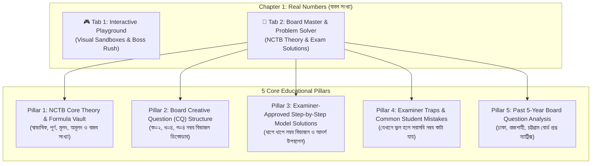

# NCTB Board Master & Problem Solver Architecture
## *Comprehensive Plan for NCTB-Aligned Theory, Step-by-Step Board Problem Solutions, and Examiner Rubrics*

> **Feature Name:** Board Master & Problem Solver (বোর্ড মাস্টার ও সমস্যা সমাধান নির্দেশিকা)  
> **Target Curriculum:** Bangladesh National Curriculum and Textbook Board (NCTB) — SSC General Mathematics  
> **Pilot Chapter:** Chapter 1: Real Numbers (বাস্তব সংখ্যা)  
> **Target Audience:** Class 9–10 Bangladeshi Students & Educators  
> **Language:** English (Architecture & Specifications) with Bengali exam-aligned terminology  

---

## 1. Executive Summary & Educational Dilemma

### 1.1 The Student Dilemma in Bangladesh
In the Bangladeshi secondary education system (SSC), students face a critical gap between **understanding a concept** and **scoring 10/10 on an exam script**:
1. **The Step-Marking Blindspot:** Board examiners do not grade on final answers alone; they grade according to strict NCTB step-by-step rubrics. A student who reaches the correct final number but skips an essential intermediate deduction step will lose 2 out of 4 marks.
2. **Generic Guidebook Limitations:** Popular commercial guidebooks (Panjeree, Anupam, Jupiter, Made Easy) provide cramped, dense solutions without highlighting *why* specific steps carry marks, *where* examiners routinely deduct marks, or *how* to structure answers for maximum score security.
3. **The Dual-Need Student Reality:**
   - **Need A (Intuition & Play):** Students need interactive sandboxes, visual proofs, and simulations to overcome fear and genuinely understand math (The **Playground**).
   - **Need B (Execution & Board Mastery):** Students need an exam-focused master guide that reveals board questions, exact step rubrics, examiner expectations, and common pitfalls to guarantee an A+ (The **Board Master Guide**).

### 1.2 The Solution: Dual-Mode Chapter Architecture
Inside each chapter in `/dashboard/playground/math/[chapterNo]`, students will have an intuitive top-level switch:
* 🎮 **Interactive Playground (ইন্টারেক্টিভ ল্যাব):** Visual sandbox, interactive sliders, $\sqrt{2}$ compass, 9s & 0s decimal decoder, and 60-second Boss Rush.
* 📖 **Board Master & Problem Solver (বোর্ড মাস্টার ও সমস্যা সমাধান নির্দেশিকা):** Complete NCTB chapter theory, board exam Creative Question (CQ) patterns, step-by-step rubric solutions, and examiner trap warnings.

---

## 2. The 5-Pillar Board Master Framework



---

## 3. Concrete Blueprint for Chapter 1: Real Numbers (বাস্তব সংখ্যা)

### Pillar 1: NCTB Core Theory & Formal Definitions

Every formal definition required for Knowledge Questions (জ্ঞানমূলক — Part ক) must be presented with exact NCTB textbook wording, mathematical notation, and examples:

1. **Classification Tree of Real Numbers (বাস্তব সংখ্যার শ্রেণিবিন্যাস):**
   * **Natural Numbers ($\mathbb{N}$):** Counting numbers $\{1, 2, 3, 4, ...\}$.
     * **Prime Numbers (মৌলিক সংখ্যা):** Numbers greater than $1$ whose only positive divisors are $1$ and the number itself ($2, 3, 5, 7, ...$). *Crucial Note:* $2$ is the ONLY even prime number!
     * **Composite Numbers (যৌগিক সংখ্যা):** Numbers having factors other than $1$ and itself ($4, 6, 8, 9, ...$).
     * **$1$ is neither prime nor composite (১ মৌলিকও নয়, যৌগিকও নয়).**
     * **Coprime Numbers (সহমৌলিক সংখ্যা):** Two numbers are coprime if their Greatest Common Divisor (GCD / গ.সা.গু) is $1$ (e.g., $4$ and $9$).
   * **Integers ($\mathbb{Z}$):** All whole numbers $\{..., -3, -2, -1, 0, 1, 2, 3, ...\}$.
     * Non-negative integers (অঋণাত্মক পূর্ণসংখ্যা): $\{0, 1, 2, 3, ...\}$.
   * **Rational Numbers ($\mathbb{Q}$):** Numbers expressible in the form $\frac{p}{q}$, where $p, q \in \mathbb{Z}$ and $q \neq 0$.
     * Proper fractions (প্রকৃত ভগ্নাংশ): $|p| < |q|$.
     * Improper fractions (অপ্রকৃত ভগ্নাংশ): $|p| \ge |q|$.
     * Terminating decimals (সসীম দশমিক): e.g., $0.25 = \frac{1}{4}$.
     * Recurring decimals (আবৃত্ত দশমিক / পৌনঃপুনিক): e.g., $0.\dot{3} = \frac{1}{3}$, $0.2\dot{4}\dot{5} = \frac{27}{110}$.
   * **Irrational Numbers ($\mathbb{Q}'$):** Numbers that CANNOT be expressed as $\frac{p}{q}$ ($p, q \in \mathbb{Z}, q \neq 0$). Their decimal representations are **infinite non-terminating and non-recurring (অসীম অনাবৃত দশমিক)**:
     * Non-perfect square roots: $\sqrt{2}, \sqrt{3}, \sqrt{5}, \sqrt{7}$.
     * Transcendental constants: $\pi = 3.14159265...$, $e = 2.71828...$.
   * **Real Numbers ($\mathbb{R}$):** The union of all rational and irrational numbers ($\mathbb{R} = \mathbb{Q} \cup \mathbb{Q}'$).

---

### Pillar 2: Board Creative Question (CQ) Structure (10 Marks Total)

In SSC General Mathematics examinations across all education boards (Dhaka, Rajshahi, Chittagong, Comilla, etc.), Creative Questions follow a strict **2 + 4 + 4 = 10** marks structure:

| CQ Part | Domain / Cognitive Level | Marks | Expected Answer Length & Scope |
| :--- | :--- | :--- | :--- |
| **Part (ক)** | **Knowledge (জ্ঞানমূলক)** | **2 Marks** | 2–4 lines. Clear definition, short evaluation (e.g. converting a simple recurring decimal to a fraction, verifying coprimality). |
| **Part (খ)** | **Application (প্রয়োগমূলক)** | **4 Marks** | 8–12 lines. Structured mathematical derivation, stating givens, substitution, algebraic computation, and clear final result. |
| **Part (গ)** | **Higher Ability (উচ্চতর দক্ষতা)** | **4 Marks** | 12–18 lines. Multi-stage logical proof (e.g. irrationality proof), interval analysis, or multi-term recurring decimal operations. |

---

### Pillar 3: Examiner-Approved Step-by-Step Model Solutions

Here are the **Top 3 Recurring Board Exam Problem Types** for Chapter 1 with full step marking rubrics:

---

#### Board Problem Type 1: Proof of Irrationality (অমূলদ সংখ্যার প্রমাণ)

> **Board Question (Part খ / গ — 4 Marks):**  
> প্রমাণ করো যে, $\sqrt{5}$ একটি অমূলদ সংখ্যা।  
> *(Prove that $\sqrt{5}$ is an irrational number.)*

##### Step-by-Step Examiner Rubric & Model Answer:

* **Step 1: Bounds & Integer Elimination [Award: 1 Mark]**  
  $$\text{এখানে, } 2^2 = 4 < 5 < 9 = 3^2$$  
  $$\therefore 2 < \sqrt{5} < 3$$  
  সুতরাং, $\sqrt{5}$ এর মান $2$ অপেক্ষা বড় এবং $3$ অপেক্ষা ছোট।  
  অতএব, $\sqrt{5}$ কোনো পূর্ণসংখ্যা হতে পারে না।

* **Step 2: Assumption of Rational Form [Award: 1 Mark]**  
  যদি $\sqrt{5}$ পূর্ণসংখ্যা না হয়, তবে এটি হয় মূলদ সংখ্যা অথবা অমূলদ সংখ্যা হবে।  
  ধরি, $\sqrt{5}$ একটি মূলদ সংখ্যা।  
  তাহলে এমন দুটি স্বাভাবিক সংখ্যা $p$ ও $q$ থাকবে, যেন:  
  $$\sqrt{5} = \frac{p}{q}$$  
  *(যেখানে $p$ ও $q$ পরস্পর সহমৌলিক, স্বাভাবিক সংখ্যা এবং $q > 1$)*

* **Step 3: Algebraic Squaring & Transformation [Award: 1 Mark]**  
  উভয়পক্ষকে বর্গ করে পাই:  
  $$(\sqrt{5})^2 = \left(\frac{p}{q}\right)^2 \implies 5 = \frac{p^2}{q^2}$$  
  উভয়পক্ষকে $q$ দ্বারা গুণ করে পাই:  
  $$5q = \frac{p^2}{q}$$

* **Step 4: Logical Contradiction & Final Conclusion [Award: 1 Mark]**  
  এখানে, যেহেতু $q$ একটি স্বাভাবিক সংখ্যা ($q > 1$), তাই $5q$ স্পষ্টতই একটি **পূর্ণসংখ্যা**।  
  কিন্তু $p$ ও $q$ পরস্পর সহমৌলিক স্বাভাবিক সংখ্যা এবং $q > 1$ হওয়ায়, $\frac{p^2}{q}$ পূর্ণসংখ্যা নয়, এটি একটি **ভগ্নাংশ**।  
  আমরা জানি, একটি পূর্ণসংখ্যা কখনো কোনো ভগ্নাংশের সমান হতে পারে না:  
  $$5q \neq \frac{p^2}{q}$$  
  সুতরাং, $\sqrt{5}$ কে $\frac{p}{q}$ আকারে প্রকাশ করা অসম্ভব।  
  $\therefore \sqrt{5}$ মূলদ সংখ্যা নয়।  
  **অতএব, $\sqrt{5}$ একটি অমূলদ সংখ্যা। (প্রমাণিত)**

---

#### Board Problem Type 2: Converting Recurring Decimals & Alignment (পৌনঃপুনিক দশমিক ভগ্নাংশ)

> **Board Question (Part ক — 2 Marks):**  
> $0.2\dot{4}\dot{5}$ কে সাধারণ ভগ্নাংশে প্রকাশ করো।  
> *(Convert $0.2\dot{4}\dot{5}$ into a vulgar fraction.)*

##### Step-by-Step Examiner Rubric & Model Answer:

* **Step 1: Application of NCTB Formula [Award: 1 Mark]**  
  NCTB সূত্রানুসারে:  
  $$\text{সাধারণ ভগ্নাংশ} = \frac{\text{দশমিক বিন্দু বাদে সম্পূর্ণ সংখ্যা} - \text{অনাবৃত অংশের সংখ্যা}}{\text{যতটি পৌনঃপুনিক অঙ্ক ততটি ৯ এবং যতটি অনাবৃত অঙ্ক ততটি ০}}$$  
  $$0.2\dot{4}\dot{5} = \frac{245 - 2}{990}$$

* **Step 2: Arithmetic Simplification & Lowest Terms [Award: 1 Mark]**  
  $$= \frac{243}{990}$$  
  উভয় লব ও হরকে $9$ দ্বারা ভাগ করে পাই:  
  $$= \frac{27}{110}$$  
  **উত্তর: $\frac{27}{110}$**

---

#### Board Problem Type 3: Finding Rational & Irrational Numbers Between Two Reals

> **Board Question (Part খ — 4 Marks):**  
> $a = \sqrt{3}$ এবং $b = 4$ দুটি বাস্তব সংখ্যা। $a$ ও $b$ এর মধ্যবর্তী একটি মূলদ ও একটি অমূলদ সংখ্যা নির্ণয় করো।  
> *(Given $a = \sqrt{3}$ and $b = 4$. Find one rational and one irrational number between $a$ and $b$.)*

##### Step-by-Step Examiner Rubric & Model Answer:

* **Step 1: Decimal Approximation of Limits [Award: 1 Mark]**  
  $$\text{এখানে, } a = \sqrt{3} \approx 1.7320508...$$  
  $$\text{এবং } b = 4$$

* **Step 2: Constructing the Rational Number ($x$) [Award: 1 Mark]**  
  ধরি, $x = 2.5 = \frac{25}{10} = \frac{5}{2}$  
  স্পষ্টতই, $1.732... < 2.5 < 4$  
  অর্থাৎ, $a < x < b$।  
  যেহেতু $x = \frac{5}{2}$ কে দুইটি পূর্ণসংখ্যার অনুপাতে প্রকাশ করা যায়, সুতরাং $x$ একটি মূলদ সংখ্যা।

* **Step 3: Constructing the Irrational Number ($y$) [Award: 1 Mark]**  
  ধরি, $y = 2.01001000100001...$  
  স্পষ্টতই, $1.732... < y < 4$  
  অর্থাৎ, $a < y < b$।

* **Step 4: Formal Verification of Non-Repeating Nature [Award: 1 Mark]**  
  যেহেতু $y$ এর দশমিক অংশ অসীম এবং কোনো নির্দিষ্ট পর্যায়ক্রমে পৌনঃপুনিক হয় না (অনাবৃত অসীম দশমিক), সুতরাং $y$ কে $\frac{p}{q}$ ভগ্নাংশ আকারে লেখা যায় না।  
  অতএব, $y$ একটি অমূলদ সংখ্যা।  
  **উত্তর: মূলদ সংখ্যা $= 2.5$, অমূলদ সংখ্যা $= 2.010010001...$**

---

### Pillar 4: Examiner Traps & Common Student Mistakes

Board examiners from the Secondary and Higher Secondary Education Boards have identified recurring student errors that result in automatic mark deductions:

| Mistake Type | Common Student Error | Why the Examiner Deducts Marks | How to Avoid It (The Golden Rule) |
| :--- | :--- | :--- | :--- |
| **Trap 1: Omitting Coprime Condition** | Writing $\sqrt{2} = \frac{p}{q}$ without specifying: *"$p, q$ are coprime and $q > 1$"*. | If $p, q$ are not coprime, then $\frac{p^2}{q}$ COULD be an integer, which destroys the contradiction proof! Examiner deducts **1 to 2 marks**. | **Always write verbatim:** *"$p$ ও $q$ পরস্পর সহমৌলিক স্বাভাবিক সংখ্যা এবং $q > 1$"*. |
| **Trap 2: Carry-over in Recurring Addition** | Adding recurring decimals without running enough test repeating digits to check for the carry-over digit. | Missing the $+1$ carry gives an answer off by $0.00...1$. Examiner awards **0 marks** for the final step. | Always write at least **2 extra sets** of repeating digits during alignment to catch the carry bit. |
| **Trap 3: Incomplete Simplification** | Leaving $\frac{243}{990}$ without reducing to $\frac{27}{110}$. | NCTB requires the vulgar fraction to be in its lowest reduced form (লঘিষ্ঠ আকার). Deducts **0.5 to 1 mark**. | Always divide numerator and denominator by common factors until coprime. |
| **Trap 4: Missing Concluding Sentence** | Stopping at $5q \neq \frac{p^2}{q}$ without writing the explicit concluding statement. | Fails to answer the direct question asked in the stimulus. | Always close with: *"অতএব, $\sqrt{5}$ মূলদ হতে পারে না; সুতরাং $\sqrt{5}$ একটি অমূলদ সংখ্যা।"* |

---

### Pillar 5: Past 5-Year Board Exam Question Matrix

Analysis of board examination papers from 2020–2024 across all major education boards:

| Board & Year | Exam Part | Question Stimulus / Task | Underlying NCTB Category |
| :--- | :--- | :--- | :--- |
| **Dhaka Board 2024** | CQ 1 (খ) | প্রমাণ করো যে, $\sqrt{7}$ একটি অমূলদ সংখ্যা। | Proof of Irrationality ($4$ marks) |
| **Rajshahi Board 2023** | CQ 1 (ক) | $0.3\dot{7}\dot{8}$ কে সাধারণ ভগ্নাংশে রূপান্তর করো। | Recurring Decimal Conversion ($2$ marks) |
| **Chittagong Board 2023**| CQ 1 (গ) | $\sqrt{5}$ এবং $4$ এর মধ্যবর্তী দুটি অমূলদ সংখ্যা নির্ণয় করো। | Real Intervals & Density ($4$ marks) |
| **Jessore Board 2022** | CQ 1 (খ) | প্রমাণ করো যে, যেকোনো চারটি ক্রমিক স্বাভাবিক সংখ্যার গুণফলের সাথে $1$ যোগ করলে যোগফল একটি পূর্ণবর্গ সংখ্যা হয়। | Consecutive Integer Product Proof ($4$ marks) |
| **Comilla Board 2020** | CQ 1 (গ) | $2.3\dot{5}$ এবং $1.\dot{2}\dot{4}$ এর সদৃশ রূপান্তর ও যোগফল নির্ণয় করো। | Recurring Addition ($4$ marks) |

---

## 4. UI/UX Design & Layout Specification

### 4.1 Route Location
* Route: `web/src/app/dashboard/playground/math/[chapterNo]/page.tsx`
* Top navigation bar features a dynamic 2-tab switch:
  * Tab 1: **[🎮 ইন্টারেক্টিভ ল্যাব (Interactive Playground)]** (Active sandbox, animations, boss rush)
  * Tab 2: **[📖 বোর্ড মাস্টার গাইড (NCTB Board Master & Problem Solver)]**

### 4.2 The Board Master Guide Layout (Two-Column Desktop View)

```
+----------------------------------------------------------------------------------------------------+
| 🏠 Playground > General Math > Chapter 1: Real Numbers                                             |
| [🎮 ইন্টারেক্টিভ ল্যাব (Interactive Lab)]    [★ 📖 বোর্ড মাস্টার ও সমাধান গাইড (Board Master Guide)] |
+------------------------------------+---------------------------------------------------------------+
| STICKY TABLE OF CONTENTS (25%)     | MAIN BOARD EXAM STUDY & SOLVER PANE (75%)                     |
|                                    |                                                               |
| 📑 সূচিপত্র (Table of Contents)      | 📌 অধ্যায় ১: বাস্তব সংখ্যা — বোর্ড মাস্টার গাইড              |
| 1. NCTB মূল তত্ত্ব ও সূত্রকোষ       |                                                               |
| 2. বোর্ড সৃজনশীলের (CQ) ৩টি টাইপ    | ───────────────────────────────────────────────────────────── |
| 3. টাইপ ১: অমূলদ সংখ্যার প্রমাণ     | 🎯 টাইপ ১: অমূলদ সংখ্যার প্রমাণ (বোর্ড পরীক্ষায় আসা নিশ্চিত)     |
| 4. টাইপ ২: পৌনঃপুনিক দশমিক ভগ্নাংশ |                                                               |
| 5. টাইপ ৩: মধ্যবর্তী সংখ্যা নির্ণয়  | 📝 বোর্ড প্রশ্ন: প্রমাণ করো যে, √৫ একটি অমূলদ সংখ্যা। [৪ নম্বর]  |
| 6. পরীক্ষকের ট্র্যাপ ও সাধারণ ভুল   |                                                               |
| 7. বিগত ৫ বছরের বোর্ড প্রশ্ন ম্যাট্রিক্স| 💡 রুব্রিক ভিত্তিক আদর্শ সমাধান:                             |
|                                    |    • ধাপ ১ [১ নম্বর]: ২² < ৫ < ৩² সুতরাং পূর্ণসংখ্যা নয়...     |
| [⚡ প্র্যাকটিস মক টেস্ট শুরু করো]      |    • ধাপ ২ [১ নম্বর]: √৫ = p/q (সহমৌলিক ও q > 1)...           |
|                                    |    • ধাপ ৩ [১ নম্বর]: বর্গ করে ৫q = p²/q...                   |
|                                    |    • ধাপ ৪ [১ নম্বর]: পূর্ণসংখ্যা ≠ ভগ্নাংশ! অতএব অমূলদ।    |
|                                    |                                                               |
|                                    | ⚠️ পরীক্ষকের সতর্কতা বক্স:                                    |
|                                    | "সহমৌলিক ও q > 1 না লিখলে সরাসরি ১ নম্বর কাটা যাবে!"           |
+------------------------------------+---------------------------------------------------------------+
```

### 4.3 Key Interactive Features of the Board Master Pane:
1. **Interactive Step-Marking Badges:** Each step displays a visual tag: `[ধাপ ১: ১ নম্বর]`, `[ধাপ ২: ১ নম্বর]`, helping students understand exactly how marks accumulate.
2. **"Copy Model Solution" Button:** Students can copy the clean, formatted Bengali text with LaTeX formulas directly to their notes.
3. **"Examiner's Secret" Warning Callouts:** High-contrast alert boxes highlighting the common pitfalls where students lose marks.
4. **"Practice this CQ in Mock Exam":** A direct CTA linking to `/dashboard/practice/generate` with Chapter 1 pre-selected.

---

## 5. Implementation Status & Chapter Roadmap

### Status Tracker
- **Chapter 1: বাস্তব সংখ্যা (Real Numbers)** — ✅ **COMPLETED & VERIFIED**
  - Interactive Playground: 5 Quests (Classification Lab, Recurring Decoder, Geometric $\sqrt{2}$ Compass, Sieve of Eratosthenes, 60s Boss Rush).
  - Board Master Guide: 5 Pillars (Theory, CQ Breakdown, 3 Model Solutions with $2+4+4$ rubrics, Examiner Traps, 5-Year Board Matrix).
  - E2E Verified: `scripts/e2e-playground-test.mjs` (0 console errors).
- **Chapter 2: সেট ও ফাংশন (Sets & Functions)** — ✅ **COMPLETED & VERIFIED**
  - Interactive Playground: 5 Quests (Venn Island Sandbox, Power Set $2^n$ Generator, De Morgan Dual Mirror, Function Machine with divide-by-zero detection, 60s Sets Boss Rush).
  - Board Master Guide: 5 Pillars (Formal Definitions, CQ Breakdown, 3 Model Solutions: $2^n$ proof, set builder to roster, relation domain/range table; Examiner Traps, 5-Year Board Matrix).
  - E2E Verified: `scripts/e2e-ch2-playground-test.mjs` (0 console errors).
- **Chapter 3: বীজগাণিতিক রাশি (Algebraic Expressions)** — ✅ **COMPLETED & VERIFIED**
  - Interactive Playground: 5 Quests (Geometric Tile Slicer & Expander, Symmetrical $x+1/x$ Power Ladder, Middle-Term Factor Splitter, Remainder Theorem Machine, 60s Algebra Boss Rush).
  - Board Master Guide: 5 Pillars (Formulas Vault: $4ab, 2(a^2+b^2), ab$ as difference of two squares; CQ Breakdown, 3 Model Solutions: $x^5 - 1/x^5$ proof, $m^3 + 2p^3 = 3mn$ identity, factor theorem cubic vanishing proof; Examiner Traps, 5-Year Board Matrix).
  - E2E Verified: `scripts/e2e-ch3-playground-test.mjs` (0 console errors).
- **Chapter 4: সূচক ও লগারিদম (Exponents & Logarithms)** — ✅ **COMPLETED & VERIFIED**
  - Interactive Playground: 5 Quests (Paper Fold to the Moon $2^n$, Richter & Sound Decibel logarithmic compressor, Base-Exponent Power Balancer $a^x = a^y \implies x = y$, Scientific Notation & Characteristic/Mantissa Lab, 60s Exponents & Logs Boss Rush).
  - Board Master Guide: 5 Pillars (Exponents & Log Laws Vault, CQ Breakdown $2+4+4$, 3 Model Solutions: $p^a = q, q^b = r, r^c = p \implies abc = 1$, $\frac{2^{n+4}-4\cdot 2^{n+1}}{2^{n+2}\div 2}=4$, $\frac{\log_k a}{y-z}=\dots \implies a^{y+z}b^{z+x}c^{x+y}=1$; Examiner Traps, 5-Year Board Matrix).
  - E2E Verified: `scripts/e2e-ch4-playground-test.mjs` (0 console errors).
- **Chapter 5: এক চলকবিশিষ্ট সমীকরণ (Equations in One Variable)** — ⏳ **NEXT IN QUEUE**
  - Planned Quests:
    1. *Physical Two-Pan Weight Balance:* Linear balance with draggable weight blocks discovering inverse operations visually.
    2. *Fractional Linear Equation Cross-Multiplier:* Visual step-by-step cross-multiplication with LCD animations.
    3. *Quadratic Discriminant ($b^2 - 4ac$) Particle Collider:* Interactive parabola shifting showing real/distinct, equal, or complex roots.
    4. *Extraneous Root (অবান্তর মূল) Trap Detector:* Interactive square root equation solver highlighting ghost roots.
    5. *60-Second Linear & Quadratic Boss Rush.*
  - Planned Board Guide:
    - 5 Pillars with authentic SSC board CQ templates (quadratic formula derivations, word problems on speed/time/distance, extraneous root checks).

### Remaining General Math Chapters:
* **Ch 5:** One-Variable Equations (এক চলকবিশিষ্ট সমীকরণ)
* **Ch 7:** Practical Geometry (ব্যবহারিক জ্যামিতি)
* **Ch 8:** Circle Theorems (বৃত্ত সংক্রান্ত উপপাদ্য — Theorem 20, 23)
* **Ch 9 & 10:** Trigonometry & Height/Distance (ত্রিকোণমিতিক অনুপাত ও দূরত্ব ও উচ্চতা)
* **Ch 11:** Algebraic Ratio & Proportion (বীজগাণিতিক অনুপাত ও সমানুপাত)
* **Ch 12:** Simple Simultaneous Equations in Two Variables (দুই চলকবিশিষ্ট সরল সহসমীকরণ)
* **Ch 13:** Finite Series (সসীম ধারা — সমান্তর ও গুণোত্তর ধারা)
* **Ch 16:** Mensuration (পরিমিতি — সিলিন্ডার, গোলক, ঘনক)
* **Ch 17:** Statistics (পরিসংখ্যান — সংক্ষিপ্ত পদ্ধতিতে গড়, মধ্যক, প্রচুরক ও অজিভ রেখা)
