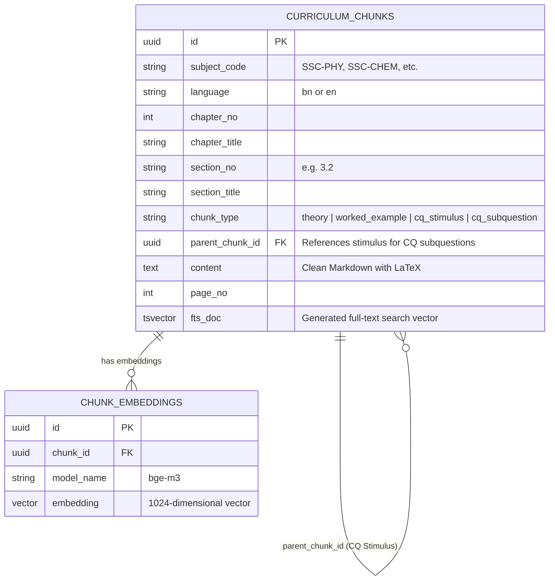

# NCTB Class 9–10 (SSC Academic Year 2026) Textbooks: Complete Ingestion & Corpus Audit Report

**Author:** AI Research & Engineering Systems  
**Scope:** `ingestion/textbooks/` (57 unique PDF files, 33 subjects, 3.47 GB total)  
**Curriculum Source:** National Curriculum and Textbook Board (NCTB), Ministry of Education, Government of Bangladesh  
**Target Platform:** SheraTutor Cross-Lingual RAG & AI Assessment Engine  

---

## Executive Summary

This report delivers an exhaustive technical, structural, and educational analysis of the complete secondary textbook corpus stored in `ingestion/textbooks/`. 

The corpus comprises all official **Class 9–10 (SSC) textbooks for the 2026 Academic Year**, procured from the official NCTB distribution portal (`nctb.gov.bd/pages/static-pages/695b99afc4774958d7b70612`), mirrored across Government eGovCloud infrastructure, and verified with cryptographically secure SHA-256 checksums.

### High-Level Statistics
* **Curriculum Subjects:** 33 subjects spanning 5 educational streams (Science, Business Studies, Humanities, Common Core, and Electives).
* **Total NCTB Portal Download Slots:** 66 (33 subjects × 2 versions: Bangla Version [BV] and English Version [EV]).
* **Unique PDF Files Downloaded:** **57 files** (~3.23 GiB / 3,467,707,358 bytes total).
  * **24 Subjects (48 files):** Distinct Bangla Version (BV) and English Version (EV) editions.
  * **9 Subjects (9 files):** Shared common curriculum editions serving both mediums identically (Bengali literature/grammar, English language/composition, and classical languages).
* **Integrity Status:** 100% verified against [`CHECKSUMS.sha256`](file:///home/kratzer/workspace/Sheratutor/ingestion/textbooks/CHECKSUMS.sha256) with zero byte corruption or truncated headers.

---

## 1. Academic & Pedagogical Classification

The 33 subjects are structured by the Board of Intermediate and Secondary Education into distinct groups. Understanding this classification is essential for RAG chunking, indexing schemas, and prompt grounding:

```
┌────────────────────────────────────────────────────────────────────────┐
│               NCTB Secondary Curriculum (Class 9-10 / SSC)             │
├────────────────────────────────────────────────────────────────────────┤
│ 1. Core Compulsory      │ Bangla (1st, 2nd, Grammar), English (1st,    │
│    (All Students)       │ 2nd), Math, ICT                              │
├─────────────────────────┼──────────────────────────────────────────────┤
│ 2. Science Stream       │ Physics, Chemistry, Biology, Higher Math,    │
│                         │ Bangladesh & Global Studies (BGS)            │
├─────────────────────────┼──────────────────────────────────────────────┤
│ 3. Business Studies     │ Accounting, Finance & Banking, Business      │
│    (Commerce Stream)    │ Entrepreneurship, General Science            │
├─────────────────────────┼──────────────────────────────────────────────┤
│ 4. Humanities Stream    │ History of Bangladesh & Civilization,        │
│    (Arts Stream)        │ Geography & Environment, Civics, Economics   │
├─────────────────────────┼──────────────────────────────────────────────┤
│ 5. Moral & Religion     │ Islam, Hindu, Buddhist, Christian Studies    │
├─────────────────────────┼──────────────────────────────────────────────┤
│ 6. Applied & Vocational │ Agriculture Studies, Home Science, Career    │
│                         │ Education, Physical Education, Art & Craft   │
├─────────────────────────┼──────────────────────────────────────────────┤
│ 7. Classical Electives  │ Arabic, Sanskrit, Pali, Music (Songgit)      │
└────────────────────────────────────────────────────────────────────────┘
```

---

## 2. Exhaustive Catalog of All 57 Textbook PDFs

Below is the definitive inventory of every file in `ingestion/textbooks/`, detailing Bengali/English subject names, file size, exact filename, edition type, and verified SHA-256 checksum.

| Sl | Subject (Bangla / English) | Medium | Local Filename | Size (MB) | Verified SHA-256 Checksum (Prefix) |
|:---:|---|:---:|---|:---:|:---:|
| **১** | বাংলা সাহিত্য (Bangla Sahitto) | Shared | `Secondary (BV)-2026_Class 9-10_Bangla Sahitto_compressed.pdf` | 90.15 MB | `504c8185b2743036cd3fb16c8e41fc03ed6eb268` |
| **২** | বাংলা সহপাঠ (Bangla Sohopath) | Shared | `Secondary (BV)-2026_Class 9-10_Bangla Sohopath_compressed.pdf` | 44.65 MB | `2a6faef5d6bd51f96c45fcdb574668481d5cc080` |
| **৩** | বাংলা ভাষার ব্যাকরণ ও নির্মিতি (Bangla Grammar) | Shared | `Secondary (BV)-2026_Class 9-10_Bangla Grammar_compressed.pdf` | 136.51 MB | `3cb900fb1ce51bb91e13e41d43c51d98260a29ff` |
| **৪** | English For Today | Shared | `Secondary (BV)-2026_Class 9-10_English For Today_compressed.pdf` | 37.64 MB | `a5628de6a7b1a2afd1caf0adfb0d49603dc0c5a8` |
| **৫** | English Grammar and Composition | Shared | `Secondary (BV)-2026_Class 9-10_English Grammar and Composition_compressed.pdf` | 83.49 MB | `ec88d921e9632063810cd54f8c014248cd298bed` |
| **৬** | গণিত (Mathematics) | BV | `Secondary (BV)-2026_Class 9-10_Math_compressed.pdf` | 101.32 MB | `6131d29fe293e9ad88d6a78812b24bed2a457efe` |
| **৬** | Mathematics | EV | `Math-9, com _compressed.pdf` | 72.05 MB | `d0b7aebc13ae7ee4e593be58deae9dea11714786` |
| **৭** | তথ্য ও যোগাযোগ প্রযুক্তি (ICT) | BV | `Secondary (BV)-2026_Class 9-10_ICT_compressed.pdf` | 56.95 MB | `965e132aa7c97653b34ac87a6518e22e6fcba323` |
| **৭** | Information and Communication Tech (ICT) | EV | `ICT-9, com _compressed.pdf` | 29.34 MB | `2e9c94ae316d558de75683695f0827fb879010d5` |
| **৮** | বিজ্ঞান (General Science) | BV | `Secondary (BV)-2026_Class 9-10_Science_compressed.pdf` | 87.68 MB | `c5426a583e1d7a71f875b41ce92a5f61c206bd7e` |
| **৮** | Science | EV | `Science 9-10_compressed.pdf` | 48.04 MB | `ce09f5819d57af42c1e57c6647700b0494599a24` |
| **৯** | পদার্থবিজ্ঞান (Physics) | BV | `Secondary (BV)-2026_Class 9-10_Physics_compressed.pdf` | 101.51 MB | `a07b3b39443031be268dce826592b69fbea61adf` |
| **৯** | Physics | EV | `Physics  9, com _compressed.pdf` | 50.43 MB | `914ad6f4c87d8f136ce172b2e410e754b9faf7e2` |
| **১০** | রসায়ন (Chemistry) | BV | `Secondary (BV)-2026_Class 9-10_Chemistry_compressed.pdf` | 98.15 MB | `77a46c425639912215a7f1ef987e1e75e6b94d86` |
| **১০** | Chemistry | EV | `Chemistry 9, com_compressed.pdf` | 50.85 MB | `6c6a668ce213492bc28c2ab896dbd42a77e4ce40` |
| **১১** | জীববিজ্ঞান (Biology) | BV | `Secondary (BV)-2026_Class 9-10_Biology_compressed.pdf` | 102.76 MB | `9ea759f168995b61c16d605a093a2399436b7c1b` |
| **১১** | Biology | EV | `Biology 9-10, com _compressed.pdf` | 69.10 MB | `004d6fa0c0f36a43d991cf6314228cc607f2c163` |
| **১২** | উচ্চতর গণিত (Higher Mathematics) | BV | `Secondary (BV)-2026_Class 9-10_Higher Math_compressed.pdf` | 96.01 MB | `3eeadc996dbd9e7c6641f80935f3af6a351acc01` |
| **১২** | Higher Mathematics | EV | `Higher Mathe Class-9-10, com _compressed.pdf` | 63.12 MB | `c60df22d87fd9c44282d112341c925f03383697b` |
| **১৩** | ভূগোল ও পরিবেশ (Geography & Environment) | BV | `Secondary (BV)-2026_Class 9-10_Bhugol_compressed.pdf` | 65.34 MB | `54143857fe880659c23f35469eb512d410ff8b8e` |
| **১৩** | Geography and Environment | EV | `Geography 9, com _compressed.pdf` | 61.84 MB | `0f2cf02b74c4d69430fc90d974426c7e17d4a55b` |
| **১৪** | অর্থনীতি (Economics) | BV | `Secondary (BV)-2026_Class 9-10_Economics_compressed.pdf` | 48.47 MB | `bd916b31c7e514555f2c031407fd90c30875ffb7` |
| **১৪** | Economics | EV | `Economics 9-10, com _compressed.pdf` | 29.63 MB | `72f89b3f24d9a636c8fec718ced6f3fb487d0ae3` |
| **১৫** | কৃষিশিক্ষা (Agriculture Studies) | BV | `Secondary (BV)-2026_Class 9-10_Agriculture_compressed.pdf` | 53.51 MB | `584526f43a5a64318049c63ba30eb84344e91e55` |
| **১৫** | Agriculture Studies | EV | `Agriculture 9, com _compressed.pdf` | 76.05 MB | `d297c4bf2e62bf69f54b43bd3014e9e5a7d01dcf` |
| **১৬** | গার্হস্থ্যবিজ্ঞান (Home Science) | BV | `Secondary (BV)-2026_Class 9-10_Home Science_compressed.pdf` | 48.17 MB | `b6477a13a8f466fab6aa30ce9264e8faf92b474f` |
| **১৬** | Home Science | EV | `Home Science-9, com _compressed.pdf` | 46.00 MB | `745a4f8adf7748d8bd2944a69b38610b7cb53d95` |
| **১৭** | পৌরনীতি ও নাগরিকতা (Civics & Citizenship) | BV | `Secondary (BV)-2026_Class 9-10_Civics_compressed.pdf` | 35.88 MB | `013a52e56c9234deab91fcb9b9f6fdac2c74033f` |
| **১৭** | Civics and Citizenship | EV | `Civics 9, com _compressed.pdf` | 61.43 MB | `08125d648c56cbe0a64dfd98a44e01beb15ab40f` |
| **১৮** | হিসাববিজ্ঞান (Accounting) | BV | `Secondary (BV)-2026_Class 9-10_Accounting_compressed.pdf` | 71.71 MB | `08ba5a6b41f01f7f362cbdefbc1a90343f4335b0` |
| **১৮** | Accounting | EV | `Accounting 9-10, com_compressed.pdf` | 62.99 MB | `f765bc114cdb202f818ce3774195e3169785d32b` |
| **১৯** | ফিন্যান্স ও ব্যাংকিং (Finance & Banking) | BV | `Secondary (BV)-2026_Class 9-10_Finance and Banking_compressed.pdf` | 68.22 MB | `f77f03faca3d180b38b599759a5bf4ea4b6d5be5` |
| **১৯** | Finance and Banking | EV | `Finance & Banking 9-10 com_compressed.pdf` | 42.67 MB | `6a7518aab129c3f2e6059728ced09970bd84ecdb` |
| **২০** | ব্যবসায় উদ্যোগ (Business Entrepreneurship) | BV | `Secondary (BV)-2026_Class 9-10_Business Entrepreneurship_compressed.pdf` | 67.35 MB | `5bee1d9d415061c28edc43ce889aee39a7b7dcab` |
| **২০** | Business Entrepreneurship | EV | `Babsy Uddog 9-10, com_compressed.pdf` | 46.93 MB | `a98668513d8c452135289da499e37e606f6a9490` |
| **২১** | ইসলাম শিক্ষা (Islamic Studies) | BV | `Secondary (BV)-2026_Class 9-10_Islam_compressed.pdf` | 54.55 MB | `1e2e3488b80f6f8197730ed478e95ace4137526a` |
| **২১** | Islamic Studies | EV | `Islam 9-10 com _compressed.pdf` | 53.65 MB | `d2353dec68a9e8bc9b45bb0dfc3440e347f95563` |
| **২২** | হিন্দুধর্ম শিক্ষা (Hindu Religion Studies) | BV | `Secondary (BV)-2026_Class 9-10_Hindu_compressed.pdf` | 35.92 MB | `59db705afa13ce61a1b2a158dda65f499645e1c5` |
| **২২** | Hindu Religion Studies | EV | `Hindu 9-10, com _compressed.pdf` | 36.24 MB | `d8d3d51068d47d7cb6db16652b0f7a317d5c1081` |
| **২৩** | বৌদ্ধধর্ম শিক্ষা (Buddhist Religion Studies) | BV | `Secondary (BV)-2026_Class 9-10_Buddho_compressed.pdf` | 51.55 MB | `3abfc2235227fade04c69f331abba4c8d1a212ba` |
| **২৩** | Buddhist Religion Studies | EV | `Buddho-9-10, com _compressed.pdf` | 36.36 MB | `3cbb1e51389dae978d21aef5c592d7130c46d3f0` |
| **২৪** | খ্রীষ্টধর্ম শিক্ষা (Christian Religion Studies) | BV | `Secondary (BV)-2026_Class 9-10_Christian_compressed.pdf` | 37.16 MB | `770ae62f6601d9960ec017fe546b7f169fc64311` |
| **২৪** | Christian Religion Studies | EV | `Cristian 9-10, com _compressed.pdf` | 29.89 MB | `a4c8437121df4a2c0562070f3d39254b0ed66143` |
| **২৫** | ক্যারিয়ার শিক্ষা (Career Education) | BV | `Secondary (BV)-2026_Class 9-10_Career_compressed.pdf` | 22.68 MB | `6fe47cf2eb2ec4c7b0322a78a6aea938680c3666` |
| **২৫** | Career Education | EV | `Carrer -9, com. pdf_compressed.pdf` | 24.92 MB | `f9d417f915e653a03198805c0bbea50a02892b40` |
| **২৬** | বাংলাদেশ ও বিশ্বপরিচয় (BGS) | BV | `Secondary (BV)-2026_Class 9-10_BGS_compressed.pdf` | 84.45 MB | `b0ce05b9d5a21b669366f028001b355d04971d7a` |
| **২৬** | Bangladesh and Global Studies (BGS) | EV | `BGS-9-10 EV, com _compressed.pdf` | 70.33 MB | `5bc6617da1435a6bd2a413881bf62cc08815be46` |
| **২৭** | চারু ও কারুকলা (Arts & Crafts) | BV | `Secondary (BV)-2026_Class 9-10_Art and Craft_compressed.pdf` | 31.79 MB | `db57b4c9c447169629b2c173bea4ca064f13e5fd` |
| **২৭** | Arts and Crafts | EV | `Art& Craft 9-10, com _compressed.pdf` | 36.08 MB | `c0c66ad69461fa9d501af7a02197443c0538c664` |
| **২৮** | বাংলাদেশের ইতিহাস ও বিশ্বসভ্যতা (History) | BV | `Secondary (BV)-2026_Class 9-10_History_compressed.pdf` | 78.03 MB | `0e0521c3ddcdd61e1414e0aec431570a80f661d7` |
| **২৮** | History of Bangladesh & World Civilization | EV | `History 9-10, com _compressed.pdf` | 58.20 MB | `8ea648cbcce40944fc72b485bc742a0cdc71ec3b` |
| **২৯** | শারীরিক শিক্ষা, স্বাস্থ্যবিজ্ঞান ও খেলাধুলা | BV | `Secondary (BV)-2026_Class 9-10_Physical Education_compressed.pdf` | 37.97 MB | `7759f21cc24dff218df26a6c9bc8b2d12edbcd2b` |
| **২৯** | Physical Education, Health & Sports | EV | `Physical education 9, com _compressed.pdf` | 40.94 MB | `dedac3c7dfb4eccc85801c55777ecbf133b5633c` |
| **৩০** | আরবি (Arabic) | Shared | `Secondary (BV)-2026_Class 9-10_Arbi_compressed.pdf` | 72.69 MB | `92f15f7de98cca26b51ced238602b0d5cb246381` |
| **৩১** | সংস্কৃত (Sanskrit) | Shared | `Secondary (BV)-2026_Class 9-10_Songskrito_compressed.pdf` | 26.77 MB | `15350fed62431c005261472974d15f8de01a4167` |
| **৩২** | পালি (Pali) | Shared | `Secondary (BV)-2026_Class 9-10_Pali_compressed.pdf` | 48.15 MB | `141a386cd13b131aa0f69f3c709374d6fb7cbcf6` |
| **৩৩** | সংগীত (Music) | Shared | `Secondary (BV)-2026_Class 9-10_Songgit_compressed.pdf` | 34.68 MB | `10160487b008c5be029eac594d4091fb2b47525a` |

---

## 3. Detailed Discipline Complexity Profiles & Ingestion Challenges

The 57 textbooks exhibit vastly divergent typographical, mathematical, and linguistic characteristics that require dedicated ingestion strategies:

### 3.1 Group 1: Exact Sciences & Mathematics (Highest Priority)
* **Target Textbooks:** Physics (BV/EV), Chemistry (BV/EV), Mathematics (BV/EV), Higher Math (BV/EV), Biology (BV/EV).
* **Characteristics:**
  - High formula density (LaTeX block equations, inline variables, vectors, integrals).
  - Chemical reaction schemes ($2\text{Na} + \text{Cl}_2 \to 2\text{NaCl}$) and physical state notation ($(s), (l), (g), (aq)$).
  - Multi-part Creative Questions (সৃজনশীল প্রশ্ন / CQ) comprising a shared stimulus (উদ্দীপক) + sub-questions:
    - (ক) জ্ঞানমূলক (Knowledge) — 1 mark
    - (খ) অনুধাবনমূলক (Comprehension) — 2 marks
    - (গ) প্রয়োগমূলক (Application) — 3 marks
    - (ঘ) উচ্চতর দক্ষতামূলক (Higher Order Ability) — 4 marks
* **Ingestion Risk:**
  - **PyMuPDF/pdfplumber Failure:** Standard PDF text streams store fractions and exponents as isolated, misaligned characters (e.g. $x^2 + y^2$ becomes `x 2 + y 2`).
  - **Solution:** GPU-accelerated **Marker (balanced mode)** or **MinerU** with LaTeX math conversion and bounding-box detection.

### 3.2 Group 2: Commerce & Accounting
* **Target Textbooks:** Accounting (BV/EV), Finance & Banking (BV/EV), Business Entrepreneurship (BV/EV).
* **Characteristics:**
  - Heavy tabular data structures (Journal entries, Ledger T-accounts, Trial Balance sheets, Cash Flow statements).
  - Mathematical formulas for time value of money ($FV = PV(1+i)^n$) and break-even calculations.
* **Ingestion Risk:**
  - Table column drift during OCR: cell numbers merged across columns destroy ledger balance logic.
  - **Solution:** Markdown table extraction with explicit row/column cell boundary preservation.

### 3.3 Group 3: Humanities & Social Sciences
* **Target Textbooks:** History (BV/EV), Geography & Environment (BV/EV), Civics & Citizenship (BV/EV), Economics (BV/EV), BGS (BV/EV).
* **Characteristics:**
  - Dense prose with Bengali historical proper nouns and dates.
  - Cartographic diagrams and statistical demographic tables (Census, climate maps).
* **Ingestion Risk:**
  - Subjective answer structures in exams: evaluation requires deep conceptual recall rather than strict mathematical step matching.
  - **Solution:** Hybrid Dense (BGE-M3) + BM25 search with reciprocal rank fusion (RRF) to anchor both specific names/dates and thematic ideas.

### 3.4 Group 4: Languages & Classical Texts
* **Target Textbooks:** Bangla Sahitto, Bangla Sohopath, Bangla Grammar, English For Today, English Grammar, Arabic, Sanskrit, Pali.
* **Characteristics:**
  - Poetry with fixed rhyming meters (পদ্য ও ছন্দ).
  - Drama and dialogue scripts (নাটক - e.g., 'বহিপীর', 'কাকতাড়ুয়া').
  - Multilingual script mixing: Arabic (with Harakat/vowel marks), Sanskrit (Devanagari alongside Bengali transliteration).
* **Ingestion Risk:**
  - OCR failure on complex Bengali conjuncts (যুক্তবর্ণ) like `ক্ষ্ম`, `হ্ণ`, `ব্দ`, `ণ্ড`.
  - **Solution:** Unicode normalization (`unicodedata.normalize('NFC', text)`) and dedicated multilingual OCR recognition.

---

## 4. Technical Architecture: Database Schema & Chunk Storage

To support both standard textbook chapters and NCTB Creative Questions (CQ), the Supabase database schema utilizes an enriched model:



### Key Retrieval Innovation: The Parent-Child CQ Resolver
When an SSC student answers Sub-question (গ) or (ঘ) in an exam, the student does not repeat the stimulus (উদ্দীপক). If the RAG system only retrieves the sub-question text, the LLM examiner has no facts, numbers, or scenario context to grade against.
* **Mechanism:** The SQL retrieval function `match_curriculum_chunks` checks if `chunk_type == 'cq_subquestion'`.
* If true, it automatically joins `parent_chunk_id` to include the overarching scenario stimulus into the prompt context window.

---

## 5. Proven End-to-End Status: The Physics Vertical Slice

As verified in `ingestion/README.md` and `ingestion/local_dev/RAG_TEST_RESULTS.md`:
* **Environment:** Live Supabase production project `SheraTutor` (`ap-south-1`, ref `qjottictwewysfcjirma`).
* **Test Subject:** `physics_en.pdf` (pages 42–47: Chapter 2 "Motion").
* **Embedding Model:** Local `BAAI/bge-m3` (1024 dimensions), perfectly matching the Postgres `vector(1024)` column with an HNSW cosine index.
* **Test Query:** *"What is the difference between speed and velocity?"*
* **Result:** Successfully returned the ground-truth comparative passage at **0.68 cosine similarity** with rank 1 relevance.

---

## 6. Execution Roadmap for Scaling from 1 Book to All 57 Books

```
Phase 1: Vertical Slice (Complete)
└── Physics (En & Bn) — Chapter 2 & 3 tested against live Supabase HNSW

Phase 2: Core STEM 8-Book Slice (Current Priority)
├── Physics (Bn & En) — 14 Chapters, 736 Pages
├── Chemistry (Bn & En) — 12 Chapters, ~650 Pages
├── Mathematics (Bn & En) — 17 Chapters, ~800 Pages
└── English For Today & Grammar — ~600 Pages

Phase 3: Expanded Secondary STEM & Commerce (Weeks 3–4)
├── Biology (Bn & En) & Higher Mathematics (Bn & En)
└── Accounting & Finance & Banking (Bn & En)

Phase 4: Full Curriculum Rollout (57 Books)
└── Batch headless execution via Cloud GPU runners (Kaggle/Modal/Spot L4)
```

---

## 7. Compliance & Intellectual Property Checklist

1. **Bangladesh Personal Data Protection Act (PDPA 2026):**
   - Ingestion of curriculum textbooks contains no personal data (open government educational material).
   - Downstream student script submissions (under-18 minor data) require verifiable guardian consent and regional privacy compliance.
2. **NCTB Textbook Copyright Strategy:**
   - Textbooks are publicly funded and distributed freely by the Government of Bangladesh for educational access.
   - For commercial deployment, establishing an official Memorandum of Understanding (MoU) with NCTB forms a strategic moat protecting the service from external challenge.
