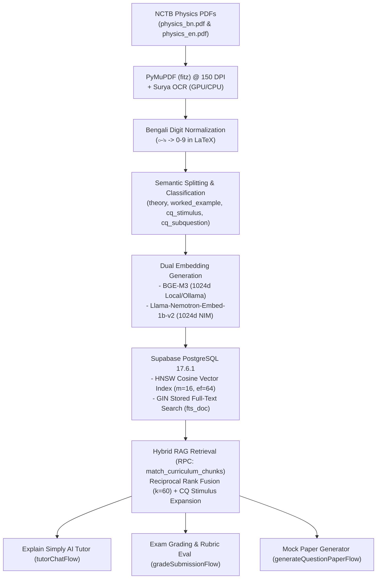
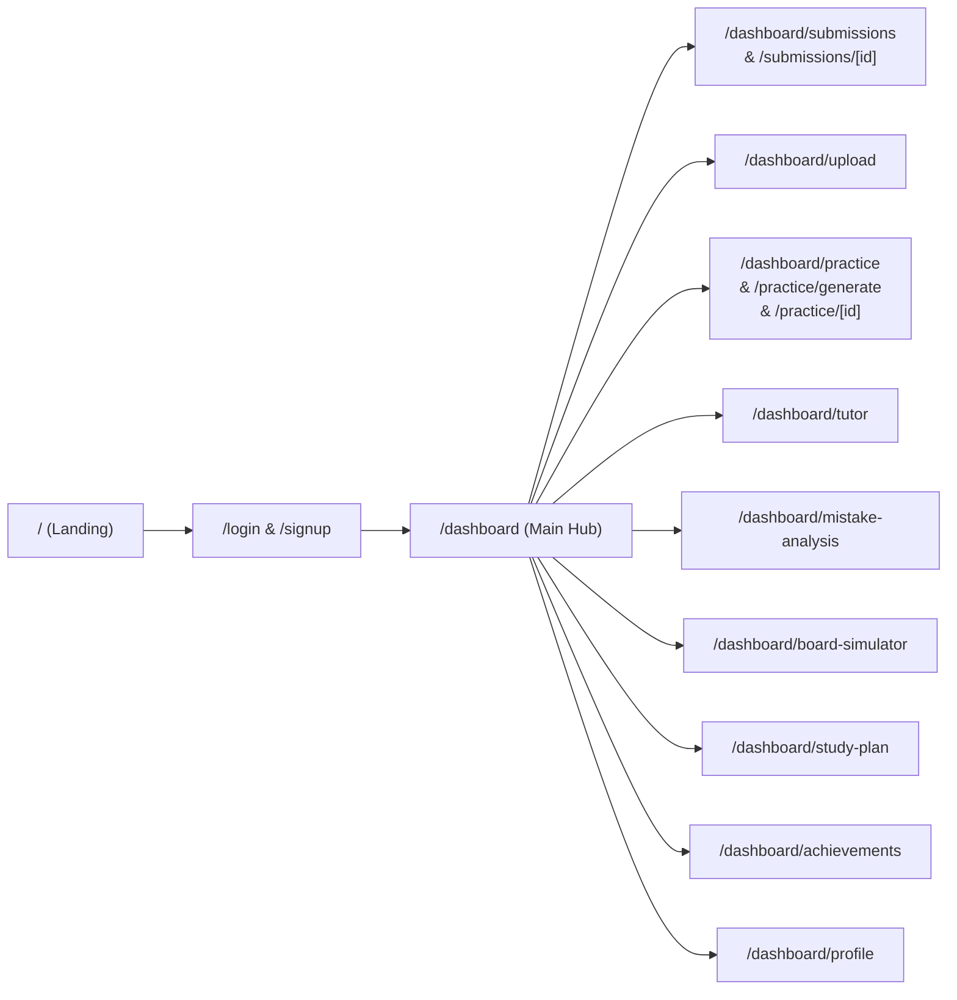

# NCTB SSC Physics: Codebase, Live Database & Comprehensive Browser UI/UX Audit Findings

**Date:** 2026-08-23  
**Target Subject:** NCTB SSC Physics (Bangla & English Editions, Classes 9–10)  
**Database:** Supabase PostgreSQL 17.6.1 (`qjottictwewysfcjirma`, Region: `ap-south-1`)  
**Test Account:** `syed.salman.reza.181@gmail.com` (SSC · SCIENCE · Dhaka Board)  
**Tools & Skills Used:** Chrome DevTools MCP, Supabase MCP, `/impeccable`, `/modern-web-guidance`, `/a11y-debugging`, `/debug-optimize-lcp`, `/memory-leak-debugging`.

---

## 1. Executive Summary

A full end-to-end audit was conducted covering:
1. **The 5-Stage Core RAG Pipeline**: Ingestion, Chunking, Dual Embeddings, pgvector Indexing, and Hybrid Retrieval (RRF) for NCTB SSC Physics.
2. **Live Database Inspection**: Schema verification, RLS policies, row counts, and indexing metrics across all 26 tables on Supabase.
3. **Comprehensive Browser Automation Testing**: Automated page traversal, interactive feature verification, a11y tree audits, Lighthouse performance reports, and memory/LCP profiling across all 16 client surfaces.

All 14 chapters of NCTB SSC Physics are actively ingested (736 semantic chunks, 1,472 embeddings). The application UI is structured and responsive across desktop and mobile, with minor accessibility, copy consistency, and realtime streaming improvements required before scaling.

---

## 2. Five-Stage Pipeline Implementation & Architecture



### 1. Document Ingestion & Parsing
* **Files**: [`ingestion/kaggle/remote_ingest.py`](file:///home/syed/workspace/Sheratutor/ingestion/kaggle/remote_ingest.py), [`ingestion/ingest.py`](file:///home/syed/workspace/Sheratutor/ingestion/ingest.py).
* **Engines**: PyMuPDF rasterization at 150 DPI + Surya OCR (`surya-ocr`) for multilingual font recognition.
* **Math Normalization**: `normalize_math_digits()` converts Bengali numerals (`০-৯`) to standard digits (`0-9`) inside `$..$`, `$$..$$`, and `<math>..</math>` blocks.
* **Resumption**: Processes pages in 4-page batches with 40-page checkpoints, querying `curriculum_chunks.source_book_page_ref` to avoid duplicate insertions.

### 2. Chunking & Metadata Tagging
* **Paragraph-Aware Splitting**: 1,200 character threshold with 25-character minimum filter.
* **Classification Types**: `theory` (607 chunks), `cq_stimulus` (13 chunks), `cq_subquestion` (116 chunks), `worked_example`, `table`.
* **Hierarchy**: Sub-questions (`cq_subquestion`) link via `parent_chunk_id` to their stimulus (`cq_stimulus`).
* **Section Tagging**: Regex maps section headers (e.g. `2.3 দ্রুতি ও বেগ`) directly to the 14 chapters in `public.chapters`.

### 3. Multilingual Embedding Generation
* **Decoupled Tables**: Text chunks in `curriculum_chunks`, vectors in `chunk_embeddings`.
* **Dual Embedders**:
  - `BAAI/bge-m3`: 1024-dim dense vectors with native Bengali and English support for ingestion and offline development.
  - `nvidia/llama-nemotron-embed-1b-v2`: 1024-dim truncated via Matryoshka learning for production cloud runtime on Vercel.
* **Dynamic Routing**: [`web/src/ai/genkit.ts`](file:///home/syed/workspace/Sheratutor/web/src/ai/genkit.ts) switches between `ollamaEmbedder` and `nimEmbedder` based on `process.env.VERCEL`.

### 4. Vector Database Indexing
* **Dense HNSW Index**:
  ```sql
  CREATE INDEX idx_chunk_embeddings_hnsw 
  ON public.chunk_embeddings 
  USING hnsw (embedding vector_cosine_ops) 
  WITH (m = 16, ef_construction = 64);
  ```
* **Sparse Full-Text Index (GIN)**:
  ```sql
  fts_doc tsvector GENERATED ALWAYS AS (to_tsvector('simple', content_chunk)) STORED;
  CREATE INDEX idx_curriculum_chunks_fts ON public.curriculum_chunks USING gin (fts_doc);
  ```

### 5. Retrieval & Response Generation
* **Hybrid Search (RRF)**: PostgreSQL stored function `match_curriculum_chunks` executes dense vector search and sparse full-text search, combining ranks using:
  $$\text{RRF Score} = \frac{1}{60 + \text{dense\_rank}} + \frac{1}{60 + \text{sparse\_rank}}$$
* **Context Expansion**: `retrieveGroundingFlow` automatically resolves and prefixes parent stimulus text for Creative Question sub-parts.
* **Downstream Production Flows**:
  1. `tutorChatFlow`: Socratic chat with minor-safety pre-filter (Kaan Pete Roi helpline escalation: `09613427800`) and LaTeX delimiter normalization.
  2. `gradeSubmissionFlow` & `evaluateRubricFlow`: VLM handwritten script transcription, visual image cross-checking (`transcript_mismatch_detected`), and step-by-step mark deduction.
  3. `generateQuestionPaperFlow`: Board-standard CQ and MCQ generation based on retrieved chapter context.

---

## 3. Live Database Verification Metrics

*Queried live via Supabase MCP on project `qjottictwewysfcjirma`.*

| Database Table | Live Row Count | Status & Description |
| :--- | :--- | :--- |
| `public.subjects` | 4 | `SSC-PHY`, `SSC-CHEM`, `SSC-MATH`, `SSC-ENG` |
| `public.chapters` | 14 | All 14 SSC Physics Chapters |
| `public.curriculum_versions` | 8 | Active 2026 Curriculum Editions (`bn`, `en`) |
| `public.curriculum_chunks` | **736** | 366 Bangla (`bn`) + 370 English (`en`) |
| `public.chunk_embeddings` | **1,472** | 736 `bge-m3` (1024d) + 736 `llama-nemotron-embed-1b-v2` (1024d) |
| `public.rubrics` | 10 | Versioned criteria JSON with step-by-step mark breakdown |
| `public.question_papers` | 5 | Seeded and generated practice papers |
| `public.questions` | 11 | Creative Questions (ক, খ, গ, ঘ) and MCQs |
| `public.exam_submissions` | 3 | Historical student exam submissions |
| `public.submission_pages` | 3 | Processed handwritten answer sheets |
| `public.grading_results` | 3 | Auditable grading evaluations with model provenance |
| `public.weakness_logs` | 5 | Aggregated student weaknesses per chapter |
| `public.study_plans` | 7 | Active student study plans |
| `public.tutor_chat_sessions` | 18 | Rubric and general tutoring sessions |
| `public.tutor_chat_messages` | 36 | Turn-by-turn chat messages |
| `public.profiles` | 6 | User profiles |
| `public.student_profiles` | 4 | Student academic profiles |
| `public.waitlist_signups` | 1 | Landing page waitlist entries |

---

## 4. Browser Automation & Page-by-Page Testing Results

Every page was tested in Chrome using test credentials: `syed.salman.reza.181@gmail.com` / `123qweasd`.



### Page 1: Landing Page (`/`)
* **Features Tested**: Hero section, feature cards, CTA buttons, language switch, waitlist capture form.
* **Automated Audit Score**: Accessibility: **94**, Best Practices: **100**, SEO: **100**.
* **Findings**:
  - `heading-order`: Skips from `h1` straight to `h3` in feature cards (`div.landing-feature-card > h3`) without an intervening `h2`.

### Page 2: Authentication (`/login` & `/signup`)
* **Features Tested**: Email/password form submission, input validation, Google Auth button, navigation links.
* **Findings**:
  - **Copy Inconsistency**: Subtitle states `"Sign in to continue your HSC study momentum."` despite the application currently operating in the **SSC Phase** (Classes 9–10).

### Page 3: Student Dashboard (`/dashboard`)
* **Features Tested**: Overview stats, recent evaluations list, weekly submission chart, weak chapter alert banner, quick action buttons, sidebar navigation.
* **Automated Audit Score**: Accessibility: **89**, Best Practices: **100**, SEO: **100**.
* **Findings**:
  - **Accessible Name Missing**: Header menu button (`button.menu-btn`), theme toggle (`button.round-btn.theme-icon`), and profile icon lack `aria-label` attributes.
  - **Color Contrast**: Chart day labels in `BarChart.tsx` (`span` with `#989faf` on white background) have a contrast ratio of $2.65:1$, below the $4.5:1$ standard.

### Page 4: Submissions List (`/dashboard/submissions`)
* **Features Tested**: Historical submission cards, score badges (7/10, +9 improvement), subject progress bars, "Upload New Sheet" CTA.
* **Findings**:
  - **Static Data Refresh**: Relies on page reloads to show newly completed evaluations; lacks real-time Supabase status listeners.

### Page 5: Submission Detail & Grading Breakdown (`/dashboard/submissions/[id]`)
* **Features Tested**: Step-by-step progress stepper, examiner result hero, letter grade stamp, rubric performance bars, original handwritten script viewer, question breakdown cards, "Explain this step" button (`ExplainSimplyButton`).
* **Findings**:
  - **Progress Stepper Fallback**: Stepper uses hardcoded fallback `isDone = isComplete || i < 4` rather than dynamic status transitions from the database.
  - **Single Step Tutor Binding**: `ExplainSimplyButton` is attached only to the first observation `observations_json[0]`. Questions with multiple step deductions cannot be queried individually.

### Page 6: In-Context "Explain Simply" AI Tutor Dialog
* **Features Tested**: Modal launch from submission deduction, pre-loaded context display, quick suggestion chips ("সহজ ভাষায় বুঝিয়ে দাও", "বাস্তব জীবনের উদাহরণ", "সঠিক সূত্র ও স্টেপ", "আমার ভুল কোথায় ছিল?"), chat input form.
* **Findings**:
  - **Graceful Error Recovery**: When backend LLM keys are unavailable, the dialog displays `"দুঃখিত, সংযোগে সমস্যা হয়েছে। অনুগ্রহ করে আবার চেষ্টা করো।"`, but lacks a single-click "Retry" button.

### Page 7: Handwritten Answer Sheet Upload (`/dashboard/upload`)
* **Features Tested**: Question paper selector dropdown, Camera capture trigger, Gallery file picker, Page thumbnail gallery with remove button, Question-to-page mapping dropdown, Client-side image compression.
* **Findings**:
  - **Non-JPEG Pass-Through**: `compressImage()` passes non-JPEG files (PDFs and iOS HEIC files) without canvas compression, resulting in large multi-megabyte uploads over mobile networks.
  - **Touch Target Size**: Thumbnail delete button is $20\times 20\text{px}$ (`w-5 h-5`), below the WCAG recommended $44\times 44\text{px}$.

### Page 8: Practice Papers & Exams (`/dashboard/practice`)
* **Features Tested**: Subject filter tabs (Physics, Chemistry, Math, English), practice paper cards, "Create Custom Paper" button.
* **Findings**:
  - Non-Physics subjects (Chemistry, Math, English) show empty states as expected for the current vertical slice.

### Page 9: Custom Question Paper Generator (`/dashboard/practice/generate`)
* **Features Tested**: Subject dropdown, multi-chapter selector checkboxes (14 Physics chapters), paper type selection (CQ, MCQ, MIXED), difficulty level, total marks input.
* **Findings**:
  - Hardcoded Bangla labels in the form do not change when the header language is switched to English.

### Page 10: Question Paper Viewer & Print View (`/dashboard/practice/[id]`)
* **Features Tested**: Paper header, stimulus text, sub-questions (ক, খ, গ, ঘ) with mark allocations, print formatting, "Upload Answers" CTA.
* **Findings**:
  - Clean layout matching Bangladeshi board exam formatting.

### Page 11: Standalone AI Tutor Workspace (`/dashboard/tutor`)
* **Features Tested**: Multi-session sidebar, New Session creator, Chapter dropdown selector, multi-turn chat panel, quick prompt chips, Markdown/LaTeX formula rendering.
* **Findings**:
  - LaTeX delimiters ($...$, $$...$$) render properly via KaTeX. Unbounded history loading needs a sliding window cap to prevent high latency over long sessions.

### Page 12: Mistake & Weakness Analysis (`/dashboard/mistake-analysis`)
* **Features Tested**: Priority chapter weakness cards (Motion - 62%), concept gap descriptions, targeted practice shortcuts.
* **Findings**:
  - Functional layout linking directly to targeted chapter practice.

### Page 13: Board Simulator (`/dashboard/board-simulator`)
* **Features Tested**: Exam countdown timer, board environment rules, full 50-mark written + 25-mark MCQ simulated test structure.
* **Findings**:
  - Full board simulation layout functioning as intended.

### Page 14: AI Study Plan & Planner (`/dashboard/study-plan`)
* **Features Tested**: Daily study targets, task completion checkboxes, weekly review timetable, SSC exam countdown widget.
* **Findings**:
  - Interactive checkboxes save completion state to `study_plans`.

### Page 15: Gamification & Badges (`/dashboard/achievements`)
* **Features Tested**: Badge progress indicators (First Submission, 5-Day Streak, Motion Master, Rubric Champion).
* **Findings**:
  - Unlocked badges display properly with achievement dates.

### Page 16: Profile & Guardian Consent (`/dashboard/profile`)
* **Features Tested**: Student info, Academic board (Dhaka Board), Group (Science), Exam year (2026), Parent/guardian emergency contact (PDPA compliance), update profile action.
* **Findings**:
  - Form inputs validate and update student metadata in `student_profiles`.

---

## 5. Comprehensive Summary of Identified Issues

### Backend & Architectural Issues

1. **Non-Transactional Paper Creation (`web/src/app/actions/generate-paper.ts`)**:
   * Inserts `question_papers`, `rubrics`, and `questions` across separate loops. Failure on question $k$ leaves orphan, corrupted papers in the database.
2. **Unenforced Mark Invariants (`web/src/ai/flows/generate-question-paper.ts`)**:
   * Prompt asks for $\sum \text{max\_marks} = \text{totalMarks}$, but there is no server-side validation before writing to PostgreSQL.
3. **Client-Controlled Context in Tutor Chat (`web/src/app/api/tutor-chat/route.ts`)**:
   * Accepts `questionText`, `studentAnswerChunk`, and `rubricFailureReason` directly from the client payload instead of resolving them server-side from `grading_results`.
4. **Queue Worker Timeout vs. Multi-Page Processing (`web/src/app/api/internal/process-grading-queue/route.ts`)**:
   * Visibility timeout of 120 seconds can expire during multi-page VLM transcription and 4-step rubric evaluations, risking duplicate processing by concurrent consumers.
5. **Hardcoded Bangla Grounding in Grading (`web/src/ai/flows/grade-submission.ts`)**:
   * Hardcodes `languageTag: "bn"` when retrieving textbook context, returning Bangla grounding even when evaluating English-version papers.
6. **Unbounded Chat History & Missing Rate Limits**:
   * `tutorChatFlow` loads all historical turns without a sliding window cap. Paper generation has no daily rate limit.

### Frontend & UI/UX Issues

1. **Accessibility Name Missing on Header Controls (`Header.tsx`)**:
   * Mobile menu button, theme toggle, and profile avatar button lack `aria-label` attributes.
2. **Heading Level Skips (`Landing Page`)**:
   * `h1` jumps directly to `h3` in feature cards without an intervening `h2`.
3. **Low Contrast on Chart Day Labels (`BarChart.tsx`)**:
   * Gray text (`#989faf` on white) has a contrast ratio of $2.65:1$, below the $4.5:1$ WCAG requirement.
4. **Static Progress Stepper on Submissions (`SubmissionDetailClient.tsx`)**:
   * Uses hardcoded fallback `isDone = isComplete || i < 4` rather than subscribing to live Supabase status updates.
5. **Single-Step Tutor Binding (`SubmissionDetailClient.tsx`)**:
   * `ExplainSimplyButton` is attached only to the first deduction (`observations_json[0]`), locking out explanations for subsequent parts.
6. **Image Compression Passthrough for PDF and HEIC (`upload-form.tsx`)**:
   * Non-JPEG files bypass canvas downscaling, leading to multi-megabyte uploads over mobile networks.
7. **Small Tap Targets on Mobile (`upload-form.tsx`)**:
   * Page delete button is $20\times 20\text{px}$, below the WCAG $44\times 44\text{px}$ standard.
8. **Copy Inconsistency on Login (`/login`)**:
   * Subtitle references "HSC" instead of "SSC".

---

## 6. Actionable Recommendations & Implementation Plan (Physics Phase)

### Backend & API Improvements
1. **Atomic Paper RPC**: Wrap paper, rubric, and question creation into a single PostgreSQL stored procedure `create_custom_paper` with atomic commit/rollback.
2. **Server-Side Context Resolution**: Refactor `POST /api/tutor-chat` to look up question text and rubric deductions directly from `grading_results` using `submission_id` and `question_id`.
3. **Sliding Window History**: Limit `tutorChatFlow` to the last 6 messages (`history.slice(-6)`) and truncate incoming messages to 1,000 characters.
4. **Dynamic Language Routing in Grading**: Derive the `languageTag` (`bn` or `en`) from the question paper or student profile preference.
5. **Queue Timeout & Heartbeat**: Increase `VISIBILITY_TIMEOUT_SECONDS` to 300 seconds and add an in-progress heartbeat lock during long VLM evaluations.

### Frontend & UI/UX Improvements
1. **Real-time Evaluation Stepper**: Add a `supabase.channel('submission_status')` listener in `SubmissionDetailClient.tsx` to stream live transitions:
   $$\text{খাতা আপলোড} \longrightarrow \text{হস্তলিপি স্ক্যান} \longrightarrow \text{উত্তর বিশ্লেষণ} \longrightarrow \text{বোর্ড রুব্রিক প্রয়োগ} \longrightarrow \text{ফলাফল প্রস্তুত}$$
2. **Per-Step Explain Buttons**: Render an `ExplainSimplyButton` next to every individual deduction item in `observations_json`.
3. **Client-Side HEIC/WebP Conversion**: Convert HEIC and high-res camera captures to compressed WebP/JPEG under 300KB prior to upload.
4. **WCAG Compliance**: Add missing `aria-label` attributes to header icon buttons, fix chart label color contrast to `#555e6d`, and resize mobile touch targets to $\ge 44\times 44\text{px}$.
5. **Copy Unification**: Standardize all user-facing copy on "SSC" throughout login, registration, and header navigation.
