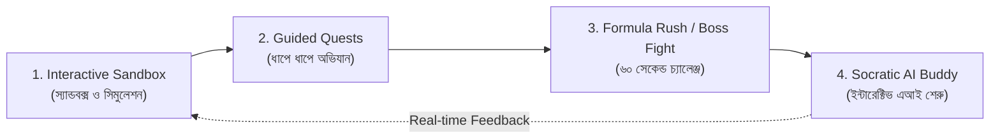

# SheraTutor Playground: Interactive Study Material Architecture
## *Making NCTB Math Addictive, Visual, and Fun for Class 9–10 Students*

> **Document Type:** Master Product Specification & Engineering Blueprint  
> **Target Audience:** Class 9–10 SSC Bangladeshi Students & Educators  
> **First Subject:** General Mathematics (সাধারণ গণিত — All 17 NCTB Chapters)  
> **Status:** Phase 1 (Ch 1) & Phase 2 (Ch 2) Completed & Live; Phase 3 (Ch 3) In Progress  

---

## 1. Executive Summary & Product Thesis

### The Core Problem in Bangladesh
Traditional NCTB textbooks and commercial guidebooks (Panjeree, Anupam, Jupiter) suffer from three critical flaws:
1. **Passive Memorization (মুখস্থ নির্ভরতা):** Students memorize formulas like $(a+b)^2 = a^2 + 2ab + b^2$, $\sin^2\theta + \cos^2\theta = 1$, or $V = \pi r^2 h$ as sterile strings of symbols without ever seeing *why* they work.
2. **Dense, Intimidating Walls of Text:** Guidebooks present 800+ pages of monochrome text. When students flip open a chapter, their cognitive load spikes and motivation plummets.
3. **Disconnected Creative Questions (CQ):** Students can solve standard textbook drill problems, but freeze when presented with Board Creative Questions (CQ) where parts (ক), (খ), and (গ) test deep spatial, geometric, or algebraic intuition.

### The Playground Vision
**SheraTutor Playground (গণিত খেলার মাঠ)** transforms static textbook chapters into **interactive, visual micro-sandboxes**. 
* Instead of reading about sets, students **physically toggle boolean operations on a live glowing Venn diagram** and watch formulas update in real time.
* Instead of memorizing power set counts, students **adjust element counts to watch $2^n$ combinatorial subsets branch out visually**.
* A friendly, embedded **Socratic AI Companion ("শেরু" / Sheru)** watches the student's sandbox actions in real time, delivering contextual hints in natural Bangla when they get stuck.
* A top-level toggle switch instantly switches between the **Interactive Playground** and the **NCTB Board Master & Problem Solver Guide**.

---

## 2. The 4-Pillar Pedagogical Framework

### Pillar 1: Visual Interactive Sandbox (স্যান্ডবক্স)
* **Zero Passive Reading:** Every concept begins with an interactive artifact (sliders, draggable vertices, toggle switches, or balance scales).
* **Cause & Effect:** Changing a slider instantly recalculates and animates the corresponding mathematical entity, bridging algebraic symbols with visual reality.

### Pillar 2: Guided Quests (অভিযান)
* Each chapter is broken down into **3 to 5 bite-sized interactive quests** (5–8 minutes each).
* **Predict-First Mechanics:** Students explore concepts dynamically before formalizing mathematical notation.

### Pillar 3: Boss Battle & Formula Rush (চ্যালেঞ্জ ও বসের সাথে যুদ্ধ)
* Fast-paced, gamified 60-second micro-challenges testing pattern recognition and formula mastery.
* Streak multipliers, sound effects, confetti bursts, and collectible NCTB mastery badges (e.g. *বাস্তব সংখ্যা বিশারদ*, *সেট ও ফাংশন অধিনায়ক*).

### Pillar 4: Socratic AI Companion ("শেরু" / Sheru)
* Embedded floating avatar at the corner of the canvas.
* Gives warm, humorous, Socratic hints in natural colloquial Bangla via `/api/tutor-chat`.

---

## 3. Class 9–10 General Math: 17-Chapter Interactive Blueprint

### Group A: Algebra (বীজগণিত)

| Ch # | Chapter Name (NCTB) | Status | Interactive Playground Concept |
| :--- | :--- | :---: | :--- |
| **১** | **বাস্তব সংখ্যা (Real Numbers)** | ✅ Live | Number Classification Lab, Recurring Decimal Decoder, Geometric $\sqrt{2}$ Compass, Sieve of Eratosthenes, 60s Boss Rush. |
| **২** | **সেট ও ফাংশন (Sets & Functions)** | ✅ Live | Venn Island Sandbox, Power Set $2^n$ Generator, De Morgan Dual Mirror, Function Machine Conveyor with zero-division error alert, 60s Boss Rush. |
| **৩** | **বীজগাণিতিক রাশি (Algebraic Expressions)** | ✅ Live | Geometric Tile Slicer for $(a+b)^2$, $x + 1/x$ Symmetrical Power Ladder, Middle-Term Factor Splitter, Remainder Theorem Vanishing Root, 60s Boss Rush. |
| **৪** | **সূচক ও লগারিদম (Exponents & Logs)** | ✅ Live | Paper Fold to the Moon ($2^n$), Richter Scale & Sound Decibel logarithmic compressor, Base-Exponent Power Balancer, Scientific Notation Lab, 60s Boss Rush. |
| **৫** | **এক চলকবিশিষ্ট সমীকরণ (Equations in One Variable)** | ⏳ Next | Two-pan physical balance scale with draggable weight blocks, Quadratic Discriminant particle collider, Extraneous Root detector. |
| **১১** | **বীজগাণিতিক অনুপাত ও সমানুপাত (Ratio & Proportion)** | Planned | Scalable recipe sandbox discovering componendo-dividendo (যোজন-বিয়োজন) visually. |
| **১২** | **দুই চলকবিশিষ্ট সরল সহসমীকরণ (Simultaneous Equations)** | Planned | Dual laser intersection on a coordinate plane discovering unique vs infinite vs no solution. |
| **১৩** | **সসীম ধারা (Finite Series)** | Planned | Gauss's staircase block builder snap-to-invert revealing $S_n = \frac{n(n+1)}{2}$. |

### Group B: Geometry & Vectors (জ্যামিতি ও ক্ষেত্রফল)

| Ch # | Chapter Name (NCTB) | Status | Interactive Playground Concept |
| :--- | :--- | :---: | :--- |
| **৬** | **রেখা, কোণ ও ত্রিভুজ (Lines, Angles & Triangles)** | Planned | Triangle vertex bender with live protractor locking sum at $180^\circ$. |
| **৭** | **ব্যবহারিক জ্যামিতি (Practical Geometry)** | Planned | Virtual compass and straightedge construction sandbox with arc-snapping. |
| **৮** | **বৃত্ত (Circle Theorems)** | Planned | Theorem 20 dynamic inspector ($\angle AOB = 2\angle APB$) and tangent perpendicularity. |
| **১৪** | **অনুপাত, সদৃশতা ও প্রতিসমতা (Ratio, Similarity & Symmetry)** | Planned | Shadow projection light source and polygon scaling. |
| **১৫** | **ক্ষেত্রফল সম্পর্কিত উপপাদ্য (Area Theorems)** | Planned | Rotating Pythagorean water wheel completely filling $a^2$ and $b^2$ from $c^2$. |

### Group C: Trigonometry (ত্রিকোণমিতি)

| Ch # | Chapter Name (NCTB) | Status | Interactive Playground Concept |
| :--- | :--- | :---: | :--- |
| **৯** | **ত্রিকোণমিতিক অনুপাত (Trigonometric Ratios)** | Planned | Interactive unit circle with synchronized $\sin, \cos, \tan$ color-coded rods. |
| **১০** | **দূরত্ব ও উচ্চতা (Distance & Elevation)** | Planned | Virtual theodolite surveyor calculating Padma Bridge or Shapla Chattar heights. |

### Group D: Mensuration & Statistics (পরিমিতি ও পরিসংখ্যান)

| Ch # | Chapter Name (NCTB) | Status | Interactive Playground Concept |
| :--- | :--- | :---: | :--- |
| **১৬** | **পরিমিতি (Mensuration)** | Planned | 3D unfolding solids (Cylinder, Cone, Prism) unrolling into 2D nets ($2\pi rh + 2\pi r^2$). |
| **১৭** | **পরিসংখ্যান (Statistics)** | Planned | Dynamic histogram bar stretcher, step-deviation mean calculator, cumulative Ogive curve. |

---

## 4. Current Implementation Status

1. **Chapter 1: বাস্তব সংখ্যা (Real Numbers)**
   - Live URL: `/dashboard/playground/math/1`
   - Quests: 5 complete interactive quests
   - Board Master: 5 pillars (Theory, CQ Breakdown, 3 Model Solutions with $2+4+4$ marks, Examiner Traps, 5-Year Matrix)
   - Verified: 0 console errors via Puppeteer
2. **Chapter 2: সেট ও ফাংশন (Sets & Functions)**
   - Live URL: `/dashboard/playground/math/2`
   - Quests: 5 complete interactive quests (Venn, Power Set, De Morgan, Function Machine, Boss Rush)
   - Board Master: 5 pillars ($2^n$ proof, set builder conversion, relation domain/range, examiner traps, 5-Year Matrix)
   - Verified: 0 console errors via Puppeteer
3. **Chapter 3: বীজগাণিতিক রাশি (Algebraic Expressions)**
   - Live URL: `/dashboard/playground/math/3`
   - Quests: 5 complete interactive quests (Geometric Tile Slicer, Symmetrical $x+1/x$ Power Ladder, Middle-Term Factor Splitter, Remainder Theorem Vanishing Root, 60s Algebra Boss Rush)
   - Board Master: 5 pillars (Square/Cube Formulas & Corollaries, CQ Breakdown, 3 Model Solutions with $2+4+4$ marks, Examiner Traps, 5-Year Matrix)
   - Verified: 0 console errors via Puppeteer
4. **Chapter 4: সূচক ও লগারিদম (Exponents & Logarithms)**
   - Live URL: `/dashboard/playground/math/4`
   - Quests: 5 complete interactive quests (Paper Fold to the Moon $2^n$, Richter & Sound Decibel logarithmic compressor, Base-Exponent Power Balancer, Scientific Notation Lab, 60s Exponents & Logs Boss Rush)
   - Board Master: 5 pillars (Laws of Exponents & Logs, CQ Breakdown $2+4+4$, 3 Model Solutions: cyclic $p^a=q$, exponent fraction simplification, log identity; Examiner Traps, 5-Year Board Matrix)
   - Verified: 0 console errors via Puppeteer
5. **Chapter 5: এক চলকবিশিষ্ট সমীকরণ (Equations in One Variable)**
   - Status: ⏳ Next in Queue for Phase 5
