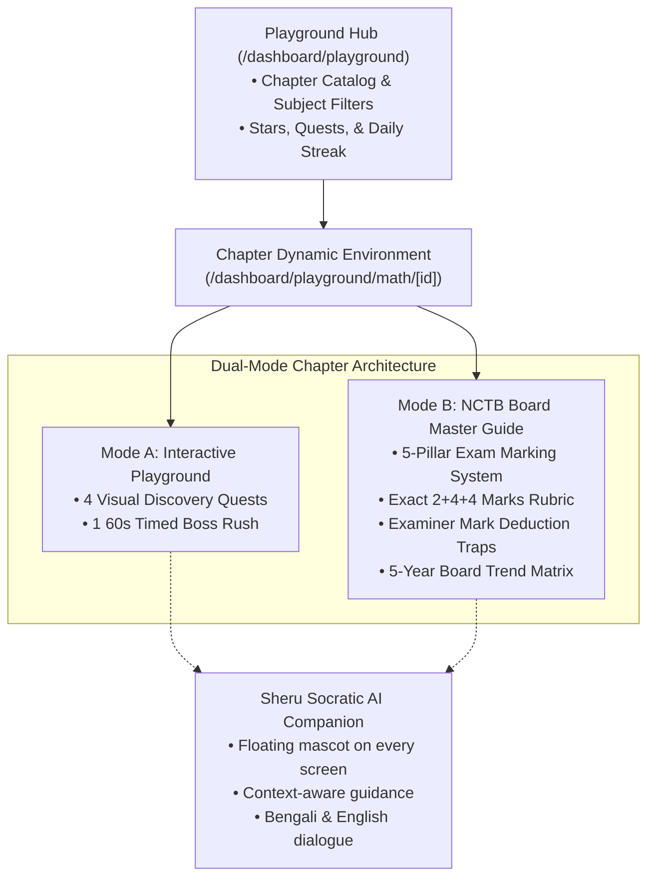

# SheraTutor Playground: Comprehensive Overview & Technical Architecture

> **"Learn Without Memorizing, Play with Real Math!"**  
> *(মুখস্থ না করে আনন্দের সাথে বাস্তব গণিত শেখার ইন্টারেক্টিভ প্ল্যাটফর্ম)*

---

## 1. Executive Summary & Vision

The **SheraTutor Playground** is a dedicated learning platform integrated into SheraTutor (`/dashboard/playground`). Designed for Bangladeshi students preparing for the high-stakes Secondary School Certificate (SSC) and Higher Secondary Certificate (HSC) board examinations, it directly addresses a critical systemic flaw in STEM education: **rote memorization without conceptual or visual understanding**.

Historically, students memorize textbook identities, geometric proofs, and logarithm conversion rules without understanding their foundational intuition. In national board exams, when creative questions (সৃজনশীল প্রশ্ন - CQ) slightly alter coefficients or question framing, students struggle and lose marks.

The SheraTutor Playground bridges this gap by merging:
1. **Interactive Micro-Sandboxes (Tactile Discovery):** Hands-on visual experiments (e.g. geometric tile slicers, paper folding rockets, physical balance beams).
2. **NCTB Board Master Guide (Exam Grounding):** Detailed, step-by-step marking rubrics reflecting the official $2+4+4 = 10$ marks allocation used by national board examiners.
3. **Sheru Socratic AI Companion:** A context-aware mascot that offers guidance, conceptual explanations, and trap warnings in student-friendly Bengali and English without spoiling solutions.

---

## 2. Core Tripartite System Architecture

---

## 3. Playground Hub (`/dashboard/playground`)

The Hub serves as the central game lobby and study center:

### Key Hub Features:
* **Subject Track Selector:**
  * **General Math (Class 9–10)** — *Active (Chapter 1)*
  * **Physics (Class 9–10)** — *Active (Chapter 1: ভৌত রাশি ও পরিমাপ, Chapter 2: গতি, Chapter 3: বল, Chapter 4: কাজ, ক্ষমতা ও শক্তি)*
  * **Higher Math** — *Upcoming*
  * **Chemistry** — *Upcoming*
  * **Biology** — *Upcoming*
* **Playground v2 (Virtual Interactive Guidebook):**
  * Calm discovery with hideable sidebar, 5-Step Learning Framework (`1 Learn Concept`, `2 See Example`, `3 Try Yourself`, `4 Check Understanding`, `5 Summary`).
  * Direct route at `/dashboard/playground/v2` with drill-down subject cards and chapter selectors.
* **Gamified Metric Trackers:**
  * **Stars Earned:** Dynamic counter across all quests (e.g., $12 / 48$ stars).
  * **Daily Study Streak:** Encourages daily interactive practice.
* **Chapter Grid:**
  * Displays chapter number, bilingual titles (Bangla & English), interactive highlights, star ratings, and playable status (`Playable Now` vs `Upcoming`).

---

## 4. The 5-Pillar NCTB Board Master Guide

To bridge playful discovery with top board exam performance, every chapter includes an examiner-grade **Board Master Guide**:

| Pillar # | Pillar Title | Purpose & Examination Value |
| :---: | :--- | :--- |
| **১** | **Theory & Formulas Vault** | Comprehensive list of textbook definitions, radical conversions, logarithm laws, and essential domain restrictions (e.g., base $a > 0, a \neq 1$, argument $N > 0$, $a^0=1$ requiring $a \neq 0$). |
| **২** | **CQ Question Blueprint ($2+4+4=10$)** | Official anatomy of Creative Questions: Part ক (2 Marks, জ্ঞান ও অনুধাবন), Part খ (4 Marks, প্রয়োগমূলক), and Part গ (4 Marks, উচ্চতর দক্ষতা). |
| **৩** | **Model Board Solutions with Step Rubrics** | Authentic board exam solutions with visual step tags (`[ধাপ ১: ১ নম্বর]`, `[ধাপ ২: ১ নম্বর]`). Includes a 1-click **"Copy Model Solution"** button for revision notes. |
| **৪** | **Examiner Traps & Common Pitfalls** | Alert callouts warning against the exact misconceptions and silly errors where students routinely lose marks. |
| **৫** | **5-Year Board Matrix (২০১৯–২০২৪)** | Systematic recurrence breakdown across all 9 General Education Boards in Bangladesh (Dhaka, Rajshahi, Cumilla, Jashore, Chattogram, Barishal, Sylhet, Dinajpur, Mymensingh). |

---

## 5. Live Chapters Breakdown

### 📘 Chapter 1: বাস্তব সংখ্যা (Real Numbers)
* **Live Route:** `/dashboard/playground/math/1`
* **Interactive Quests:**
  1. **Number Classification Lab:** Interactive tree classifying numbers into Natural ($\mathbb{N}$), Whole, Integers ($\mathbb{Z}$), Rational ($\mathbb{Q}$), and Irrational ($\mathbb{Q}'$).
  2. **Recurring Decimal Decoder:** Slider adjusting non-recurring and recurring digits to visualize why recurring decimals generate 9s and 0s in the denominator ($0.2\dot{4}\dot{5} = \frac{245-2}{990} = \frac{27}{110}$).
  3. **Geometric $\sqrt{2}$ Compass:** Hypotenuse construction on a number line using the Pythagorean theorem ($1^2 + 1^2 = (\sqrt{2})^2$).
  4. **Sieve of Eratosthenes:** Prime number filter eliminating multiples of 2, 3, 5, 7.
  5. **60-Second Real Numbers Boss Rush:** 10 rapid-fire board MCQs testing classification and properties.
* **Board Master Focus:**
  * Proof by contradiction: **"প্রমাণ করো যে, $\sqrt{5}$ একটি অমূলদ সংখ্যা"** (Full 4-step rubric).
  * Recurring decimal conversion to vulgar fractions.
  * Constructing rational and irrational numbers between two real limits.

---

### 📗 Chapter 2: সেট ও ফাংশন (Sets & Functions)
* **Live Route:** `/dashboard/playground/math/2`
* **Interactive Quests:**
  1. **Venn Island Sandbox:** Multi-circle visualizer for $A \cup B$, $A \cap B$, $A \setminus B$, and $(A \cup B)'$.
  2. **Power Set $2^n$ Generator:** Tree generating all subsets and confirming that a set with $n$ elements has $2^n$ subsets.
  3. **De Morgan Dual Mirror:** Parallel visual verification showing that $(A \cup B)' = A' \cap B'$.
  4. **Function Machine Conveyor:** Animated input-output factory testing domain, codomain, range, and triggering an alarm on division by zero ($f(x) = \frac{2x+1}{x-2}$ when $x=2$).
  5. **60-Second Sets Boss Rush:** 10 MCQs on subset counting, relation domain/range, and one-to-one function conditions.
* **Board Master Focus:**
  * Formal inductive proof that if $n(A) = n$, then $n(P(A)) = 2^n$.
  * Tabular calculation of relation Domain and Range ($\text{Dom } R, \text{Range } R$).
  * One-to-one function algebraic proofs ($f(x_1) = f(x_2) \implies x_1 = x_2$).

---

### 📙 Chapter 3: বীজগাণিতিক রাশি (Algebraic Expressions)
* **Live Route:** `/dashboard/playground/math/3`
* **Interactive Quests:**
  1. **Geometric Tile Slicer & Expander:** Partitioning squares into $a^2$, $ab$, $ab$, and $b^2$ to visually prove $(a+b)^2 = a^2 + 2ab + b^2$.
  2. **Symmetrical $x + 1/x$ Power Ladder:** Interactive rung climber deriving $x^2 + 1/x^2$, $x^3 \pm 1/x^3$, and $x^5 \pm 1/x^5$.
  3. **Middle-Term Factor Splitter:** Dual-dial tool matching sum ($p+q=b$) and product ($p \cdot q = ac$).
  4. **Remainder Theorem & Vanishing Root:** Finding root $x=a$ such that $f(a)=0$ to factor polynomials.
  5. **60-Second Algebra Boss Rush:** 10 board MCQs testing square and cube identities.
* **Board Master Focus:**
  * Proof of $x^5 - \frac{1}{x^5} = (x^3 - \frac{1}{x^3})(x^2 + \frac{1}{x^2}) - (x - \frac{1}{x})$.
  * Cyclic identity proof: If $a+b+c = 0$, prove $a^3 + b^3 + c^3 = 3abc$.
  * Cubic polynomial factorization via the Factor Theorem.

---

### 📕 Chapter 4: সূচক ও লগারিদম (Exponents & Logarithms)
* **Live Route (Version 2 Guidebook):** `/dashboard/playground/v2/math/4`
* **Live Route (Version 1 Quest Arena):** `/dashboard/playground/math/4`
* **Version 2 Interactive Labs (5-Step Learning Framework):**
  1. **সূচকের মৌলিক নিয়মাবলি ও ঘাত স্কেল ল্যাব (Laws of Indices & Exponent Power Scale):** Base selector ($a \in [2, 3, 5, 10]$), exponent slider ($n \in [-4, 4]$), $a^0 = 1$ ($a \neq 0$) zero-power alert, $a^{-n} = 1/a^n$ division ladder visualizer, 5 NCTB fundamental index laws, and fractional exponent radicals ($a^{m/n} = \sqrt[n]{a^m}$).
  2. **লগারিদমের রূপান্তর তুলাদণ্ড ল্যাব (Logarithm Definition & Balance Machine):** Two-way converter ($a^x = N \iff x = \log_a N$), two-pan physical balance beam, and domain safety sentinel exposing base $a=1$ and negative/zero $N \le 0$ traps.
  3. **লগের গুণ, ভাগ ও ভিত্তি পরিবর্তন ল্যাব (Laws of Logarithms & Change of Base):** $\log_a(MN) = \log_a M + \log_a N$, $\log_a(M/N) = \log_a M - \log_a N$, change of base $\log_a b = \frac{\log_k b}{\log_k a}$, and side-by-side numerical comparison proving fatal trap $\log(M+N) \neq \log M + \log N$.
  4. **সূচকীয় সমীকরণ সমাধানকারী ল্যাব (Exponential Equations Solver):** Live solvers for 4 classic board models ($4^x = 8$, $2^{x+7} = 4^{x+2}$, $(\sqrt{3})^{x+1} = (\sqrt[3]{3})^{2x-1}$, and quadratic substitution $2^{2x+1} - 9 \cdot 2^x + 4 = 0$).
  5. **বৈজ্ঞানিক রূপ, পূর্ণক ও অংশক ল্যাব (Scientific Notation, Characteristic & Mantissa):** Real-time scientific notation converter ($N = A \times 10^n$), characteristic integer / bar notation ($\bar{k}$), non-negative mantissa guarantee ($0 \le m < 1$), and negative logarithm mantissa trap analyzer ($\log N = -2.4621 \implies \bar{3}.5379$).
* **Board Master Focus:**
  * 3 Worked Board CQs with step-by-step solutions, marking rubrics, and Examiner Secrets.
  * 3 Numeric Challenges with instant KaTeX validation ($2^{x+4} = 32$, $\log_4 2$, $5^0 + 5^{-1}$).
  * 5 Board-Standard MCQs with detailed explanations.
  * 6 Comprehensive Formula Cards, 4 Examiner Traps, 1-Click Note Copy, and Sheru Socratic AI Companion.

---

### 📐 Chapter 5: এক চলকবিশিষ্ট সমীকরণ (Equations in One Variable)
* **Live Route (Version 2 Guidebook):** `/dashboard/playground/v2/math/5`
* **Version 2 Interactive Labs (5-Step Learning Framework):**
  1. **সমীকরণ বনাম অভেদ তুলাদণ্ড ল্যাব (Equation vs Identity Balance Scale):** Physical balance scale with live $x$ slider demonstrating equilibrium conditions ($2x + 3 = 7$ balances only at $x=2$ vs $(x+1)^2 \equiv x^2 + 2x + 1$ balances for all $x$), plus 5 foundational differences matrix.
  2. **একঘাত সমীকরণ ও পক্ষান্তর বিধি ল্যাব (Linear Equations & Transposition Rules):** Step-by-step transposition mechanics ($ax + b = c \implies x = \frac{c-b}{a}$) preserving mathematical equality under addition, subtraction, multiplication, and division.
  3. **দ্বিঘাত সমীকরণ ও নিশ্চায়ক কোলাইডার ল্যাব (Quadratic Equations & Discriminant Collider):** Sridhar Acharya formula $x = \frac{-b \pm \sqrt{b^2 - 4ac}}{2a}$ with discriminant $D = b^2 - 4ac$ collider demonstrating rational, irrational, equal ($D=0$), and complex roots ($D < 0$).
  4. **অমূলদ সমীকরণ ও অবান্তর মূল ডিটেক্টর ল্যাব (Radical Equations & Extraneous Root Detector):** Model 1 valid radical equations vs Model 2 trap ($\sqrt{x-3} + 2 = 0 \implies x=7$) demonstrating why squaring introduces extraneous roots and fails verification test, yielding empty set $\emptyset$.
  5. **বাস্তবভিত্তিক সমস্যা ও সমীকরণ গঠন ল্যাব (Word Problems & Mathematical Modeling):** 3 core models for boat & stream effective velocities ($u \pm v$), fraction numerator/denominator adjustments, and pipes & cistern hourly work rates ($1/t$).
* **Board Master Focus:**
  * 3 Worked Board CQs with step-by-step rubrics (Dhaka/Chittagong, Rajshahi/Comilla, Jessore/Dinajpur) and Examiner Secrets.
  * 3 Interactive Numeric Challenges ($3x - 7 = 14 \implies x=7$, discriminant $x^2-5x+6=0 \implies D=1$, $\sqrt{x+5}=4 \implies x=11$).
  * 5 Board-Standard MCQs with instantaneous feedback.
  * 6 Comprehensive Formula Cards, 4 Examiner Traps, 1-Click Note Copy, and Sheru Socratic AI Companion.

---

### ⚛️ Physics Chapter 1: ভৌত রাশি ও পরিমাপ (Physical Quantities & Measurement)
* **Live Route:** `/dashboard/playground/v2/physics/1`
* **Interactive Labs:**
  1. **7 Fundamental SI Units & Multiples Lab:** Exponent scale from Pico ($10^{-12}$) to Tera ($10^{12}$).
  2. **Vernier Calipers Simulator:** Calibrated main scale ($M$) and vernier scale ($V$) with slide controls ($L = M + V \times VC$).
  3. **Screw Gauge Lab:** Linear scale ($L$) and circular scale ($C$) with pitch and circular division controls ($d = L + C \times LC$).
  4. **Dimensional Analysis Inspector:** Live dimension solver for $[F] = [MLT^{-2}]$ and $[W] = [ML^2T^{-2}]$.
  5. **Percentage Error Propagation Lab:** Sphere and cube measurement error multiplier ($\Delta V / V \approx 3 \times \Delta r / r$).

---

### 🚀 Physics Chapter 2: গতি (Motion)
* **Live Route:** `/dashboard/playground/v2/physics/2`
* **Interactive Labs:**
  1. **5 Motion Types & Reference Frame:** Train passenger vs platform observer perspective toggle.
  2. **Distance vs Displacement Vector Lab:** Curved trajectory vs displacement chord & centripetal acceleration stone demo.
  3. **4 Kinematic Equations & Car Simulator:** Live $u, a, t$ control sliders and instantaneous velocity / displacement calculation.
  4. **Galileo Free Fall Twin-Chamber:** Vacuum chamber dropping heavy ball vs light feather with $g = 9.8\text{ m/s}^2$.
  5. **Motion Graph Area Analyzer:** $v-t$ multi-phase trapezoid area calculation ($s = s_1 + s_2 + s_3$).

---

### ⚡ Physics Chapter 3: বল (Force)
* **Live Route:** `/dashboard/playground/v2/physics/3`
* **Interactive Labs:**
  1. **Bus Passenger Inertia Simulator:** Accelerating vs sudden braking passenger tilt angles & mass as inertia measure.
  2. **Newton's 2nd Law & F=ma Accelerator:** Force ($F$), mass ($m$), and floor friction ($f_k$) sliders ($F_{\text{net}} = F - f_k = ma$).
  3. **Newton's 3rd Law & Gun Recoil:** Bullet mass ($m$, g), bullet velocity ($v$, m/s), and rifle mass ($M$, kg) sliders ($V = -\frac{mv}{M}$).
  4. **Conservation of Momentum & 2-Car Collision:** Head-on car and truck collision with combined velocity badge ($V = \frac{m_1u_1 + m_2u_2}{m_1 + m_2}$).
  5. **4 Types of Friction Explorer:** Static, sliding, rolling, and fluid friction characteristics and ways to minimize/maximize friction.

---

### 🔋 Physics Chapter 4: কাজ, ক্ষমতা ও শক্তি (Work, Power & Energy)
* **Live Route:** `/dashboard/playground/v2/physics/4`
* **Interactive Labs:**
  1. **Work & Vector Angle Lab:** Interactive applied force ($F$), displacement ($s$), and angle ($\theta \in [0^\circ, 180^\circ]$) sliders calculating $W = Fs \cos\theta$ with real-time classification into positive, zero, and negative work.
  2. **Kinetic Energy & Momentum Lab:** Mass ($m$) and velocity ($v$) sliders visualizing rolling motion and verifying $E_k = \frac{1}{2}mv^2 = \frac{p^2}{2m}$ and work-energy theorem ($W = \Delta E_k$).
  3. **Spring Elastic Potential Energy Lab:** Spring constant ($k$) and compression distance ($x$) sliders with animated coiled spring calculating stored potential energy $E_p = \frac{1}{2}kx^2$.
  4. **Conservation of Mechanical Energy Free Fall Tower:** Drop height ($H$) and mass ($m$) sliders with animated falling ball and proportional real-time energy bars demonstrating $E_p + E_k = mgH = \text{const}$ at all altitudes.
  5. **Water Pump Motor Efficiency Lab:** Motor power ($P_{\text{in}}$, kW), water volume ($V$, L), tank height ($h$), and time ($t$, min) sliders calculating $P_{\text{out}} = \frac{mgh}{t}$ and efficiency $\eta = \frac{P_{\text{out}}}{P_{\text{in}}} \times 100\%$ with rooftop tank filling animation.

---

### 🌊 Physics Chapter 5: পদার্থের অবস্থা ও চাপ (States of Matter & Pressure)
* **Live Route:** `/dashboard/playground/v2/physics/5`
* **Interactive Labs:**
  1. **Pressure & Density Simulator:** Applied force ($F$) and contact area ($A$) sliders calculating $P = F/A$ with realistic presets (flat shoe, high-heel, elephant foot, pin) and material density analyzer ($\rho = m/V$).
  2. **Liquid Pressure & Depth Lab:** Liquid depth ($h$) and density ($\rho$) sliders calculating hydrostatic pressure $P = h\rho g$ with fluid selector (kerosene, pure water, saline, mercury).
  3. **Archimedes' Principle & Buoyancy Lab:** Object density and volume sliders with interactive submerge toggle demonstrating $F_B = V_{\text{sub}}\rho_{\text{liq}}g$, floating condition $\frac{V_{\text{sub}}}{V} = \frac{\rho_{\text{obj}}}{\rho_{\text{liq}}}$, and apparent weight in fluid.
  4. **Pascal's Hydraulic Press Multiplier Lab:** Small and large piston radii sliders and input force slider demonstrating force amplification factor ($A_2/A_1 = r_2^2/r_1^2$), car lifting animation, and work conservation ($W_1 = W_2$).
  5. **Hooke's Elasticity & Young's Modulus Lab:** Wire material selector (steel, copper, glass, bone), length, diameter, and hanging mass sliders calculating elongation ($\Delta L = \frac{FL}{AY}$), stress, and strain.

---

### 🔥 Physics Chapter 6: বস্তুর ওপর তাপের প্রভাব (Effect of Heat on Matter)
* **Live Route:** `/dashboard/playground/v2/physics/6`
* **Interactive Labs:**
  1. **Temperature Scales & Kinetic Molecular Speed Lab:** Three synchronized thermometers (Celsius, Fahrenheit, Kelvin) with formula $C/5 = (F-32)/9 = (K-273)/5$, instant presets ($-40^\circ$ coincidence point, $0^\circ\text{C}$ ice point, $37^\circ\text{C}$ body, $100^\circ\text{C}$ steam), and 15-particle kinetic speed visualization.
  2. **Solid Thermal Expansion & Railway Track Gap Lab:** Real-time expansion calculator ($\Delta L = \alpha L_1 \Delta T, \beta=2\alpha, \gamma=3\alpha$) across copper, steel, aluminum, brass, and invar with live rail buckling risk warning banner.
  3. **Liquid Expansion & Anomalous Water Ecology Lab:** Flask expansion sequence ($A \rightarrow B \rightarrow C$, $V_r = V_a + V_g$) and anomalous expansion of water ($0^\circ\text{C}-4^\circ\text{C}$) showcasing the survival of aquatic life beneath a frozen lake surface.
  4. **Calorimetry Heat Exchange Mixer Lab:** Metal selector (copper, iron, lead, silver, gold), mass, and temperature sliders with cold water mixer calculating equilibrium temperature $\theta$ and verifying $Q_{\text{lost}} = Q_{\text{gained}}$.
  5. **Latent Heat Curve & Pressure Cooker Phase Lab:** Energy input slider ($0\text{--}3200\text{ kJ}$) demonstrating 5 phases of ice melting and steam vaporization ($L_f = 3.36 \times 10^5\text{ J/kg}, L_v = 2.26 \times 10^6\text{ J/kg}$) and ambient pressure slider ($0.5\text{--}2.0\text{ atm}$) adjusting the boiling point from $85^\circ\text{C}$ (mountain altitude) to $120^\circ\text{C}$ (pressure cooker).

---

### 🌊 Physics Chapter 7: তরঙ্গ ও শব্দ (Waves & Sound)
* **Live Route:** `/dashboard/playground/v2/physics/7`
* **Interactive Labs:**
  1. **Simple Harmonic Motion & Period Lab:** Simple pendulum ($T = 2\pi\sqrt{l/g}$) with Moon ($1.62\text{ m/s}^2$) and Jupiter ($24.79\text{ m/s}^2$) gravity presets, and vertical spring oscillation ($T = 2\pi\sqrt{m/k}$) with Hooke's restoring force $F = -kx$.
  2. **Wave Generator & Characteristic Parameters Lab:** Transverse sine wave generator with frequency ($f$), wavelength ($\lambda$), and amplitude ($A$) adjusting speed $v = f\lambda$ and period $T = 1/f$, alongside longitudinal wave compression/rarefaction slinky simulator with intensity square law $I \propto A^2$.
  3. **Speed of Sound in Mediums & Bell Jar Vacuum Lab:** Sound speed comparison across air, hydrogen, water, iron, and diamond ($v_{\text{solid}} > v_{\text{liquid}} > v_{\text{gas}}$), temperature-speed relation ($v \propto \sqrt{T}$), and bell jar vacuum experiment toggle demonstrating sound cannot propagate in empty space.
  4. **Echo Simulator & Well Depth Lab:** Reflecting obstacle distance slider ($5\text{--}80\text{ m}$) and air temperature slider ($0\text{--}40^\circ\text{C}$) with live "Clap" pulse audio wave animation, calculating total return time $t = 2d/v$ and validating echo audibility against the $0.1\text{ s}$ human persistence of hearing criteria.
  5. **Frequency Spectrum & Ultrasonic SONAR Survey Lab:** Interactive frequency slider ($5\text{ Hz}\text{--}100\text{ kHz}$) spanning infrasound, audible human range ($20\text{ Hz}\text{--}20\text{ kHz}$), ultrasound animal navigation (bats/dolphins), and ocean research vessel SONAR ocean depth survey ($h = vt/2$) with 3D seismic geophone survey.

---

### ☀️ Physics Chapter 8: আলোর প্রতিফলন (Reflection of Light)
* **Live Route:** `/dashboard/playground/v2/physics/8`
* **Interactive Labs:**
  1. **Laws of Reflection & Plane Mirror Lab:** Interactive incident ray slider ($0^\circ\text{--}80^\circ$) proving $\angle i = \angle r$, smooth specular vs rough diffuse reflection toggle, plane mirror virtual image & distance equality ($u = v$), and minimum mirror height rule ($H/2$) for full-length reflection.
  2. **Concave Mirror 6-Position Ray Tracing Lab:** Object position slider ($u = 5\text{--}80\text{ cm}$) with 6 preset positions (infinity, beyond $2f$, at $2f$, between $f$ & $2f$, at $f$, between pole & $f$), dynamic SVG ray tracing with principal focus & center of curvature rays, and live image calculation ($v, |m|$, real/virtual).
  3. **Convex Mirror & Wide Field of View Lab:** Convex mirror ($120^\circ$) vs plane mirror ($45^\circ$) field of view comparison, rear-view vehicle driver blind-spot reduction, and negative focal length convention ($f < 0$).
  4. **Mirror Formula & Magnification Solver Lab:** Dual sliders for focal length and object distance calculating $\frac{1}{u} + \frac{1}{v} = \frac{1}{f} \implies v = \frac{uf}{u - f}$ and linear magnification $m = -v/u = L'/L$ with step-by-step mathematical derivation.
  5. **Dangerous Mountain Curve & Real-World Optical Devices Lab:** Bird's-eye view 90° blind mountain hairpin curve simulator with 45°-angled looking mirror, dentist's concave mirror ($u < f$), solar cooker parallel light concentrator, and vehicle headlight parallel beam generator.

---

### 🔍 Physics Chapter 9: আলোর প্রতিসরণ (Refraction of Light)
* **Live Route:** `/dashboard/playground/v2/physics/9`
* **Interactive Labs:**
  1. **Snell's Law & Refractive Index Lab:** Medium 1 and 2 selector ($n_{\text{air}}=1.00, n_{\text{water}}=1.33, n_{\text{glass}}=1.52, n_{\text{diamond}}=2.42$), incident angle slider ($\theta_1 = 0^\circ\text{--}85^\circ$), live refraction solver ($n_1 \sin\theta_1 = n_2 \sin\theta_2$), light speed display ($v = c/n$), and submerged coin apparent depth simulator ($h' = h \cdot n_1/n_2$).
  2. **Critical Angle & Total Internal Reflection Lab:** Dense-to-rare medium selector, incident angle slider, dynamic 3-case detector ($\theta < \theta_c$ refraction, $\theta = \theta_c$ 90° grazing ray, $\theta > \theta_c$ 100% emerald green total internal reflection), and 2 mandatory board exam rules.
  3. **Optical Fiber, Mirage & Prism Dispersion Lab:** Optical fiber core ($n=1.50$) and cladding ($n=1.45$) zig-zag TIR signal propagation with infrared absorption rationale; 3-layer desert atmospheric gradient mirage simulator creating inverted tree water reflections; and triangular glass prism white light dispersion into 7 spectral colors (VIBGYOR).
  4. **Convex & Concave Lens Ray Tracing Lab:** Dual lens type toggle, object distance ($u$) and focal length ($f$) sliders, 6 classic convex presets ($u > 2f$, $u = 2f$, $f < u < 2f$, $u = f$, $u < f$ magnifying glass), with full SVG optical center $O$, principal foci, parallel and optical center ray tracing with live $v$ and $m$.
  5. **Lens Formula, Power & Eye Defect Corrections Lab:** Eyeball model with cornea, lens, and retina; defect selector for normal vision, Myopia (রেটিনার সামনে ফোকাস $\rightarrow$ concave spectacle $-D$ correction), and Hypermetropia (রেটিনার পেছনে ফোকাস $\rightarrow$ convex spectacle $+D$ correction); and power solver $P = 1/f\text{ (m)} = 100/f\text{ (cm)}$ in Dioptres.

---

### ⚡ Physics Chapter 10: স্থির তড়িৎ (Static Electricity)
* **Live Route:** `/dashboard/playground/v2/physics/10`
* **Interactive Labs:**
  1. **Triboelectric Friction & Humidity Leakage Lab:** Material pair selector (কাচ + রেশম, চিরুনি + পশম, বেলুন + পশম), rub cycles slider, flying electron transfer animation ($e^-$), dry winter (20% RH) vs monsoon (95% RH) atmospheric charge dissipation comparison, and electrostatic attraction paper scraps test.
  2. **Gold-Leaf Electroscope & 4-Step Induction Wizard:** Complete SVG gold-leaf electroscope with brass disc, insulating cork, brass rod, diverging gold leaves ($\theta = 0^\circ \text{--} 65^\circ$), earth grounding toggle, charge rod slider, and 4-step electrostatic induction wizard (Step 1: Bring Rod $\rightarrow$ Step 2: Earthing $\rightarrow$ Step 3: Disconnect Earthing $\rightarrow$ Step 4: Remove Rod leaving permanent opposite charge).
  3. **Coulomb Force Collider & Inverse Square Law Lab:** $F = k \frac{q_1 q_2}{r^2}$ collider with charge sliders ($q_1, q_2$), distance slider ($r = 0.1\text{--}2.0\text{ m}$), dielectric medium selector (vacuum $k=9\times 10^9$, glass $\kappa=5$, water $\kappa=80$), mutual equal-and-opposite force vectors ($\vec{F}_{12}, \vec{F}_{21}$ satisfying Newton's 3rd Law), attraction vs repulsion indicator, and textbook presets.
  4. **Electric Field & Null Point Simulator:** Electric field intensity $E = k \frac{Q}{r^2}$ with 5 polarity presets (dipole $+/-$, like charges $+/+$, textbook $+4\text{ C}/-1\text{ C}$, isolated positive/negative), draggable/slider test charge probe ($q_0 = +1\text{ C}$) calculating resultant $\vec{E}_{\text{net}}$, and exact null point ($E_{\text{net}} = 0$) position solver.
  5. **Electric Potential, Capacitors & Lightning Safety Lab:** 3 sub-modes:
     - Parallel Plate Capacitor ($C = \frac{\varepsilon A}{d}$, $Q=CV$, $U = \frac{1}{2}CV^2$) with area, distance, voltage sliders, and dielectric selector (air vs mica $\kappa=6$).
     - Electric Potential & Charge Flow (Sphere A 24V/6C vs Sphere B 10V/9C with animated connecting wire demonstrating potential difference, not total charge, dictates current direction).
     - Cloud-to-ground lightning discharge simulator with building model, sharp copper lightning rod (action of points), earthing wire, and Faraday cage automobile safety explanation.

---

### 💡 Physics Chapter 11: চল তড়িৎ (Current Electricity)
* **Live Route:** `/dashboard/playground/v2/physics/11`
* **Interactive Labs:**
  1. **Ohm's Law & Drift Electron Circuit Lab:** $V = IR$, $I = V/R$, live SVG circuit with drift electrons whose animated speed scales with current, ammeter and voltmeter needles, polarity inverter toggle, and interactive Ohm's Triangle ($V, I, R$) tooltips.
  2. **Resistivity & Wire Geometry 3D Lab:** $R = \rho \frac{L}{A}$, dynamic 3D cylinder SVG rendering wire length and circular cross-section, temperature slider ($0^\circ\text{C}$ to $100^\circ\text{C}$), metal vs semiconductor (Silicon) negative temperature coefficient comparison, and 5 material presets (রুপা, তামা, টাংস্টেন, নাইক্রোম, সিলিকন).
  3. **Series & Parallel Circuits & Lost Volts Simulator:** Series vs parallel circuit toggle with broken bulb fault injection (শ্রেণি বর্তনীতে একটি বাল্ব নষ্ট হলে সব বন্ধ, সমান্তরাল বর্তনীতে অন্য বাল্ব অক্ষুণ্ণ থাকে), and cell internal resistance simulator ($E = V + Ir$, $v = Ir$, $V = E - Ir$) with terminal voltage drops.
  4. **Power, Billing & Grid Transmission Lab:** Household multi-appliance electricity bill calculator ($W = Pt / 1000$ BOT unit/kWh) in BDT across bulbs, fans, refrigerators, TVs, and air conditioners; and high-voltage grid transmission loss simulator ($P_{\text{loss}} = I^2 R$) showing why stepped-up transmission ($132\text{ kV}$) prevents grid power collapse compared to $220\text{ V}$.
  5. **Household Safety & Bird on Wire Mystery Lab:** NCTB Figure 11.17 Household wiring flow (Meter $\rightarrow$ Main Switch $\rightarrow$ Fuse/MCB $\rightarrow$ Parallel Appliances), live vs neutral switch risk comparison, 3-pin earth grounding chassis leakage protection, and NCTB Exercise Q5 mystery demonstrating why a bird on a single wire experiences $\Delta V = 0\text{ V}$ and is safe while a bat spanning two wires is electrocuted.

---

### 🧮 General Mathematics Chapter 2: সেট ও ফাংশন (Sets & Functions) — Version 2
* **Live Route:** `/dashboard/playground/v2/math/2`
* **Interactive Labs:**
  1. **Set Notations & Types Lab:** Roster vs Set-builder generator, preset conditions, upper limit slider $N$, dynamic element badges with $n(A)$, and finite, infinite, empty ($\emptyset$), and universal ($U$) sets.
  2. **Venn Diagram & Operations Lab:** Universal set $U = \{1, \dots, 10\}$, operations ($A \cup B, A \cap B, A \setminus B, B \setminus A, A', B'$), De Morgan's Laws 1 & 2 live proofs, and Disjoint Mode toggle ($A \cap B = \emptyset$).
  3. **Power Set & $2^n$ Subsets Simulator:** $n = 0\text{--}4$ configurator, dynamic generator for all $2^n$ subsets, proper ($2^n - 1$) vs improper subsets, and empty set power set trap $P(\emptyset) = \{\emptyset\}$ with $2^0 = 1$ element.
  4. **Cartesian Product & Relations Lab:** $A \times B$ grid ($3 \times 3 = 9$ ordered pairs), condition filters ($y = x + 1, x < y, y = 2x, x \ge y$), dynamic $\operatorname{Dom}(R)$ and $\operatorname{Range}(R)$, and SVG Bipartite Arrow Graph.
  5. **Function Machine & Domain-Range Lab:** Mother-Child analogy explaining why each domain element must have a single unique image, linear, quadratic, and rational function calculators with step-by-step arithmetic substitution engine.
* **5-Step Board Framework:** 3 worked board CQs with Examiner Secret Rubrics, 3 instant-feedback mathematical challenges, 5 board-standard MCQs, 6 formula cards, and Socratic AI Tutor drawer.

---

### 🧲 Physics Chapter 12: বিদ্যুতের চৌম্বক ক্রিয়া (Magnetic Effects of Current)
* **Live Route:** `/dashboard/playground/v2/physics/12`
* **Interactive Labs:**
  1. **Oersted Experiment & Right-Hand Thumb Rule Lab:** $B = \frac{\mu_0 |I|}{2\pi r}$, live SVG straight copper wire piercing plane, concentric circular magnetic field lines with directional curling arrows, compass needle with dynamic deflection angle ($\theta = \arctan(B / B_E)$), above vs below wire placement, and polarity reversal East/West deflection indicator.
  2. **Solenoid & Electromagnet Magnetic Domains Lab:** $B = \mu_r \mu_0 \frac{N}{L} I$, turns slider ($N = 5\text{--}50$), current slider ($I = 0\text{--}10\text{ A}$), core material selector (বাতাস $\mu_r=1$, নরম লোহা $\mu_r=1200$, ইস্পাত $\mu_r=150$), microscopic magnetic domain arrows aligning into parallel saturation, and nail attraction test with instant demagnetization upon power cut for soft iron.
  3. **DC Motor & Fleming's Left-Hand Rule Lab:** $F = BIL \sin\theta, \tau = BIA \sin\theta$, permanent horseshoe magnet pole shoes (Red North, Blue South), rotating armature coil with live angular position tracking, split-ring commutator & carbon brushes, Fleming's left hand 3-finger guide, and fault-injection toggle disabling commutator causing motor to stall at $90^\circ$ neutral plane.
  4. **Electromagnetic Induction & AC Generator Lab:** Solenoid coil ($N = 50\text{--}500$), draggable bar magnet with velocity controls, center-zero Galvanometer needle deflection ($\mathcal{E} = -N \frac{d\Phi}{dt}$), Lenz's Law visualizer demonstrating repulsive opposing pole formation upon entry and attractive pole upon withdrawal; alongside rotating AC generator with live sinusoidal oscilloscope waveform.
  5. **Transformer Simulator & High-Voltage Grid Transmission Lab:** Dual-coil transformer with laminated soft iron core ($V_s / V_p = n_s / n_p = I_p / I_s$), Step-Up vs Step-Down status, and textbook fatal DC Battery Trap warning ($d\Phi/dt = 0 \implies V_s = 0\text{ V}$); alongside high-voltage grid transmission analyzer demonstrating why stepped-up transmission ($132\text{ kV}$) cuts heat loss from $1,033\text{ kW}$ down to $2.87\text{ W}$ ($99.99\%$ efficiency).

---

## 6. The Sheru Socratic AI Companion

Present on every playground screen is **Sheru**, the SheraTutor AI mascot:
* **Culturally Grounded:** Speaks in warm, encouraging Bengali and English (*"আরে দোস্ত! আমি শেরু..."*).
* **Context-Aware:** Recognizes the current quest and offers tailored hints.
* **Pre-Set Conceptual Prompts:** Students can ask common questions with one tap (e.g. *"কাগজ ভাঁজ করে সত্যি কি চাঁদে যাওয়া সম্ভব?"*, *"লগের মধ্যে ঋণাত্মক সংখ্যা বসানো যায় না কেন?"*).
* **Socratic Guardrails:** Focuses on conceptual understanding and avoids giving away direct answers during quizzes.

---

## 7. Technical Specifications & Stack

* **Frontend Framework:** Next.js 16 (App Router, Turbopack, React 19).
* **Styling & Design System:** Tailwind CSS v4, Radix UI primitives, Lucide React icons, and custom OKLCH tokens (supporting light and dark themes).
* **Mathematical Rendering:** KaTeX integration via `<RenderMathText />` with safe parsing to prevent JSX syntax collisions.
* **Automated End-to-End Verification:** Full headless Chromium test suite executed via Puppeteer:
  * `web/scripts/e2e-playground-test.mjs` (Math Ch 1)
  * `web/scripts/e2e-ch2-playground-test.mjs` (Math Ch 2 V1)
  * `web/scripts/e2e-ch3-playground-test.mjs` (Math Ch 3)
  * `web/scripts/e2e-ch4-playground-test.mjs` (Math Ch 4)
  * `web/scripts/e2e-math-ch2-complete.mjs` (Math Ch 2 V2 Guidebook)
  * `web/scripts/e2e-math-ch3-complete.mjs` (Math Ch 3 V2 Guidebook)
  * `web/scripts/e2e-math-ch4-complete.mjs` (Math Ch 4 V2 Guidebook)
  * `web/scripts/e2e-physics-v2-complete.mjs` (Physics Ch 1)
  * `web/scripts/e2e-physics-ch2-complete.mjs` (Physics Ch 2)
  * `web/scripts/e2e-physics-ch3-complete.mjs` (Physics Ch 3)
  * `web/scripts/e2e-physics-ch4-complete.mjs` (Physics Ch 4)
  * `web/scripts/e2e-physics-ch5-complete.mjs` (Physics Ch 5)
  * `web/scripts/e2e-physics-ch6-complete.mjs` (Physics Ch 6)
  * `web/scripts/e2e-physics-ch7-complete.mjs` (Physics Ch 7)
  * `web/scripts/e2e-physics-ch8-complete.mjs` (Physics Ch 8)
  * `web/scripts/e2e-physics-ch9-complete.mjs` (Physics Ch 9)
  * `web/scripts/e2e-physics-ch10-complete.mjs` (Physics Ch 10)
  * `web/scripts/e2e-physics-ch11-complete.mjs` (Physics Ch 11)
  * `web/scripts/e2e-physics-ch12-complete.mjs` (Physics Ch 12)
  * **Result:** 0 console errors, 100% test pass rate across all sandboxes and tabs.

---

## 8. Remaining NCTB General Math Roadmap

The 17-chapter curriculum roadmap continues sequentially:
* **Ch 5:** এক চলকবিশিষ্ট সমীকরণ (Equations in One Variable — Two-pan weight balance, Quadratic Discriminant collider, Extraneous Root detector)
* **Ch 6:** রেখা, কোণ ও ত্রিভুজ (Lines, Angles & Triangles — Vertex bender locking sum at $180^\circ$)
* **Ch 7:** ব্যবহারিক জ্যামিতি (Practical Geometry — Virtual compass and straightedge construction)
* **Ch 8:** বৃত্ত (Circle Theorems — Theorem 20 dynamic central vs inscribed angle inspector)
* **Ch 9 & 10:** ত্রিকোণমিতিক অনুপাত ও দূরত্ব (Trig Ratios & Elevation — Unit circle, Padma Bridge laser surveyor)
* **Ch 11:** বীজগাণিতিক অনুপাত ও সমানুপাত (Ratio & Proportion — Scalable recipe discovering componendo-dividendo)
* **Ch 12:** দুই চলকবিশিষ্ট সরল সহসমীকরণ (Simultaneous Equations — Dual laser intersection on coordinate plane)
* **Ch 13:** সসীম ধারা (Finite Series — Gauss's staircase block builder)
* **Ch 16:** পরিমিতি (Mensuration — 3D unfolding solids into 2D nets)
* **Ch 17:** পরিসংখ্যান (Statistics — Dynamic histogram bar stretcher & Ogive curves)
