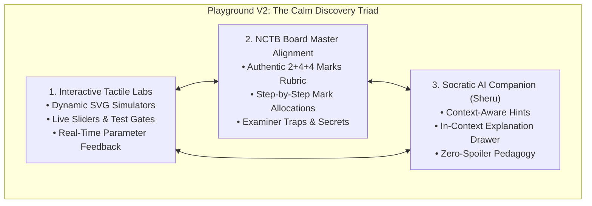
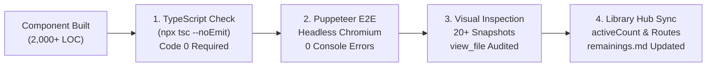

# SheraTutor Playground Version 2: Comprehensive Architecture & Master Guide

> **"শান্ত ও মনোযোগী শিখন — মুখস্থ নয়, দৃষ্টিনির্ভর উপলব্ধি ও শতভাগ বোর্ড প্রস্তুতি"**  
> *(Calm, Focused Learning: Visual Intuition Over Rote Memorization with Complete Board Exam Mastery)*

---

## 1. Executive Summary & Product Vision

**SheraTutor Playground Version 2** (`/dashboard/playground/v2`) is the flagship interactive STEM learning platform within the SheraTutor ecosystem. Engineered specifically for Bangladeshi Secondary School Certificate (**SSC**) and Higher Secondary Certificate (**HSC**) students following the National Curriculum and Textbook Board (**NCTB**) syllabus, Playground V2 redefines how complex mathematical and scientific concepts are mastered.

### The Systemic Educational Challenge in Bangladesh
In traditional Bangladeshi high-school classrooms and coaching centers:
1. **Rote Memorization of Identities & Formulas**: Students memorize algebraic identities, geometric theorems, trigonometric values, and physics formulas without visual intuition.
2. **Fragility in Creative Questions (সৃজনশীল প্রশ্ন - CQ)**: When national board exams introduce a slight variation in question stems or change geometric orientations, students struggle to deduce the underlying principles.
3. **Loss of Marks in Step Deductions**: Students frequently fail to score full marks ($10/10$) in CQs due to missing intermediate statements, unstated conditions (e.g. $a \neq 0$, $a > 0$), or geometric reasoning justifications.
4. **Distraction & Gamification Fatigue**: Early educational apps often overload students with gamified timers, flashing points, and casino-like animations that induce cognitive friction and anxiety rather than deep conceptual focus.

### The Playground V2 Paradigm: "Calm Discovery"
Playground V2 shifts away from noisy gamification to **"Calm Discovery" (শান্ত ও গভীর উপলব্ধি)**. It pairs tactile interactive simulation with the exact marking rubrics of NCTB board examiners through a structured, distraction-free environment.



---

## 2. The Canonical 5-Step Learning Framework

Every single chapter in Playground V2 strictly follows the **Canonical 5-Step Learning Framework**. This standardized progression guides the student from tactile exploration to exam perfection:

```
[ ১. কনসেপ্ট ল্যাব ] ──► [ ২. উদাহরণ দেখুন ] ──► [ ৩. নিজে চেষ্টা করুন ] ──► [ ৪. অনুধাবন যাচাই ] ──► [ ৫. সারসংক্ষেপ ]
 (Learn Concept)         (See Example)          (Try Yourself)         (Check Understanding)       (Summary Vault)
```

### Tab Breakdown & Pedagogical Purpose

| Step # | Tab Label (Bangla) | Tab Label (English) | Core Purpose & Pedagogical Deliverable |
| :---: | :--- | :--- | :--- |
| **১** | **কনসেপ্ট ল্যাব** | **Learn Concept** | **4 to 5 Interactive Micro-Simulators**: Dynamic SVGs, parameter sliders, radio presets, and visual balancers allowing students to experiment with mathematical relationships and observe instant graphical feedback. Embedded with **Examiner Traps** highlighting boundary failures. |
| **২** | **উদাহরণ দেখুন** | **See Example** | **3 Worked Board Creative Questions (CQ)**: Full $2 + 4 + 4 = 10$ marks breakdown from recent Board exams (Dhaka, Chattogram, Rajshahi, Dinajpur, Cumilla, Jashore 2023–2024). Each question features step tags (`[ধাপ ১: ১ নম্বর]`, `[ধাপ ২: ১ নম্বর]`), "Examiner Secrets" (পরীক্ষকের গোপন নির্দেশিকা), and a 1-click clipboard copy of model answers. |
| **৩** | **নিজে চেষ্টা করুন** | **Try Yourself** | **3 Interactive Math & Science Challenges**: Direct problem-solving with numeric inputs, instant validation, green success badges, and progressive step-by-step hint revealers. |
| **৪** | **অনুধাবন যাচাই** | **Check Understanding** | **5 Board Standard MCQs**: Diagnostic multiple-choice questions with immediate radio selection feedback, score counter, and comprehensive bilingual explanations for every single option. |
| **৫** | **সারসংক্ষেপ** | **Summary** | **Formula Bank & Examiner Traps**: Comprehensive formula cheat sheets with 1-click clipboard copy, key definitions, and an **Examiner Pitfall Sentinel** detailing where students lose marks. |

---

## 3. Global Architecture & Platform Navigation

### Platform Routing Hierarchy
All Playground V2 pages reside under `/dashboard/playground/v2`:

```
/dashboard/playground/v2                      -> Guidebook Library Hub (Subject Catalog)
/dashboard/playground/v2/math/[1-17]          -> General Mathematics Chapters 1 to 17
/dashboard/playground/v2/physics/[1-12]       -> Physics Chapters 1 to 12
/dashboard/playground/v2/higher-math/...      -> Higher Mathematics (Upcoming)
/dashboard/playground/v2/chemistry/...        -> Chemistry (Upcoming)
/dashboard/playground/v2/biology/...          -> Biology (Upcoming)
```

### The Guidebook Library Hub (`GuidebookLibraryView.tsx`)
The Library Hub serves as the central command portal for all secondary school subjects:
1. **Subject Summary Cards**:
   - **General Mathematics (`MATH-109`)**: **17 of 17 Chapters Active (100% Complete)**.
   - **Physics (`PHY-136`)**: **12 Chapters Active (86% Complete)**.
   - **Higher Mathematics (`HMATH-126`)**: Syllabus mapped (14 chapters).
   - **Chemistry (`CHEM-137`)**: Syllabus mapped (12 chapters).
   - **Biology (`BIO-138`)**: Syllabus mapped (14 chapters).
2. **Subject Quick Filters**: Interactive pill bar (`All Subjects`, `General Math`, `Physics`, etc.) for instant catalog narrowing.
3. **Comprehensive Chapter Cards**:
   - Chapter number & bilingual title (`অধ্যায় ০১ • বাস্তব সংখ্যা / Real Numbers`).
   - Estimated study duration (`পড়ার সময়: ১৫ মিনিট`).
   - Board exam weighting badge (`বোর্ড পরীক্ষায় মান: ১০ নম্বর`).
   - 5 lesson preview tags indicating the specific sub-topics and interactive labs.
   - Primary action button (`গাইডবুক খুলুন ও পড়ুন` / `Open Guidebook`).

---

## 4. General Mathematics: Complete 17-Chapter Catalog (100% Complete)

General Mathematics is **100% complete** across all 17 chapters of the NCTB Class 9–10 curriculum. Every chapter is built under the canonical 5-step framework and verified with 0 TypeScript and 0 browser console errors.

### Chapter Directory & Interactive Lab Matrix

| Ch # | Chapter Name (Bangla / English) | Component File | Interactive Labs (Step 1) | Board CQs (Step 2) |
| :---: | :--- | :--- | :--- | :--- |
| **01** | **বাস্তব সংখ্যা**<br>*(Real Numbers)* | `RealNumbersGuidebook.tsx` | • Number Classification Universe<br>• $\sqrt{2}$ Irrationality Proof Detective<br>• Recurring Decimal Decoder ($9$s & $0$s)<br>• Red Line Addition/Subtraction | • Dhaka 2024 (Proof of $\sqrt{7}$)<br>• Rajshahi 2023 (Recurring Decimals)<br>• Cumilla 2023 (Real Numbers Limits) |
| **02** | **সেট ও ফাংশন**<br>*(Sets & Functions)* | `MathSetsFunctionsGuidebook.tsx` | • Roster vs Set Builder Method<br>• Venn Diagram Operations & De Morgan<br>• Power Set $P(A)$ & $2^n$ Subsets Proof<br>• Cartesian Product & Relations Grid<br>• Function Machine & Domain-Range | • Dhaka 2024 (Power Sets & Venn)<br>• Jashore 2023 (Domain-Range)<br>• Chattogram 2024 (Relations & Inverses) |
| **03** | **বীজগাণিতিক রাশি**<br>*(Algebraic Expressions)* | `MathAlgebraicExpressionsGuidebook.tsx` | • Geometric Tiles Algebraic Identities<br>• Symmetrical $x \pm 1/x$ Reciprocal Power Ladder<br>• Middle-Term Splitter & Factor Grid<br>• Remainder & Factor Vanishing Machine<br>• Cyclic & Symmetric Permutations ($a \to b \to c$) | • Dhaka 2024 ($x^4 + 1/x^4$ Proof)<br>• Cumilla 2024 (Middle-term CQ)<br>• Rajshahi 2023 (Cyclic Factorization) |
| **04** | **সূচক ও লগারিদম**<br>*(Exponents & Logarithms)* | `MathExponentsLogarithmsGuidebook.tsx` | • Laws of Indices & Power Scale<br>• Logarithm Definition Balance ($a^x = N$)<br>• Log Laws & Fatal Trap Sentinel<br>• Exponential Equations Solver<br>• Scientific Notation & Mantissa Converter | • Dhaka 2024 (Logarithmic Proofs)<br>• Chattogram 2023 (Characteristic/Mantissa)<br>• Dinajpur 2024 (Exponential Equation) |
| **05** | **এক চলকবিশিষ্ট সমীকরণ**<br>*(Equations in One Variable)* | `MathEquationsOneVariableGuidebook.tsx` | • Equation vs Identity Balancer<br>• Linear Equations Transposition Machine<br>• Quadratic Discriminant Collider ($D = b^2 - 4ac$)<br>• Radical Equations Extraneous Root Detector<br>• Speed-Time-Distance Boat Word Problems | • Dhaka 2024 (Extraneous Root Trap)<br>• Cumilla 2023 (Boat-Stream Velocity)<br>• Rajshahi 2024 (Fraction Word Problem) |
| **06** | **রেখা, কোণ ও ত্রিভুজ**<br>*(Lines, Angles & Triangles)* | `MathLinesTrianglesGuidebook.tsx` | • Adjacent & Vertically Opposite Rays<br>• Parallel Lines & Transversal (Z, F, C angles)<br>• Triangle Sum $180^\circ$ & Exterior Angle<br>• 4 Congruence Criteria (SAS, SSS, ASA, RHS)<br>• Pythagoras & Triangle Inequality Collider | • Dhaka 2024 (Angle Bisector CQ)<br>• Jashore 2024 (Congruence Proof)<br>• Dinajpur 2023 (Pythagorean Triplets) |
| **07** | **ব্যবহারিক জ্যামিতি**<br>*(Practical Geometry)* | `MathPracticalGeometryGuidebook.tsx` | • Triangle Construction: Sum of Sides<br>• Difference of Sides Case 1 & Case 2<br>• Perimeter & Base Angles Construction<br>• Quadrilateral 5-Condition Hierarchy<br>• Rhombus Diagonals & Trapezoid Simulator | • Dhaka 2024 (Perimeter Construction)<br>• Chattogram 2024 (Trapezoid CQ)<br>• Rajshahi 2023 (Rhombus Diagonals) |
| **08** | **বৃত্ত**<br>*(Circles)* | `MathCircleGuidebook.tsx` | • Center & Chord Theorems 17, 18, 19<br>• Inscribed vs Central Angle ($\angle BOC = 2\angle BAC$)<br>• Cyclic Quadrilateral Supplementary Angles<br>• Tangents & Secants Pair ($PA = PB$)<br>• Circumcircle, Incircle & Excircle Simulator | • Dhaka 2024 (Theorem 20 & 23)<br>• Cumilla 2024 (Tangents from Exterior Point)<br>• Barishal 2023 (Incircle Construction) |
| **09** | **ত্রিকোণমিতিক অনুপাত**<br>*(Trigonometric Ratios)* | `MathTrigonometryGuidebook.tsx` | • Right Triangle & 6 Ratios ($\sin, \cos, \tan...$)<br>• 3 Fundamental Identities Balancer<br>• Standard Values 5-Finger Technique<br>• Trigonometric Equations ($2\cos^2\theta + 3\sin\theta = 3$)<br>• Complementary Angles Perspective Swap | • Dhaka 2024 (Identity Verification)<br>• Chattogram 2024 (Trig Equation Solve)<br>• Sylhet 2023 (Elimination of $\theta$) |
| **10** | **দূরত্ব ও উচ্চতা**<br>*(Distance & Elevation)* | `MathDistanceElevationGuidebook.tsx` | • Angle of Elevation & Depression Sightline<br>• Tower Height & $30^\circ-45^\circ-60^\circ$ Geometry<br>• River Width Two-Observation Points<br>• Broken Storm Tree / Pole Modeling<br>• Balloon Dual Observation Point Simulator | • Dhaka 2024 (Broken Tree Height)<br>• Rajshahi 2024 (River Width Shortcut)<br>• Dinajpur 2023 (Observation from Moving Ship) |
| **11** | **বীজগাণিতিক অনুপাত ও সমানুপাত**<br>*(Algebraic Ratio & Proportion)* | `MathAlgebraicRatioProportionGuidebook.tsx` | • Ratio & Proportion Cross-Multiplication<br>• Componendo & Dividendo Master Balancer<br>• Continued Proportion & $k$-Method Lab<br>• Compound Ratio "দ" Method & Distribution<br>• Repeated Componendo-Dividendo Radical Solver | • Dhaka 2024 ($k$-Method Proof)<br>• Jashore 2023 (Radical Eq via Componendo)<br>• Cumilla 2024 (Partnership Business Ratio) |
| **12** | **দুই চলকবিশিষ্ট সরল সহসমীকরণ**<br>*(Simultaneous Linear Equations)* | `MathSimultaneousEquationsGuidebook.tsx` | • System Consistency ($a_1/a_2$ vs $b_1/b_2$)<br>• Substitution vs Elimination Step Solver<br>• Cross-Multiplication Determinant Matrix<br>• SVG Cartesian Graph & Intersection Pin<br>• Upstream-Downstream Boat Word Problem | • Dhaka 2024 (Cross-Multiplication Method)<br>• Chattogram 2023 (Graphical Solution)<br>• Barishal 2024 (Boat & Stream Speed) |
| **13** | **সসীম ধারা**<br>*(Finite Series)* | `MathFiniteSeriesGuidebook.tsx` | • Arithmetic Progression (AP) Ladder $a+(n-1)d$<br>• AP Sum & Gauss Pairing Visualizer<br>• Special Series $\sum n, \sum n^2, \sum n^3$<br>• Geometric Progression (GP) Scale $a \cdot r^{n-1}$<br>• GP Summation & Logarithmic Series Converter | • Dhaka 2024 (AP & GP Dual Stem)<br>• Rajshahi 2024 (Gauss $\sum n^3$ Proof)<br>• Mymensingh 2023 (Loan Installment AP) |
| **14** | **অনুপাত, সদৃশতা ও প্রতিসমতা**<br>*(Ratio, Similarity & Symmetry)* | `MathRatioSimilarityGuidebook.tsx` | • Thales's Theorem 28 ($AD/DB = AE/EC$)<br>• Angle Bisector Theorem 30 ($BD/DC = AB/AC$)<br>• Equiangular Similar Triangles Scale $k$<br>• Triangle Area Ratio Theorem 33 ($k^2$)<br>• Line & Rotational Symmetry Orders | • Dhaka 2024 (Thales's Theorem CQ)<br>• Cumilla 2024 (Area Ratio of Similar Triangles)<br>• Sylhet 2023 (Rotational Symmetry Order) |
| **15** | **ক্ষেত্রফল সম্পর্কিত উপপাদ্য ও সম্পাদ্য**<br>*(Area Theorems & Constructions)* | `MathAreaTheoremsGuidebook.tsx` | • Parallelograms on Same Base (Theorem 35)<br>• Triangle Area = Half-Parallelogram (Theorem 36)<br>• Median Bisects Triangle Area Equally<br>• Pythagoras & Garfield's Trapezoid Dissection<br>• Area-Conserving Construction (Triangle to Parallelogram) | • Dhaka 2024 (Theorem 35 Proof CQ)<br>• Rajshahi 2023 (Garfield Dissection)<br>• Dinajpur 2024 (Construction 13) |
| **16** | **পরিমিতি**<br>*(Mensuration)* | `MathMensurationGuidebook.tsx` | • Multifaceted Triangles (Heron, Equilateral, Isosceles)<br>• Quadrilaterals, Rhombus & Trapezoid Simulator<br>• Regular $n$-Polygons ($\frac{na^2}{4}\cot\frac{180^\circ}{n}$)<br>• Circles, Sectors & Circular Ring Pathway<br>• 3D Solids: Cuboid, Cube & Cylinder Simulator | • Dhaka 2024 (Circular Ring Pathway CQ)<br>• Chattogram 2024 (Cylinder & Cuboid Surface)<br>• Jashore 2023 (Trapezoid Area & Road) |
| **17** | **পরিসংখ্যান**<br>*(Statistics)* | `MathStatisticsGuidebook.tsx` | • Assumed Mean & Step-Deviation $\bar{x} = a + \frac{\sum f_i u_i}{N}h$<br>• Cumulative Frequency ($F_c$) & Median Lab<br>• Mode Simulator with 1st/Last Class Modal Traps<br>• Ogive Curve with $N/2$ Median Graphical Projection<br>• Histogram & Frequency Polygon with Modal Cross-Lines | • Dhaka 2024 (50 Students Marks, Mean & Polygon)<br>• Chattogram 2024 (60 Workers Wage, Median & Ogive)<br>• Rajshahi 2024 (70 Persons Age, Mode & Histogram) |

---

## 5. Physics: 12-Chapter Live Catalog

Physics currently features **12 fully implemented chapters** (86% syllabus coverage), with Chapter 13 in the active pipeline:

| Ch # | Chapter Name (Bangla / English) | Component File | Key Interactive Labs |
| :---: | :--- | :--- | :--- |
| **01** | **ভৌত রাশি ও পরিমাপ**<br>*(Physical Quantities)* | `PhysicsQuantitiesGuidebook.tsx` | Vernier Calipers Simulator, Screw Gauge Lab, Dimensional Analysis Inspector, Percentage Error Propagation Trap. |
| **02** | **গতি**<br>*(Motion)* | `PhysicsMotionGuidebook.tsx` | 1D Kinematics ($v = u + at, s = ut + \frac{1}{2}at^2, v^2 = u^2 + 2as$), Freely Falling Body & Vertical Throw, $s-t$ & $v-t$ Graph Analyzer, Police-Thief Pursuit Simulator. |
| **03** | **বল**<br>*(Force)* | `PhysicsForceGuidebook.tsx` | Newton's 1st Law Inertia Balancer, $F=ma$ Acceleration Rig, Gun Recoil & Momentum Conservation ($m_1u_1 + m_2u_2 = m_1v_1 + m_2v_2$), Friction & Inclined Plane Slicer. |
| **04** | **কাজ, ক্ষমতা ও শক্তি**<br>*(Work, Power & Energy)* | `PhysicsWorkPowerEnergyGuidebook.tsx` | Work & Angle Collider ($W = Fs\cos\theta$), Kinetic Energy & Momentum ($E_k = p^2/2m$), Spring Potential Energy ($E_p = \frac{1}{2}kx^2$), Conservation Tower, Motor Efficiency Calculator. |
| **05** | **পদার্থের অবস্থা ও চাপ**<br>*(States of Matter & Pressure)* | `PhysicsStatesOfMatterGuidebook.tsx` | Hydrostatic Pressure ($P = h\rho g$), Archimedes Buoyancy Simulator ($F_b = V\rho g$), Pascal's Hydraulic Press ($F_2 = F_1 \frac{A_2}{A_1}$), Hooke's Law & Young's Modulus Stress-Strain Curve. |
| **06** | **বস্তুর ওপর তাপের প্রভাব**<br>*(Effect of Heat on Matter)* | `PhysicsThermalGuidebook.tsx` | Temperature Scales Converter ($C, F, K$), Solid Linear/Areal/Cubical Expansion ($\alpha, \beta, \gamma$), Rail Gap Simulator, Real vs Apparent Liquid Expansion, Anomalous Expansion of Water, Latent Heat Phase Transition Curve. |
| **07** | **তরঙ্গ ও শব্দ**<br>*(Waves & Sound)* | `PhysicsWavesSoundGuidebook.tsx` | Simple Harmonic Motion Pendulum ($T = 2\pi\sqrt{l/g}$), Transverse vs Longitudinal Wave Oscillator ($v = f\lambda$), Speed of Sound Medium Balancer, Bell Jar Vacuum Chamber, Echo & Well Depth ($2d = vt$), SONAR Survey Simulator. |
| **08** | **আলোর প্রতিফলন**<br>*(Reflection of Light)* | `PhysicsReflectionGuidebook.tsx` | Laws of Reflection, Plane Mirror Minimum Height ($H/2$), Concave Mirror 6-Position Ray Tracing, Convex Mirror Wide Field of View, Mirror Formula Solver ($\frac{1}{u} + \frac{1}{v} = \frac{1}{f}$), Dangerous Mountain Curve Safety Mirror. |
| **10** | **স্থির তড়িৎ**<br>*(Static Electricity)* | `PhysicsStaticElectricityGuidebook.tsx` | Triboelectric Friction Series, Gold-Leaf Electroscope Induction Wizard, Coulomb Force Collider ($F = k\frac{q_1q_2}{r^2}$), Electric Field & Dipole Null Point ($E = k\frac{Q}{r^2}$), Parallel Plate Capacitor ($C = \frac{\varepsilon A}{d}$), Lightning Rod Grounding Safety. |
| **11** | **চল তড়িৎ**<br>*(Current Electricity)* | `PhysicsCurrentElectricityGuidebook.tsx` | Ohm's Law Circuit Balancer ($V = IR$), Wire Geometry & Resistivity ($R = \rho L/A$), Series & Parallel Resistors, Cell Internal Resistance & Lost Volts ($E = V + Ir$), Electricity Bill Calculator ($W = \frac{Pt}{1000}\text{ kWh}$), High-Voltage Transmission Line Loss ($I^2R$). |
| **12** | **বিদ্যুতের চৌম্বক ক্রিয়া**<br>*(Magnetic Effects of Current)* | `PhysicsMagnetismGuidebook.tsx` | Oersted Experiment & Right-Hand Thumb Rule, Solenoid Magnetic Field ($B = \mu n I$), Fleming's Left-Hand Rule DC Motor with Split-Ring Commutator, Electromagnetic Induction & Lenz's Law, AC/DC Generator Waveform, Transformer Voltage Ratio ($V_p/V_s = N_p/N_s = I_s/I_p$). |
| **13** | **আধুনিক পদার্থবিজ্ঞান ও ইলেকট্রনিক্স**<br>*(Modern Physics & Electronics)* | *(In Active Pipeline)* | Radioactivity ($\alpha, \beta, \gamma$), Half-Life Decay Curve ($N = N_0(1/2)^{t/T_{1/2}}$), $p-n$ Junction Diode Forward/Reverse Bias, Full-Wave Rectification, Logic Gates (AND, OR, NOT, NAND, NOR, XOR). |

---

## 6. Technical Implementation & Engineering Patterns

### 1. Technology Stack
- **Framework**: Next.js 16+ (App Router), React 19, Turbopack.
- **Styling**: Tailwind CSS v4, shadcn/ui design tokens, Radix UI primitives, `lucide-react`.
- **Mathematical Rendering**: `<RenderMathText text="..." />` utilizing KaTeX.
- **Authentication & Multi-Tenancy**: Supabase SSR (`@supabase/ssr`) with Row Level Security (RLS) and PDPA minor consent controls.
- **End-to-End Verification**: Headless Chromium via `puppeteer-core`.

### 2. The JSX KaTeX Expression Safety Rule
In React 19 JSX, curly braces `{...}` inside raw text nodes are evaluated as JavaScript expressions. When rendering LaTeX containing curly braces (e.g. `\frac{a}{b}`, `f_{m-1}`), raw inclusion triggers syntax errors:
```tsx
// ❌ WRONG: Triggers TS1127 / TS2304 in Next.js Turbopack
<p>মধ্যক = L + (\frac{N}{2} - F_c) \times \frac{h}{f_m}</p>

// ✅ CORRECT: Always pass LaTeX through RenderMathText
<RenderMathText text="$\text{Median} = L + \left(\frac{N}{2} - F_c\right)\frac{h}{f_m}$" />
```

### 3. High-Performance SVG Rendering for Interactive Labs
All visual lab sandboxes are drawn using lightweight, hardware-accelerated SVG elements with explicit `viewBox` properties and reactive coordinate math:
- Responsive scaling: `w-full h-auto viewBox="0 0 600 350"` ensures crisp rendering across mobile screens and 4K displays.
- Coordinate transformations: Math logic coordinates are calculated inside memoized callbacks (`useMemo`, `useCallback`) to guarantee 60fps responsiveness during slider dragging.
- Zero server roundtrips: All simulation logic (calculating step-deviations, cumulative frequencies, reflection angles, or circuit currents) executes purely on the client.

### 4. Bilingual Internationalization Pattern
All guidebook components utilize the `useLanguage()` context:
```tsx
const { language } = useLanguage();
const isBn = language === 'bn';

// Instant conditional text rendering:
<h3 className="font-heading font-bold">
  {isBn ? 'সংক্ষিপ্ত পদ্ধতিতে গড় নির্ণয়' : 'Short-cut Method for Arithmetic Mean'}
</h3>
```

---

## 7. The Sheru Socratic AI Companion Integration

Embedded into every guidebook is **Sheru**, the Socratic AI companion:
1. **Slide-Over Drawer**: Toggled via a floating button or top-bar button (`Sheru AI শিক্ষক`).
2. **Context-Aware Dialogue**: Pre-seeded with the chapter's active topic, current lab state, and common board traps.
3. **One-Tap Socratic Chips**:
   - *"সহজ ভাষায় বুঝিয়ে দাও"* (Explain it simply).
   - *"বোর্ড পরীক্ষায় কীভাবে লিখব?"* (How should I structure this in board exams?).
   - *"সাধারণত ছাত্ররা কোথায় ভুল করে?"* (Where do students commonly lose marks?).
4. **Anti-Spoiler Guardrails**: Formulated to guide the student toward discovering the correct answer through leading questions rather than immediately providing the final numerical result.

---

## 8. Quality Assurance & Verification Standards

To guarantee enterprise-grade stability, every chapter must pass the **SheraTutor Production Gate**:



1. **0 TypeScript Errors**: Code must compile cleanly with `npx tsc --noEmit`.
2. **0 Browser Console Errors**: Running automated Puppeteer test suites must produce 0 uncaught exceptions, 0 network failures, and 0 console error logs.
3. **20+ Visual Screenshots**: Capture all lab states, CQ answers, challenges, and MCQs in the artifact directory, followed by systematic inspection.
4. **Library Hub Sync**: The chapter must be linked with correct badges, study duration, exam marks, and active chapter counters.

---

## 9. Current Status & Next Roadmap Deliverables

### Current Delivery Status (October 2026)
- **General Mathematics**: **17 of 17 Chapters Completed (100%)** 🎉
- **Physics**: **12 of 14 Chapters Completed (86%)** 🚀
- **Total Live Chapters Across System**: **29 Live Chapters**

### Next Engineering Deliverables in Pipeline
1. **Physics Chapter 13**: *আধুনিক পদার্থবিজ্ঞান ও ইলেকট্রনিক্স (Modern Physics & Electronics)* — Radioactive decay, semiconductor diodes, logic gates.
2. **Physics Chapter 14**: *জীবন বাঁচাতে পদার্থবিজ্ঞান (Physics for Saving Life)* — X-Ray, CT Scan, MRI, Ultrasound, ECG, Endoscopy.
3. **Higher Mathematics Launch**: Commencing with Chapter 1 (*সেট ও অন্বয়*) and Chapter 8 (*ত্রিকোণমিতি*).
4. **Chemistry Launch**: Commencing with Chapter 3 (*পদার্থের গঠন*) and Chapter 4 (*পর্যায় সারণি*).

---

*Document compiled and verified against the live SheraTutor codebase on October 4, 2026.*
