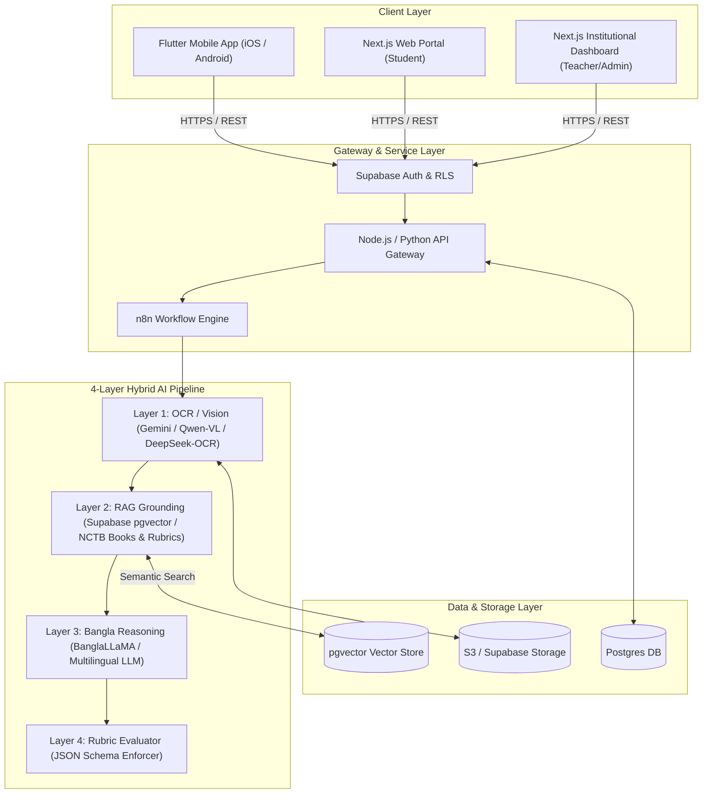
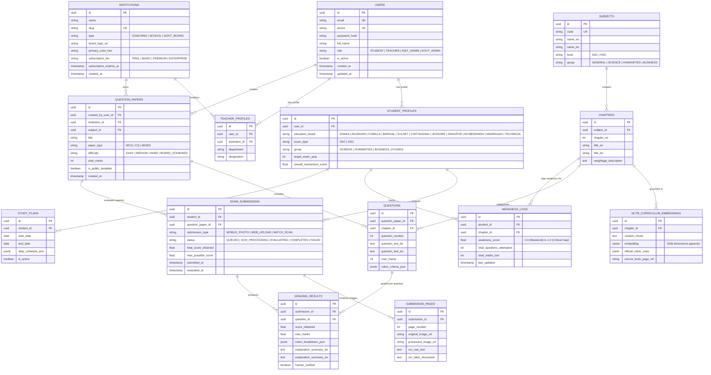
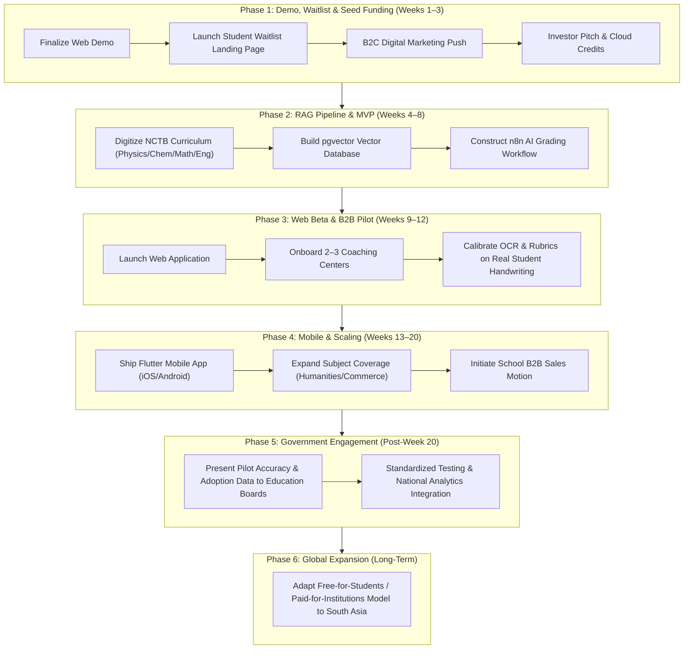

# Software Requirements Specification (SRS)
## SheraTutor — AI-Powered Board Examiner & Learning Platform

**Document Standard:** IEEE Std 830-1998 / ISO/IEC/IEEE 29148  
**Document Version:** 1.0.0  
**Status:** Approved Specification  
**Date:** August 2026  
**System Target:** Web Application (Next.js) & Mobile Application (Flutter)  
**Domain:** `sheratutor.ai`  

---

## Executive Summary & Document Control

| Property | Details |
|---|---|
| **System Name** | SheraTutor |
| **Tagline** | "SheraTutor, for **Shera**Students" |
| **Primary Audience** | SSC and HSC Students in Bangladesh (~3.2M annual candidate TAM) |
| **Secondary Audience** | Schools, Coaching Centers, Education Boards, Ministry of Education |
| **Business Model** | Two-Sided: 100% Free for Students (B2C), Paid Infrastructure for Institutions (B2B) |
| **Lead Architecture** | Next.js + Flutter + Supabase (`pgvector`) + n8n + 4-Layer Hybrid AI Stack |

---

## 1. Introduction

### 1.1 Purpose
This Software Requirements Specification (SRS) document details the complete functional, non-functional, interface, data, and architectural requirements for **SheraTutor**. It establishes the formal technical baseline for developers, AI engineers, UI/UX designers, and institutional stakeholders.

### 1.2 Scope
SheraTutor is a dual-sided educational platform:
1. **Student Platform (B2C — Free):** An always-available AI board examiner providing instant vision-based grading of handwritten exam scripts (Bangla and English), step-by-step mark deduction explanations, interactive AI tutoring, adaptive study planning, and mock exam generation.
2. **Institutional Platform (B2B — Commercial SaaS):** An assessment infrastructure suite enabling schools and coaching centers to generate board-standard question papers (MCQ + CQ), evaluate scanned paper answer scripts in bulk, produce parent-teacher diagnostic reports, monitor cohort analytics, and deploy white-labeled evaluation portals.

### 1.3 Definitions, Acronyms, and Abbreviations
* **NCTB:** National Curriculum and Textbook Board (Bangladesh).
* **SSC:** Secondary School Certificate (Grade 10 National Exam).
* **HSC:** Higher Secondary Certificate (Grade 12 National Exam).
* **CQ:** Creative Question (Multi-part structured long-form written questions common in Bangladeshi exams).
* **MCQ:** Multiple Choice Question.
* **OCR:** Optical Character Recognition.
* **VLM:** Vision-Language Model.
* **RAG:** Retrieval-Augmented Generation.
* **RLS:** Row-Level Security (Postgres).
* **TAM:** Total Addressable Market.
* **TTFT:** Time-to-First-Token.

### 1.4 Market Context & Operational Drivers
According to official 2025 education board statistics:
* **SSC Candidates:** ~1.93 Million registered candidates across 11 boards; pass rate of 68.45% with 139,032 GPA-5 achievers.
* **HSC Candidates:** ~1.25 Million registered candidates; pass rate of **58.83%** (a 21-year low, dropping 18.95 percentage points from 77.78% in 2024).
* **Feeder Network:** ~29,000 schools and colleges across Bangladesh.

The dramatic drop in pass rates underscores a systemic gap between standard classroom instruction and the rigorous demonstration of problem-solving skills required under board exam conditions. SheraTutor bridges this gap by democratizing expert board examiner feedback.

---

## 2. Overall Description

### 2.1 Product Perspective & Context Diagram



### 2.2 User Classes & Characteristics

| User Class | Subsystem Access | Key Characteristics & Operational Needs |
|---|---|---|
| **Student (B2C)** | Mobile & Web Student Portal | Ages 13–19. Requires low-friction UI, fast image upload, clear Bangla explanations, motivational progress tracking, and zero subscription barrier. |
| **Teacher / Evaluator (B2B)** | Web Institutional Portal | Educators at coaching centers/schools. Requires rapid question paper drafting, batch script scanning review, printable PDFs, and detailed parent reports. |
| **Coaching Center Admin (B2B)** | Web Admin Portal | Commercial managers. Requires white-label branding controls, license/seat management, student roster imports, and batch analytics. |
| **School Admin (B2B)** | Web Admin Portal | Academic administrators. Requires term-wide performance heatmaps, teacher activity tracking, and curriculum alignment metrics. |
| **Board / Ministry Official (B2B)** | Web Macro Portal | High-level decision makers. Requires anonymized nationwide/district-level learning gap metrics and standardized test pilot management. |
| **System / AI Engine** | Internal Automated Pipeline | Processes scripts, calculates embeddings, executes rubric matching, and updates adaptive student weakness profiles. |

### 2.3 System Operating Environment
* **Web Client:** Responsive Web Application (Chrome 100+, Safari 15+, Firefox 100+, Edge) built using Next.js 14+, React 18, Tailwind CSS, Shadcn UI.
* **Mobile Client:** Native Android (SDK 24 / Android 7.0+) and iOS (iOS 14+) built with Flutter 3.x with native camera integration.
* **Backend Infrastructure:** Supabase (PostgreSQL 15+ with `pgvector` extension), Node.js v20 LTS, Python 3.11+, n8n Self-Hosted Workflow Orchestrator.
* **AI Model Hosting:** Cloud API gateways (Google Gemini API, OpenAI API, Anthropic API) combined with self-hosted vLLM/Triton containers for open-source VLMs (Qwen-VL, DeepSeek-OCR).

---

## 3. External Interface Requirements

### 3.1 Design System & User Interfaces (UI/UX Specification)

The visual design system is specifically tailored to resonate with Bangladeshi teenagers while maintaining an institutional standard for B2B dashboards.

#### Color Palette Tokens
```css
:root {
  --color-ink-navy: #14182B;      /* Primary dark background, headline text */
  --color-card-navy: #1E2761;     /* Secondary dark surfaces & cards */
  --color-coral: #FF6B57;         /* Primary CTA, accent wordmark, tick mark */
  --color-coral-deep: #E6503D;    /* Hover states & small sub-labels */
  --color-mint: #23D9A5;          /* AI sparkle motif & success indicators */
  --color-mint-deep: #0FB98A;     /* Darker mint for high-contrast text */
  --color-sunshine: #FFC93C;      /* Merit star & highlight details */
  --color-paper-white: #FFFFFF;    /* Script card background */
  --color-paper-gray: #F4F5FB;     /* Alternate light section background */
  --color-line-gray: #D7DEEF;      /* Ruled lines and subtle dividers */
  --color-ink-soft: #5A6180;       /* Muted body text on light backgrounds */
}
```

#### Typography Hierarchy
* **Headlines & Display:** `Baloo 2` (Weights: 600, 700, 800) — Bouncy, youthful display font establishing an approachable tone for students.
* **Body Text:** `Inter` (Weights: 400, 500, 600, 700) — High-legibility UI body typeface.
* **Eyebrows, Stats & Code:** `Space Mono` (Weight: 700, Letter-spacing: +2px, Uppercase) — Provides an authentic "exam mark sheet" feel.

#### Brand Mark & Iconography
* **Wordmark:** "Shera" in Ink Navy/White + "Tutor" in Coral.
* **Tagline:** "for **Shera**Students" set in matching two-tone hierarchy.
* **Icon:** Tilted white paper answer sheet featuring faint gray ruled lines, a confident hand-drawn Coral checkmark, a Mint 4-point AI sparkle, and a Sunshine 5-point merit star.
* **Grade Stamp Motif:** Circular dashed-line rubber stamp motif (e.g., "A+ Examiner Verified") used across web banners, report headers, and stats tiles.

---

## 4. Detailed Functional Requirements (FR)

### Module 1: Authentication & User Profile Management

#### FR-AUTH-01: Multi-Provider Authentication
* **Description:** The system shall authenticate users via Email/Password, Phone Number (OTP), and Google OAuth 2.0.
* **Inputs:** Credentials, OAuth Tokens, Phone Number + SMS Code.
* **Processing:** Validation via Supabase Auth; generation of JWT access tokens and refresh tokens.
* **Outputs:** Auth session state, authenticated user token.

#### FR-AUTH-02: Student Profile Onboarding
* **Description:** The system shall capture student target metadata during initial login.
* **Data Fields:** Full Name, Education Board (9 General Boards, Madrasah, Technical), Exam Type (SSC, HSC), Academic Group (Science, Humanities, Business Studies), Target Exam Year.

#### FR-AUTH-03: Multi-Tenant RBAC Isolation
* **Description:** The system shall enforce strict data boundaries between B2B Institutions using Postgres Row-Level Security (RLS). Teachers and Admins can only view data within their assigned `institution_id`.

---

### Module 2: Question Paper Generator (B2B & B2C)

#### FR-GEN-01: Custom Mock Paper Generation
* **Description:** The system shall generate board-standard Question Papers containing Multiple Choice Questions (MCQs) and Creative Questions (CQs).
* **Parameters:** Subject, Chapter selection (single or multi-chapter), Difficulty Calibration (Easy, Medium, Hard, Board Standard), Target Mark Total (e.g., 25, 50, 100 marks).

#### FR-GEN-02: Past Board Paper Replication
* **Description:** The system shall store and regenerate exact past board exam papers (e.g., Dhaka Board 2023 Physics Paper 1).

#### FR-GEN-03: Export to PDF & Print Layout
* **Description:** B2B teachers shall be able to export generated question papers and matching official marking schemes into formatted, printable PDFs featuring institution header branding.

---

### Module 3: Script Capture, Vision & OCR Engine

#### FR-OCR-01: Multi-Page Script Capture
* **Description:** The mobile and web clients shall provide camera capture and file picker utilities for uploading multi-page images of student handwritten answer scripts.
* **Supported Formats:** JPG, PNG, HEIC, PDF.

#### FR-OCR-02: Image Pre-Processing
* **Description:** The vision system shall automatically auto-crop, perspective-correct, contrast-enhance, and orient uploaded script images.

#### FR-OCR-03: Multilingual & Formula Extraction
* **Description:** The OCR pipeline shall transcribe:
  1. Handwritten Bangla text.
  2. Handwritten English text.
  3. Mathematical equations (LaTeX formatted).
  4. Chemical reaction formulas.
  5. Diagram labels and geometry drawings.

---

### Module 4: 4-Layer AI Grading & RAG Grounding

#### FR-EVAL-01: Vector RAG Retrieval
* **Description:** Before grading, the system shall query the vector store (`pgvector`) to retrieve relevant digitized NCTB textbook chunks and official board marking rubrics matching the question ID.

#### FR-EVAL-02: Structured Rubric Evaluation
* **Description:** The AI evaluator shall assess the transcribed student answer against retrieved rubric criteria using a fixed JSON Schema:
```json
{
  "question_id": "string",
  "max_marks": 10,
  "score_obtained": 7.5,
  "criteria_evaluations": [
    {
      "step_name": "Formula Statement",
      "max_step_marks": 2,
      "awarded_marks": 2,
      "status": "MATCHED",
      "observation": "Correctly stated Newton's Second Law formula F = ma."
    },
    {
      "step_name": "Unit Conversion",
      "max_step_marks": 2,
      "awarded_marks": 0.5,
      "status": "PARTIAL",
      "observation": "Converted mass from grams to kg incorrectly (used 100 instead of 1000)."
    }
  ],
  "deduction_summary_bn": "কেজি এককে রূপান্তরের সময়ে ১০০০ এর পরিবর্তে ১০০ দিয়ে ভাগ করায় ১.৫ নম্বর কর্তন করা হয়েছে।",
  "deduction_summary_en": "1.5 marks deducted due to dividing by 100 instead of 1000 during unit conversion to kg."
}
```

#### FR-EVAL-03: Human-in-the-Loop Override (Pilot Safeguard)
* **Description:** For B2B institutional tests, teachers shall have an override interface to adjust AI-awarded scores, which feeds correction vectors back into the evaluation calibration queue.

---

### Module 5: Gap Analysis & AI Tutor Chatbot

#### FR-CHAT-01: "Explain It Simply" Contextual Chat
* **Description:** Beside every deducted mark in an evaluated script, the system shall present an "Explain it simply" trigger.
* **Behavior:** Launches an interactive chat session pre-loaded with the exact question, student answer chunk, and rubric failure reason.

#### FR-CHAT-02: Plain-Language Analogy Engine
* **Description:** The AI tutor shall answer follow-up queries using age-appropriate analogies, supporting both conversational Bangla and English.

---

### Module 6: Adaptive Study Planner & Student Dashboard

#### FR-PLAN-01: Continuous Weakness Logging
* **Description:** The system shall maintain a `weakness_score` (float from 0.0 to 1.0) for every student across all chapters based on historical evaluation deductions.

#### FR-PLAN-02: Dynamic Daily Schedule Allocation
* **Description:** The system shall generate a daily study plan that reallocates study hours toward chapters exhibiting high weakness scores.

#### FR-PLAN-03: Progress Dashboard & Momentum Metrics
* **Description:** The dashboard shall render:
  1. **Momentum Score:** Calculated from weekly test activity and score velocity.
  2. **Board Prediction Score:** Estimated GPA/mark range.
  3. **Subject Understanding Heatmap:** Green (Mastered), Yellow (Review Needed), Red (Critical Gap).

---

### Module 7: B2B Cohort Analytics & Institutional Tools

#### FR-B2B-01: Batch Performance Heatmap
* **Description:** Render class- and school-wide performance metrics, displaying subject and chapter mastery percentages across entire student cohorts.

#### FR-B2B-02: At-Risk Student Flagging
* **Description:** Automatically highlight students whose trailing 3-test average falls below board pass thresholds.

#### FR-B2B-03: Parent-Teacher Breakdown Reports
* **Description:** Generate downloadable, branded diagnostic summary sheets detailing individual student progress, exam scores, and target revision points.

#### FR-B2B-04: White-Label Portal Customization
* **Description:** Allow coaching center administrators to set custom domain aliases, brand logo headers, accent color schemes, and custom report footers.

---

## 5. Non-Functional Requirements (NFR)

### 5.1 Performance Requirements
* **NFR-PERF-01 (Grading Latency):** Full processing of a single handwritten answer page (Image Upload → Vision OCR → RAG Lookup → LLM Rubric Evaluation → JSON Output) shall complete within **≤ 15.0 seconds** at p95.
* **NFR-PERF-02 (Tutor Chat TTFT):** The AI Tutor Chatbot Time-to-First-Token shall be **≤ 2.0 seconds**.
* **NFR-PERF-03 (Web LCP):** Core Web Vitals Largest Contentful Paint (LCP) shall be **≤ 2.5 seconds** on standard 4G connections.
* **NFR-PERF-04 (API Throughput):** The API Gateway shall support **1,000 requests per second (RPS)** baseline, scaling to **10,000 RPS** during peak board exam months (April–May, October–November).

### 5.2 Security & Data Protection
* **NFR-SEC-01 (Data Encryption):** All data at rest shall be encrypted using AES-256; all communications in transit shall enforce TLS 1.3.
* **NFR-SEC-02 (Multi-Tenant Isolation):** Postgres Row-Level Security (RLS) policies must be tested continuously to prevent cross-tenant data leaks between competing coaching centers.
* **NFR-SEC-03 (Child Data Privacy):** Student performance data and uploaded script photos must comply with data protection regulations for minors. Images shall be scrubbed of personally identifiable information (PII) before LLM model training processing.

### 5.3 Reliability, Availability & Quality
* **NFR-REL-01 (Grading Accuracy Correlation):** Automated CQ grading output must maintain a **≥ 95% statistical correlation** with senior human board examiners during calibration audits.
* **NFR-REL-02 (System Availability):** The application shall guarantee **99.9% uptime** SLA (excluding scheduled maintenance windows communicated 48 hours in advance).
* **NFR-REL-03 (Hallucination Prevention):** RAG grounding must strictly enforce that 100% of facts cited in mark deduction summaries reference indexed NCTB curriculum materials.

### 5.4 Maintainability & Architecture
* **NFR-ARCH-01 (Separable Pipeline Stages):** The 4-layer AI engine (OCR → RAG → Reasoning → Rubric Evaluator) shall be implemented as decoupled microservice modules connected via REST/n8n, allowing independent replacement of LLM providers without code refactoring.
* **NFR-ARCH-02 (Open-Source Fallback Path):** The system must maintain functional compatibility to swap proprietary Vision APIs (Gemini Vision) with self-hosted open-source VLM models (Qwen-VL / DeepSeek-OCR) to preserve unit economics as user volume scales.

---

## 6. System Architecture & Entity-Relationship Model

### 6.1 Complete Entity-Relationship Diagram (ERD)



---

## 7. User Stories Matrix & Acceptance Criteria

```carousel
### US-01: Handwritten Script Evaluation
**As a** Student,  
**I want to** take a photo of my handwritten answer sheet and submit it,  
**So that** I can get an instant board-standard mark breakdown.  
<!-- slide -->
### US-01 Acceptance Criteria
1. Given an image upload of handwritten Bangla/English text, the OCR engine transcribes text within 5s.
2. Given transcribed content, the AI engine evaluates steps against NCTB rubrics within 15s total.
3. System outputs score per question alongside specific Bangla deduction explanations.
<!-- slide -->
### US-02: B2B Question Generator
**As a** Coaching Center Teacher,  
**I want to** select chapter criteria and generate a 50-mark exam paper,  
**So that** I can print tests without spending hours writing questions.  
<!-- slide -->
### US-02 Acceptance Criteria
1. Teacher selects Subject, Chapter(s), and Difficulty.
2. System generates calibrated MCQ and CQ questions with full rubrics.
3. Teacher can edit questions and export a branded, printable PDF.
```

---

## 8. Implementation & Phased Rollout Plan



---

## 9. Verification & Traceability Matrix

| Req ID | Requirement Summary | Verification Method | Pass Criteria |
|---|---|---|---|
| **FR-AUTH-03** | RLS Tenant Isolation | Automated Security Test | 100% block rate on cross-tenant queries. |
| **FR-OCR-03** | Bangla/Math OCR | Test Suite Benchmark | >90% character accuracy on messy khata scripts. |
| **FR-EVAL-02** | Structured JSON Rubric | Integration Test | Schema validation passes without fallback errors. |
| **NFR-PERF-01**| <15s Grading Latency | Load Test (k6) | p95 latency ≤ 15,000ms under 500 RPM load. |
| **NFR-REL-01** | ≥95% Examiner Alignment | Blind Double Grading | Pearson correlation r ≥ 0.95 vs human panel. |

---

> **Document Approval:**  
> **Lead Systems Architect:** *SheraTutor Engineering Team*  
> **Product Operations:** *SheraTutor Board Committee*  
