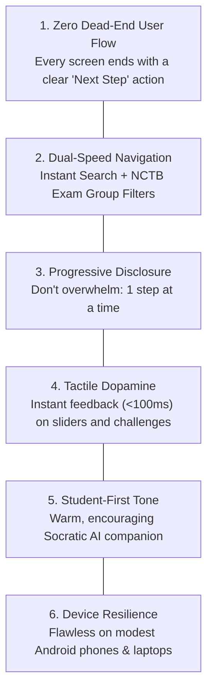
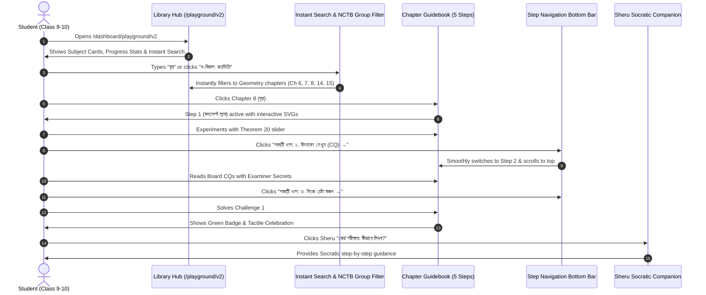

# EdTech UI/UX Deep Research & Student Experience Blueprint: SheraTutor Playground V2

> **"Focused, Calm & Empowering: Designing for Bangladeshi Teenagers (Classes 9–10 & HSC, Ages 14–18)"**

---

## 1. Executive Summary & Context

SheraTutor's core audience consists of **Bangladeshi teenage students (aged 14 to 18)** preparing for high-stakes national examinations:
- **Secondary School Certificate (SSC)**: General Mathematics, Physics, Chemistry, Higher Mathematics, Biology.
- **Higher Secondary Certificate (HSC)**: Advanced Science disciplines.

Unlike adult professionals or university students, high-school teenagers possess distinct cognitive, psychological, and physiological characteristics:
1. **High Exam Anxiety**: Fear of falling short of GPA 5.0 (Golden A+), pressure from parents, teachers, and coaching centers.
2. **Short Attention Spans & Multitasking**: Highly attuned to fast, responsive mobile interfaces (TikTok, YouTube, Instagram, Discord). Any clunky, slow, or corporate UI induces immediate abandonment.
3. **Cognitive Overload from Voluminous Textbooks**: The NCTB General Mathematics textbook is ~350 dense pages; Physics is ~300 pages. Staring at wall-to-wall text triggers reading fatigue.
4. **Bilingual Academic Reality**: Students study in Bengali medium, but technical terms are heavily blended: *CQ (সৃজনশীল), MCQ (বহুনির্বাচনী), Domain-Range, Formula, Factorization, Step-deviation, Ogive*.

---

## 2. Competitive & Comparative EdTech Benchmarking

| Platform | Core Strength | Teenage Engagement Technique | Friction Point / What to Avoid |
| :--- | :--- | :--- | :--- |
| **Duolingo** | Gamified bite-sized progression | Visual streak counter, micro-lessons (<3 min), immediate audio-visual dopamine on correct answers. | Over-gamification can feel childish; notifications and lives system induce stress rather than deep understanding. |
| **Brilliant.org** | Interactive tactile concepts | "Play first, formalize second." Sliders and interactive physics/math before abstract formulas. | Paywalled, dense English prose, lacks alignment with national board exam question patterns. |
| **Khan Academy** | Structured mastery trees | Clear breadcrumb trails, "Up Next" bottom bar, visual mastery crown icons. | Video-heavy, passive watching rather than tactile manipulation; slow to navigate for rapid exam revision. |
| **PhET Interactive (CU Boulder)** | Dynamic causal simulations | Real-time parameter reaction (drag a slider $\rightarrow$ wave frequency or force changes instantly). | Isolated simulations with zero exam grounding, no grading rubrics, no worked past-board questions. |
| **Shikho / 10 Minute School** | Bengali curriculum grounding | Animated video lessons, animated slides, board question test papers. | Static video lectures without tactile sandboxes; mobile app feels like an e-commerce course catalog. |
| **Linear / Raycast / Arc** | High-velocity modern UX | Command palette (`⌘K`), keyboard navigation, instant response (<50ms), calm neutral canvas with focused accents. | Built for developers, but their interaction clarity and speed set the gold standard for Gen Z digital natives. |

---

## 3. The SheraTutor Teen-Centric UI/UX Principles

Based on our analysis, the SheraTutor student experience must adhere to **6 Ironclad Principles**:

### Principle 1: Zero Dead-End User Flow (চলমান শিখন পথ)
- **The Problem**: In typical platforms, when a student finishes reading a lab at the bottom of the page, the screen just ends. The student must scroll 2,000 pixels back to the top to figure out what to do next.
- **The Solution**: A sticky or floating **"পরবর্তী ধাপে যান" (Continue to Next Step)** bottom bar:
  - Clear label showing the exact next milestone: `পরবর্তী ধাপ: ২. বোর্ড উদাহরণ দেখুন (CQ) →`.
  - Progress badge showing current momentum: `ধাপ ১/৫ • ২০% সম্পন্ন`.
  - Clicking automatically switches the active tab and scrolls smoothly to the top.

### Principle 2: Dual-Speed Navigation (দ্রুত অনুসন্ধান ও বোর্ড বিভাগ)
- **The Problem**: Scrolling through 17 tall cards in General Math takes 10+ page scrolls.
- **The Solution**:
  1. **Instant Search Bar (`⌘K` / `/`)**: Fast fuzzy search across chapter numbers, titles, and math/physics concepts (`"বৃত্ত"`, `"পীথাগোরাস"`, `"চ্যাপ্টার ১০"`, `"গতি"`, `"বিদ্যুৎ"`).
  2. **NCTB Exam Question Group Filters**:
     - **ক-বিভাগ: বীজগণিত (Algebra)**: Ch 1, 2, 3, 4, 5, 11, 12, 13
     - **খ-বিভাগ: জ্যামিতি (Geometry)**: Ch 6, 7, 8, 14, 15
     - **গ-বিভাগ: ত্রিকোণমিতি ও পরিমিতি (Trigonometry & Mensuration)**: Ch 9, 10, 16
     - **ঘ-বিভাগ: পরিসংখ্যান (Statistics)**: Ch 17
     Every Bangladeshi student studies by these 4 board divisions.

### Principle 3: View Density Modes (বিস্তারিত বনাম কম্প্যাক্ট গ্রিড)
- **Detailed View (বিস্তারিত ভিউ)**: Expanded cards with lesson breakdowns, study times, and board marks.
- **Compact Grid View (কম্প্যাক্ট গ্রিড)**: High-density 2-to-3 column grid allowing students on laptops and tablets to view the entire subject catalog without scrolling for miles.

### Principle 4: Tactile Dopamine on Challenge Resolution
- When a student solves a numeric challenge in Step 3 or answers an MCQ in Step 4:
  - Immediate visual celebration (glowing green badge, gentle chime or subtle confetti burst).
  - Encouraging feedback: *"অসাধারণ! তুমি সমস্যাটি নির্ভুলভাবে সমাধান করেছ!"*
  - Clear progress checklist: `৩টির মধ্যে ৩টি চ্যালেঞ্জ সফল!`.

### Principle 5: Approachable Socratic Tone (শেরু এআই টিউটর)
- Sheru should never speak like a cold corporate bot or a strict examiner.
- Warm, respectful, relatable Bengali:
  - *"সাবাশ! স্লাইডারটা টেনে দেখো তো মানটা কীভাবে বদলায়?"*
  - *"ভয় পেয়ো না, চলো ধাপে ধাপে দেখি বোর্ড পরীক্ষায় এখানে পরীক্ষক কোথায় নম্বর কাটেন।"*
  - Adaptive prompt chips that match the student's active step.

### Principle 6: Keyboard Accelerators for Laptop Study
- Students studying on laptops can press:
  - `1`, `2`, `3`, `4`, `5` to switch between the 5 canonical tabs instantly.
  - `[` and `]` or `←` and `→` to move between previous and next steps.
  - `/` or `⌘K` to focus the search bar.

---

## 4. Architectural Implementation Blueprint

---

## 5. Execution Roadmap

1. **Step 1: Guidebook Library Hub UX Enhancement (`GuidebookLibraryView.tsx`)**:
   - Implement **Instant Search Bar** with real-time fuzzy filtering across all 29 live chapters.
   - Implement **NCTB Board Exam Division Filters** (ক-বিভাগ: বীজগণিত, খ-বিভাগ: জ্যামিতি, গ-বিভাগ: ত্রিকোণমিতি ও পরিমিতি, ঘ-বিভাগ: পরিসংখ্যান for Math; Mechanics, Waves, Electricity for Physics).
   - Implement **View Density Mode Switcher** (Detailed Card View vs Compact Grid View).
   - Implement **Study Progress & Live Stats Counter** with visual progress bars.
2. **Step 2: Universal Step Navigation Footer Component (`StepNavigationFooter.tsx`)**:
   - Create a clean, accessible, sticky/end-of-step navigation component.
   - Circular progress ring + next/prev action + keyboard shortcuts (`1-5`).
3. **Step 3: Verification & Zero-Regression Check**:
   - `npx tsc --noEmit` code 0.
   - E2E Puppeteer test verifying search, filters, grid toggle, and all 17 math chapters.
