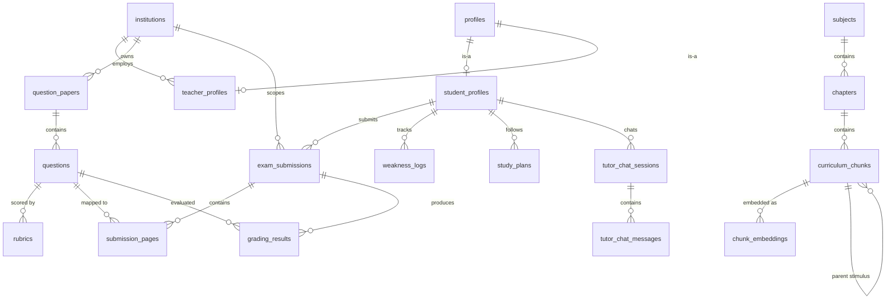

# SheraTutor: Comprehensive Codebase Architecture & Systems Report

## 1. Executive Summary & Vision

**SheraTutor** is Bangladesh's first AI board examiner and learning companion, engineered specifically for secondary and higher-secondary students (**NCTB SSC & HSC curriculum**, currently vertically sliced to **Physics & Chemistry**). 

The platform addresses a systemic national challenge: the lack of accessible, objective, and formative feedback on handwritten exam scripts. Students photograph their handwritten exam answer sheets (খাতা) and receive automated, rubric-grounded evaluations with mark breakdowns, rule-level deduction citations, and remedial Socratic tutoring — all delivered through a cultural "খাতা" notebook design language.

### Core Stack
- **Web & Application Tier**: Next.js 16 (App Router, Turbopack, React 19), Tailwind CSS v4, shadcn/ui (`radix-nova`), `@supabase/ssr`.
- **AI Orchestration Tier**: Google Genkit 1.41 (`genkit/beta`), NVIDIA NIM (OpenAI-compatible inference runtime, Llama 3.2 Vision + GPT-OSS Reasoning), `@genkit-ai/mcp` (Model Context Protocol).
- **Data & Queue Tier**: Supabase PostgreSQL 17, `pgvector` (HNSW 1024-dimension cosine similarity), `pgmq` (transactional job queue), `pg_cron` (autonomous scheduling), `vault` (encrypted secrets storage), Supabase Storage.
- **Offline Ingestion Tier**: Python 3.12, `marker-pdf` (balanced mode), Surya OCR, PyMuPDF, Matryoshka-truncated embeddings (`llama-nemotron-embed-vl-1b-v2`).

---

## 2. Full-Stack Architectural Topology

```
+----------------------------------------------------------------------------------------------------+
|                                    CLIENT TIER (Student Browser)                                   |
| - React 19 Server & Client Components (Khata Ruled-Paper Theme)                                   |
| - Client-Side Image Downscaling (Canvas-based, prevents Vercel 4.5MB payload exhaustion)          |
| - KaTeX Math & LaTeX Equation Rendering ($...$ inline, $$...$$ display)                           |
| - Supabase Realtime WebSocket Subscriptions (Instant notification on grading completion)          |
+----------------------------------------------------------------------------------------------------+
                                                  |
                                                  | HTTPS / Server Actions / SSE
                                                  v
+----------------------------------------------------------------------------------------------------+
|                                      EDGE & NEXT.JS SERVER TIER                                     |
|                                                                                                    |
|  [proxy.ts]                                                                                        |
|  - Session Cookie Refresh via @supabase/ssr updateSession                                          |
|                                                                                                    |
|  [Server Actions (web/src/app/actions/)]                                                           |
|  - onboarding.ts: DOB Age Gate (Under-18 requires guardian phone + acknowledged consent)            |
|  - generate-paper.ts: NCTB practice paper generation + bulk rubric/question inserts                |
|  - study-plan.ts: Deterministic 14-day weakness-weighted scheduler                                 |
|                                                                                                    |
|  [Route Handlers (web/src/app/api/)]                                                              |
|  - /api/submissions: Idempotent script upload & enqueue_grading_job call                           |
|  - /api/tutor-chat: Asia/Dhaka rate limit (50 msgs/day), crisis safety pre-filter, SSE streaming   |
|  - /api/internal/process-grading-queue: Secret-authenticated background worker endpoint           |
+----------------------------------------------------------------------------------------------------+
              |                                                               |
              | Service-Role / RPC                                            | Tool Calling / Inference
              v                                                               v
+----------------------------------------------------+   +-------------------------------------------+
|             SUPABASE DATA & QUEUE TIER             |   |        GENKIT AI ORCHESTRATION TIER       |
|                                                    |   |                                           |
|  [23 RLS-Protected PostgreSQL 17 Tables]           |   |  [Core Flows (web/src/ai/flows/)]         |
|  - Identity: institutions, profiles, student_*     |   |  1. transcribe.ts (Verbatim VLM OCR)      |
|  - Curriculum: subjects, chapters, chunks, vectors |   |  2. retrieve-grounding.ts (Hybrid RAG)    |
|  - Submissions: exam_submissions, submission_pages |   |  3. evaluate-rubric.ts (Rubric citations) |
|  - Results: grading_results, grading_corrections   |   |  4. grade-submission.ts (Orchestrator)    |
|  - Queue: pgmq.grading_queue                       |   |  5. tutor-chat.ts & generate-paper.ts     |
|                                                    |   |                                           |
|  [Autonomous Cron Worker (0034 Migration)]         |   |  [Autonomous Agents & MCP]                |
|  - pg_cron: '* * * * *' (Every 60s)                |   |  - tutorAgent (Socratic multi-turn agent)  |
|  - pg_net: net.http_post to /api/internal/...      |   |  - tutor-tools.ts (Exact math calculator) |
|  - vault: reads secret from decrypted_secrets      |   |  - mcp/server.ts (MCP Server Hub)         |
+----------------------------------------------------+   +-------------------------------------------+
```

---

## 3. Deep Dive: Module Breakdown & Implementations

### Module 1: NCTB Curriculum Ingestion Pipeline (`ingestion/`)
The ingestion pipeline is an offline Python subsystem responsible for processing official National Curriculum and Textbook Board (NCTB) PDF textbooks into high-fidelity semantic chunks stored in Supabase.

1. **Document Conversion & Layout Extraction**:
   - Uses `marker_single --mode balanced` and Surya OCR.
   - Extracts mathematical formulas directly into clean LaTeX, identifies tables, and isolates figure captions while stripping double-column formatting artifacts and running headers.
2. **Semantic & Hierarchical Chunking**:
   - Rather than arbitrary character-length splitting, text is segmented on structural section boundaries (`section_title`).
   - Categorized by `chunk_type`:
     - `theory`: Declarative physical laws, principles, and definitions.
     - `worked_example`: Mathematical word problems with step-by-step solutions.
     - `cq_stimulus`: Creative question scenario stories or diagrams.
     - `cq_subquestion`: Individual (ক/খ/গ/ঘ) subquestions, linked back to the stimulus via `parent_chunk_id`.
3. **Matryoshka Embedding Generation**:
   - Model: NVIDIA NIM `llama-nemotron-embed-vl-1b-v2`.
   - Dimension: Truncated to **1024 dimensions** via Matryoshka representation learning.
   - Handles long textbook passages (up to 3,261 characters) without token overflow.
4. **Physical Verification Suite (`verify_all_pages_against_pdf.py`)**:
   - Audits every ingested chunk against the raw PDF text layer to ensure zero missing pages, formula hallucination, or character dropouts.

---

### Module 2: Supabase Data Tier & Database Architecture (`supabase/`)
The persistence tier comprises **23 normalized tables** protected by **100% Row Level Security (RLS)** across **34 progressive migrations**.



#### Key Architectural Highlights:
1. **Hybrid RAG Stored Procedure (`match_curriculum_chunks`)**:
   - Implemented in SQL (`supabase/migrations/00000000000007_retrieval_fn.sql`).
   - Merges vector similarity search (`<=>` cosine distance over HNSW index) and PostgreSQL full-text search (`ts_rank_cd` over `fts_doc`) using **Reciprocal Rank Fusion (RRF)**:
     $$\text{Score} = \frac{1}{60 + \text{rank}_{\text{dense}}} + \frac{1}{60 + \text{rank}_{\text{fts}}}$$
2. **Transactional Asynchronous Queue (`pgmq`)**:
   - `enqueue_grading_job(submission_id)` pushes jobs into `grading_queue`.
   - Bypasses web request limits and ensures submissions survive edge restarts.
3. **Autonomous Scheduled Poller (`pg_cron` + `pg_net` + `vault`)**:
   - Defined in migration 034.
   - Runs every 60 seconds (`* * * * *`).
   - Retrieves the worker secret from `vault.decrypted_secrets` and issues an HTTP POST to `/api/internal/process-grading-queue`.
   - **Fail-Closed Design**: If the secret is missing from Vault, the header is omitted and the endpoint returns 401 Unauthorized.

---

### Module 3: Genkit AI Orchestration Layer (`web/src/ai/`)
Orchestrated using Google Genkit (`genkit/beta`), unifying multi-provider inference, structured output schemas, and autonomous agents.

1. **Provider Normalization (`genkit.ts`)**:
   - Configured with `openAICompatible` plugins for **NVIDIA NIM** and **AgentRouter**.
   - Custom `agentRouterFetch` normalizer:
     - Injects required WAF `User-Agent: Cline/3.0.0`.
     - Catches upstream HTTP errors cleanly with structured JSON error propagation.
     - Converts `text/plain` streaming payloads into compliant `application/json` responses.
2. **Current Model Allocations**:
   - `MODELS.vision`: `nim/meta/llama-3.2-11b-vision-instruct` (Verbatim OCR).
   - `MODELS.reasoning`: `nim/openai/gpt-oss-20b` (Rubric grading & Socratic tutoring).
   - `MODELS.paper`: `nim/meta/llama-3.2-11b-vision-instruct` (Fast question generation within Vercel's 60s boundary).
   - `MODELS.fast`: `nim/openai/gpt-oss-20b`.
   - `FALLBACK_REASONING_MODEL`: `nim/openai/gpt-oss-20b`.
3. **Provenance Versioning**:
   - `PIPELINE_VERSION = "2026.08.13-bge-m3-pivot"`
   - `PROMPT_VERSION = "2026.08.13-v1"`
   - Every grading result records the exact model name, prompt version, pipeline version, and rubric version ID for auditability and regression testing.

---

### Module 4: 4-Layer Board-Examiner Grading Pipeline

```
[ Student Answer Image ]
          |
          v
+----------------------------------------------------------------------------+
| LAYER 1: VERBATIM OCR (transcribe.ts)                                      |
| - Model: Llama 3.2 Vision                                                  |
| - Constraint: Absolute verbatim transcription. Zero auto-correction.       |
| - Output: verbatim_text, math_expressions, detected_language, uncertain   |
+----------------------------------------------------------------------------+
          |
          v
+----------------------------------------------------------------------------+
| LAYER 2: HYBRID RAG GROUNDING (retrieve-grounding.ts)                      |
| - Vector: 1024-dim HNSW Cosine Search + Postgres FTS BM25 (RRF fusion)     |
| - Context: Official textbook chunks + CQ parent stimulus expansion         |
| - Output: Verified curriculum passages + groundingConfidence score         |
+----------------------------------------------------------------------------+
          |
          v
+----------------------------------------------------------------------------+
| LAYER 3+4: RUBRIC EVALUATION & VERIFICATION (evaluate-rubric.ts)           |
| - Model: GPT-OSS-20b (Reasoning) or Llama 3.2 Vision                       |
| - Evaluation: Official rubric JSON criteria step-by-step scoring           |
| - Rules: Every deduction MUST cite official rubric rule (cited_rubric_rule)|
| - Safeguard: Photo vs transcript mismatch detection (transcript_mismatch)  |
+----------------------------------------------------------------------------+
          |
          v
+----------------------------------------------------------------------------+
| LAYER 5: PROVENANCE PERSISTENCE (grade-submission.ts)                      |
| - Client: Supabase service-role client (RLS bypass for worker)             |
| - Idempotency: Safe no-op on already COMPLETED submissions                 |
| - Storage: Writes grading_results row + updates weakness_logs per chapter  |
+----------------------------------------------------------------------------+
```

---

### Module 5: Autonomous Socratic Tutor Agent & HITL Interrupts

The Socratic tutor is implemented via `ai.defineAgent` (`web/src/ai/agents/tutor-agent.ts`) with multi-turn session persistence in `tutor_chat_sessions`.

1. **Pedagogical Guardrails**:
   - **One Leading Question at a Time**: Prohibits dumping complete final answers.
   - **No Repetitive Greetings**: Enforces diving directly into academic analysis.
   - **Strict LaTeX Math Wrapping**: All formulas enclosed in `$formula$` with Bengali text strictly outside math delimiters.
2. **Autonomous Tool Set (`web/src/ai/tools/tutor-tools.ts`)**:
   - `verifyPhysicsCalculation`: Deterministic JavaScript math calculator covering kinematics ($v=u+at$, $s=ut+\frac{1}{2}at^2$, $v^2=u^2+2as$), dynamics ($F=ma$), energy ($E_k=\frac{1}{2}mv^2$), work/power ($P=W/t$), and Ohm's law ($V=IR$). Guarantees computational correctness.
   - `searchTextbookCurriculum`: RAG search querying official NCTB textbook chunks when students request definitions or laws.
3. **Human-In-The-Loop (HITL) Interrupt**:
   - `requestPracticeQuizInterrupt = ai.defineInterrupt(...)`: Pauses generation to request explicit student consent before launching an interactive 3-question diagnostic quiz.
4. **Crisis Safety Pre-Filter (`preFilterSafety`)**:
   - Regex-based self-harm and crisis screener.
   - Intercepts crisis inputs before LLM execution, returning a compassionate escalation message referencing the **Kaan Pete Roi** mental health helpline (`০৯৬১৩৪২৭৮০০`) and logging a `SAFETY_ESCALATION` audit event.

---

### Module 6: Web Application Frontend & Student Dashboard (`web/src/app/`)
Built with Next.js 16 and styled with the "খাতা" notebook design language.

1. **Student Dashboard (`/dashboard/`)**:
   - Computes momentum score, letter grade, estimated board percentiles, weakness heatmaps, and today's study tasks.
2. **Answer Sheet Upload (`/dashboard/upload`)**:
   - Canvas-based client downscaling to protect edge payload limits.
   - Visual reordering and page-to-question assignment.
3. **Evaluation Breakdown (`/dashboard/submissions/[id]`)**:
   - Step-by-step rubric evaluation display with mark glyphs (`Tick`, `HalfTick`, `Cross`), examiner-red deduction callouts, and inline "Explain It Simply" tutor trigger.
4. **Practice Paper Generator (`/dashboard/practice/generate`)**:
   - Generates customized NCTB exam papers (CQ with ক/খ/গ/ঘ subparts, MCQ, or mixed) automatically paired with matching rubrics.
5. **Board Simulator (`/dashboard/board-simulator`)**:
   - Timed exam simulation with full KaTeX-rendered printable sheets.
6. **14-Day Study Planner (`/dashboard/study-plan`)**:
   - Deterministic algorithm scheduling high-weakness chapters with frequency 1–4 across a 14-day study cycle.
7. **Bilingual Support**:
   - `LanguageContext.tsx` with dynamic English and Bengali translations (`data/translations.ts`).

---

### Module 7: Model Context Protocol (MCP) Server Hub (`web/src/ai/mcp/`)
SheraTutor exposes its verified NCTB curriculum search and rubric grading capabilities as an MCP server (`server.ts`) built on `@genkit-ai/mcp`.
- **Tools Exposed**: `retrieveGroundingFlow` (NCTB curriculum search) and `evaluateRubricFlow` (rubric scoring).
- **Transport**: Standard I/O (stdio) transport, allowing AI coding assistants (Cursor, Claude Desktop, Antigravity) to query verified textbook definitions and evaluate student answers directly.

---

## 4. Key Workflows & State Machines

### 4.1 End-to-End Exam Submission & Grading State Machine
```
[Student Uploads Pages]
          |
          v
[POST /api/submissions] ---> Writes exam_submissions (status: QUEUED)
          |              ---> Calls enqueue_grading_job() (pgmq)
          v
[pg_cron Autonomous Trigger] (Every 60s)
          |
          v
[POST /api/internal/process-grading-queue] (x-worker-secret validation)
          |
          v
[status: OCR_PROCESSING] ---> Layer 1: transcribePageFlow per page
          |
          v
[status: EVALUATING]     ---> Layer 2: retrieveGroundingFlow per question
                         ---> Layer 3: evaluateRubricFlow per question
          |
          v
[status: COMPLETED]      ---> Writes grading_results with full provenance
                         ---> Updates weakness_logs per chapter
                         ---> Supabase Realtime emits event to Student UI
```

---

## 5. Security, Compliance & Multi-Tenancy

| Dimension | Implementation Details |
| :--- | :--- |
| **Row Level Security (RLS)** | 100% of tables have RLS enabled. Students can only view their own submissions and chat sessions; teachers and institutions are scoped by institutional boundaries. |
| **PDPA Minor Consent** | Enforced at both application and database layers: DOB age calculation requires guardian phone and consent acknowledgment for under-18 users (enforced via DB CHECK constraints). |
| **Training Data Opt-In** | Explicit `training_data_opt_in` flag and audit timestamp `training_data_opt_in_at` ensures student scripts are not used for model training without consent. |
| **Worker Authentication** | Internal worker route `/api/internal/process-grading-queue` is protected via `x-worker-secret` stored securely in Supabase `vault.decrypted_secrets`. |
| **Dispute & Audit Trail** | Students can flag transcript errors ("This isn't what I wrote"); every dispute and safety escalation is logged in `audit_log`. |

---

## 6. Created Artifacts Reference

1. **Interactive Visual Explorer**: [`sheratutor_interactive_explorer.html`](../visual-explorers/apps/sheratutor-architecture.html)
   - Multi-tab interactive explorer featuring the System Topology Map, 4-Layer Grading Pipeline Simulator, Socratic Tutor Inspector, Database ERD & pgmq Queue visualizer, NCTB Ingestion overview, and Live Code Studio.
2. **Architectural Report**: [`SHERATUTOR_SYSTEM_ARCHITECTURE_REPORT.md`](system-architecture.md)
   - Comprehensive technical documentation detailing every layer, data model, state machine, and design decision.

<!-- GOAL_COMPLETE -->
