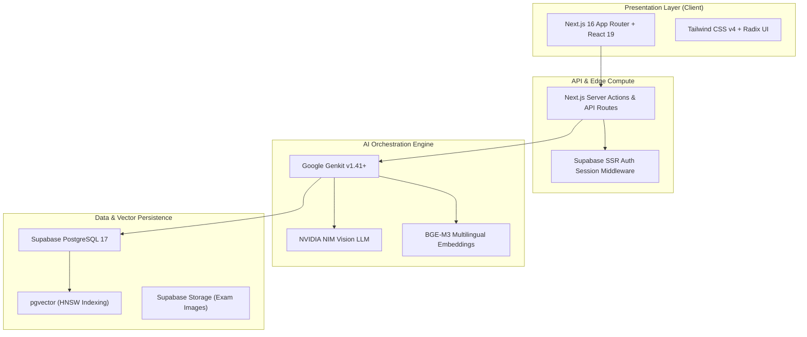

# System Architecture & AI Engineering

  FULL-STACK CLOUD ARCHITECTURE
  NEXT.JS 16 &amp; GENKIT AI

Welcome to the **SheraTutor Architecture & AI Engineering Hub**. This section documents the end-to-end technical implementation of SheraTutor, spanning the Next.js 16 App Router frontend, Supabase PostgreSQL 17 database with pgvector, Google Genkit AI orchestration flows, and Microsoft Azure AI Foundry deployment blueprints.

---

## Architecture & Engineering Directory

-   :material-sitemap: **[System Architecture Report](system-architecture.md)**

    ---

    Complete architecture topology covering Next.js 16, React 19, Supabase SSR, pgvector indexing, and NVIDIA NIM vision extraction.

    [:octicons-arrow-right-24: Inspect System Topology](system-architecture.md)

-   :material-folder-cog-outline: **[Codebase Anatomy Report](codebase-anatomy.md)**

    ---

    In-depth structural breakdown of `web/` and backend packages, API routes, Server Actions, state management, and shared components.

    [:octicons-arrow-right-24: Explore Codebase Anatomy](codebase-anatomy.md)

-   :material-cpu-64-bit: **[Google Genkit Architecture](genkit-architecture.md)**

    ---

    Detailed specification of Google Genkit v1.41+ flow engine, Reflection API, OpenTelemetry tracing, and plugin architecture.

    [:octicons-arrow-right-24: Read Genkit Deep Dive](genkit-architecture.md)

-   :material-transit-connection-variant: **[SheraTutor + Genkit Integration](genkit-integration-plan.md)**

    ---

    Step-by-step implementation of 7 production AI flows (rubric evaluation, Bengali/English tutoring, LaTeX rendering, vector search).

    [:octicons-arrow-right-24: View Integration Specs](genkit-integration-plan.md)

-   :material-microsoft-azure: **[Azure Foundry Blueprint](foundry-integration-blueprint.md)**

    ---

    Enterprise migration blueprint to Azure AI Foundry Agent Service, Agent Canvas, Model Router latency switching, and MCP server tooling.

    [:octicons-arrow-right-24: Review Foundry Blueprint](foundry-integration-blueprint.md)

-   :material-database-sync: **[Multimodal Vector DB Blueprint](multimodal-vector-foundry.md)**

    ---

    Architecture for scaling the NCTB multimodal vector database with Azure AI Search, hybrid reciprocal rank fusion, and Supabase pgvector.

    [:octicons-arrow-right-24: Inspect Vector Blueprint](multimodal-vector-foundry.md)

-   :material-account-switch: **[Developer Hand-Off Guide](developer-handoff-guide.md)**

    ---

    Complete engineering hand-off guide for B2C SSC Web Portal developers covering local setup, environment variables, and deployment workflows.

    [:octicons-arrow-right-24: Open Hand-Off Guide](developer-handoff-guide.md)

-   :material-book-cog: **[LLM, RAG & Vector Guide](llm-rag-vector-guide.md)**

    ---

    Practical guide to state-of-the-art LLMs, hybrid RAG retrieval pipelines, chunking heuristics, and AI orchestration best practices.

    [:octicons-arrow-right-24: Read Technical Guide](llm-rag-vector-guide.md)

---

## Core System Technology Stack

