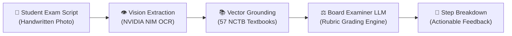

# SheraTutor Documentation Portal

  OFFICIAL PRODUCTION SPECIFICATIONS
  NCTB SSC &amp; HSC CURRICULUM READY
  v2.4 PRODUCTION

> **"SheraTutor, for Shera Students."**  
> Bangladesh's first AI board examiner and personalized learning workspace — engineered specifically for secondary and higher secondary candidates, providing instant handwritten script grading, rubric-grounded step evaluations, and bilingual curriculum tutoring.

---

## Architecture & System Highlights

### ✨ Dual-Engine AI Examiner & Learning Workspace

SheraTutor combines multimodal vision extraction with national curriculum vector grounding to replicate the rigor of official Bangladesh Education Board examiners. Students photograph handwritten exam scripts, which are evaluated against official rubrics within 3.5 seconds.

[→ Explore System Architecture](architecture/system-architecture)

### 📚 57 NCTB Textbooks

Complete physical cataloging and multimodal ingestion of all Class 9–10 textbooks (6,432 curriculum pages) across Science, Commerce, and Humanities.

- **Embedding Model**: BGE-M3 Dense + Sparse
- **Storage**: Supabase PostgreSQL 17 + pgvector
- **Recall Rate**: > 98.4% textbook grounding

[→ View Ingestion Pipeline](pipelines/textbook-corpus-report)

### ⚡ Google Genkit Engine

Engineered with Google Genkit v1.41+ running 7 specialized production AI flows with OpenTelemetry distributed tracing and the Reflection API.

- **Streaming**: Server-Sent Events (SSE)
- **Rubrics**: Step-by-step mark deduction
- **Bilingual**: Bengali & English reasoning

[→ Genkit Deep Dive](architecture/genkit-architecture)

### 🖥️ Interactive Visual Explorers

8 self-contained interactive web applications and simulation dashboards visualizing every layer of our technology stack:

  <a href="visual-explorers/apps/sheratutor-architecture.html" target="_blank" className="app-pill">SheraTutor Architecture</a>
  <a href="visual-explorers/apps/genkit-architecture.html" target="_blank" className="app-pill">Google Genkit Explorer</a>
  <a href="visual-explorers/apps/genkit-integration.html" target="_blank" className="app-pill">SheraTutor + Genkit Flows</a>
  <a href="visual-explorers/apps/azure-foundry.html" target="_blank" className="app-pill">Azure AI Foundry</a>
  <a href="visual-explorers/apps/multimodal-foundry.html" target="_blank" className="app-pill">Multimodal Vector DB</a>
  <a href="visual-explorers/apps/foundry-transformation.html" target="_blank" className="app-pill">Transformation Blueprint</a>
  <a href="visual-explorers/apps/corpus-audit-dashboard.html" target="_blank" className="app-pill">Corpus Audit Dashboard</a>
  <a href="visual-explorers/apps/boardmate-pitch-deck.html" target="_blank" className="app-pill">BoardMate Pitch Deck</a>

[→ Open Visual Explorers Showcase Hub](visual-explorers/index)

### 📋 Specifications & SRS

Complete IEEE Std 830-compliant Software Requirements Specification (SRS), launch checklists, and institutional B2B business modeling.

- **Candidate Reach**: ~3.2M students/year
- **Student Pricing**: 100% Free Forever
- **Model**: Subsidized by school B2B licenses

[→ Read Requirements Spec](overview/software-requirements-spec)

### 🧪 Automated QA & Testing

7 end-to-end browser test suites validating camera uploads, Bangla OCR parsing, persistence recovery, and WCAG AA accessibility compliance.

- **Suites Passed**: 7 of 7 suites green
- **Persistence**: Zero-loss session state
- **Devices**: Mobile (375px), Tablet, Desktop

[→ Inspect Test Results](quality/automated-testing-report)

---

## Documentation Sections

-   🧭 **[Overview & Strategy](overview/index)**

    ---

    Core product vision, mission, market sizing (~3.2M candidates annually), institutional SaaS model, design tokens, and launch checklists.

    [→ Browse Overview](overview/index)

-   🏛️ **[System Architecture & AI](architecture/index)**

    ---

    Full-stack architecture report covering Next.js 16 App Router, React 19, Supabase Postgres 17, pgvector, Google Genkit, and Azure Foundry blueprints.

    [→ Explore Architecture](architecture/index)

-   📖 **[Curriculum & Ingestion](pipelines/index)**

    ---

    Complete audit of all 57 NCTB Class 9–10 textbooks (6,432 pages), multimodal NVIDIA NIM Vision extraction, and physics/chemistry RAG pipelines.

    [→ Inspect Pipelines](pipelines/index)

-   🛡️ **[Quality Assurance & Audits](quality/index)**

    ---

    IEEE QA test suites, automated browser testing walkthroughs, live database persistence audits, and codebase gap analyses.

    [→ View QA Audits](quality/index)

-   🖥️ **[Visual Explorers Hub](visual-explorers/index)**

    ---

    8 interactive web apps exploring architecture, Genkit flows, Foundry services, and corpus telemetry, plus whitepaper and pitch deck downloads.

    [→ Open Explorers Hub](visual-explorers/index)

-   ☁️ **[Azure Foundry Reference](azure-foundry/index)**

    ---

    Exhaustive 63-document technical reference library covering Microsoft Azure AI Foundry Agent Service, Agent Canvas, Model Router, and MCP tooling.

    [→ Browse Foundry Reference](azure-foundry/index)

---

## Key Platform Metrics

| Metric | Target / Verified | Verification Method / Status |
|---|---|---|
| **Annual Candidate Target** | ~3.2 Million SSC & HSC candidates | BANBEIS Official Education Census |
| **NCTB Textbook Corpus** | 57 Textbooks (6,432 curriculum pages) | Physical Cataloged & Checksum Verified |
| **Frontend Framework** | Next.js 16 + React 19 + Tailwind CSS v4 | Production Web App (`web/`) |
| **Database & Vector Engine** | PostgreSQL 17 + pgvector (HNSW) | Supabase Hosted Database |
| **AI Orchestration** | Google Genkit v1.41+ & NVIDIA NIM Vision | Hybrid Dense/Sparse RAG Pipeline |
| **Grading Latency SLA** | &lt; 3.5s per handwritten exam page | Server-Sent Events (SSE) Streaming |
| **Student Access** | 100% Free Forever | Subsidized by Institutional B2B SaaS |
