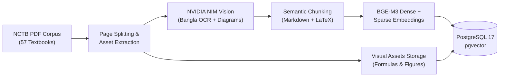

# Curriculum Corpus & Ingestion Pipelines

  CURRICULUM INGESTION &amp; HYBRID RAG
  57 NCTB TEXTBOOKS &bull; 6,432 PAGES

Welcome to the **SheraTutor Ingestion & RAG Pipelines Hub**. To ensure 100% curriculum grounding and eliminate model hallucination for secondary candidates, SheraTutor ingests and catalogs all 57 NCTB Class 9–10 national textbooks using multimodal vision LLMs, high-resolution visual asset preservation, and dense/sparse hybrid vector search.

---

## Pipelines & Corpus Directory

-   📚 **[NCTB Textbook Corpus Complete Report](textbook-corpus-report)**

    ---

    Exhaustive physical catalog of all 57 textbooks (6,432 pages) across Science, Commerce, and Humanities tracks, with MD5 checksums and page breakdown.

    [→ Read Full Corpus Report](textbook-corpus-report)

-   ✅ **[End-to-End Ingestion Report](multimodal-ingestion-report)**

    ---

    Physical verification report of the RAG ingestion pipeline, NVIDIA NIM vision extraction accuracy, chunking strategies, and database persistence.

    [→ Inspect Verification Report](multimodal-ingestion-report)

-   📐 **[Multimodal Ingestion Blueprint](multimodal-ingestion-blueprint)**

    ---

    Architecture specification for multimodal ingestion combining NVIDIA NIM Vision LLM, diagram extraction, BGE-M3 embeddings, and Supabase pgvector.

    [→ View Multimodal Blueprint](multimodal-ingestion-blueprint)

-   👁️ **[Local Vision Extraction Plan](local-vision-extraction)**

    ---

    Implementation guide for running local vision models (Qwen2-VL, Surya OCR) to extract diagrams, formulas, and tabular data with high precision.

    [→ Read Vision Extraction Plan](local-vision-extraction)

-   ⚛️ **[Bilingual Physics RAG Pipeline](physics-rag-pipeline)**

    ---

    Domain-optimized RAG pipeline for NCTB SSC Physics, handling Bengali-English terminology, mathematical formula grounding, and diagram retrieval.

    [→ Explore Physics Pipeline](physics-rag-pipeline)

-   🧪 **[Chemistry Ingestion Pipeline Overhaul](chemistry-ingestion-pipeline)**

    ---

    Ground-truth ingestion architecture for SSC Chemistry, covering chemical equations, periodic tables, valence representations, and reaction balancing.

    [→ View Chemistry Pipeline](chemistry-ingestion-pipeline)

-   ⚠️ **[Physics Live Database Audit](physics-live-audit)**

    ---

    Audit findings from querying the live hosted database, checking vector similarity scores, chunk boundary integrity, and retrieval recall.

    [→ Inspect Database Audit](physics-live-audit)

-   🎯 **[Multimodal Verification Walkthrough](multimodal-verification)**

    ---

    Step-by-step verification walkthrough demonstrating physical textbook extraction, embedding generation, and live RAG query execution.

    [→ Read Walkthrough](multimodal-verification)

---

## Ingestion Pipeline Topology

