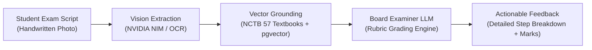

# SheraTutor Documentation Portal

  OFFICIAL REPOSITORY SPECIFICATIONS
  NCTB SSC &amp; HSC CURRICULUM READY

> **"SheraTutor, for Shera Students."**  
> Bangladesh's first AI board examiner and personalized learning workspace — engineered specifically for secondary and higher secondary candidates, providing instant handwritten script grading, rubric-grounded feedback, and bilingual curriculum tutoring.

---

## Documentation Sections

-   :material-compass-outline: **[Overview & Vision](SheraTutor_Full_Project_Documentation.md)**

    ---

    Core product thesis, mission, Bangladesh EdTech market sizing (~3.2M candidates annually), institutional business model, and brand design tokens.

    [:octicons-arrow-right-24: Explore Vision & Strategy](SheraTutor_Full_Project_Documentation.md)

-   :material-clipboard-check-outline: **[Specifications & Audits](SheraTutor_Software_Requirements_Specification.md)**

    ---

    IEEE Std 830-compliant Software Requirements Specification (SRS), launch checklists, codebase gap analysis, browser QA test suites, and compliance audits.

    [:octicons-arrow-right-24: View System Specs](SheraTutor_Software_Requirements_Specification.md)

-   :material-book-open-page-variant-outline: **[Ingestion & RAG Pipelines](NCTB_Class_9_10_Textbook_Corpus_Complete_Report.md)**

    ---

    Complete audit of all 57 NCTB Class 9–10 textbooks (6,432 pages), multimodal NVIDIA NIM Vision extraction, BGE-M3 hybrid vector search, and physics/chemistry pipelines.

    [:octicons-arrow-right-24: Inspect Ingestion Pipelines](NCTB_Class_9_10_Textbook_Corpus_Complete_Report.md)

-   :material-cpu-64-bit: **[Genkit & System Architecture](antigravity-docs/SHERATUTOR_SYSTEM_ARCHITECTURE_REPORT.md)**

    ---

    Full-stack architecture report covering Next.js 16 App Router, React 19, Supabase Postgres 17, pgvector, and Google Genkit v1.41+ AI flow integrations.

    [:octicons-arrow-right-24: Explore System Architecture](antigravity-docs/SHERATUTOR_SYSTEM_ARCHITECTURE_REPORT.md)

-   :material-television-play: **[Interactive Visual Explorers](antigravity-docs/sheratutor_interactive_explorer.html)**

    ---

    Self-contained interactive visualizers for SheraTutor system architecture, Google Genkit flows, Microsoft Foundry topologies, and the BoardMate AI pitch deck.

    [:octicons-arrow-right-24: Launch Visual Explorers](antigravity-docs/sheratutor_interactive_explorer.html)

-   :material-microsoft-azure: **[Azure Foundry Reference](crawled_docs/what-is-foundry.md)**

    ---

    Exhaustive 63-document technical reference library covering Microsoft Azure AI Foundry Agent Service, Agent Canvas, Model Router, MCP protocols, and OpenTelemetry observability.

    [:octicons-arrow-right-24: Browse Foundry Reference](crawled_docs/what-is-foundry.md)

---

## Key Platform Metrics

| Metric | Target / Verified | Source / Status |
|---|---|---|
| **Annual Candidate Target** | ~3.2 Million SSC/HSC students | BANBEIS Education Statistics |
| **NCTB Textbook Corpus** | 57 Textbooks (6,432 curriculum pages) | Fully Cataloged & Ingested |
| **Frontend Stack** | Next.js 16 + React 19 + Tailwind CSS v4 | Production Web App (`web/`) |
| **Database & Vector Engine** | PostgreSQL 17 + pgvector + Supabase SSR | Live Hosted Database |
| **AI Orchestration** | Google Genkit v1.41+ & NVIDIA NIM Vision | Hybrid RAG Pipeline |
| **Student Pricing** | 100% Free Forever | Subsidized by Institutional B2B SaaS |

---

## Architectural Highlights

