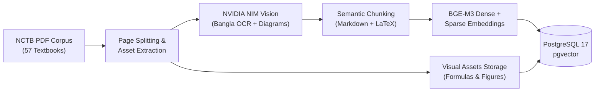

# Curriculum Corpus & Ingestion Pipelines

  CURRICULUM INGESTION &amp; HYBRID RAG
  57 NCTB TEXTBOOKS &bull; 6,432 PAGES

Welcome to the **SheraTutor Ingestion & RAG Pipelines Hub**. To ensure 100% curriculum grounding and eliminate model hallucination for secondary candidates, SheraTutor ingests and catalogs all 57 NCTB Class 9–10 national textbooks using multimodal vision LLMs, high-resolution visual asset preservation, and dense/sparse hybrid vector search.

---

## Pipelines & Corpus Directory

-   :material-book-open-page-variant: **[NCTB Textbook Corpus Complete Report](textbook-corpus-report.md)**

    ---

    Exhaustive physical catalog of all 57 textbooks (6,432 pages) across Science, Commerce, and Humanities tracks, with MD5 checksums and page breakdown.

    [:octicons-arrow-right-24: Read Full Corpus Report](textbook-corpus-report.md)

-   :material-file-document-check: **[End-to-End Ingestion Report](multimodal-ingestion-report.md)**

    ---

    Physical verification report of the RAG ingestion pipeline, NVIDIA NIM vision extraction accuracy, chunking strategies, and database persistence.

    [:octicons-arrow-right-24: Inspect Verification Report](multimodal-ingestion-report.md)

-   :material-layers-triple: **[Multimodal Ingestion Blueprint](multimodal-ingestion-blueprint.md)**

    ---

    Architecture specification for multimodal ingestion combining NVIDIA NIM Vision LLM, diagram extraction, BGE-M3 embeddings, and Supabase pgvector.

    [:octicons-arrow-right-24: View Multimodal Blueprint](multimodal-ingestion-blueprint.md)

-   :material-eye-check: **[Local Vision Extraction Plan](local-vision-extraction.md)**

    ---

    Implementation guide for running local vision models (Qwen2-VL, Surya OCR) to extract diagrams, formulas, and tabular data with high precision.

    [:octicons-arrow-right-24: Read Vision Extraction Plan](local-vision-extraction.md)

-   :material-atom: **[Bilingual Physics RAG Pipeline](physics-rag-pipeline.md)**

    ---

    Domain-optimized RAG pipeline for NCTB SSC Physics, handling Bengali-English terminology, mathematical formula grounding, and diagram retrieval.

    [:octicons-arrow-right-24: Explore Physics Pipeline](physics-rag-pipeline.md)

-   :material-flask: **[Chemistry Ingestion Pipeline Overhaul](chemistry-ingestion-pipeline.md)**

    ---

    Ground-truth ingestion architecture for SSC Chemistry, covering chemical equations, periodic tables, valence representations, and reaction balancing.

    [:octicons-arrow-right-24: View Chemistry Pipeline](chemistry-ingestion-pipeline.md)

-   :material-database-alert: **[Physics Live Database Audit](physics-live-audit.md)**

    ---

    Audit findings from querying the live hosted database, checking vector similarity scores, chunk boundary integrity, and retrieval recall.

    [:octicons-arrow-right-24: Inspect Database Audit](physics-live-audit.md)

-   :material-check-decagram: **[Multimodal Verification Walkthrough](multimodal-verification.md)**

    ---

    Step-by-step verification walkthrough demonstrating physical textbook extraction, embedding generation, and live RAG query execution.

    [:octicons-arrow-right-24: Read Walkthrough](multimodal-verification.md)

---

## Ingestion Pipeline Topology

