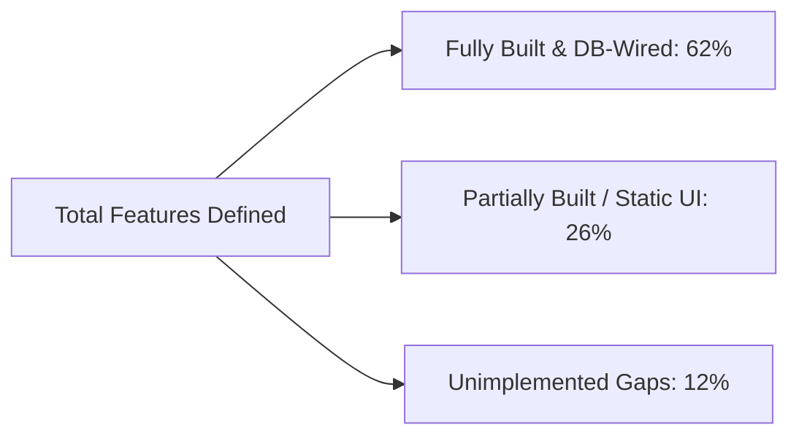
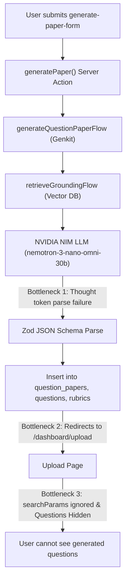
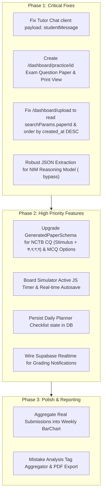

# SheraTutor: In-Depth Codebase Review & Feature Gap Analysis

An exhaustive audit of the `@web` codebase (`/home/syed/workspace/Sheratutor/web`) and the live **PostgreSQL 17** database on Supabase (`qjottictwewysfcjirma`) was conducted to compare existing implementations against the **SheraTutor Product Architecture & Feature Specification**.

---

## 1. Implementation Status Overview

---

## 2. Module-by-Module Review: Implemented vs. Gaps

### Module 1: Landing Page & Public Access (`/`)

#### What Has Already Been Implemented
- **Landing Page Shell & Header**: Built in `web/src/app/page.tsx` with bilingual navigation, animated Khata paper preview (`KhataPreview`), and responsive layouts.
- **Waitlist & Lead Capture Form**: Built in `web/src/components/waitlist-form.tsx` and wired to Server Action `web/src/app/actions/waitlist.ts`.
  - Captures `fullName`, `phone` (with Bangladeshi regex validation `+8801[3-9]\d{8}`), `email`, `examType` (SSC/HSC), and `targetExamYear` (2026–2030).
  - Persists directly into `public.waitlist_signups` with client IP address hashing for anti-spam.
- **Guardian Consent & PDPA 2026 Compliance**: Checkbox toggle dynamically reveals guardian consent acknowledgment box when `isMinor` is checked.
- **Product Value Pillars**: 3-step workflow (*Camera -> AI Vision Scan -> Step Rubric*) and 3 value proposition cards localized in both Bengali and English.

#### Gaps & Needed Enhancements
1. **SMS OTP Verification**: Guardian consent is currently an unverified checkbox. For full PDPA 2026 minor consent enforcement, an SMS OTP dispatch to `guardian_phone` is required before final submission.
2. **Dynamic Live Counter**: The landing page does not show a live "Total students joined" counter from `waitlist_signups`.

---

### Module 2: Authentication (`/login`, `/signup`) & Onboarding

#### What Has Already Been Implemented
- **Email/Password & Multi-Provider Sign-In**: Built in `web/src/app/login/page.tsx` and `web/src/app/signup/page.tsx`, calling Server Actions in `web/src/app/actions/auth.ts`.
- **Google OAuth Integration**: Configured in Supabase Auth client (`signInWithOAuth({ provider: 'google' })`).
- **Student Profile Creation & Onboarding Flow**: Built in `web/src/app/onboarding/page.tsx` and `web/src/app/actions/onboarding.ts`.
  - Collects Date of Birth (calculates `is_minor` <= 18 cutoff), Education Board (all 11 BD boards), Academic Group (`SCIENCE`, `HUMANITIES`, `BUSINESS_STUDIES`), and Target Year.
  - Enforces DB-level check constraint `chk_minor_requires_consent` requiring `guardian_consent_at`.
  - Auto-inserts base user profile via PostgreSQL trigger `trg_on_auth_user_created`.

#### Gaps & Needed Enhancements
1. **Password Reset Flow**: Forgot password / magic link recovery route (`/forgot-password`) is missing.
2. **Session Hydration on OAuth Return**: OAuth redirect callback in `/auth/callback/route.ts` exchanges the auth code, but does not verify if the user needs onboarding redirection if `student_profiles` row is missing.

---

### Module 3: Main Dashboard / Workspace (`/dashboard`)

#### What Has Already Been Implemented
- **Server-Side Data Loader**: Built in `web/src/app/dashboard/page.tsx`, fetching live `student_profiles`, `exam_submissions`, `subjects`, `weakness_logs`, and active `study_plans`.
- **Exam Readiness & Board Prediction Widget**: Built in `web/src/components/pages/DashboardPageClient.tsx`.
  - Calculates real average score %, GPA grade letter (`A+`, `A`, `A-`, `B`, `C`, `F`), percentile rank, and momentum score ring (`ScoreRing`).
- **Curriculum Subjects Overview**: Renders subject cards (Physics, Chemistry, Higher Math, English) with mastery percentage derived from `weakness_logs`.
- **Today's Focus Daily Tasks**: Reads and displays day-1 schedule from `study_plans.daily_schedule_json`.
- **Assessment Activity & Momentum Tracker**: Shows total tests submitted, term average, and momentum percentage.

#### Gaps & Needed Enhancements
1. **Weekly Trend Bar Chart**: `BarChart.tsx` renders static mock bar heights instead of aggregating the student's submissions over the last 7 days (Monday–Sunday).
2. **Task Completion State Sync**: Checking a daily task on the dashboard modifies React state only; it does not persist task completion back to the database.

---

### Module 4: Socratic AI Tutor (`/dashboard/tutor`)

#### What Has Already Been Implemented
- **Subject & Topic Selector**: Built in `web/src/components/tutor-page-client.tsx`. Dynamically loads subjects and chapters from `public.subjects` and `public.chapters`.
- **KaTeX / LaTeX Rendering**: Markdown pipeline configured with `remark-math` and `rehype-katex` for formula display ($W = \Delta K$).
- **Socratic Examiner Persona & Guardrails**: Built in `web/src/ai/flows/tutor-chat.ts`.
  - `stripLeadingGreeting`: Strips repetitive greetings.
  - `normalizeLatexDelimiters`: Normalizes math wrappers to `$...$` and `$$...$$`.
  - **Minor Safety Triage**: `preFilterSafety` intercepts self-harm patterns in Bengali/English and returns **Kaan Pete Roi** helpline (`০৯৬১৩৪২৭৮০০`) while logging a `SAFETY_ESCALATION` in `audit_log`.
  - **Daily Rate Limiting**: Capped at 50 queries per student per Asia/Dhaka day.
  - **Hybrid RAG Grounding**: Queries textbook chunks per turn in `general` mode.

#### Gaps & Needed Enhancements
1. **API Request Body Field Alignment**: In `web/src/components/tutor-page-client.tsx`, the client sends `{ message: query, studentLanguagePreference: ... }`, whereas `web/src/app/api/tutor-chat/route.ts` expects `{ studentMessage: string, languagePreference: ... }`. This mismatch causes general tutor chat requests to return HTTP 400 (`studentMessage is required`).
2. **Past Sessions Drawer / History**: `TutorPageClient` accepts `initialSessions`, but the session history list is not rendered in the sidebar for switching between past conversations.

---

### Module 5: Mock Exams (`/dashboard/practice`)

#### What Has Already Been Implemented
- **Question Paper Bank**: Built in `web/src/app/dashboard/practice/page.tsx` and `ExamsPageClient.tsx`. Loads question papers from `public.question_papers`.
- **Custom Question Paper Generator**: Built in `web/src/app/dashboard/practice/generate/page.tsx`, `generate-paper-form.tsx`, and `generate-paper.ts`.
  - Synthesizes Board-standard CQ/MCQ papers via Genkit `generateQuestionPaperFlow` grounded in curriculum chunks.
  - Generates matching grading rubrics in `public.rubrics` and questions in `public.questions`.

#### Gaps & Needed Enhancements
1. **Missing Dynamic Route**: Clicking *"Start exam"* (`/dashboard/practice/${p.id}`) leads to a 404 because the dynamic page `/dashboard/practice/[id]/page.tsx` is not yet created.
2. **Interactive Filters**: Filter chips (Subject, Chapter, Board, Difficulty) are visual buttons without active client-side filtering over the papers list.

---

### Module 6: Board Simulator (`/dashboard/board-simulator`)

#### What Has Already Been Implemented
- **Exam Screen & Layout**: Built in `web/src/components/pages/ExamsPageClient.tsx`. Simulates the board exam header, full marks, Part A MCQs, option selection, and exit safety controls.

#### Gaps & Needed Enhancements
1. **Static Timer**: The 3-hour timer (`02:59:48`) is static text rather than an active JS countdown timer with auto-submit on expiration.
2. **Hardcoded Questions**: Questions are hardcoded mock items rather than querying questions from a specific `question_paper_id`.
3. **Missing Part B (Creative Questions / CQ)**: Does not render the Stimulus (উদ্দীপক) + sub-questions `(ক, খ, গ, ঘ)` view or provide a direct upload bridge for handwritten Part B scripts.
4. **No MCQ State Persistence**: Selected MCQ options are not saved to the backend during the test.

---

### Module 7: AI Grading & Script Upload (`/dashboard/upload`)

#### What Has Already Been Implemented
- **Multi-Page Upload UI**: Built in `web/src/components/upload-form.tsx` with native mobile camera capture (`capture="environment"`), gallery picker, client-side downscale compression (`compressImage`), thumbnail preview, reordering, and question-to-page tagging.
- **Supabase Storage Pipeline**: Uploads to `submission-pages` bucket and creates signed pre-authenticated URLs.
- **Async Queue Enqueue**: `POST /api/submissions` inserts `exam_submissions` and invokes `enqueue_grading_job(submission_id)` on **PGMQ**.
- **Multi-Layer Grading Engine**: Built in `web/src/ai/flows/grade-submission.ts`:
  - Layer 1: Vision OCR transcription (`transcribe.ts`).
  - Layer 2: Hybrid RAG grounding (`retrieve-grounding.ts`).
  - Layer 3+4: Step rubric evaluation (`evaluate-rubric.ts`) with anti-hallucination image cross-checking.

#### Gaps & Needed Enhancements
1. **Background Queue Cron Execution**: The background queue worker route `/api/internal/process-grading-queue` is functional, but automated execution requires setting up a remote HTTP cron schedule (e.g. Supabase `pg_cron` or Vercel Cron) targeting the deployed production URL.
2. **Answer Sheet QR Scanner**: Physical answer sheet QR code decoder is designed in schema (`answer_sheet_qr_token`) but client-side camera auto-detection is not yet implemented.

---

### Module 8: Results & Submission History (`/dashboard/submissions`)

#### What Has Already Been Implemented
- **Submission Timeline & Archive**: Built in `web/src/app/dashboard/submissions/page.tsx` and `SubmissionsPageClient.tsx`, listing past submissions with scores and status tags.
- **Detailed Evaluation Scorecard (`/dashboard/submissions/[id]`)**: Built in `web/src/app/dashboard/submissions/[id]/page.tsx` and `SubmissionDetailClient.tsx`.
  - Displays 5-step evaluation progress, Board grade stamp, performance breakdown bars across criteria, photographed script viewer, and question-by-question observations.
- **"Explain Simply" AI Tutor Integration**: Each evaluated question includes an `ExplainSimplyButton` opening a dedicated side panel (`tutor-chat-panel.tsx`) pre-loaded with the exact question and mark deduction reason.

#### Gaps & Needed Enhancements
1. **Performance Delta Calculation**: Displays static difference rather than comparing score against the student's immediate prior submission in the same subject.
2. **Multi-Page Script Viewer**: Script preview currently shows page 1 only; thumbnail switching between all uploaded pages is needed.

---

### Module 9: Mistake Analysis & Marks Recovery (`/dashboard/mistake-analysis`)

#### What Has Already Been Implemented
- **Recoverable Marks Calculation**: Built in `web/src/app/dashboard/mistake-analysis/page.tsx` and `MistakesPageClient.tsx`. Calculates recoverable marks by aggregating `weakness_logs.total_marks_lost`.
- **Targeted Practice Links**: Lists weak chapters with direct links to practice them in the AI Tutor.

#### Gaps & Needed Enhancements
1. **Cognitive Error Classification Breakdown**: The Conceptual vs. Mechanical error split is currently a heuristic (78% vs 22%) rather than aggregating structured deduction tags from `grading_results.rubric_breakdown_json`.
2. **Download Report**: The *"Download Report"* button has no export/PDF generator attached.

---

### Module 10: Adaptive Study Planner (`/dashboard/study-plan`)

#### What Has Already Been Implemented
- **Deterministic 14-Day Spaced Repetition Planner**: Built in `web/src/app/actions/study-plan.ts`. Reads student's highest weakness score chapters and distributes review slots across a 14-day cycle.
- **Planner UI & Daily Checklist**: Built in `web/src/app/dashboard/study-plan/page.tsx` and `PlannerPageClient.tsx`.
- **Targeted Weakness Recommendations**: Displays dynamic recommendation based on the top weakness chapter.

#### Gaps & Needed Enhancements
1. **Checklist Persistence**: Toggling task checkboxes in `PlannerPageClient.tsx` updates local React state only; task completion is not persisted to the database.
2. **Dynamic Streak Calculation**: Streak is displayed as static *"7 day streak"* instead of calculating consecutive daily active submission/study dates.

---

### Module 11: Achievements & Gamification (`/dashboard/achievements`)

#### What Has Already Been Implemented
- **XP & Level Progression Engine**: Built in `web/src/app/dashboard/achievements/page.tsx` and `AchievementsPageClient.tsx`.
  - Dynamically calculates XP ($150\text{ XP} \times \text{tests} + 10 \times \text{score}$), Level, and academic rank title (*Apprentice Learner -> Rising Scholar -> Board Scholar*).
- **Dynamic Milestone Badges**: 4 milestone badges (*Practice Consistency, Accuracy Milestone 80%+, XP Growth, Board Readiness*) that unlock dynamically based on live student metrics.

#### Gaps & Needed Enhancements
1. **Shareable Progress**: The *"Share"* button has no handler attached (needs Web Share API / clipboard link generator).
2. **Dedicated DB Table**: Badges are computed on-the-fly; a `student_achievements` table is needed to store historical unlock timestamps and celebratory push notifications.

---

### Module 12: Settings & Student Profile (`/dashboard/profile`)

#### What Has Already Been Implemented
- **Academic Profile Management**: Built in `web/src/app/dashboard/profile/page.tsx`, `SettingsPageClient.tsx`, and Server Action `profile.ts`.
  - Updates Name, Exam Type (SSC/HSC), Academic Group, Education Board (all 11 BD boards), and Target Year.
- **PDPA 2026 Privacy Controls**: Checkbox toggle for AI model improvement opt-in (`training_data_opt_in`).
- **Theme & Language Switches**: Integrates ThemeContext (Light/Dark) and LanguageContext (Bangla/English).

#### Gaps & Needed Enhancements
1. **Avatar Upload**: *"Change photo"* button is visual; uploading custom avatars to Supabase Storage is not wired (renders initials).
2. **Settings Tab Switching**: Sidebar tabs (*learning, notifications, appearance, privacy*) switch the active tab state but render on a single continuous page.

---

### Module 13: Global Workspace Utilities

#### What Has Already Been Implemented
- **Bilingual Localization (বাংলা / English)**: Universal context `LanguageContext.tsx` with dictionary in `translations.ts` wired across all components.
- **Quick Search Palette (⌘K / Ctrl+K)**: Universal modal in `web/src/components/Header.tsx` enabling instant keyboard navigation across all modules and tools.
- **Notifications Tray**: Header dropdown in `Header.tsx` with unread badges.
- **Examiner Help Drawer**: Sidebar bottom card linking directly to AI Tutor.

#### Gaps & Needed Enhancements
1. **Real-Time Live Notifications**: Notification tray displays static mockup items; needs Supabase Realtime subscriptions listening to `exam_submissions.status = 'COMPLETED'` to notify students live when grading finishes.

---

## 3. Deep Dive: Exam Question Generation Pipeline Analysis

An in-depth code audit of `generate-question-paper.ts`, `generate-paper.ts`, `generate-paper-form.tsx`, and `upload/page.tsx` revealed critical bottlenecks affecting question synthesis and user output presentation:

### 3.1 Root Causes of Generation & Output Display Failures

1. **Total Absence of a Dedicated Question Paper Display / Viewer Screen**:
   - **Root Cause**: When a question paper is generated, `generatePaper` redirects directly to `/dashboard/upload?paperId=${paper.id}`. The student is taken straight to an upload interface with camera buttons — **the actual questions, stimulus text, and problem statements are never presented on screen for the student to solve!**
   - In addition, on the Practice page (`/dashboard/practice`), clicking *"Start exam"* (`/dashboard/practice/${p.id}`) points to `/dashboard/practice/[id]`, which **does not exist in the codebase**, producing a Next.js `404 Not Found`.

2. **Ignored `paperId` Query Parameter & Missing Default Selection on `/dashboard/upload`**:
   - **Root Cause**: `UploadPage` (`app/dashboard/upload/page.tsx`) does not accept `searchParams` (`paperId`). `UploadForm` defaults state to `papers[0]?.id`. Furthermore, the query fetches up to 20 papers without an `order('created_at', { ascending: false })` clause, causing the newly generated paper to not be selected or loaded.

3. **Reasoning Model (`nemotron-3-nano-omni-30b`) JSON Schema Parsing Crashes**:
   - **Root Cause**: In `generate-question-paper.ts`, `ai.generate` requests `output: { schema: GeneratedPaperSchema }` from `nvidia/nemotron-3-nano-omni-30b-a3b-reasoning`. Reasoning models emit internal chain-of-thought tokens (`<thought>...</thought>`) before the opening JSON brace `{`. This causes Genkit's OpenAI-compatible plugin parser to fail with `"model returned no structured output"` or `JSON.parse` syntax errors.

4. **Lack of NCTB Creative Question (CQ) Structure Separation**:
   - **Root Cause**: `GeneratedQuestionSchema` models questions as flat strings. NCTB Creative Questions (সৃজনশীল প্রশ্ন / CQ) require a **Stimulus (উদ্দীপক)** followed by 4 distinct sub-questions:
     - `ক` (Knowledge / জ্ঞানমূলক - 1 mark)
     - `খ` (Comprehension / অনুধাবনমূলক - 2 marks)
     - `গ` (Application / প্রয়োগমূলক - 3 marks)
     - `ঘ` (Higher Ability / উচ্চতর দক্ষতা - 4 marks)
   - The absence of this schema structure leads to generic paragraph outputs instead of Board-standard formats.

5. **MCQ Options Embedded in Prose Instead of Structured Array**:
   - **Root Cause**: When `paperType: "MCQ"` is selected, choices $(A, B, C, D)$ are dumped into `question_text` as raw text rather than an `options: string[]` array, preventing clickable radio button rendering.

6. **Context Window Overload & Timeout on Multi-Chapter Selection**:
   - **Root Cause**: Selecting 4+ chapters causes 16+ chunks ($>6,000\text{ tokens}$) to be dumped into `groundingContext`, causing the Server Action to exceed Next.js timeout limits or trigger NIM rate-limit throttling.

---

## 4. Prioritized Remediation Roadmap

