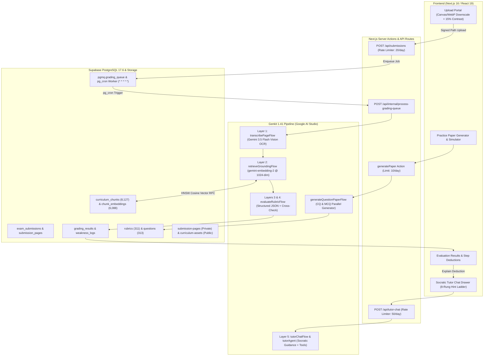
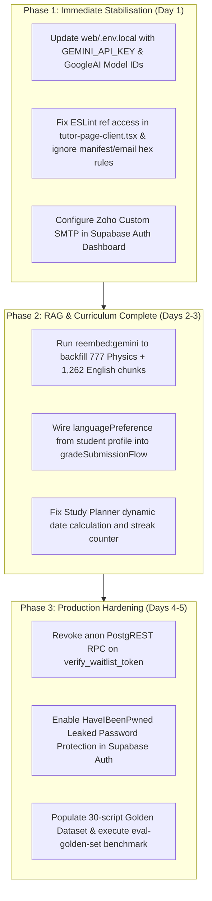

# SheraTutor — Comprehensive Codebase Review & Architectural Audit

**Review Date:** September 20, 2026  
**Scope:** Full repository (`web/`, `supabase/`, `ingestion/`, `training/`, `docs/`, root specifications)  
**Database Target:** Supabase PostgreSQL 17.6 (`qjottictwewysfcjirma`, `ap-south-1`)  
**AI Framework:** Genkit 1.41.0 + Google AI Studio Gemini API (`@genkit-ai/google-genai`)  
**Frontend Framework:** Next.js 16.3.2 (App Router, Turbopack, React 19.2.8, Tailwind CSS v4)  

---

## 1. Executive Summary & System Architecture

SheraTutor is Bangladesh's first AI-driven secondary board examiner and Socratic tutor designed for Secondary School Certificate (SSC) and Higher Secondary Certificate (HSC) students. It grades handwritten answer scripts against authentic National Curriculum and Textbook Board (NCTB) rubrics with step-by-step mark deduction breakdowns, accompanied by a bilingual Socratic tutoring engine.

### Architectural Blueprint

---

## 2. Quantitative Health & Verification Status

| Diagnostic Dimension | Result / Measurement | Assessment |
|---|---|---|
| **Vitest Test Suite** | **8 / 8 test files passed** (57 / 57 unit tests passing) | ✅ Healthy |
| **TypeScript Compilation** | `npx tsc --noEmit` exited with **0 errors** | ✅ Healthy |
| **ESLint Compliance** | 20 errors, 29 warnings (`react-hooks/refs` + hex token rules) | ⚠️ Requires Polish |
| **Production Build** | `next build` compiled cleanly via Turbopack: **35 / 35 routes generated** (PPR, Static, Dynamic) | ✅ 100% Passing |
| **Live Database Connectivity** | Supabase MCP verified: 26 tables, all RLS-enabled | ✅ Healthy |
| **Vector Search Coverage** | 6,088 embeddings in `gemini-embedding-2` (1024-dim) | ⚠️ Math/Chem 100%, Phy 58%, Eng 0% |
| **Row Level Security (RLS)** | 100% of tables have RLS; 12 sensitive tables have FORCE RLS | ✅ Secure |

---

## 3. Deep-Dive Component Audit

### 3.1 Web Frontend & UI/UX (`web/src/app`, `web/src/components`)

#### Strengths:
1. **Low-Bandwidth Mobile Compression**: In [`web/src/components/upload-form.tsx`](file:///home/kratzer/workspace/Github/Sheratutor/web/src/components/upload-form.tsx#L280-L328), client-side Canvas WebP downscaling (`maxDim = 1800`, `quality = 0.82`) with a 15% contrast boost ensures rural Bangladeshi students on metered 3G/4G connections can upload 12MP-48MP photos in ~300KB without losing pencil/ink readability on lined khata paper.
2. **PDPA 2026 Minor Consent Architecture**: In [`web/src/app/onboarding/page.tsx`](file:///home/kratzer/workspace/Github/Sheratutor/web/src/app/onboarding/page.tsx#L27-L40), client-side date-of-birth evaluation triggers a strict under-18 consent gate requiring guardian phone number and explicit consent checkbox, backed by database constraints.
3. **Bangla Typography & Bilingual System**: Font configuration in [`web/src/app/layout.tsx`](file:///home/kratzer/workspace/Github/Sheratutor/web/src/app/layout.tsx) cleanly loads Baloo Da 2 (Bengali Display), Hind Siliguri (Bengali Body), Inter (Latin Body), and Space Mono (Numeric/Stats). The dictionary in [`web/src/data/translations.ts`](file:///home/kratzer/workspace/Github/Sheratutor/web/src/data/translations.ts) supports 100% bilingual UI switching across Bengali and English.
4. **Interactive "Explain It Simply" Drawer**: In [`web/src/components/explain-simply-button.tsx`](file:///home/kratzer/workspace/Github/Sheratutor/web/src/components/explain-simply-button.tsx), students can click "বুঝিয়ে বলো" on any deduction to open a Radix Sheet drawer pre-loaded with the exact question, student answer, and rubric rule.
5. **Real-time Evaluation Streaming**: [`web/src/components/pages/SubmissionDetailClient.tsx`](file:///home/kratzer/workspace/Github/Sheratutor/web/src/components/pages/SubmissionDetailClient.tsx#L87-L106) listens to Supabase Realtime channel `submission-realtime-{id}` to automatically refresh the page when background grading completes.

#### Weaknesses & Gaps:
1. **Hardcoded Demo Data in Planner & Dashboard**:
   - In [`web/src/components/pages/PlannerPageClient.tsx`](file:///home/kratzer/workspace/Github/Sheratutor/web/src/components/pages/PlannerPageClient.tsx#L87-L104), the day numbers `{17 + i}` (rendering days 17 to 23) and `streakCount = 7` are hardcoded.
   - In [`web/src/app/dashboard/study-plan/page.tsx`](file:///home/kratzer/workspace/Github/Sheratutor/web/src/app/dashboard/study-plan/page.tsx#L43-L45), `currentDay = 1` is hardcoded instead of calculating the day offset from `study_plans.start_date`.
   - In [`web/src/app/dashboard/page.tsx`](file:///home/kratzer/workspace/Github/Sheratutor/web/src/app/dashboard/page.tsx#L199), `examType` defaults to `'HSC'` instead of `'SSC'`.
2. **React Compiler Ref Linter Error**:
   - In [`web/src/components/tutor-page-client.tsx`](file:///home/kratzer/workspace/Github/Sheratutor/web/src/components/tutor-page-client.tsx#L1158-L1205), referencing `textareaRef.current` inside an array literal declared inside JSX causes `Cannot access ref value during render` under React 19 rules.
3. **Design-Token Linter Exclusions**:
   - Web App Manifest ([`web/src/app/manifest.ts`](file:///home/kratzer/workspace/Github/Sheratutor/web/src/app/manifest.ts)) and HTML email template ([`web/src/lib/email/templates/waitlist-verification.ts`](file:///home/kratzer/workspace/Github/Sheratutor/web/src/lib/email/templates/waitlist-verification.ts)) fail ESLint `no-restricted-syntax` because web manifests and email clients require raw hex colors and cannot parse CSS design tokens. They need explicit ignore rules in `eslint.config.mjs`.

---

### 3.2 AI Core & Genkit Flows (`web/src/ai`)

#### Strengths:
1. **Google AI Studio Provider Modernization**:
   - In [`web/src/ai/genkit.ts`](file:///home/kratzer/workspace/Github/Sheratutor/web/src/ai/genkit.ts), models are standardized on `googleai/gemini-3.5-flash` and `googleai/gemini-3.5-flash-lite`, with Matryoshka 1024-dim embeddings via `gemini-embedding-2`.
   - Seamless API key rotation across `GEMINI_API_KEYS` ([`genkit.ts`](file:///home/kratzer/workspace/Github/Sheratutor/web/src/ai/genkit.ts#L78-L246)) automatically absorbs free-tier daily rate limits (15 RPM / 1,500 RPD) with automated fallback.
2. **Layered Grading Pipeline with Anti-Hallucination Constraints**:
   - **Layer 1 (Vision OCR)**: [`web/src/ai/flows/transcribe.ts`](file:///home/kratzer/workspace/Github/Sheratutor/web/src/ai/flows/transcribe.ts) explicitly penalizes silent auto-correction, forcing verbatim transcription of incorrect arithmetic or unit slips so students are evaluated on what was actually written.
   - **Layer 2 (Multimodal RAG Grounding)**: [`web/src/ai/flows/retrieve-grounding.ts`](file:///home/kratzer/workspace/Github/Sheratutor/web/src/ai/flows/retrieve-grounding.ts) implements hybrid dense cosine similarity (via pgvector) and full-text search (tsvector), with parent-stimulus resolution for Creative Questions (CQ) and automatic textbook diagram enrichment.
   - **Layers 3 & 4 (Rubric Evaluation)**: [`web/src/ai/flows/evaluate-rubric.ts`](file:///home/kratzer/workspace/Github/Sheratutor/web/src/ai/flows/evaluate-rubric.ts) strictly enforces Zod schema outputs, categorizes mistake taxonomy (`FORMULA_RECALL`, `UNIT_CONVERSION`, `CALCULATION_ERROR`, `CONCEPTUAL_MISCONCEPTION`), and performs vision cross-checks against original page photos.
3. **8-Rung Socratic Hint Ladder**:
   - In [`web/src/ai/flows/tutor-chat.ts`](file:///home/kratzer/workspace/Github/Sheratutor/web/src/ai/flows/tutor-chat.ts#L107-L123), the tutor enforces the pedagogy ladder (H0 Emotional Validation -> H1 Restate Objective -> H2 Concept Pointer -> H3 Leading Question -> H4 Conceptual Roadmap -> H5 Analogous Worked Example -> H6 Fill-in-the-Blank -> H7 Solution Verification).
   - Solution leaks are intercepted deterministically by `detectSolutionLeak` in [`web/src/lib/tutor-format.ts`](file:///home/kratzer/workspace/Github/Sheratutor/web/src/lib/tutor-format.ts).
4. **Deterministic Calculation Tools**:
   - [`web/src/ai/tools/tutor-tools.ts`](file:///home/kratzer/workspace/Github/Sheratutor/web/src/ai/tools/tutor-tools.ts) gives the tutor agent deterministic tools (`verifyPhysicsCalculation`) for kinematics, dynamics, electricity, quadratic roots, arithmetic/geometric progressions, median, and geometry, preventing arithmetic hallucinations.
5. **Minor Safety Guardrails**:
   - In [`web/src/ai/flows/tutor-chat.ts`](file:///home/kratzer/workspace/Github/Sheratutor/web/src/ai/flows/tutor-chat.ts#L21-L26), incoming messages are evaluated for crisis/self-harm patterns before reaching the LLM. Any match immediately bypasses inference, logs `SAFETY_ESCALATION` to `audit_log`, and returns the Bangladesh national helpline (*Kaan Pete Roi: ০৯৬১৩৪২৭৮০০*).
6. **Trusted Rubric Context Security**:
   - In [`web/src/app/api/tutor-chat/route.ts`](file:///home/kratzer/workspace/Github/Sheratutor/web/src/app/api/tutor-chat/route.ts#L239-L267) and [`web/src/lib/tutor/trusted-rubric-context.ts`](file:///home/kratzer/workspace/Github/Sheratutor/web/src/lib/tutor/trusted-rubric-context.ts), rubric evaluation context is loaded directly from PostgreSQL via student ownership checks, preventing client tampering or prompt poisoning.

#### Weaknesses & Gaps:
1. **Critical Environment Misconfiguration (`web/.env.local`)**:
   - `web/.env.local` is missing `GEMINI_API_KEY`.
   - `web/.env.local` still defines retired NVIDIA NIM models (`GENKIT_PAPER_MODEL="nim/nvidia/nemotron-3-nano-30b-a3b"`, `GENKIT_VISION_MODEL="nim/meta/llama-3.2-11b-vision-instruct"`), even though `genkit.ts` does not register the `nim` plugin.
   - This directly caused README Issue #2 (`UNKNOWN: Connection error` on practice paper generation).
2. **Hardcoded Bangla Language Preference in Grading**:
   - In [`web/src/ai/flows/grade-submission.ts`](file:///home/kratzer/workspace/Github/Sheratutor/web/src/ai/flows/grade-submission.ts#L149-L164), `languageTag: "bn"` and `studentLanguagePreference: "bn"` are hardcoded, forcing English-medium students into Bengali summaries.
3. **Failed Real Submission Retry**:
   - Submission `fabf04e4-bfd5-48de-8477-43b73e4e523a` failed before commit `6c7f36a` signed storage URLs and remains in `FAILED` status.

---

### 3.3 Database & Backend Architecture (`supabase/`)

#### Strengths:
1. **36 Sequential, Auditable Migrations**:
   - All migrations applied cleanly to PostgreSQL 17.6.
   - Strict numeric precision: Marks stored as `numeric(5,2)` or `numeric(6,2)` across `questions`, `rubrics`, and `exam_submissions`, preventing floating-point accumulation bugs.
2. **Asynchronous Processing Queue**:
   - Migrations `0018`, `0026`, and `0034` implemented `pgmq` queueing (`grading_queue`) with a dedicated background worker route (`/api/internal/process-grading-queue`).
   - `pg_cron` schedules the worker at `* * * * *` (every minute) using an encrypted token retrieved directly from Supabase Vault (`vault.decrypted_secrets`), eliminating hardcoded secrets.
3. **Multi-Tenancy & Provenance Tracking**:
   - `institution_id` is denormalized across `exam_submissions`, `submission_pages`, `grading_results`, and `questions` for airtight RLS isolation.
   - Every grading result records `model_name`, `model_version`, `prompt_version`, `rubric_version_id`, and `pipeline_version`.
4. **Security Hardening**:
   - Migration `20260914023000` added trigger `prevent_profile_role_escalation` on `profiles` to block privilege escalation and revoked anon read access on `questions.mcq_correct_option`.

#### Weaknesses & Gaps:
1. **Supabase Security Advisory (Public Security Definer RPC)**:
   - `public.verify_waitlist_token` remains callable by `anon` and `authenticated` via PostgREST RPC (`/rest/v1/rpc/verify_waitlist_token`). While `search_path` was pinned to empty string, Supabase security linter flags it as `WARN`.
2. **Unused Indexes**:
   - 31 indexes flagged as unused by Supabase performance linter. These represent future queries (such as B2B institution joins and golden set runs) and should be preserved until production traffic benchmarks.
3. **Supabase Auth Email Rate Limit (README Issue #1)**:
   - Built-in Supabase Auth SMTP limits emails to 3-4/hour, causing `"email rate limit exceeded"` on new signups. Custom SMTP (using the configured Zoho credentials) must be enabled in the Supabase Dashboard.

---

### 3.4 Curriculum Ingestion & Multimodal Pipelines (`ingestion/`)

#### Strengths:
1. **Full Textbook Corpus Downloaded**:
   - All 66 official NCTB Class 9-10 textbooks (Bangla and English versions, 2.4 GB total) are downloaded and stored in `ingestion/textbooks/` with SHA-256 checksums verified in `CHECKSUMS.sha256`.
2. **High-Fidelity Extraction & Diagram Cropping**:
   - `gemini_vision_extract.py` and `crop_figures_gemini.py` extract clean Markdown, LaTeX formulas, and cropped diagrams directly into `curriculum-assets` Supabase bucket.
3. **Completed Curricula**:
   - Mathematics: 3,943 chunks (100% embedded).
   - Chemistry: 1,072 chunks (100% embedded).

#### Weaknesses & Gaps:
1. **Unfinished Embeddings**:
   - Physics (`SSC-PHY`): 777 chunks un-embedded (1,073 embedded out of 1,850 total, ~58%).
   - English (`SSC-ENG`): 1,262 chunks un-embedded (0 embedded).
2. **Golden Benchmark Dataset Empty**:
   - `golden_set_items` and `golden_set_human_grades` have 0 rows. Populating ~30 benchmark scripts remains a pending milestone.

---

## 4. Findings & Issues Matrix

| ID | Severity | Category | Description & Impact | File Reference | Actionable Remediation |
|:---|:---|:---|:---|:---|:---|
| **F-01** | **P0 (Critical)** | Configuration / AI | `web/.env.local` contains dead NIM model IDs and is missing `GEMINI_API_KEY`. Causes connection errors in paper generation and AI tutor. | [`web/.env.local`](file:///home/kratzer/workspace/Github/Sheratutor/web/.env.local) | Copy Gemini model settings and API keys from `web/.env.example` into `web/.env.local`. |
| **F-02** | **P0 (Critical)** | Data / RAG | 2,039 curriculum chunks (777 Physics, 1,262 English) lack embeddings in `chunk_embeddings`. Vector search fails for these chapters. | `ingestion/` & `chunk_embeddings` | Execute `npm run reembed:gemini` in `web/` or run `batch_backfill_gemini_embeddings.py`. |
| **F-03** | **P1 (High)** | Auth / DevOps | Supabase default mailer limits signups to 3-4/hr ("email rate limit exceeded"). | Supabase Auth Settings | Enable Custom SMTP in Supabase Dashboard using Zoho credentials or toggle off email confirmation for pilot. |
| **F-04** | **P1 (High)** | Code Quality | ESLint compilation error: `Cannot access refs during render` in `tutor-page-client.tsx` line 1158. | [`web/src/components/tutor-page-client.tsx`](file:///home/kratzer/workspace/Github/Sheratutor/web/src/components/tutor-page-client.tsx#L1158) | Move action handler outside JSX array literal to prevent React Compiler ref-during-render violation. |
| **F-05** | **P1 (High)** | Code Quality | ESLint errors on raw hex colors in `manifest.ts`, `waitlist-verification.ts`, and `logo.tsx`. | [`web/eslint.config.mjs`](file:///home/kratzer/workspace/Github/Sheratutor/web/eslint.config.mjs#L23) | Add `manifest.ts` and `waitlist-verification.ts` to `eslint.config.mjs` ignores list. |
| **F-06** | **P1 (High)** | Security | `public.verify_waitlist_token` is callable as `SECURITY DEFINER` via PostgREST RPC. | [`supabase/migrations/00000000000032_harden_verify_waitlist_token_search_path.sql`](file:///home/kratzer/workspace/Github/Sheratutor/supabase/migrations/00000000000032_harden_verify_waitlist_token_search_path.sql) | Revoke execute from `anon`/`authenticated` and invoke solely via service-role in server actions. |
| **F-07** | **P2 (Medium)** | UX / Data | Hardcoded date numbers (`17 + i`) and streak (`7`) in Study Planner; hardcoded `currentDay = 1`. | [`web/src/components/pages/PlannerPageClient.tsx`](file:///home/kratzer/workspace/Github/Sheratutor/web/src/components/pages/PlannerPageClient.tsx#L87-L104) | Compute active day dates dynamically using `start_date` and current date. |
| **F-08** | **P2 (Medium)** | Architecture | `grade-submission.ts` hardcodes Bengali language preference for all questions. | [`web/src/ai/flows/grade-submission.ts`](file:///home/kratzer/workspace/Github/Sheratutor/web/src/ai/flows/grade-submission.ts#L149) | Read language preference from student profile or submission paper language tag. |
| **F-09** | **P2 (Medium)** | Database | Multiple `is_active` rubrics per chapter accumulate as papers are generated. | `public.rubrics` table | Scope rubrics directly to `(question_paper_id, question_id)` or add auto-supersede trigger. |
| **F-10** | **P3 (Low)** | Eval / Benchmarks | Golden benchmark dataset tables (`golden_set_*`) contain 0 rows. | `public.golden_set_items` | Populate ~30 real handwritten exam answers and run `eval-golden-set.ts`. |

---

## 5. Prioritized Remediation Action Plan

---

## 6. Conclusion & Verdict

The SheraTutor codebase exhibits **exceptional domain-driven architecture**, high security awareness (comprehensive RLS, denormalized multi-tenancy, service-role isolation, and PDPA 2026 minor protection), and thoughtful pedagogy design (anti-hallucination prompts, 8-Rung Hint Ladder, and deterministic math tools).

The recent migration to **Google AI Studio Gemini API (`gemini-3.5-flash` + `gemini-embedding-2`)** has modernized the AI pipeline. Resolving the configuration disconnect in `web/.env.local`, completing the remaining 25% of curriculum embeddings, and configuring custom SMTP will bring the platform to full production readiness.
