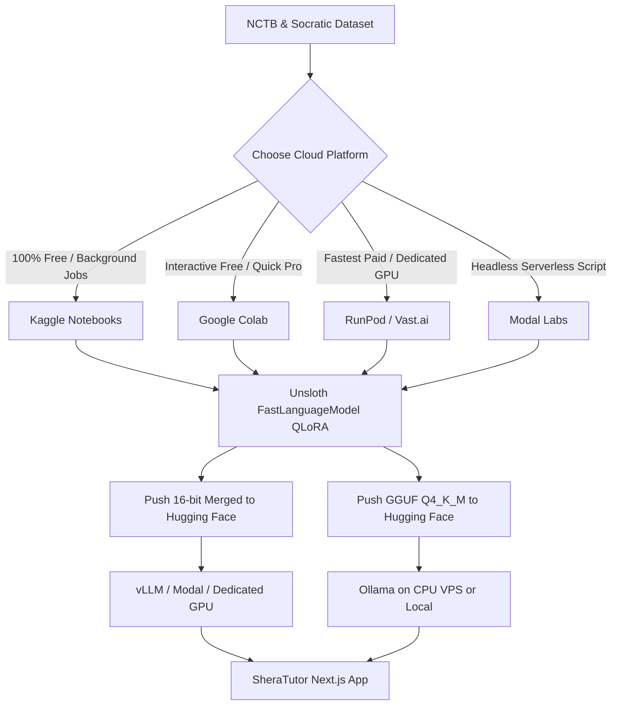
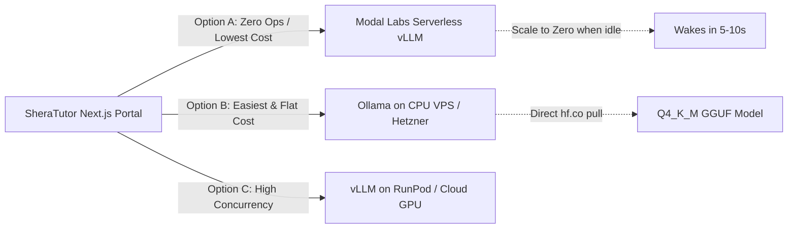

# Comprehensive Unsloth Research, Fine-Tuning Guide & Production Architecture for SheraTutor

## Executive Summary

This guide provides an end-to-end, production-ready blueprint for fine-tuning open-weights LLMs using **Unsloth** in the cloud (focusing on **Kaggle**, with Colab, RunPod, and Modal alternatives) and serving the fine-tuned model for the **SheraTutor** Next.js application.

It integrates directly with your existing **Supabase pgvector RAG database** (`qjottictwewysfcjirma`), which contains **8,127 verified NCTB curriculum chunks** and **5,917 `gemini-embedding-2` vector embeddings** with HNSW indexing and Reciprocal Rank Fusion (RRF) hybrid search.

---

## 1. Live Supabase RAG Vector Database Audit & Metrics

A live inspection of your production Supabase database revealed the following curriculum inventory across 53 textbook chapters:

| Subject | Language | Curriculum Chunks | Vector Embeddings (`gemini-embedding-2`) | Status |
| :--- | :--- | :--- | :--- | :--- |
| **SSC Physics (PHY)** | Bengali | 923 | 923 | ✅ 100% Embedded |
| **SSC Physics (PHY)** | English | 927 | 150 | ⚠️ 777 Chunks Pending |
| **SSC Chemistry (CHEM)** | Bengali | 304 | 304 | ✅ 100% Embedded |
| **SSC Chemistry (CHEM)** | English | 768 | 768 | ✅ 100% Embedded |
| **SSC Mathematics (MATH)** | Bengali | 2,036 | 1,997 | ✅ 98% Embedded |
| **SSC Mathematics (MATH)** | English | 1,907 | 1,800 | ✅ 94% Embedded |
| **SSC English (ENG)** | Bengali | 555 | 0 | ⏳ Pending Ingestion |
| **SSC English (ENG)** | English | 707 | 0 | ⏳ Pending Ingestion |
| **TOTAL** | | **8,127** | **5,917** | **~73% System Complete** |

### Live Retrieval Benchmark
- **Query Tested**: `"কাচনলে অ্যামোনিয়া ও হাইড্রোক্লোরিক এসিডের ব্যাপন পরীক্ষা কীভাবে করে?"`
- **Result**: Ranked #1 match was Chapter 2 (*পদার্থের অবস্থা*), Page 28 with an **80.48% cosine similarity score**, retrieving the authentic diagram URL: `https://qjottictwewysfcjirma.supabase.co/storage/v1/object/public/curriculum-assets/chemistry/bn/ch_02/p028_fig_01.png`.

### Automated Dataset Exporter
To bridge your RAG database directly with training, we built [`training/dataset/export_supabase_to_dataset.py`](file:///home/syed/workspace/Sheratutor/training/dataset/export_supabase_to_dataset.py). Running this tool extracted **170 RAG-grounded Socratic dialogues** directly into [`training/dataset/sheratutor_supabase_rag_dataset.jsonl`](file:///home/syed/workspace/Sheratutor/training/dataset/sheratutor_supabase_rag_dataset.jsonl) ready for Unsloth.

## 1. Why Unsloth? Architecture & Core Benefits

Unsloth (developed by Daniel and Michael Han) is an open-source framework designed to accelerate LLM fine-tuning and reduce VRAM requirements by rewriting the core PyTorch operations into custom OpenAI Triton kernels.

### Key Architectural Advantages
1. **2x to 5x Faster Training Speed**:
   - Manually written backward passes for cross-entropy loss, RoPE embeddings, and MLP activations.
   - Eliminates PyTorch autograd graph overhead and redundant memory allocations.
2. **70% to 80% Less VRAM Usage**:
   - Allows fine-tuning an **8B model on a single 16GB GPU** (e.g., Kaggle Tesla T4) with context lengths up to 4096 or 8192 tokens.
   - Integrates 4-bit QLoRA (`bitsandbytes`) with optimized gradient checkpointing (`use_gradient_checkpointing = "unsloth"`).
3. **0% Accuracy Loss**:
   - Unlike lossy approximations, Unsloth computes mathematically exact gradients.
4. **Native Multi-Format Export**:
   - Direct export to **16-bit merged weights** (for vLLM, Hugging Face), **GGUF** (4-bit `q4_k_m`, 8-bit `q8_0` for Ollama/llama.cpp), and automatic Ollama `Modelfile` generation.
5. **Loss Masking (`train_on_responses_only`)**:
   - Masks the prompt/instruction tokens so gradient updates occur **strictly on the assistant's pedagogical responses**, preventing the model from memorizing questions or degrading in generalization.

---

## 2. Model Selection for SheraTutor (Bangla/English SSC AI Tutor)

SheraTutor is a specialized B2C web portal for Bangladeshi Secondary School Certificate (SSC) students (grades 9-10). It requires:
- **Bilingual proficiency**: Native Bengali (বাংলা) instruction and explanations with English scientific terminology.
- **STEM & Math reasoning**: Step-by-step problem solving in Physics, Chemistry, and Mathematics.
- **Strict format adherence**: Clean LaTeX math delimiters (`\( ... \)` inline, `\[ ... \]` block).
- **Pedagogical scaffolding**: Socratic hints (Rung 1-7), solution-leak deterrence, and encouraging tone.

### Model Evaluation Matrix

| Model | Size | Bengali Tokenizer & Fluency | Math / STEM Reasoning | Kaggle T4 VRAM (4-bit LoRA) | Deployment Footprint | Verdict |
| :--- | :--- | :--- | :--- | :--- | :--- | :--- |
| **Qwen 2.5 7B-Instruct** | 7.6B | ⭐⭐⭐⭐⭐ (Excellent Bengali vocabulary & byte-fallback) | ⭐⭐⭐⭐⭐ (State-of-the-art for <10B models) | ~6.5 GB VRAM | 4.7 GB (GGUF Q4_K_M) | **Top Recommendation** |
| **Qwen 2.5 3B-Instruct** | 3.1B | ⭐⭐⭐⭐ (Very good) | ⭐⭐⭐⭐ (High for its weight class) | ~2.8 GB VRAM | 2.1 GB (GGUF Q4_K_M) | **Best for Low-Cost VPS / CPU** |
| **DeepSeek-R1-Distill-Qwen-7B** | 7.6B | ⭐⭐⭐⭐ (Very good) | ⭐⭐⭐⭐⭐ (Chain-of-thought `<think>`) | ~6.8 GB VRAM | 4.7 GB (GGUF Q4_K_M) | **Best for Deep Derivations** |
| **Meta Llama 3.1 8B-Instruct** | 8.0B | ⭐⭐⭐ (Acceptable, higher token splits) | ⭐⭐⭐⭐ (Strong general reasoning) | ~7.2 GB VRAM | 4.9 GB (GGUF Q4_K_M) | Solid English, weaker Bengali |
| **Gemma 2 9B-Instruct** | 9.2B | ⭐⭐⭐ (Good) | ⭐⭐⭐⭐ (Strong) | ~8.9 GB VRAM | 5.8 GB (GGUF Q4_K_M) | Slower training; sliding window attention |

> [!TIP]
> **Primary Recommendation**: Start with **`unsloth/Qwen2.5-7B-Instruct-bnb-4bit`**. It strikes the ideal balance between superior Bengali generation, state-of-the-art STEM problem solving, and low resource overhead.

---

## 3. Cloud Training Platforms Comparison

Since local hardware lacks a dedicated GPU, training must run in the cloud.



### In-Depth Platform Breakdown

| Feature | Kaggle (Recommended) | Google Colab | RunPod (Paid) | Modal Labs |
| :--- | :--- | :--- | :--- | :--- |
| **Free Quota** | **30 hours / week** | Dynamic (approx. 4-12 hrs) | None ($0.22-$0.34/hr) | **$30 free compute / mo** |
| **GPU Hardware** | **Tesla T4 (16GB)** or Dual T4 | Tesla T4 (15GB) (Free) / A100 (Pro) | RTX 4090 / 3090 / A100 | T4 / A10G / L4 / A100 |
| **Background Execution** | **Yes (Up to 12 hours)** via "Save & Run All" | No on free tier (browser must stay open) | Yes (Persistent Pod) | Yes (CLI remote job) |
| **CLI Automation** | Yes (`kaggle kernels push`) | Limited | SSH / Docker | Yes (`modal run`) |
| **Storage Persistence** | Ephemeral per session | Ephemeral (mounts Drive) | Persistent Network Volume | Cloud Volume |
| **Best For** | **Zero-budget, automated batch training** | Quick prototyping | Rapid iteration on high-end GPUs | Serverless training & production |

> [!CAUTION]
> **Kaggle Hardware Selection Warning**:
> In Kaggle Notebook Settings, always choose **GPU T4 x2** or **GPU T4 x1**. **DO NOT select Tesla P100**. The P100 (Pascal architecture, `sm_60`) lacks the hardware capabilities required by modern Triton kernels and bfloat16/fp16 tensor cores.

---

## 4. End-to-End Kaggle Fine-Tuning Pipeline

### Step 1: Environment Setup in Kaggle
In your Kaggle notebook settings (right sidebar):
1. **Accelerator**: Select `GPU T4 x2` or `GPU T4 x1`.
2. **Internet**: Toggle to `ON` (required for pip packages and downloading Hugging Face models).
3. **Environment**: Select `Always use latest environment`.
4. **Secrets**: Go to `Add-ons` -> `Secrets`, create a secret named `HF_TOKEN` containing your Hugging Face Write Token.

### Step 2: Training Script Implementation

```python
%%capture
# 1. Install Unsloth & required libraries
!pip install unsloth
!pip install --no-deps trl peft accelerate bitsandbytes
```

```python
import os
import torch
from unsloth import FastLanguageModel, is_bfloat16_supported
from unsloth.chat_templates import get_chat_template, train_on_responses_only
from datasets import load_dataset
from trl import SFTTrainer, DataCollatorForSeq2Seq
from transformers import TrainingArguments

# Verify GPU
assert torch.cuda.is_available(), "Please enable GPU in Kaggle settings!"
print(f"Using GPU: {torch.cuda.get_device_name(0)}")

# 2. Hugging Face Authentication
from kaggle_secrets import UserSecretsClient
user_secrets = UserSecretsClient()
HF_TOKEN = user_secrets.get_secret("HF_TOKEN")
HF_USERNAME = "syed181"  # Replace with your Hugging Face username

# 3. Load Model in 4-bit with Unsloth
max_seq_length = 2048
model, tokenizer = FastLanguageModel.from_pretrained(
    model_name = "unsloth/Qwen2.5-7B-Instruct-bnb-4bit",
    max_seq_length = max_seq_length,
    load_in_4bit = True,
)

# 4. Configure LoRA Parameters
model = FastLanguageModel.get_peft_model(
    model,
    r = 16,
    target_modules = [
        "q_proj", "k_proj", "v_proj", "o_proj",
        "gate_proj", "up_proj", "down_proj",
    ],
    lora_alpha = 16,
    lora_dropout = 0,               # 0 is optimized for Unsloth
    bias = "none",
    use_gradient_checkpointing = "unsloth",
    random_state = 3407,
)

# 5. Setup Chat Template
tokenizer = get_chat_template(
    tokenizer,
    chat_template = "qwen-2.5",
)

# 6. Format Dataset (ChatML)
# Assuming dataset is in JSONL format with 'messages' list
dataset = load_dataset("json", data_files="sheratutor_train_dataset.jsonl", split="train")

def formatting_prompts_func(examples):
    convos = examples["messages"]
    texts = [
        tokenizer.apply_chat_template(convo, tokenize=False, add_generation_prompt=False)
        for convo in convos
    ]
    return {"text": texts}

dataset = dataset.map(formatting_prompts_func, batched=True)

# 7. Configure SFTTrainer
trainer = SFTTrainer(
    model = model,
    tokenizer = tokenizer,
    train_dataset = dataset,
    dataset_text_field = "text",
    max_seq_length = max_seq_length,
    dataset_num_proc = 2,
    data_collator = DataCollatorForSeq2Seq(tokenizer = tokenizer),
    args = TrainingArguments(
        per_device_train_batch_size = 2,
        gradient_accumulation_steps = 4,
        warmup_steps = 10,
        max_steps = 100,            # Adjust for your dataset size
        learning_rate = 2e-4,
        fp16 = not is_bfloat16_supported(),
        bf16 = is_bfloat16_supported(),
        logging_steps = 5,
        optim = "adamw_8bit",
        weight_decay = 0.01,
        lr_scheduler_type = "cosine",
        seed = 3407,
        output_dir = "outputs",
        report_to = "none",
    ),
)

# 8. Mask instructions: compute loss ONLY on assistant responses
trainer = train_on_responses_only(
    trainer,
    instruction_part = "<|im_start|>user\n",
    response_part = "<|im_start|>assistant\n",
)

# 9. Train Model
trainer_stats = trainer.train()

# 10. Direct Export to Hugging Face Hub
output_repo = f"{HF_USERNAME}/sheratutor-qwen2.5-7b"

# Export 16-bit merged weights (for vLLM / Cloud APIs)
model.push_to_hub_merged(
    output_repo,
    tokenizer,
    save_method = "merged_16bit",
    token = HF_TOKEN,
)

# Export GGUF 4-bit (for Ollama)
model.push_to_hub_gguf(
    f"{output_repo}-gguf",
    tokenizer,
    quantization_method = "q4_k_m",
    token = HF_TOKEN,
)
```

---

## 5. Production Serving Architecture for Next.js

Once pushed to the Hugging Face Hub, the model can be served in production using one of three strategies:



### Strategy A: Modal Labs (Serverless vLLM — Scale-to-Zero)
- **Why**: Zero fixed monthly cost. The GPU spins up only when students are actively chatting and automatically terminates after 5 minutes of inactivity.
- **Cost**: Uses Modal's $30/mo free tier; essentially $0/month for early stage.
- **Deploy Command**:
  ```bash
  modal deploy training/deploy/modal_vllm_serverless.py
  ```
- **Next.js Connection**: Exposes standard OpenAI-compatible `/v1/chat/completions`.

### Strategy B: Ollama on CPU/Low-Cost VPS ($7 - $15/mo)
- **Why**: Because Unsloth exports an optimized `q4_k_m` GGUF file, the model is only 4.7 GB. A 4-core, 16GB RAM CPU VPS (e.g. Hetzner Cloud CX42 for ~€14/month) can serve responses at 8-15 tokens/sec.
- **Run Directly from Hugging Face**:
  ```bash
  ollama run hf.co/syed181/sheratutor-qwen2.5-7b-gguf:Q4_K_M
  ```
- **Next.js Integration**: SheraTutor already has `genkitx-ollama` configured in `web/src/ai/genkit.ts`. Simply set:
  ```env
  OLLAMA_BASE_URL=http://your-server-ip:11434
  GENKIT_REASONING_MODEL=ollama/hf.co/syed181/sheratutor-qwen2.5-7b-gguf:Q4_K_M
  ```

### Strategy C: Dedicated GPU with vLLM (RunPod / Hetzner GPU)
- **Why**: Extreme throughput (150+ tokens/second) and support for dozens of concurrent students via PagedAttention.
- **Deploy**: Use `docker compose -f training/deploy/docker-compose.vllm.yml up -d`.

---

## 6. Next.js Integration Guide

In `SheraTutor`, the AI tutor is orchestrated via Genkit flows (`web/src/ai/flows/tutor-chat.ts`).

### Integrating the Fine-Tuned Model

You can route traffic directly to your fine-tuned model while preserving Gemini as an automated fallback:

```typescript
// web/src/ai/genkit.ts
import { ollama } from "genkitx-ollama";

export const ai = genkit({
  plugins: [
    googleAI({ apiKey: process.env.GEMINI_API_KEY }),
    ollama({
      serverAddress: process.env.OLLAMA_BASE_URL ?? "http://127.0.0.1:11434",
      models: [
        { name: "hf.co/syed181/sheratutor-qwen2.5-7b-gguf:Q4_K_M" },
      ],
    }),
  ],
});

export const MODELS = {
  // Use fine-tuned model for Socratic reasoning, fallback to Gemini
  reasoning: process.env.GENKIT_REASONING_MODEL ?? "ollama/hf.co/syed181/sheratutor-qwen2.5-7b-gguf:Q4_K_M",
  vision: "googleai/gemini-3.5-flash",
  fast: "googleai/gemini-3.5-flash-lite",
  paper: "googleai/gemini-3.5-flash",
} as const;
```

---

## 7. Actionable Roadmap & Next Steps

1. **Step 1: Expand Training Dataset**
   - Run `python3 training/dataset/prepare_training_data.py` to inspect the seed dataset.
   - Use SheraTutor's existing Supabase textbook chunks in `ingestion/` to synthesize 500-1,000 Socratic dialogues across Physics, Chemistry, and Math.
2. **Step 2: Execute Kaggle Training**
   - Push the script using `cd training/kaggle && kaggle kernels push` or run it interactively on Kaggle.
   - Verify that the models appear on your Hugging Face account (`sheratutor-qwen2.5-7b` and `sheratutor-qwen2.5-7b-gguf`).
3. **Step 3: Test Locally or on VPS via Ollama**
   - Test response quality: `ollama run hf.co/syed181/sheratutor-qwen2.5-7b-gguf:Q4_K_M`.
4. **Step 4: Connect to Next.js**
   - Update `OLLAMA_BASE_URL` and `GENKIT_REASONING_MODEL` in `web/.env.local` and test the tutor chat at `/dashboard/tutor`.
